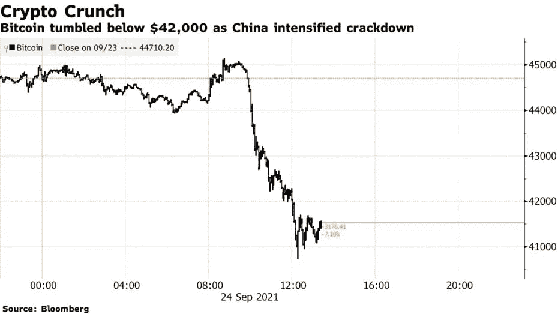

# 中国禁止加密货币

> 原文：<https://medium.com/geekculture/china-ban-on-cryptocurrency-cffd8e6cb806?source=collection_archive---------28----------------------->

source: Shutterstock

中国对加密货币的禁令给了加密市场一个可怕的打击，导致比特币和 Tether 等领先资产的价格下跌。中国还发誓要禁止挖掘数字资产，这又是对该行业最沉重的打击。中国人民银行在其网站上明确宣布，交易加密资产是一种非法金融活动，即使是离岸交易所也不能在中国及其周边地区提供服务。该银行补充说，比特币和 Tether 不是传统货币，不能进入流通领域。这一出人意料的声明震动了加密市场，比特币的价格跌至疯狂的低点，立即下跌至 8%。中国是大量密码用户和持有者的家园，市场经历了近一周的停机时间。

中国加密禁令的影响
中国一直是潮流的引领者，与其他主要国家相比，中国的法规是独一无二的，也是激进的。像中国这样的发达国家做出的决定更有可能对发展中国家产生重大影响。在像印度这样的国家，加密资产的使用和存储最近才变得合法。中国对加密货币的禁令肯定会对印度的加密玩家产生不利影响，在他们加密之旅的早期阶段给予突然打击。

Just have a look at the blow!

中国摆脱加密货币活动的主要原因是它与洗钱和过度能源消耗的联系。在禁令之前，中国禁止银行提供与加密相关的服务，这标志着一个时代的结束。仍然对加密业务很认真的中国人已经转向基于美国和英国的离岸交易所和场外交易平台。

虽然中国终止在国内使用加密资产对加密行业的估值有短期影响，但可能不会有任何长期影响，因为加密正在走向在世界其他地区的大规模采用。

**是为了达到碳目标吗？**
“嘿，碳目标！我来接你了。”，中国表示。加密产业受到审查的主要原因是与采矿相关的大量能源消耗。采矿涉及解决复杂的数学方程，以验证区块链上发生的交易，这需要巨大的计算能力和消耗大量电力的硬件设备。中国经济规划机构立场坚定，认为根除所有与加密相关的活动对于实现碳排放目标至关重要。这可能有助于中国克服已经影响到钢铁和铝等大宗商品的电力危机。
根据剑桥比特币用电指数，全球总 hash 率的 46%由中国矿商贡献，今年 4 月。对于一个拥有大量世界加密矿工的国家来说，突然禁止加密将是超越他们贡献的正确选择。

**加密禁令的替代举措**
中国人民银行(PBOC)正在研究一种替代方案，用自己的数字货币将中国的经济地位提升到一个全新的水平。中国将成为央行发行的数字货币的先锋和主要竞争者，同时它已经尝试在中国的热点城市流通数字版本的人民币。