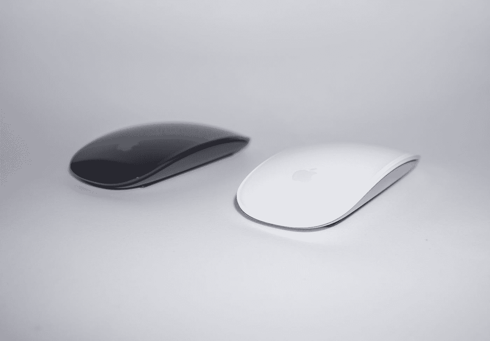

# 为您的 iOS 应用程序选择正确的分发方法。

> 原文：<https://medium.com/geekculture/choosing-the-right-distribution-method-for-your-ios-applications-b260bddd4a12?source=collection_archive---------10----------------------->

Photo by [Anthony Choren](https://unsplash.com/@tony_cm__?utm_source=medium&utm_medium=referral) on [Unsplash](https://unsplash.com?utm_source=medium&utm_medium=referral)

我在苹果工作期间，我看到的最大困惑之一是开发者试图选择正确的方法来发布他们的应用。苹果提供了许多不同的方式来分发应用程序，每一种都有特定的用途。今天，我们将深入探讨不同的分发方法，以及根据您的分发需求何时使用每种方法。

**应用商店分布:**

我们今天要介绍的第一种分发类型是最常见的分发类型，即应用商店分发。要在 App Store 上分发应用程序，您或您的组织必须首先拥有付费的 Apple 开发者计划会员资格。这种会员资格每年花费 99.00 美元，并允许在应用程序商店上提交和分发。当你试图向公众发布一款应用时，可以使用这种发布方式。

关于这种分发方式需要知道的一些事情包括，app 必须属于你自己。苹果不再允许公司或个人为任何其他组织发布/托管苹果开发者计划会员的应用程序。如果您试图在您的计划下为不同的组织提交应用程序，您可能会被应用程序审核团队拒绝，并被告知拥有该应用程序的公司必须拥有自己的 Apple 开发者计划才能提交该应用程序。你可以在这里找到更多关于苹果开发者计划[的信息。](https://developer.apple.com/programs/)

**定制商务应用:**

我们今天要讨论的下一种分发类型是企业定制应用或 B2B 应用(企业对企业)。这种类型的分发是如果你正在为一个特定的企业开发一个应用程序，并且只希望他们能够利用这个应用程序。这些应用程序通常不会在应用程序商店上线，必须直接发送到您为其开发应用程序的组织。

为了利用这种类型的分配，在这个过程中将涉及两个程序。该应用程序的开发者需要一个付费的苹果开发者计划会员，而接收该应用程序的组织需要一个苹果业务经理帐户。Apple Business Manager 计划是一个免费注册的计划，不像 Apple Developer 计划那样需要年费。通过 Apple Business Manager 计划分发应用程序通常涉及通过 MDM 提供商(移动设备管理)进行分发，但也可以通过 Apple Configurator 2 进行分发。点击这里，你可以找到更多关于发布商业定制应用的信息[。](https://developer.apple.com/custom-apps/)

**企业分布:**

另一种分发形式是，如果您希望在整个组织内部直接向员工分发您的应用程序。这种分发类型出现在苹果开发者企业计划中。该计划允许内部分发应用程序，而无需应用程序审查批准。这意味着您可以持续地更新您的应用程序，并发送最新的构建版本，而无需等待审查。

由于程序本身的性质，这种类型的分发有许多需要注意的地方。苹果开发者企业计划经历了一个极其彻底的审查过程，只有符合严格标准的组织才被允许拥有这种成员资格。一些要求包括您的组织必须至少有 100 名员工。在审核您的会员申请时，也可能会考虑您希望分发的应用类型。

苹果开发者企业计划每年花费 299.00 美元。如果您符合该计划的标准并正在提交申请，您至少需要等待一个月才能完成审核过程，尽管审核过程没有时间保证。你可以在这里找到更多关于苹果开发者企业计划[的信息。](https://developer.apple.com/programs/enterprise/)

**临时分发:**

那么，如果您想在内部向自己的员工分发，但不符合 Apple Developer Enterprise 计划的要求，会发生什么呢？幸运的是，通过标准的苹果开发者计划，你可以有更多的发行选择。其中一种分发类型是临时分发。

通过 Apple Developer Program 的特别分发将允许您将应用程序直接分发到最多 100 台注册为 Apple Developer Program 成员的设备。类似于苹果开发者企业计划，这种分发方式**不**要求应用审查过程。如果您希望分发 App Store 不接受的内部应用程序，并且希望分发的员工/个人少于 100 人，那么这种类型的分发非常理想。你可以在这里找到更多关于点对点分发[的信息。](https://help.apple.com/xcode/mac/current/#/dev31de635e5)

**试飞分布:**

我们今天要讨论的最后一种分布是通过试飞 Beta 测试的分布。多年来，TestFlight 已经发展成为一个在发布前测试应用程序的强大工具。有多种方法可以选择将你的应用程序分发给测试人员。您可以选择分发给内部测试人员(您组织内的人员)、外部测试人员(一般公众)，或者甚至通过新的 TestFlight 公共链接。

关于 TestFlight Beta 测试的一些重要注意事项包括对您可以邀请的测试人员数量的限制。对于内部测试人员，一个特定的应用程序最多可以有 25 个测试人员。如果您选择外部测试人员，这个数字会急剧上升到 10，000 名测试人员。

为内部测试人员测试应用程序时，您不需要通过应用程序审查流程批准应用程序，但是如果您邀请外部测试人员加入应用程序，您需要通过应用程序审查批准应用程序。通过 TestFlight Beta 测试发布的应用程序将保持活动状态 90 天，这使您有充足的时间在版本过期之前测试应用程序。你可以在这里找到更多关于 TestFlight Beta 测试的信息。

**结论:**

本文几乎涵盖了 iOS 应用程序可用的所有分发方法。正如你现在所知道的，开发者有多种选择，选择正确的选项不仅可以节省你的时间和拒绝，还可以确保你的应用以最佳的方式发布。如果你喜欢我的文章，请关注我的页面。快乐发展！