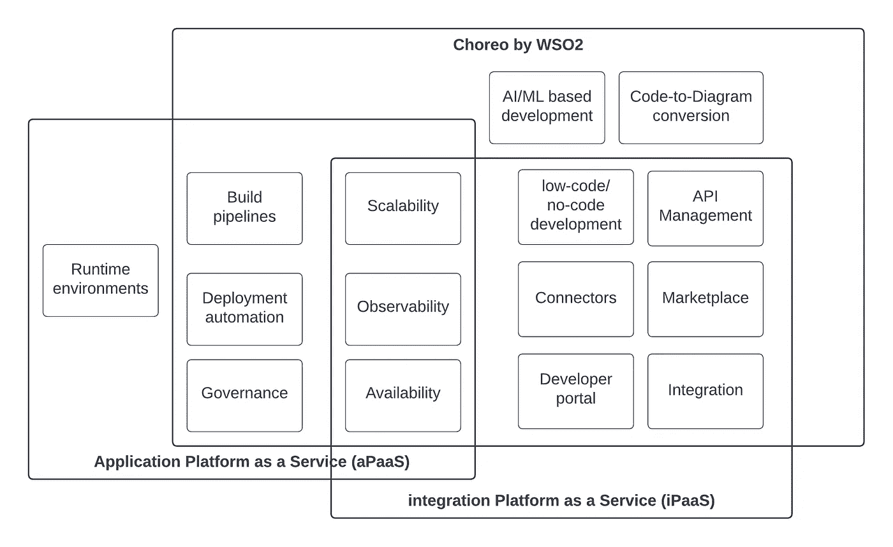

# Choreo 既不是 aPaaS 也不是 iPaaS

> 原文：<https://medium.com/geekculture/choreo-is-neither-apaas-nor-ipaas-896c582a1dc8?source=collection_archive---------11----------------------->

与 PaaS 相比，Choreo(通过 WSO2)的独特之处是什么

# 背景

自 2005 年以来，WSO2 一直在构建企业软件，该团队一直在与 1000 多家企业客户合作。WSO2 的产品涵盖了一系列功能，从 API 管理(APIM)、集成、流处理，到客户身份和访问管理(CIAM)。所有这些产品功能都作为可安装软件(二进制文件)提供给用户，可以安装在客户选择的基础架构上，如物理服务器、虚拟机和云基础架构。除了这些可安装版本之外，WSO2 还通过 WSO2 Cloud 提供了这些功能作为云(SaaS)解决方案。这个 SaaS 产品是 WSO2 产品在共享云基础设施上的可扩展安装，除了可安装组件的功能之外，它没有提供很多功能。

鉴于大多数企业都在向云以及云原生解决方案转移，WSO2 团队已经将这一点确定为平台的局限性。经过几年的研发努力，WSO2 团队激动地宣布 Choreo 将于 2022 年 3 月 30 日正式上市。官方声明可以在这里找到[。](https://wso2.com/choreo/resources/choreo-is-now-generally-available/)

Choreo by WSO2 还不是 WSO2 产品的另一个 SaaS(云)版本。这是一款 SaaS 产品，旨在解决 WSO2 团队和数以千计的客户在过去构建企业软件系统时遇到的挑战。除此之外，它还涵盖了软件开发的现代云原生工程方面，如 CI/CD、基于 AI 的开发、自动化、可观察性和可伸缩性。你可以通过访问 Choreo 官方网站[这里](https://wso2.com/choreo/)了解更多关于 Choreo 的信息。

在这篇文章中，我将讨论 Choreo 区别于其他 aPaaS(应用 PaaS)和 iPaaS(集成 PaaS)解决方案的独特之处。

# 介绍

在过去十年中，软件交付模式发生了显著变化，大多数所谓的企业应用程序和软件曾经被认为是传统的内部解决方案，现在已经发展成为云托管的软件即服务(SaaS)模式。这种提供软件应用或平台即服务(XaaS)的模式为用户提供了许多优势。在本文中，我们将讨论软件交付即服务的两个最突出的模型，并将它们与 Choreo 进行比较。

*   应用程序平台即服务(aPaaS)
*   集成平台即服务(iPaaS)
*   二氧化硅氯化物

让我们更仔细地看看这些软件模型，以便在本文的后面部分讨论和比较这些模型。

## aPaaS

应用平台即服务或 *aPaaS 是一种云服务，提供按需计算平台来开发、测试和部署应用*。它是一个平台，允许开发人员构建他们的应用程序，并将其部署到生产和生产前环境中，而不必担心管理服务器、运行时环境、操作系统等的底层复杂性。它将开发人员从那些低级任务的负担中解放出来，让他们专注于构建对组织至关重要的业务逻辑。大多数大型云供应商，如 AWS、Azure 和 Google，都提供自己的 aPaaS 解决方案，市场上也有专门构建的 aPaaS 解决方案，如 Heroku 和 Mendix。aPaaS 的一些主要优势包括

*   **开发和部署的速度** —通过内置的运行时、构建管道和测试工具，开发团队可以专注于构建应用程序并更频繁地发布它们，而不是等待耗时的手动部署和测试过程。
*   **可扩展性** —当需求增加时，底层云基础设施提供应用程序的自动可扩展性。这是由 aPaaS 平台自动处理的，开发人员只需要配置最小和最大数量的副本。
*   **可用性** —根据我们选择的解决方案，这些平台可在多个地点和地区使用。因此，开发者可以为应用消费者提供更好的体验，而无需花费数十亿美元在全球各地建立数据中心。
*   **灵活性** —这些平台允许开发人员从多种编程语言和框架中进行选择，以便他们能够利用最佳工具来完成任务。
*   **敏捷性** —借助内置的工作流和软件开发生命周期(SDLC)，这些平台允许开发人员以敏捷的方式构建应用，而不是遵循传统的瀑布式开发方法。

这些 aPaaS 平台对于没有大型 IT 部门来维护和管理 IT 基础架构(或者他们不想这样做)但对 IT 生态系统中的创新有很高需求的企业非常有用。这些平台需要一组熟练的开发人员来利用平台并为企业构建软件应用程序。

## iPaaS

集成平台即服务或 iPaaS 是一个专门构建的平台，旨在满足企业集成的需求。

根据 Gartner 的说法，*“集成平台即服务(iPaaS)是一套云服务，支持开发、执行和治理集成流，连接单个或多个组织内的内部和基于云的流程、服务、应用程序和数据的任意组合”*。

大多数 iPaaS 平台提供低代码和/或无代码抽象来快速构建集成，并允许没有很强编程背景但具有很强领域知识的所谓公民集成者利用这些平台。这些平台隐藏了底层基础设施的复杂性，允许开发人员通过集成系统、应用程序和数据来专注于构建应用程序。

有时，这些平台被称为企业 iPaaS 或 e iPaaS，以展示集成的本质，无论它是企业级集成产品还是专注于最终用户集成需求的产品。但是大多数领先的 iPaaS 平台也可以被认为是 EiPaaS，因为它们也在企业集成项目中使用。市场上有许多 iPaaS 供应商，包括 Boomi、Mulesoft、Informatica、Tibco、Celigo 和 WSO2。除了应用程序、系统和数据的集成，这些平台还允许通过 API 管理功能向内部和外部消费者公开这些集成的服务，以便业务可以扩展。以下是 iPaaS(或 EiPaaS)平台的一些优势。

*   **更快的上市时间** —这些平台中的大多数允许开发人员构建与低代码和无代码体验的集成，以便他们可以更快、更高效地构建应用。所有的构建模块和模板都是预先构建的，与 aPaaS 相比，开发一个复杂的集成只需要几个小时。
*   **用户友好**——这些平台不仅允许开发人员，也允许非开发人员(如业务分析师和领域专家)使用该工具，为业务用例创建集成，而无需担心编写代码。
*   **直接投资回报** —它允许企业通过 API 公开其内部产品和服务，以便消费者可以通过数字媒介接触到企业。同时，它允许合作伙伴和第三方开发商为传统业务模式无法覆盖的新用户群构建数字体验。这些选项产生了工具的直接 ROI。
*   **标准化** —如果没有集成平台，应用程序必须以点对点的方式相互集成，没有任何通用标准，这使得衡量此类系统的业务影响变得更加困难。iPaaS 允许以标准化的方式完成这些集成，并以标准化的方式监控其运营，以便业务领导者可以基于真实数据而不是依赖技术领导者的智慧来做出决策。

除了这些优势之外，大多数 iPaaS 平台还提供了 aPaaS 供应商提供的优势，如可用性和可扩展性，因为这些解决方案运行在提供这些底层功能的共享或私有云基础架构之上。

## 什么是 Choreo？

WSO2 团队将 Choreo 定义为数字平台即服务(DPaaS)。根据 Choreo 官方文档，*“Choreo 是一个数字创新平台，允许你大规模开发、部署和管理云原生应用。其人工智能辅助的低代码应用开发环境简化了创建服务、管理 API 和构建集成，同时确保最佳实践和安全编码指南"*。

这个定义将 Choreo 与我们之前讨论过的传统 iPaaS 和 aPaaS 解决方案区分开来。Choreo 专注于使用云原生工程技术和实践构建现代企业应用。它支持低代码和专业代码开发方法，同时提供真正的 iPaaS 式体验。下面列出了 Choreo 为用户提供的优势。

*   **支持低代码和高代码**——通过低代码方法提供的改进的生产力和通过基于代码的开发提供的灵活性使 Choreo 成为开发人员的独特体验。市民集成商和开发商都可以利用该平台获得最佳优势。
*   **包含用于云原生工程的电池** — Choreo 不仅为开发人员提供编程接口，还提供所有底层技术来构建具有行业最佳实践的云原生应用，包括 GitOps、可观察性、CI/CD、连接器和 API 管理。
*   **支持快速开发** — Choreo 的内置治理功能允许开发人员在几个小时而不是几个月内构建、测试应用程序并将其部署到生产环境中。整个过程是简化的，并通过用户和角色进行管理，因此产品的质量不会因为速度而降低。
*   **深度可观察性** —分布式系统生来注定失败。失败不是异常现象。Choreo 的深度观察功能允许用户通过适当的监控和警报来避免故障，并在出现故障时快速恢复。
*   **独特的开发者体验** — Choreo 提供独特的开发体验，源代码同时生成可视化表示，并排显示。它还通过在编写代码时提供对代码性能的洞察，提供人工智能辅助的开发体验。
*   **市场和开发者门户** —市场是一个组织内以及跨组织的开发者可以与其他人共享服务的地方。这提供了重用现有服务的机会，并通过从用户那里获得反馈来使它们变得更好。开发人员门户允许团队与对使用这些端点构建应用程序感兴趣的内部和外部用户共享 API 端点。

你可以通过访问官方文档[这里](https://wso2.com/choreo/docs/)了解更多关于 Choreo 的信息。

下图描述了每个解决方案的重叠功能。

Figure: aPaaS, iPaaS, and Choreo feature comparison

# aPaaS、iPaaS 和 Choreo (DPaaS)的比较

## 开发人员生产力

*   aPaaS——平台提供了基础设施，可以从多个运行时中进行选择来构建应用程序。要求开发人员构建应用程序，然后配置管道以部署到生产和预生产环境中。
*   iPaaS——提供了一种更高级的特定领域语言(DSL)来快速开发应用程序。没有多少开发经验的市民集成商可以使用提供的低代码、无代码接口来构建应用程序。独立的部署环境需要由开发人员来管理。
*   choreo——支持低代码/无代码以及亲代码开发人员根据团队经验进行选择。提供底层基础架构是为了管理源代码，只需点击几下按钮，即可将应用程序部署到生产和生产前环境中。

## 上市时间

*   aPaaS —这可能需要几周到几个月的时间。除了应用程序开发时间之外，还需要时间来配置构建管道、多种环境、安全控制、可观察性和监控。
*   iPaaS —这可能需要几周时间。由于基于 DSL 的方法，与 aPaaS 相比减少了应用程序开发时间。配置多个环境和构建管道需要额外的时间。
*   这可能需要几天到一周的时间。应用程序开发时间可以与 iPaaS 相同。设置环境和构建管道将节省时间，因为这些已经在 Choreo 中与安全性、可观察性和监控一起预先配置好了。

## 灵活性

*   aPaaS —在选择编程语言、运行时环境、基础设施平台和其他工具时，提供了更多的选择。如果有多个团队希望用不同的技术开发应用程序，这是一个好主意。
*   iPaaS —没有太多选择。需要使用平台提供的技术和工具。有时更容易，因为没有必要争论选择。
*   choreo——没什么选择。与 iPaaS 相同。需要使用可用的工具。

除了上述差异之外，在定价模式、基础设施的位置可用性和其他方面也可能存在差异。

## aPaaS、iPaaS 和 Choreo 的共同优势

*   可用性—由于这些平台大多利用云基础架构来运行，因此这些解决方案具有足够的冗余性，高度可用。
*   可扩展性—大多数解决方案都提供基于使用情况的自动可扩展性，因此用户无需担心手动扩展应用程序。
*   更轻松的基础架构管理—大部分基础架构管理都由供应商承担，用户只需管理应用程序和相关工具。
*   合规性—由于这些平台是由供应商管理的，因此他们可以根据所涉及的业务领域，使解决方案符合所需的标准。一些例子是 PCI DSS、FEDRAMP、SOC2 和 HIPAA。