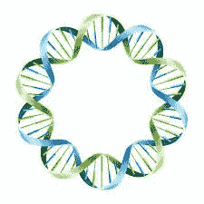
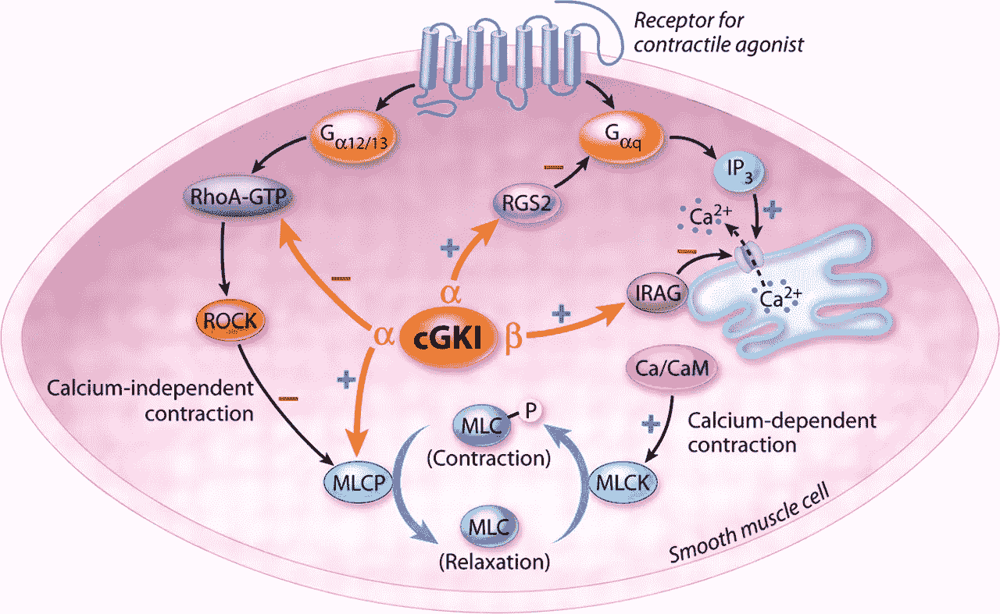
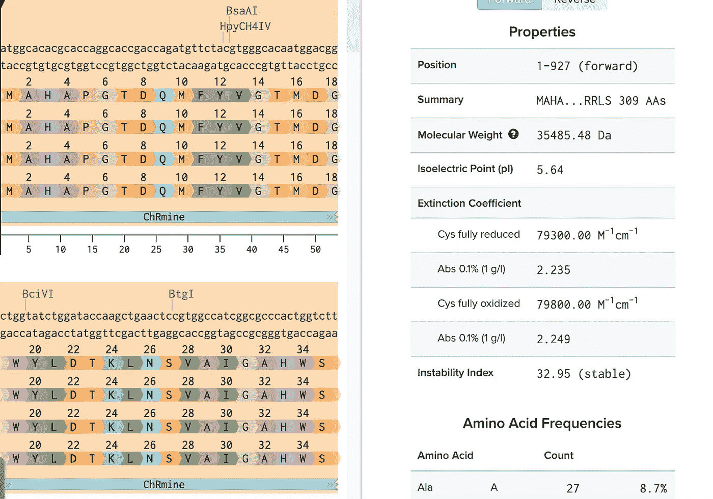
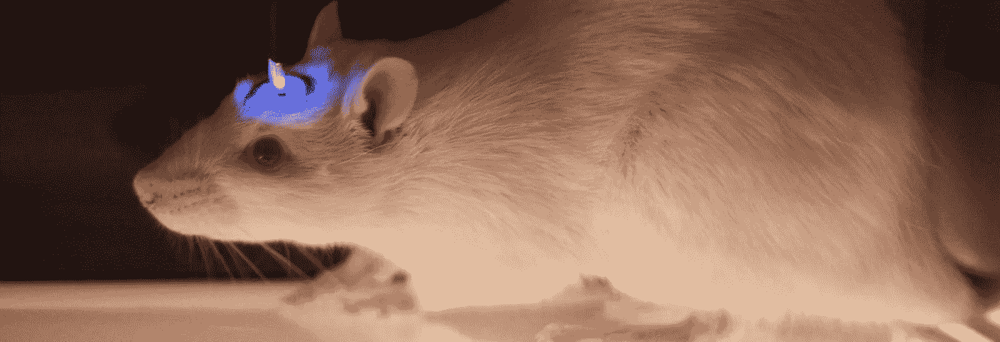
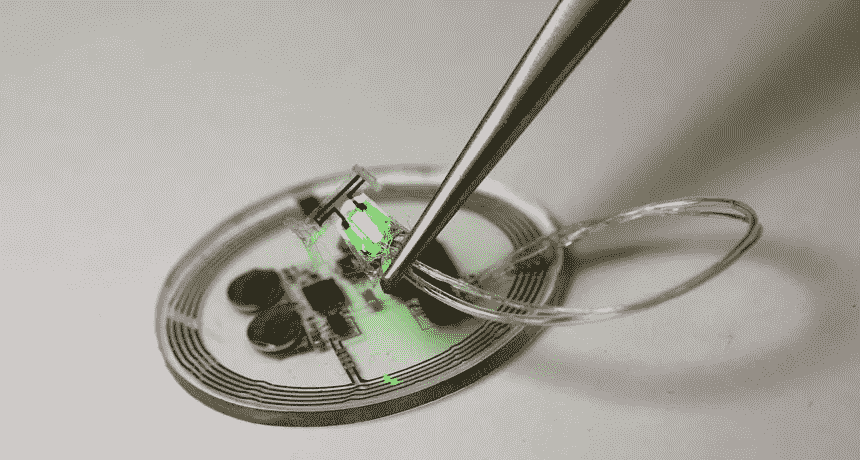

# 肌酸激酶，计算生物学，以及介于两者之间的一切

> 原文：<https://medium.com/geekculture/chrmine-kinases-computational-biology-and-everything-in-between-f0a4424ce2c0?source=collection_archive---------10----------------------->

## 光遗传学的分子生物学

如果我告诉你，现在有一项新兴技术正在实验室测试，如果商业化，可以为各种神经系统、神经退行性和精神疾病创造革命性的治疗方法，会怎么样？一种以新的方式结合了光和基因工程的使用，以实现类似现代精神控制的略微未来的似乎能力，位于两个(数)十亿美元市场的交汇处，并且已经实现了疯狂的事情，例如给盲人复明。这似乎好得令人难以置信，但事实并非如此。这一切的关键是在大自然中找到的，在一个当你第一次听到它时似乎超级意想不到的地方…

algae?!

1.  什么是光遗传学？
2.  什么是视蛋白？
3.  ChRmine 是什么？
4.  我对这些信息做了什么+它意味着什么
5.  对世界和未来的影响
6.  关键要点

## 什么是光遗传学？

**光遗传学是一种新兴的神经科学技术，它利用光和基因工程来操纵大脑中的神经元**(这就是我刚才说的东西！).这是因为单细胞藻类中天然存在的一种叫做通道视紫红质的蛋白质。通道视紫红质在植物的光合作用中起着重要的作用，因为当它检测到它所敏感的光的类型(蓝光)时，它会向植物发出信号，让植物面对光，并打开通道，开始光合作用的过程。

科学家们意识到，他们可以分离出这种蛋白质，将其插入大脑中的神经元，然后在需要时用光激活这些神经元。其工作方式是将通道视紫红质注射到大脑中的特定神经元中，并通过立体定位手术将一个可以照亮这些神经元的脑计算机接口(BCI)也放入大脑中。**然后，可以在任何时候打开光来激活视蛋白，并根据所用视蛋白的类型控制神经元的兴奋(增加其活性)或抑制(降低其活性)。**通道视紫红质具有兴奋性，但一旦这项技术被发现，科学家们就能够找到其他类型的视蛋白，它们对不同颜色的光敏感，并具有不同的用例来增加光遗传学的能力。

Light is applied to a neuron which has been genetically modified to express channelrhodopsin.

与经颅磁刺激(TMS)或深部脑刺激(DBS)等其他先前存在的脑刺激技术相比，光遗传学如此特殊的原因是因为它更加精确。由于只有经过视蛋白修饰的神经元才会对光做出反应，科学家们能够一次性刺激非常小的群体或神经元，甚至单个神经元，而不会影响所有附近的神经元。

多亏了视紫红质通道和其他类型的视蛋白，整个手术才成为可能。现在你知道视蛋白是做什么的了，为什么它们对光遗传学如此重要。但是究竟什么是视蛋白呢？

## 什么是视蛋白？

从更生物学的角度来看，视蛋白是质粒，即环状 DNA 链，它可以独立于更大的 DNA 双螺旋结构(如通常与该术语相关的形状)进行复制和执行功能。它们自然存在于一些细菌细胞中，可以为拥有它们的人提供独特的能力，如抗生素抗性。质粒和标准 DNA 结构之间的另一个关键区别是，标准结构被称为核膜的膜包围，核膜将其与细胞质分开，但质粒是裸露的 DNA，周围没有任何东西。

A plasmid’s structure

在下一个最小的层次，质粒是由激酶组成的。在这种情况下，因为我们看到的是属于蛋白质的视蛋白，激酶是一种特殊类型的蛋白激酶。这些酶可以加速化学反应，将称为底物的分子转化为另一种称为产物的分子。

A plasmid’s protein kinases must all cooperate in order to achieve the plasmid’s functions.

激酶由氨基酸链组成，氨基酸链是制造蛋白质的化合物。最后，在我们今天学习的最小层次上，氨基酸是由成对的有机分子核苷酸组成的。有两对可能的核苷酸:腺嘌呤和胸腺嘧啶或胞嘧啶和鸟嘌呤。每一对只能与它的对立面结合，而不是自身或另一对的核苷酸。当一个核苷酸连接到它的碱基对上时，它们被称为碱基对。每个氨基酸中有三个碱基对。在这个水平上，这些碱基对与构成所有生物的完全相同，但为了我们今天的目的，我们从视蛋白的角度来看它们。更确切地说，从现在开始，就 chRmine 而言。

## ChRmine 是什么？

ChRmine(读作 car-meen)是用于光遗传学的另一种视蛋白。它类似于通道视紫红质，用于刺激神经元，但不同之处在于它对红光敏感，而不是蓝光。**与其他视蛋白相比，它的主要优势是具有非常好的时间分辨率，并且不需要大量的光来激活。**脑中最适合并大量使用 chRmine 的部分是腹侧被盖区/VTA(用于奖励、动机和认知)和海马体(用于记忆)。

我选择用 chRmine 做我的项目，因为作为一个对光遗传学做了很多研究的人，我一直在看关于视紫红质的资源。这是为光遗传学发现的第一个视蛋白，它工作得相当好，所以这很有意义。然而，我很想了解其他类型的视蛋白。因此，当我在 Karl Deisseroth 网站上看到 chRmine 时，它激起了我的兴趣，我决定为这个项目研究它。

## 我用这些信息做了什么

为了完成我为这个项目所做的一切，我使用了钳工。Benchling 是一个基于云的信息学软件，它为分子生物学项目提供了许多优秀的特性。我开始研究不同类型的 chRmine 质粒载体。一开始我只使用了一个载体，它展示了 pAAV-cam KIA-chr mine-eYFP-WPRE 质粒。在我对它做任何事情之前，它只是一个黑色的圆圈，里面有不同大小和颜色的碎片(蛋白质激酶)。在左侧，Benchling 显示了由蛋白激酶分类的质粒的遗传密码(碱基对)。

The original vector of the pAAV-CaMKIIa-ChRmine-eYFP-WPRE before I did anything to it

我最感兴趣的蛋白激酶是 chRmine 激酶，因为该激酶与一组质粒同名，并且是它们必须共同属于该组的一个激酶。基于这个想法，我做的第一件事就是从质粒中分离出肌酸激酶。

一旦我这样做了，我就把它的遗传密码翻译成氨基酸，并调出一组生化特性，如它的分子量，激酶内每种类型氨基酸的频率(有 20 种)，以及基于酸度的净电荷。我还试验了其他特性，但这些是我发现最有趣和最有帮助的特性。

The isolated chRmine kinase’s genetic code, which I translated to amino acids and ran analysis on to determine the biochemical properties on the right.

在我完成了某些功能以更好地理解作为个体的一种肌酸激酶之后，我开始了一些工作来观察它们是如何变化的。为此，我提取了一种不同类型的 chRmine 质粒，它具有尽可能少的共享激酶(除了 chRmine 之外)。这个质粒被称为 pAAV-Ef1a-DIO-ChRmine-mScarlet-kv 2.1-WPRE，我使用它的第一步也是从它的质粒中分离 chr mine 激酶。

当我取出分离的肌酸激酶时，我注意到它的遗传密码和第一个激酶的密码是完全不同的序列。然而，这两种激酶仍然有相同数量的碱基/核苷酸，所以我没有仅仅停留在这个观察上。我做的下一件事是在两种激酶之间建立比对，这实质上是将核苷酸进行匹配，以观察两种给定的生物体有多少共同点。这是我发现这两种激酶不仅有相同数量的碱基，而且它们每种核苷酸的数量也是相同的。

> 那么**这意味着什么呢？**

这意味着，即使从一般的观点来看，这两种激酶的作用是相似的，因为它们仍然是同一类型的激酶，并且它们的性质整体上符合肌酸的性质，但它们在各自的质粒中用于稍微不同的事情。

这一开始可能没有太大的意义，所以这里有一个类比来稍微不同地思考它。在英语中，单词“葬礼”和短语“真正的乐趣”有相同的字母。这两个可能都是英语，但他们有完全不同的含义！激酶也是如此，但用的是遗传密码而不是英语。它们的一般前提可能是相同的，但这并不是说它们不能用于不同的事情。

## 对世界和未来的影响

这项技术还有一段路要走，因为它还处于老鼠试验阶段。为了获得 FDA 的批准并商业化，它需要完成小鼠试验，然后通过一系列的人体测试阶段。**然而，这并不能抹杀这样一个事实:在未来 10 年，这项技术可能会改变数百万人的生活。**就在今年，光遗传学首次被用于给盲人复明。这仅仅是光遗传学已经并将继续用于人类的众多令人难以置信的应用之一。

Currently, optogenetics is still in its mice trials phase.

具体来说，因为它具有兴奋性，所以在神经退行性疾病中有很大的应用。由于 chRmine 通常靶向用于认知和记忆的 VTA 和海马体，这种视蛋白特别适用于靶向的一种神经退行性疾病是阿尔茨海默氏病。

神经退行性疾病之所以被称为神经退行性疾病，是因为随着时间的推移，随着人们年龄的增长，他们大脑中特定部分的神经元的能力会退化。最终，一些神经元根本不会以它们应该的方式工作。特别是对于阿尔茨海默氏症，这个确切的过程发生在 chRmine 的目标区域。

**通过使用 chRmine 对阿尔茨海默氏症或其他形式的痴呆症患者进行光遗传学研究，我们可以对抗这些疾病的不利影响。通过迫使神经元始终保持活跃，我们可以保持该区域仍在工作的神经元的工作状态，并恢复退化神经元的能力。**

不仅如此，chRmine 和其他类型的视蛋白也可以有效地用于其他神经退行性疾病，如帕金森氏症，甚至完全不同类型的疾病，如焦虑和抑郁。遭受各种常规逆境的大脑疾病患者将很快能够以光遗传学的形式寻求有效和精确的治疗。

许多人仍然对接受光遗传学犹豫不决，因为他们担心基于侵入性计算机的大脑植入的伦理问题。虽然这种担忧肯定是正常的，也是采用非常规设备(如侵入性植入物)引入新技术过程中的一个有效部分，但社会需要克服这些额外的担忧，以便向前发展，推进可能具有令人难以置信的应用的技术。许多人会对实现这种类型的工具感到紧张，但正如科学家将努力寻找侵入性更小的应用程序一样，消费者也应该尝试开放他们的思维，以目前存在的方式包括这种技术的可能性。尤其是在医学应用的背景下。

Currently, performing optogenetics requires a small invasive BCI to deliver light.

光遗传学已经清楚地表明，它具有不可思议的潜力，一旦它最终可供人类使用，它可能会有许多改变生活的应用。这项技术可能是神经病学的未来，现在阻碍它的只是多一点时间。

## 关键要点

1.  光遗传学是一种新兴的神经科学技术，它利用光和基因工程来操纵大脑中的神经元
2.  光遗传学能够基于通道视紫红质进行，通道视紫红质是单细胞藻类中天然存在的一种视蛋白。其他类型的视蛋白已经被发现，并且也可以根据用户试图实现的目标而有用
3.  视蛋白是由蛋白激酶组成的质粒(独立的 DNA 环)，蛋白激酶由氨基酸组成，在最小水平上由核苷酸和碱基对(腺嘌呤、胸腺嘧啶、胞嘧啶和鸟嘌呤)组成
4.  胆碱是一种兴奋性视蛋白，被红光激活。它主要用于 VTA 和海马体
5.  我利用 Benchling 的分子生物学特性，从不同的质粒中分离出 chRmine 激酶，将它们的碱基翻译成氨基酸并评估它们的生化特性，然后比较它们的核苷酸序列。
6.  我注意到来自非常不同的质粒的两种肌酸激酶具有相同数量的核苷酸和每种类型的核苷酸，但是顺序不同。我发现这是因为它们做的事情略有不同，即使它们作为 chRmine 质粒的一部分的一般用例是相同的
7.  虽然光遗传学仍然是一项非常发展的技术，但它在未来可能会有革命性的应用，例如对阿尔茨海默氏症和其他形式的痴呆症患者

非常感谢你阅读我的文章，我希望你喜欢它！我叫刘冰·博恩施泰因，今年 15 岁，我热衷于神经科学、神经病学和生物技术。我很乐意在 LinkedIn 上联系，或者你可以在 rainabornstein@gmail.com 联系我，与我交谈或合作。我等不及收到你的来信了！