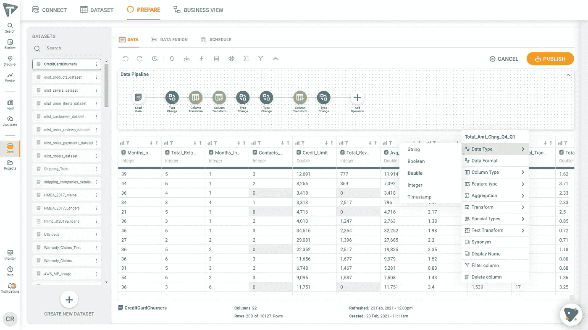
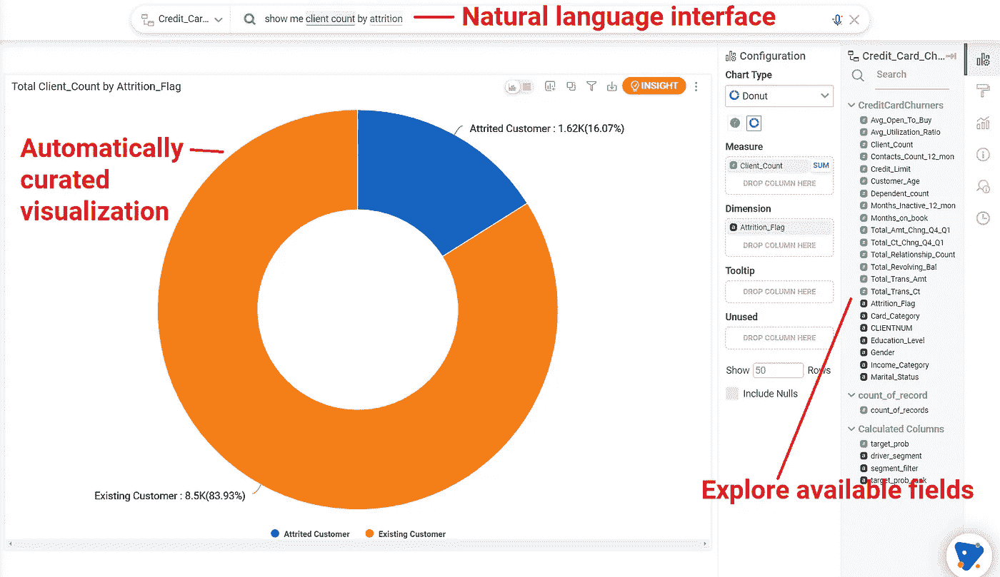
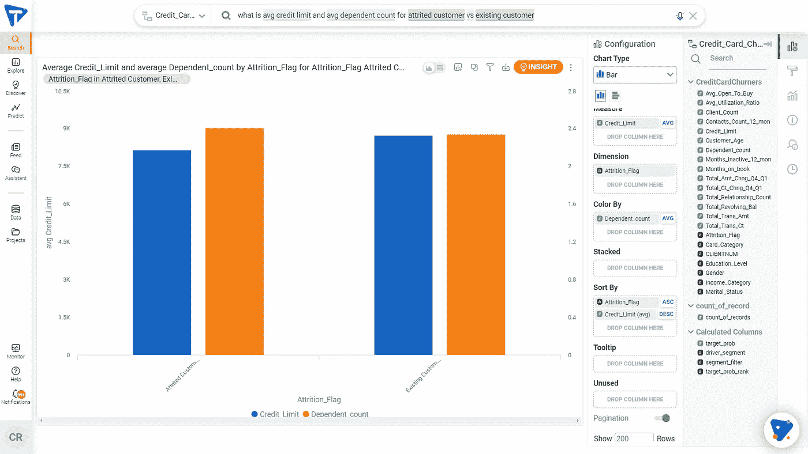
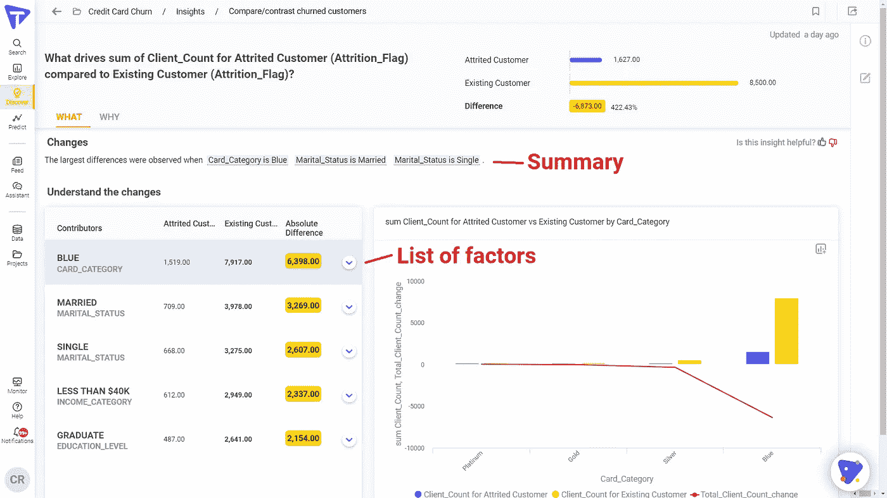
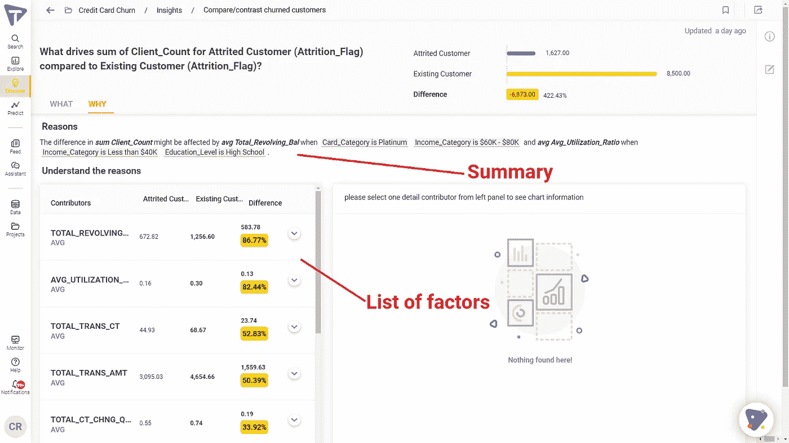
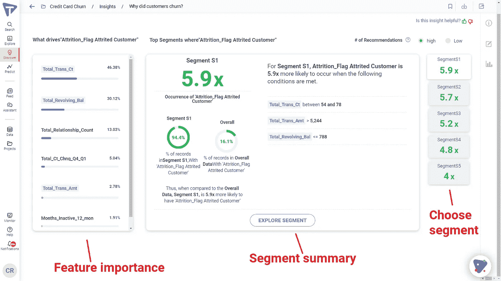

# 使用 Tellius 进行虚拟客户流失分析

> 原文：<https://medium.com/geekculture/churn-analytics-for-dummies-with-tellius-f70ea5551fee?source=collection_archive---------29----------------------->

这是一个古老的故事——为什么我会失去客户？对失去客户的狂热关注实际上是由客户获取成本(CAC)驱动的，这是获得新客户的可怕成本。流失分析比以往任何时候都更重要，因为留住现有客户的成本几乎总是以指数方式低于获得新客户的成本。

根据 [Hubspot](https://blog.hubspot.com/service/customer-acquisition-study) 的数据，收购成本增加是因为:
1。消费者对企业的信任正在减弱。营销成本正在上升
3。竞争加剧(从源头——来自像谷歌这样的营销者自己的竞争产品)
4。监管环境更加复杂

那么，你如何识别最有可能流失并前来救援的客户呢？通过将他们作为客户并避免必须更换高 CAC 的客户，您直接为利润保护做出了贡献。

如今，流失分析需要几种工具:数据准备工具、仪表板/EDA 工具和建模工具，如 Python 或潜在的 SAS。如果你只是一个需要完成这个任务的人呢？如果您不想等待数据科学家来帮助您，或者报告开发人员来创建您需要的视图，该怎么办？

我想向您展示如何在一个工具中完成客户流失预防，而不需要专业技能。

# 数据集

对于这篇博客，我们将使用从 Kaggle 获得的信用卡流失数据集。加载数据简单明了。一旦加载，你可以在 Tellius 中做一些数据准备。这里我们通过一个点击界面做了一些简单的类型改变。从类型更改到复杂的聚合，您不需要成为 SQL 专家就可以操作您的数据。

Point and click data prep example

现在来探索和理解我们的数据集。您可以使用自然语言搜索来直观地检查您正在处理的数据。让我们来看看有人会怎么做:

Exploring our churn dataset

看起来我们有 16%的顾客抱怨。我们的字段列表显示了相当多的指标，如信用额度、年龄等。让我们比较一下现有客户和现有客户的信用额度和依赖人数，看看我们是否能感觉到任何主要差异:

More EDA

直观地查看我们两个不同的类的所有这些指标是很困难的——我们如何知道哪个对不满意的客户有最大的影响？当我们考虑多变量分析时，我们想要考虑多个变量来理解数据的组合，情况又如何呢？从视觉分析中几乎不可能理解是什么驱动了客户流失。

相反，让我们尝试使用 Tellius 的一些自动化见解。我们先开球两个:
1。一项队列研究将确定我们两类客户之间的最大差异
2。一个关键的驱动力洞察，它将确定哪些功能是最重要的，并确定客户群的流失目标

We type these questions to kick off insights

在 Tellius 中，可以通过搜索、点击可视化或通过提示菜单来启动洞察力。让我们先解释一下我们的群组洞察力:

Cohort insight: What

首先，我们看到了群组洞察中的“什么”选项卡。在顶部，我们可以看到被搅动的客户数量用蓝色表示，现有客户用黄色表示。下面是一个总结，它确定了观察到的客户流失率差异最大的地方，下面是这些差异的排名列表。

这一独特的见解告诉我们，现有客户与流失客户的最大区别在于蓝卡类别和已婚或单身人士。

Cohort insight: Why

转到我们的“为什么”标签，揭示了有趣的指标组合，这些组合在搅动和现有之间有着最显著的差异。顾客的信用卡周转余额、平均使用率和总交易次数明显较低。

从这些数据中我们能推测出什么？**较少使用信用卡的客户，更有可能流失并转向另一家信用卡提供商**。

# 我们该怎么办？

我们可以做出的一个假设是，促销或优惠将吸引您的现有客户更多地使用他们的卡。较低的利率优惠、在特定零售商购物的激励或临时现金返还优惠可以帮助我们增加当前客户的信用卡使用率，从而减少他们的流失。

然而，这些报价都很贵。我们应该针对谁产生最大的影响？我们最有可能流失的客户怎么样。

确定目标客户群通常是一项单变量的工作:仅仅基于一个数据点。多元细分市场可以提供更强大、更有针对性的细分市场，我们可以用我们的优惠来攻击这些细分市场。找到这些部分通常需要数据科学家和高级建模或机器学习知识。

有了 Tellius，我们可以使用我们的第二个洞察力:关键驱动力洞察力。

Key driver insight

这一关键驱动因素洞察首先在我们的功能重要性部分向我们展示了驱动客户流失的功能。这验证了我们在群组洞察中看到的数据，其中交易计数和循环余额被证明是重要的指标，可以表明客户将会流失。

细分市场汇总确定了构成该细分市场的标准。对于上述情况，我们的总体数据集的流失率为 16.1%，而符合这一标准的这部分客户的流失率为 94.4%。针对这一细分市场提供优惠将有助于我们从一个只有 1/20 的客户仍然留在我们身边的细分市场夺回客户。

# 采取行动

通常，由于技术障碍，这是分析停止的地方。我们如何在我们的数据中标记这一细分市场，并提供一个可操作的客户列表，以提供优惠？

使用 Tellius，您可以通过使用 Explore Segment → Smart Insights 自动将标志应用于数据集，而无需了解 SQL。从这里，我们能够创建一个详细的客户列表，这些客户应该是促销的目标客户，目标是在客户流失方面扭转我们表现最差的客户群。

A filtered list ready for action

# Tellius 让客户流失分析变得简单

流失分析历来被认为对任何一个人来说都太技术性、太难。传统工具、多个团队和沟通障碍导致流失分析是一个缓慢的过程，其输出在准备就绪时已经过时。

查看 Tellius 的[免费试用版，降低您的流失率，留住您的客户，并避免获取新客户的高成本。](http://tellius.com/free-trial)