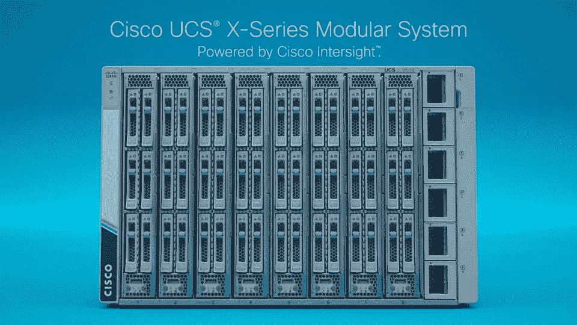
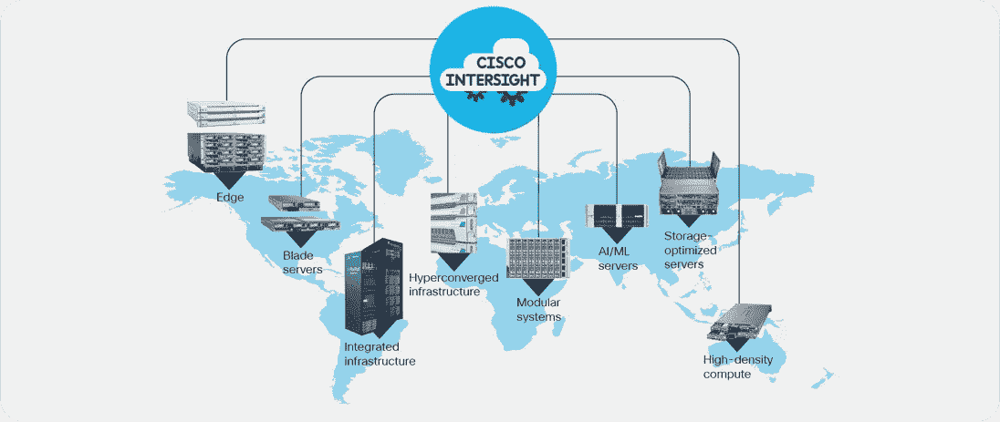

# 思科数据智能平台—借助思科 UCS X 系列模块化系统，为您的数据和应用开启混合云之旅

> 原文：<https://medium.com/geekculture/cisco-data-intelligence-platform-journey-to-hybrid-cloud-for-your-data-and-apps-with-cisco-ucs-a103c238beb2?source=collection_archive---------51----------------------->

**借助思科数据智能平台，数据湖向混合云发展**

如今，在这个数字化的世界中，数据正以非常高的速度从许多不同的来源生成，并且在许多使用案例中呈指数级增长。因此，几 peta 字节的数据正成为常态。此外，它还以各种形式生成，无论是结构化的、半结构化的还是非结构化的……各种数据也在扩展，不仅仅是简单的文本，如图像、视频、语音等，以提取情报。

这些海量数据正在内部或公共云数据湖中被吸收。显而易见，It 领导在寻找方法、如何最大化数据湖的投资回报、如何释放数据的全部潜力以及如何与业务成果完全一致方面面临挑战。此外，如何实现应用现代化，采用云原生架构，使用 Kubernetes 创建微服务，以及使用 AI/ML 框架利用高级分析。在这些挑战中，孤立的整体应用和数据进一步减缓了创新的步伐，并限制了他们向现代数字化的转型之旅。

鉴于所有这些，行业正在为他们的数据湖寻找混合解决方案，以提供具有通用身份的统一用户体验，从私有云延伸到公共云的单一 API 框架，在应用需求增长时自动扩展，通过全面的数据治理和合规性对敏感数据实施更严格的控制，并为数据分析、商业智能、人工智能推理等实施通用数据服务层。

传统上，混合云被视为连接两个数据中心(公共和私有)。然而，现代混合云完全是关于应用和数据的数字化转型。应用程序已经转变为全新的 IT 思维。以前应用支持业务功能，现在“应用就是业务！”。它是关于通过利用高级分析、人工智能、Kubernetes 和微服务来获得混合云的敏捷性、灵活性和可靠性。它关乎大规模、灵活消费、优化的安全性、性能、可用性和精细控制。

Cisco UCS X 系列的设计考虑了混合数据中心和云。UCS X 系列的主要目标是帮助客户满足现代应用程序和混合云运营模式的需求。同时降低复杂性。x 系列模块化设计提供了灵活性，可满足现代应用程序及其数据快速变化的需求。

Cisco UCS X 系列完全由 Cisco Intersight 管理。借助 Intersight，您可以获得 SaaS 交付的所有优势，以及跨数据中心、远程站点、分支机构和边缘环境的分布式基础设施和工作负载的全生命周期管理。这使您能够以以前不可能的方式分析、更新、修复和自动化您的环境。因此，您的组织可以实现显著的总拥有成本节约，并更快地交付应用程序以支持新的业务计划。

Achieving agility is the first step towards digital transformation — Drive workload agility with Cisco Intersight

多年来，Hadoop 生态系统从批处理(Hadoop 1.0)发展到流和近实时分析(Hadoop 2.0)，再到大数据遇上人工智能(Hadoop 3.0)。目前，这些技术的功能已经发展到将数据湖作为存储和计算分离的私有云，并进一步支持混合云(和多云)。

Cloudera 在 2020 年下半年发布了两款软件，这两款软件共同使数据湖成为私有云。

*1-Cloud era Data Platform Private Cloud Base—提供存储并支持传统的数据湖环境，还引入了 Apache Ozone，这是数据湖的下一代文件系统*

*2- Cloudera 数据平台私有云体验—为存储在 CDP 私有云库中的数据提供基于不同体验或角色(数据分析师、数据科学家、数据工程师)的工作负载处理*

思科数据智能平台(CDIP)由 Cloudera 数据平台(CDP)提供支持，所有创新都在 CDIP 得到了很好的集成和验证。

This architecture can start from a single rack and scale to thousands of nodes with a single pane of glass management with Cisco Application Centric Infrastructure (ACI)

思科发布了首个“基于思科 UCS C240 M5 的思科数据智能平台和 Cloudera 数据平台私有云体验”验证设计，可在[https://www . Cisco . com/c/en/us/TD/docs/unified _ computing/UCS/UCS _ CVDs/cdip _ c240m 5 _ cdppcp _ design . html](https://www.cisco.com/c/en/us/td/docs/unified_computing/ucs/UCS_CVDs/cdip_c240m5_cdppcp_design.html)上获取。该平台完全由 Cisco inter sight for infra structure perspective 管理，可以使用 Intersight Cloud Orchestrator 实现自动化。最近，思科还发布了一份关于思科 UCS M6 和思科 UCS-X 系列与 Cloudera 数据平台的思科数据智能平台的设计文档，可在[https://www . Cisco . com/c/en/us/TD/docs/unified _ computing/UCS/UCS _ CVDs/cdip _ UCS _ M6 _ cloud era _ design . html](https://www.cisco.com/c/en/us/td/docs/unified_computing/ucs/UCS_CVDs/cdip_ucs_m6_cloudera_design.html)找到

在 marketplace 产品下的 Cloudera 公共云中也有类似的体验。这开启了混合应用和数据的统一体验…借助混合 Hadoop 生态系统，我们可以利用 Cloudera SDX 层扩展数据湖的边界，从私有云到公共云提供更紧密的数据安全性、治理和合规性。

思科数据智能平台是一个云规模架构，它将数据湖和人工智能/计算场层整合在一起，作为一个实体共同工作，同时还能够独立扩展，以解决现代数据中心的 IT 问题。

CDIP 的设计考虑了云优势，将计算和存储分离。通过分离计算和存储，我们可以根据需要纵向或横向扩展。对于混合云，这种分离增加了规模界限。它带来的好处，现在推动着整体数据格局运动的势头。然而，这种分离带来了一些挑战，高速结构在这种情况下起着至关重要的作用，为了进一步提高性能，本地瞬态数据利用本地磁盘缓存，该缓存可以基于应用程序进行重建和再利用。这就是 CDP 在 CDIP 设计解决方案的方式。这种分离还允许将投资引向最需要的地方(存储或计算),并且成本效益显而易见。在许多情况下，计算需求完全是弹性的，而存储保持不变，反之亦然。

私有云以容器的形式创建虚拟数据处理计算，其中包含 CPU/内存/GPU 等资源，无论是 Spark 集群、利用 Tensorflow 或 PyTorch 独立运行的 AI、面向数据科学家的笔记本电脑(Jupyter 或 Cloudera work bench)还是虚拟仓库。所有这些都在 Kubernetes 支持的容器云中按需进行调配或取消调配。

CDIP 为数据湖和私有云提供预先验证的设计。在这些参考设计中，思科与合作伙伴一起实现了架构创新。除此之外，思科还发布了各种创世界纪录的 TPC 性能指标评测，并证明了线性扩展。思科公布了传统 map reduce 和 Spark 的最高性能数据，Spark 是用于处理大数据的下一代计算技术。此外，CDIP 通过思科 Intersight 提供集中管理。思科 Intersight 的创新和新特性及功能的增加正在加速进行，这将在混合云的背景下带来许多令人兴奋的创新；所有这些都与 UCS X 系列和 CDIP 完全一致，例如使用 orchestrator 的解决方案自动化、可观察性、监控等。

# 结论

在 CDIP，UCS X 系列为容器云提供了出色的平台，作为混合世界中现代应用的计算引擎。在未来几年，应用程序现代化的速度将会非常快，UCS X 系列完全符合，并将会出现一波新技术，如新的计算模块、网络结构、PCIe 结构、池化 NVMe 驱动器、永久内存、GPU 加速器、定制 ASICs 等。