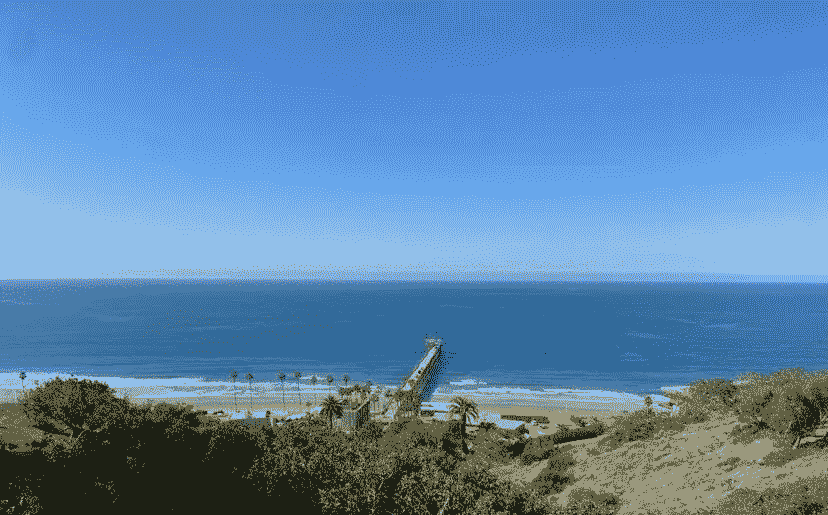
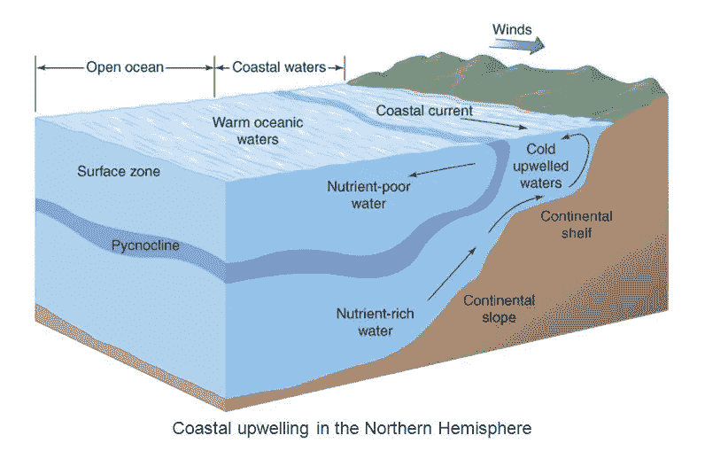
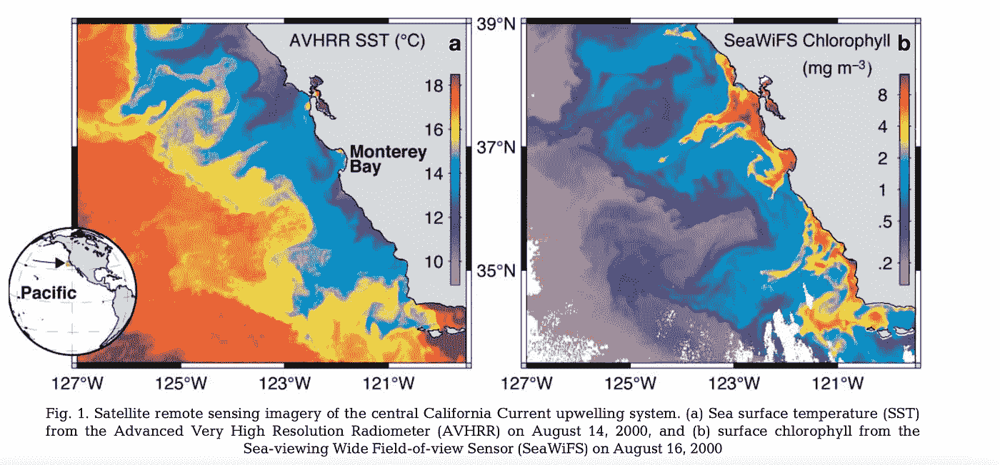
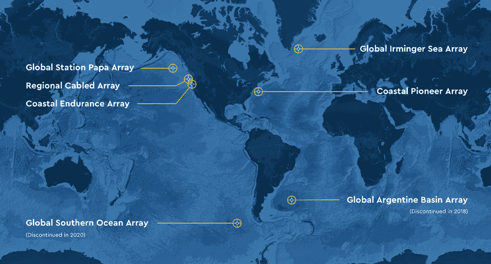
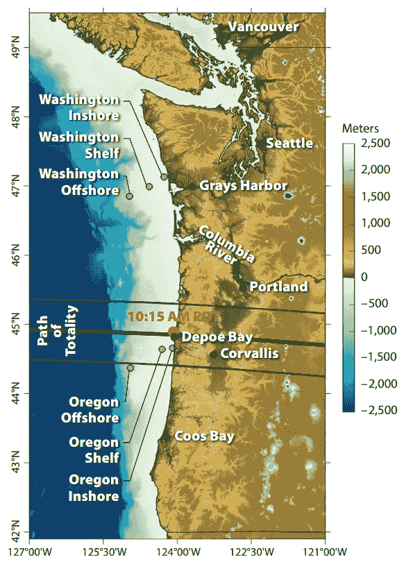
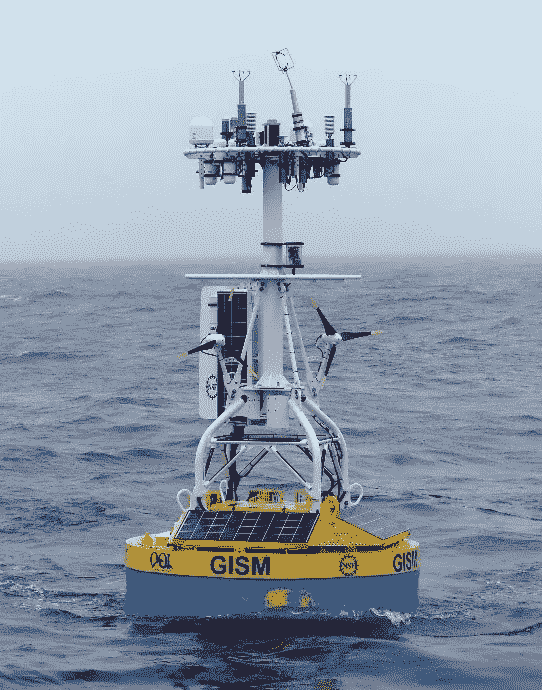
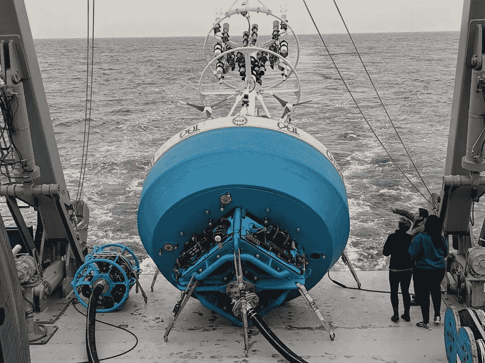
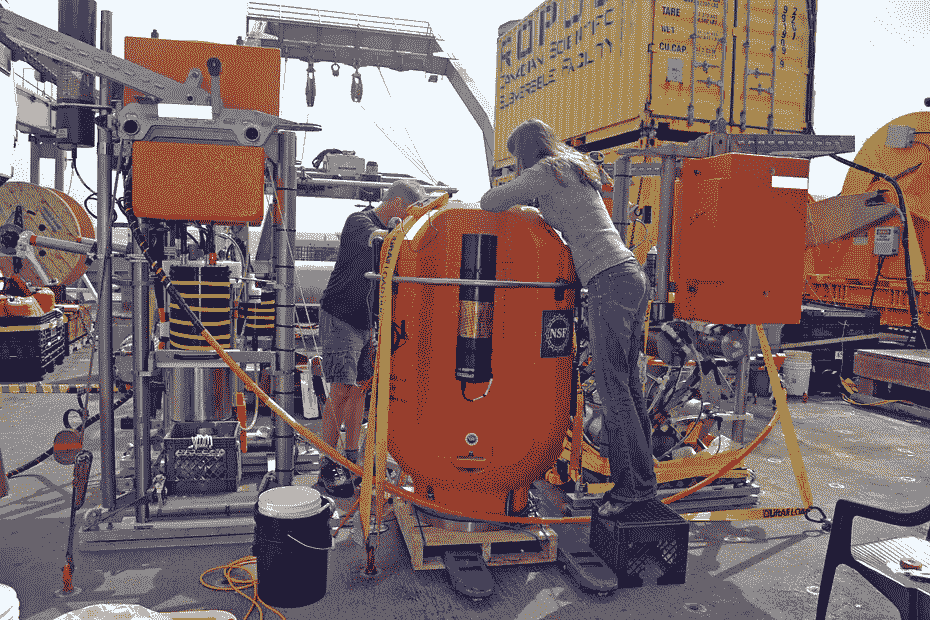
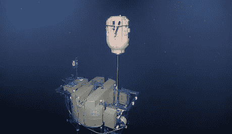

# 利用环境变量对海岸上升流进行分类

> 原文：<https://medium.com/geekculture/classifying-coastal-upwelling-using-environmental-variables-8e648d909170?source=collection_archive---------28----------------------->

## 数据科学顶点项目系列

## 第 1 部分:项目设计和背景

这是我计划讨论我最近为大会的数据科学沉浸式项目完成的顶点项目的一系列简短帖子的第一部分。我与来自华盛顿大学(UW)应用物理实验室的声学团队成员合作，选择了一个可以为 UW 海洋数据科学界的工作增添价值的项目主题。我的顶点项目的目标是建立一个模型，可以使用环境变量来**识别沿海上升流，我将写关于项目设计和背景，数据分析和发现，模型和结果，以及许多潜在的改进！我喜欢教人们关于海洋的知识，所以我将为你们所有不了解海洋的人彻底解释我的项目的海洋学方面。尽管如此，当我开始讨论模型构建细节时，如果您有一点数据科学背景，这将会有所帮助。在这一点上，我希望你已经准备好投入进去了！**

# 项目背景

正如我所说的，我对这个顶点的问题陈述是建立一个模型，可以使用环境变量来识别海岸涌升。这个项目实际上有两个概念部分:海洋学部分，我们使用传感器、数据和物理来研究海洋中的自然过程；数据科学部分，我们收集和处理数据来创建机器学习模型，以进行预测并推断变量之间的关系。就我的顶点而言，海洋学方面主要关注环境变量中的沿海涌升信号，数据科学方面主要关注二元分类问题，即建立一个模型来确定涌升是否以简单的是/否格式发生。

A photo of the Pacific that I took from the Birch Aquarium at Scripps Institution of Oceanography in California, 2020

对于不知道什么是海岸上升流的读者，让我来告诉你吧。想象一下，在一个晴朗多风的日子，你站在加利福尼亚的沙滩上。你现在看到的是太平洋，更确切地说，是[加州洋流系统](https://en.wikipedia.org/wiki/California_Current)，它在海洋学领域以其**深海海水的强烈上升流**而闻名。当这个地区的风吹向南方时，沿岸的表层水被推离海岸，深层海水被拉到表层来代替它——这被称为上升流。Downwelling 描述了相反的情况——当风在这个系统中吹向北方时，表层水被推向岸边，直到它不能再前进，必须向海底移动。加州海岸线几乎全年都有深水上升流，而俄勒冈州和华盛顿州的海岸在风向改变时，季节性地在上升流和下降流之间转换。

Diagram from Karen Lewis’s presentation on [Oceanic Circulation](https://slideplayer.com/slide/4279467/), slide 49

由于上升流是风驱动的过程，创建预测模型(试图预测上升流何时发生)的科学家可能会选择使用描述当地风速和天气模式的数据来进行预测。然而，我的项目甚至更简单——通过搜索水体中可能由上升流产生的**海水温度和盐度的变化**,试图预测**是否发生了**上升流。但是，你如何判断海洋中经过传感器的水是否是从深海涌过来的呢？

地表水和深水有很多不同之处。在海洋中，不同的水体根据密度进行组织。冷水比温水密度大，盐水比淡水密度大。密度最大的水沉入底部，密度最小的水停留在表面，所以海洋深层水比表层水更冷，含盐量更高，我们可以在收集的数据中寻找这些差异。下图显示了加利福尼亚州蒙特雷湾附近的加利福尼亚海流系统的卫星图像。在左边的图中，冷水(紫色)已经在海岸线上升流，其温度明显不同于更远处的表层水(红色和橙色)。正如我提到的，深水含盐量更高，所以我们可以在海水盐度数据中看到类似的模式。深海也没有直接通向大气的通道，这意味着深水中的溶解氧含量与地表水非常不同。

Source: [Physical-biological coupling in Monterey Bay, California: Topographic influences on phytoplankton ecology.](https://www.researchgate.net/publication/239589926_Physical-biological_coupling_in_Monterey_Bay_California_Topographic_influences_on_phytoplankton_ecology)

现在你明白了沿岸上升流，但你为什么要关心？嗯，海洋深处的水不仅仅是冷的和咸的；它还富含**营养成分，**像氮和磷！当这种营养丰富的水被带到水面时，它就成了浮游植物的食物，这反映在上面右侧面板中叶绿素浓度的卫星图像中。沿岸上升流并不是加州洋流系统所独有的，它发生在世界范围内的其他几条海岸线上。在像蒙特利湾这样的系统中，上升流可能占当地初级生产力的很大一部分，而初级生产力养活了食物网的其余部分(包括我们)，因此研究人员研究上升流等沿海过程，以最好地服务和通知他们的当地和全球沿海社区。

# 项目设计

为了让你更好地理解我在这个项目中使用的数据，想象你有一个传感器漂浮在俄勒冈州海岸附近的水柱中。它在水柱顶端 200 米的某处，全天候测量海水温度。假设温度始终为 15 ℃,有一天，风开始吹向南方，水温降低，直到达到 8 ℃,导致你说:“嘿，我想这水是从深海上升流来的！”然后你查一下那天的上升流指数——我用的是 [CUTI 指数](https://oceanview.pfeg.noaa.gov/products/upwelling/cutibeuti)，它是根据埃克曼输运和跨海岸地转输运计算出的上升流导致的总水输运。如果指数显示有利的上升流条件，您可以在盐度或溶解氧中寻找类似的模式，知道来自深海的上升流水比表层水含盐量更多，溶解氧更少。

[A map of the ocean observatory arrays maintained by the OOI](https://oceanobservatories.org/research-arrays/)

我刚刚描述的场景中的数据正是海洋观测站倡议，或 OOI，使用各种海洋传感器收集的。OOI 在世界各地有几个观测阵列，每个阵列都有一组独特的海洋学传感器，放置在海面、海底和整个水柱中。我重点关注了俄勒冈州海岸的海岸耐力阵列(见左图)，特别是俄勒冈州海上站点(见下图)，位于纽波特以西 40 英里，最大深度约 600 米。这个地点位于一个被充分研究过的区域，那里的上升流是季节性发生的，这给了我一个上升流和下降流条件的良好组合，可以在我的模型中使用。

Source: [Warm Blobs, Low-Oxygen Events, and an Eclipse: The Ocean Observatories Initiative Endurance Array Captures Them All](https://www.researchgate.net/publication/323345105_Warm_Blobs_Low-Oxygen_Events_and_an_Eclipse_The_Ocean_Observatories_Initiative_Endurance_Array_Captures_Them_All)

尽管这些传感器很酷，但它们并不总是完全起作用。你有没有试过把精密的电子产品放进密封的容器里，然后扔到 600 米外的海里？这很有挑战性！海洋中的传感器可能以各种方式发生故障，并且随着时间的推移注定会失去校准。此外，维护这些传感器的科学家和工程师需要进入一艘研究船，以便在仪器损坏时修理仪器，这意味着当船只忙于在其他地方工作时，传感器可能会连续几个月出现故障。当试图使用这些传感器分析长时间周期时，这导致了不幸的限制，我将在接下来进行讨论。

# 数据收集

我雄心勃勃的目标是纳入三个不同的传感器平台在俄勒冈海上站点收集的一年数据:位于海面的表面系泊设备，在水柱顶部 200 米上下移动的浅剖面仪，以及位于 200 米深度的固定平台。我使用了 [OOI 的 API](https://datalab.marine.rutgers.edu/2020/05/data-requests-the-easy-way-with-the-ooi-api/) 来提取这些平台从 2017 年收集的数据，以避免使用可能受到 [2014 年和 2019 年海洋热浪](https://www.fisheries.noaa.gov/feature-story/new-marine-heatwave-emerges-west-coast-resembles-blob)(如[斑点](https://en.wikipedia.org/wiki/The_Blob_(Pacific_Ocean)))影响的数据。当我拿到数据时，我很兴奋地看到，表面系泊几乎覆盖了 2017 年的所有 12 个月，浅层剖面仪的 CTD(一种测量电导率、温度和压力的传感器)从 1 月 1 日到 9 月中旬似乎都在工作。不幸的是，浅层剖面仪在 200 米平台附近停留了几个月，而不是像它被要求做的那样探索水柱，这意味着我在 2017 年的大部分时间里错过了上层水柱的全景。

Images of OOI surface moorings. They’re decked out with environmental sensors from top to bottom, literally! Image sources — left: [OOI achieves milestone with Irminger Sea deployment](https://oceanobservatories.org/2019/09/ooi-achieves-milestone-with-irminger-sea-deployment/), right: [Dr. Hilary Palevsky on Twitter](https://twitter.com/HilaryPalevsky/status/1158122464263790592).

我从 2018 年的相同平台上提取数据，看看是否有什么不同，结果是——侧写器功能更强，但 200 米平台的数据缺失了很大一部分。如果没有一个数据是在同一时间段持续收集的，我该如何使用所有这些数据？简单的解决方案是:创建两组不同的模型，每组模型由不同的平台选择提供信息，并比较它们的结果，以查看哪个平台对机器学习模型最有信息。我创建的第一套模型，用的是 2017 年水面系泊采集的海面温度和 200 米平台采集的海水温度和盐度。第二组模型使用 2018 年的浅层剖面仪海水温度数据，覆盖水柱顶部 200 米。这意味着我们可以看到模型在只知道水柱中的两个位置——水面和 200 米——与这两个位置及其之间的每个深度相比表现如何。

Images showing a shallow profiler on deck (left) and attached to a submerged platform (right). Image sources: left — [OOI Working on Oregon Offshore Shallow Profiler](https://interactiveoceans.washington.edu/platform-winch_-deck_-082914_145722/), right —[Ocean Observatories Initiatives’ Cabled Array Brings the Ocean to Your Living Room, 24/7](https://www.labmanager.com/labs-less-ordinary/ocean-observatories-initiatives-cabled-array-brings-the-ocean-to-your-living-room-24-7-3051).

由于这个项目的目标是帮助我们理解现实世界中发生的自然过程，我想使用侧重于推理而不是预测的模型。对于数据科学中使用的许多流行模型，通过让模型在数据中找到人类无法解释的复杂关系，可以获得更高的准确性。在这种情况下，我更关心可解释性而不是准确性，所以我被限制在可以提供可解释结果的模型上。基于此，我选择使用 scikit-learn 库中的两个分类器:逻辑回归分类器[和 T2 决策树分类器](https://scikit-learn.org/stable/modules/generated/sklearn.linear_model.LogisticRegression.html)。逻辑回归分类器返回系数值，决策树分类器为每个模型特征返回[计算的特征重要性](https://machinelearningmastery.com/calculate-feature-importance-with-python/)。这些系数和要素重要性将告诉我们，在俄勒冈海上站点模拟海岸上升流时，水柱中的哪些位置信息最丰富。

我的下一篇博文将讨论数据分析中有趣的发现，之后是数据预处理和模型结果。我可以就这些事情写上好几年，但是谁愿意读一篇 30 分钟的博文呢？不是我！所以我希望你能期待下一部，感谢你的阅读！

特别感谢**来自 UW 应用物理实验室的 Wu-Jung Lee** 和**来自 UW 校区 eScience Institute 的 Valentina Staneva** 对这个项目的指导。他们在 UW 领导一个海洋声纳数据科学团队，该团队创建了一个 Python 包 [echopype](https://echopype.readthedocs.io/en/latest/) ，用于处理由称为[回声探测仪](https://en.wikipedia.org/wiki/Scientific_echosounder)的传感器收集的海洋声纳数据。

如果你想了解更多关于加利福尼亚洋流系统中海岸涌升的信息，请查阅以下资源:

 [## 上升流和加利福尼亚海流

### 加利福尼亚海流是北太平洋环流的东部边界海流，从英国沿太平洋向南流动。

oceantracks.org](https://oceantracks.org/library/the-north-pacific-ocean/upwelling-and-the-california-current#:~:text=The%20California%20current%20is%20the,Canada%20to%20Baja%20California%2C%20Mexico.&text=This%20results%20in%20the%20creation,such%20as%20the%20California%20Current)  [## 海洋环境

### 加利福尼亚海岸外动态多样的海洋条件和物理环境支持着一个巨大的阵列…

caseagrant.ucsd.edu](https://caseagrant.ucsd.edu/project/discover-california-commercial-fisheries/the-ocean-environment)  [## NOAA 海洋探险者:避难所探索:背景

### 史蒂夫·盖恩斯博士，海洋科学研究所主任兼教授，生态学、进化和海洋生物学大学…

oceanexplorer.noaa.gov](https://oceanexplorer.noaa.gov/explorations/02quest/background/upwelling/upwelling.html)