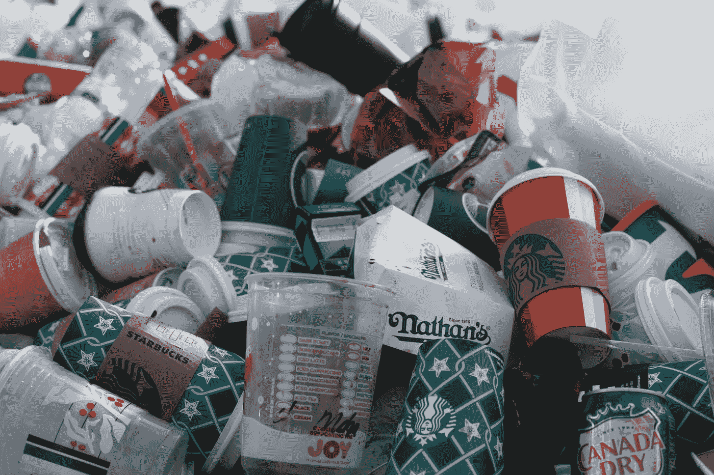

# 利用机器学习对垃圾图像进行分类

> 原文：<https://medium.com/geekculture/classifying-waste-images-with-machine-learning-14b249f11544?source=collection_archive---------2----------------------->

## 人工智能如何帮助我们减少，再利用，回收



Photo by [Jasmin Sessler](https://unsplash.com/@jasmin_sessler?utm_source=medium&utm_medium=referral) on [Unsplash](https://unsplash.com?utm_source=medium&utm_medium=referral)

# 目录

1.  [简介](#a585)
2.  [数据来源](#66db)
3.  [设置](#b157)
4.  [数据预处理](#8da1)
5.  [训练模特](#903a)
6.  [结果](#ea1f)
7.  [结论](#b335)
8.  [参考文献](#3c2b)

# 介绍

随着全世界每天产生大量的废物，废物管理是一个巨大的问题。这个问题的一个重要部分是垃圾分类。但是如果我们可以用人工智能来自动化这个过程会怎么样呢？

> 我的目标是建立机器学习模型，可以从图像中将废物分类为有机或可回收。

类似于[我过去关于神奇宝贝分类的文章](/m2mtechconnect/classifying-pokémon-images-with-machine-learning-79b9bc07c080)，我将使用*卷积神经网络*来做这件事。

# 数据源

这是我将使用的数据集:

[](https://www.kaggle.com/techsash/waste-classification-data) [## 废物分类数据

### 该数据集包含 22500 张有机和可回收物品的图像

www.kaggle.com](https://www.kaggle.com/techsash/waste-classification-data) 

它被分成测试和训练目录，这两个目录又被进一步分成有机的和可回收的文件夹。

对于训练集和验证集，原始数据集比可回收图像具有更多的有机图像。如果我们不补救这种阶级不平衡，[模型可能会知道最好只预测多数阶级](https://pythonprogramming.net/loading-custom-data-deep-learning-python-tensorflow-keras/)。

为了防止这种情况，我们将有机数据缩减到可回收数据的大小。我在文件资源管理器中按照文件大小降序随机排列文件。替代解决方案包括:

*   使用[AUC(ROC 曲线下面积)](https://developers.google.com/machine-learning/crash-course/classification/roc-and-auc)作为准确性和损失之外的指标
*   少数类的随机过采样
*   训练模型时使用类别权重

你可以在这里阅读更多处理不平衡数据的方法:

[](https://www.analyticsvidhya.com/blog/2017/03/imbalanced-data-classification/) [## 不平衡数据:如何处理不平衡分类问题

### 如果你花了一些时间在机器学习和数据科学上，你肯定会遇到…

www.analyticsvidhya.com](https://www.analyticsvidhya.com/blog/2017/03/imbalanced-data-classification/) 

# 设置

首先，我导入了我们在整个项目中需要的 python 库:

```
import numpy as npimport pandas as pdimport matplotlib.pyplot as pltimport matplotlib.image as mpimg
```

然后，我设置每个目录的路径。如果你正在使用 Google Colab，我建议上传数据集作为 zip 文件，并在笔记本中提取它。

从输出来看，每个类有 9999 个训练图像和 1112 个验证图像。

对于我们的机器学习模型，我们需要知道图像的形状，所以让我们来看几个例子:

所有图像都是 RGB，但它们的尺寸不同，这需要在预处理数据时加以考虑。我还展示了每个类的样本图像。前四个来自有机目录，而底部的四个是可回收的。

# 数据预处理

首先，我将导入预处理和构建机器学习模型所需的库:

```
from tensorflow.keras import layersfrom tensorflow.keras import Modelfrom tensorflow.keras.preprocessing.image import ImageDataGeneratorfrom tensorflow.keras.optimizers import RMSprop
```

现在我们将创建我们的图像数据生成器。我们将在 0 和 1 之间重新调整数据，同时将图像大小调整为 150 乘 150。从我的试运行来看，数据扩充并没有提高模型性能。

# 训练模型

**现在我们准备好训练我们的分类器了！**我将创建两个机器学习模型:一个从头开始的 CNN 和一个迁移学习模型。我的模型基于谷歌开发人员的图像分类实践:

[](https://developers.google.com/machine-learning/practica/image-classification?hl=en) [## ML 实习:图像分类|机器学习实习

developers.google.com](https://developers.google.com/machine-learning/practica/image-classification?hl=en) 

如果你使用的是 Google Colab，我建议使用 GPU 硬件加速器来加快训练过程。

1.  **CNN 从零开始**

2.**迁移学习模式**

对于我的迁移学习模型，我将使用 Google 的 Inception v3 模型。你可以在这里阅读更多关于 Inception v3 的内容:

[](https://cloud.google.com/tpu/docs/inception-v3-advanced) [## 云 TPU |谷歌云上的 Inception v3 高级指南

### 这份文档讨论了初始模型的各个方面，以及它们是如何结合在一起使模型在…上高效运行的

cloud.google.com](https://cloud.google.com/tpu/docs/inception-v3-advanced) 

# 结果

CNN 从无到有取得了比迁移学习模型略高的准确率，让我们直观的评价一下它的表现吧！

首先，让我们在验证集上测试我们的分类器:

有机样品对应标签 0，可回收样品对应 1。在 2224 张验证图像中，我们的模型错误分类了 197 张。

为了更好地可视化这些结果，让我们输出分类垃圾的图像以及正确性标签。

我们还可以使用其他指标来评估模型的性能。使用`evaluate()`:

我们的模型在验证集上的准确率约为 91%，而损失约为 0.25。

使用 scikit-learn 库，我们还可以创建混淆矩阵和包含更多详细信息的分类报告:

摘自[我上一篇关于讽刺检测的文章](/m2mtechconnect/detecting-headline-sarcasm-with-machine-learning-4c3523104cdf):

> 在混淆矩阵中，条目 *i，j* 是组 *i* 中但被预测为组 *j* 中的观察值的数量。

关于分类报告:

*   **精度**:分类器不将阴性样本标记为阳性的能力
*   **回忆**:分类器找到所有阳性样本的能力
*   **f1-得分**:准确率和召回率的加权平均值
*   **支持**:分类到给定类别的样本数

您可以在此阅读有关这些分类指标的更多信息:

[](https://scikit-learn.org/stable/modules/model_evaluation.html#precision-recall-and-f-measures) [## 3.3.度量和评分:量化预测质量- scikit-learn 0.24.2…

### 使用 model_selection 等工具进行模型选择和评估。GridSearchCV 和 model _ selection . cross _ val _ score…

scikit-learn.org](https://scikit-learn.org/stable/modules/model_evaluation.html#precision-recall-and-f-measures) 

对于我们的迁移学习模型，可以进行相同的模型性能评估。

# 结论

**我们已经成功构建了一个分类器，可以区分有机废物图像和可回收废物图像！但是在解决世界垃圾危机之前，我们还有很长的路要走。以下是进一步推进这个项目的一些想法:**

*   将此处使用的数据集与其他废物分类数据集相结合，以提高分类的准确性和/或废物类别的数量
*   测试和/或组合不同的解决方案来解决班级失衡问题
*   尝试其他迁移学习模式！以下是 Keras 提供的产品:

[](https://keras.io/api/applications/) [## Keras 文档:Keras 应用程序

### Keras 应用程序是深度学习模型，可与预训练的权重一起使用。这些型号可以是…

keras.io](https://keras.io/api/applications/) 

# 参考

除了贯穿本文的链接，如果没有这些令人敬畏的例子和教程的帮助，我不可能完成这个项目:

[1] Python 编程|[send ex 的 Python、TensorFlow 和 Keras](https://pythonprogramming.net/introduction-deep-learning-python-tensorflow-keras/) 深度学习基础

[2] Analytics Vidhya | [关于机器学习混淆矩阵你应该知道的一切](https://www.analyticsvidhya.com/blog/2020/04/confusion-matrix-machine-learning/)作者 Aniruddha Bhandari