# 与 python 的云自治数据库集成

> 原文：<https://medium.com/geekculture/cloud-autonomous-database-integration-with-python-f1f03d354900?source=collection_archive---------4----------------------->


> Github 项目[此处](https://github.com/saulotp/Dados-publicos)

这篇文章是我正在做的一个项目的一部分，目的是练习 Python、云和 SQL 方面的一些技能。你可以在这里阅读第一篇[](https://saulodetp.medium.com/webscrape-data-extraction-from-a-public-api-using-python-5a5a618394d)**。**

**在本文中，您将学习如何在 Oracle Cloud 上创建一个免费帐户，创建一个自治数据库，并使用 Python 和/或开源软件 Dbeaver 发送数据。**

> **步骤:
> 1-创建 Oracle 云基础设施帐户
> 2 -创建自治数据库
> 3 -使用 python 创建到我们数据库(OCI)的连接
> 4 -可选:使用 Dbeaver 连接到我们的数据库**

# **1 -创建 Oracle 云基础架构帐户**

**首先，我们必须在 Oracle Cloud 中创建一个帐户，单击下面的链接，并填写您的详细信息，包括信用卡详细信息，但不用担心，不会收取任何费用。我有一个账户一年多了，从来没有被收取过任何费用。**

```
[https://signup.cloud.oracle.com/](https://signup.cloud.oracle.com/)
```

****

> **在本文中，我不会详细介绍 oracle 云基础架构是如何工作的，也许有一天我会详细解释一下可能性以及我们可以免费做些什么。这次我们直奔主题。**

**在您的 Oracle 云控制台中，出于良好的实践，我们将创建一个新的隔间来创建我们的自治数据库(ADB)。**

**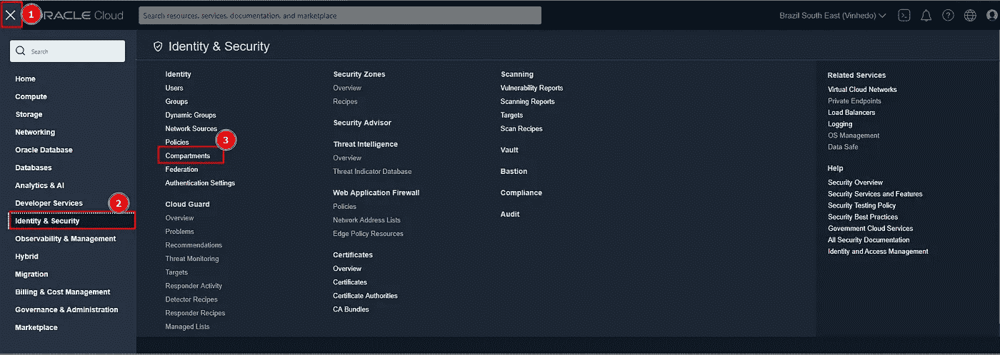**

**点击“创建隔间”:**

**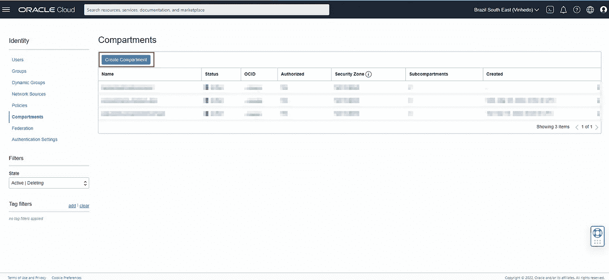**

**点击后，将出现如下窗口:**

****

**1-为你的隔间命名
2 -为你的隔间写一点描述
3 -点击创建**

**就这样，我们的隔间就这样诞生了:**

**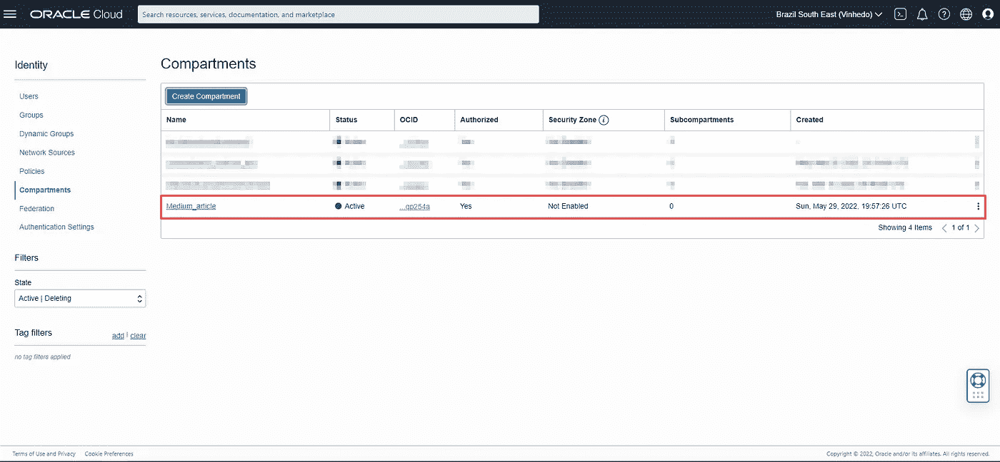**

# **2 -创建自治数据库**

> **步骤:
> 1-创建 Oracle 云基础架构帐户✔
> 2 -创建自治数据库
> 3 -使用 python 创建到我们数据库(OCI)的连接
> 4 -可选:使用 Dbeaver 连接到我们的数据库**

**现在我们可以创建我们的亚洲开发银行了。回到菜单，点击“oracle 数据库”和“自治数据仓库”:**

****

**现在，在左侧，选择我们刚刚创建的隔离专区，然后单击“创建自治数据库”**

**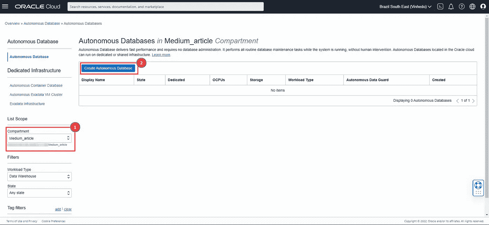**

**点击后，将打开一个新窗口:**

**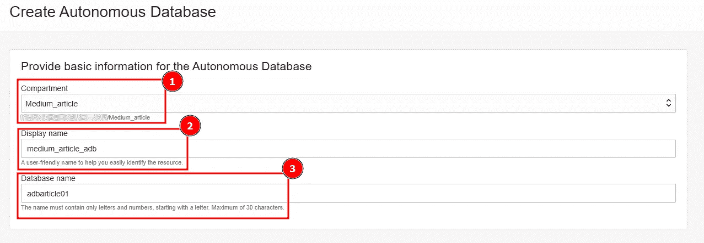**

**1-选择我们刚刚创建的区间
2 -数据库名称(一个用户友好的名称，帮助您轻松识别资源。)
3 -数据库名称，可以重复最后一个字段(或者不重复，由你决定)**

**接下来，选择“数据仓库”和共享基础架构:**

****

**我们将选择“始终免费”按钮，以确保我们不使用付费功能，因此只会显示免费选项。**

****

**用户名将是 ADMIN for standard，不能更改，但是您可以创建您的密码(不要忘记，我们将在接下来的步骤中使用它来访问数据库)。**

****

**接下来的选项是保持原样，然后单击蓝色按钮“创建自治数据库”来创建数据库。就这样，我们的数据库正在创建中，很快就可以供我们创建表格、插入数据和其他任何东西。**

**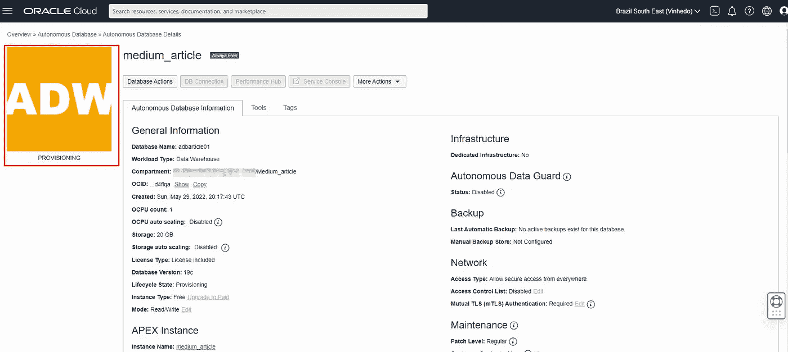**

**当“ADW”为绿色时，我们的数据库可用。**

****

**对于 OCI 的最后一步，我们需要下载我们的钱包，它将帮助我们使用 Power BI 访问我们的数据库。为此，单击“数据库连接”:**

**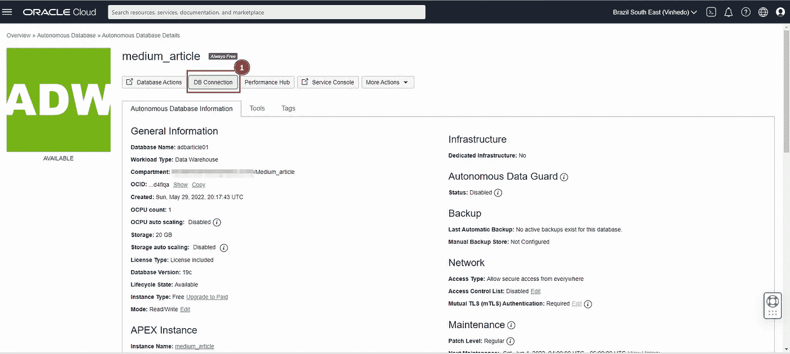**

**然后点击“下载钱包”，并创建另一个密码(不要忘记这个，我们稍后会用到它)。**

**将 Power BI 连接到 oracle 数据库的另一种方法是使用必要的凭据创建一个文件。要做到这一点，只需点击“复制”，如下图所示，并将其保存在一个名为 TNSnames.ora
的记事本中。如果您不知道这是如何工作的，请按照下载钱包的步骤操作，因为这在开始时更简单。**

****

**好的，在接下来的步骤中，我们将只使用 python 和名为 Dbeaver 的软件。**

# **3 -用 python 创建到我们数据库(OCI)的连接**

> **步骤:
> 1-创建 Oracle 云基础架构帐户✔
> 2 -创建自治数据库✔
> 3 -使用 python 创建到我们数据库(OCI)的连接
> 4 -可选:使用 Dbeaver 连接到我们的数据库**

**对于 Python 的后续步骤，我们将遵循以下文档:**

```
[https://www.oracle.com/database/technologies/appdev/python/quickstartpython.html](https://www.oracle.com/database/technologies/appdev/python/quickstartpython.html)
```

**首先，我们需要安装一些库:**

```
pip install cx_Oracle
pip install SQLAlchemy
```

**下载 Oracle 即时客户端(下载适合您的操作系统的文件):**

```
[https://www.oracle.com/database/technologies/instant-client/downloads.html](https://www.oracle.com/database/technologies/instant-client/downloads.html)
```

**在我的例子中，我使用的是 64 位 windows:**

******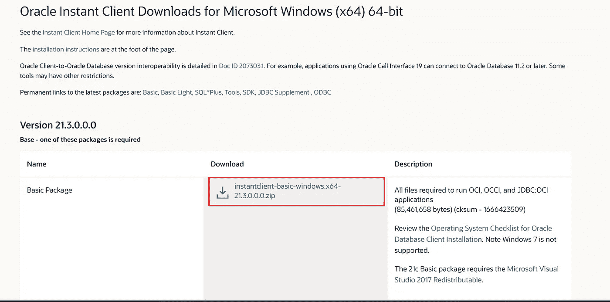**

**在“c:\”上创建一个名为 oracle 的新目录，然后在下载完成后，将文件解压缩到以下目录:**

```
C:\oracle\instantclient_21_3
```

**还记得我们之前下载的钱包吗？将文件解压缩到以下目录:**

```
C:\oracle\instantclient_21_3\network\admin
```

**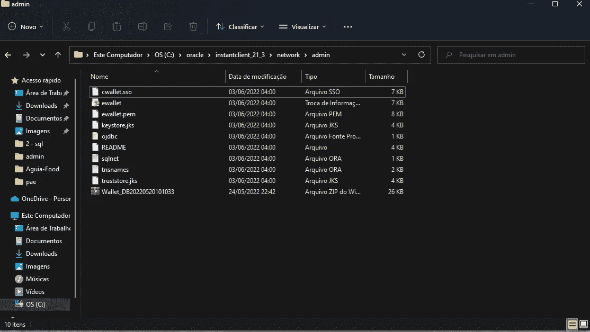**

**记住这一步，以后我们有时会回到这里。**

**完成后，我们必须创建一个到数据库的连接。**

**让我们编码:**

**首先，我们必须导入将连接到 oracle ADB 的库:**

```
# Library to connect to Oracle
import cx_Oracle
```

**然后，我们必须设置 Oracle 即时客户端的路径:**

```
# patch to instantclient_21_3
cx_Oracle.init_oracle_client(lib_dir=r"**C:\\oracle\\instantclient_21_3**")
```

**您必须将粗体显示的目录更改为之前解压缩文件的目录。如果你一步一步来，我想你不会有任何问题。**

**接下来，将您的用户名、密码和 dsn 设置为变量:**

```
# Variables to connect to Oracle
**username** = "ADMIN"
**password** = "topsecret123"
**dsn** = '(description= (retry_count=20)(retry_delay=3)(address=(protocol=tcps)(port=1522)(host=adb.sa-vinhedo-1.oraclecloud.com))(connect_data=(service_name=g19cc7d208b76c0_adbarticle01_high.adb.oraclecloud.com))(security=(ssl_server_cert_dn="CN=adb.sa-vinhedo-1.oraclecloud.com, O=Oracle Corporation, L=Redwood City, ST=California, C=US")))'
```

**对于用户名，您将使用 ADMIN，对于密码，您可以使用我们在创建数据库时创建的第一个密码，最后，对于 dsn，您可以打开文件“tnsnames”并复制您的网络服务名称，如下图所示:**

**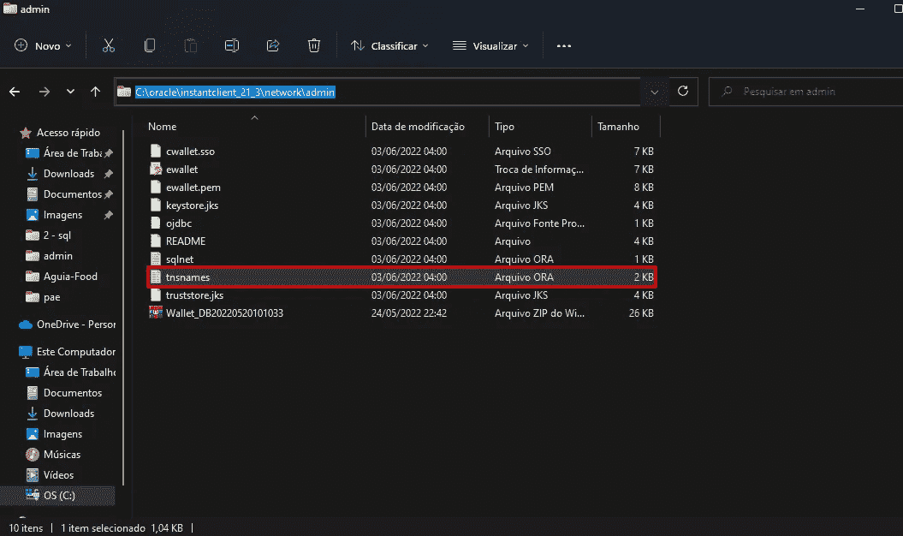****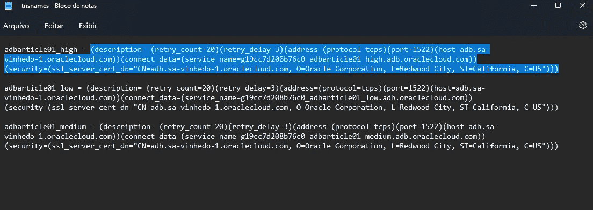**

**好了，我们的凭证准备好了，我们可以创建到数据库的连接，只需编写下面的代码，就可以了，我们连接好了！**

```
# Connect to Oracle
connection = cx_Oracle.connect(user=username, password=password, dsn=dsn)
```

**现在只需发送前面带有“cursor . execute(“SQL here”)”的 SQL 命令，表示您已经在管理您的数据库了，祝贺您！！！**

**让我们创建第一个表来插入我们在上一篇文章中丢弃的数据:**

```
# Drop table if it exists
cursor.execute("""begin
execute immediate 'drop table data_tab';
exception when others then if sqlcode <> -942 then raise; end if;
end;""")#Create table
cursor.execute("""create table data_tab(
ano INT,
mes INT,
id INT,
nome VARCHAR(255),
siglaPartido VARCHAR(255),
siglaUf VARCHAR(5),
urlFoto VARCHAR(255),
email VARCHAR(255),
tipoDespesa VARCHAR(255),
dataDocumento VARCHAR(255),
valorDocumento INT,
urlDocumento VARCHAR(255),
nomeFornecedor VARCHAR(255),
cnpjCpfFornecedor VARCHAR(255))""")#Close connection
connection.commit()
```

**使用这段代码，我们创建了一个名为“data_tab”的表和一些列，我们将使用这些列来插入代表的数据。之后，我们关闭了与以下内容的连接:**

```
connection.commit()
```

**好了，现在我们必须加载数据集并将其发送到数据库:
文档[这里](https://docs.sqlalchemy.org/en/14/contents.html)和[这里](https://blogs.oracle.com/opal/post/connecting-to-oracle-cloud-autonomous-database-through-sqlalchemy)。**

**首先，我们必须导入 **sqlalchemy** 和 **pandas** :**

```
# library to insert data to database
from sqlalchemy import create_engine
import pandas as pd
```

**接下来，我们加载我们在上一篇文章中创建的数据集，如果您没有它，请单击[此处](https://github.com/saulotp/Dados-publicos/tree/main/2%20-%20sql)下载它(expenses.csv)或单击此处阅读上一篇文章。**

```
# import dataset from csv
main = pd.read_csv('expenses.csv' , *sep*=',')
```

**设置您的凭证:
用户名:' ADMIN'
密码:'您的数据库密码'
dsn:'您可以像以前一样打开文件' tnsnames '并复制您的网络服务名'。**

```
# Variables to connect to Oracle
username = "ADMIN"
password="topsecret123"
dsn = '(description= (retry_count=20)(retry_delay=3)(address=(protocol=tcps)(port=1522)(host=adb.sa-vinhedo-1.oraclecloud.com))(connect_data=(service_name=g19cc7d208b76c0_adbarticle01_high.adb.oraclecloud.com))(security=(ssl_server_cert_dn="CN=adb.sa-vinhedo-1.oraclecloud.com, O=Oracle Corporation, L=Redwood City, ST=California, C=US")))'
```

**要将我们的数据发送到数据库，我们必须创建一个“引擎”,作为我们发送完整数据集的桥梁:**

```
# create engine
engine = create_engine(f'oracle://{username}:{password}@{dsn}/?encoding=UTF-8&nencoding=UTF-8', *max_identifier_length*=128)
```

**下面的代码将把整个数据帧发送到我们的数据库。**

```
# insert dataframe into oracle database
main.to_sql('data_tab', *con* = engine, *if_exists* = 'append', *chunksize*=1000)
```

**文档[此处](https://pandas.pydata.org/docs/reference/api/pandas.DataFrame.to_sql.html)。**

****主**:包含所有数据的数据框；
**to_sql** :该方法将发送已经是 sql 格式的数据帧，无需我们键入任何 SQL 命令；
**data_tab**:SQL 表名称
**con** :我们刚刚在
**之前创建的连接 if_exists** :如果 data _ tab 已经存在，代码会追加数据，如果不存在，则抛出值错误。
**chunksize:** 指定每批一次要写入的行数。默认情况下，所有行都将一次写入。**

**好了，用 python 发送数据就这样！**

****PS:** 可能要花很长时间，具体取决于你的连接和电脑。我有一台非常好的电脑，整个过程花了大约 3 个小时。我研究了延迟的原因，发现‘to _ SQL’方法并没有很好地优化我们刚刚做的事情，这就是为什么需要这么长时间。因此，如果您不想等那么久(我建议您不要，在实际项目中不可能做到这一点)，我们还有另一个选择，即在配置好一切后，大约需要 3 分钟将我们的整个数据集发送到数据库。只需按照下一节中的步骤操作。**

# **可选:使用 Dbeaver 连接到我们的数据库**

> **步骤:
> 1-创建 Oracle 云基础架构帐户✔
> 2 -创建自治数据库✔
> 3 -使用 python ✔创建到我们数据库(OCI)的连接
> 4 -可选:使用 Dbeaver 连接到我们的数据库**

**官方页面[此处](https://database.guide/what-is-dbeaver/)**

**”**什么是 Dbeaver？**
DBeaver 是一款面向数据库开发人员和管理员的免费、开源、图形化数据库管理工具。您可以使用 DBeaver 在各种数据库管理系统中创建和管理数据库”**

**我们将连接到数据库，并使用 Dbeaver 发送我们的数据集，如果您不能等待 python 花很长时间来发送相同的数据，这是发送数据的替代方法。**

**根据你的操作系统在这里下载并安装 Dbeaver [。](https://dbeaver.io/download/)**

> **此处引用的下一步[为](https://gregpoked.medium.com/connecting-dbeaver-to-oracle-free-cloud-tier-database-with-keyfiles-ed835f990031)**

**安装完成后，打开 Dbeaver 并遵循以下步骤:**

****

**1-新建数据库连接
2 -选择 Oracle
3 -单击下一步**

****PS:** 如果弹出任何窗口说你需要下载并安装一些驱动，安装 dbeaver 要求的所有东西(这一步非常重要如果你不这样做就不会起作用)**

**接下来，您将看到这样一个窗口:**

****

**1-点击 TNS
2 -选择你的钱包所在的目录(如果你一步一步地遵循我想你不会遇到任何问题\_(ツ)_/)；
3 -输入您的数据库用户名‘ADMIN’；
4 -输入你的数据库密码；
5 -点击驱动程序属性；**

**下一个窗口如下所示:**

**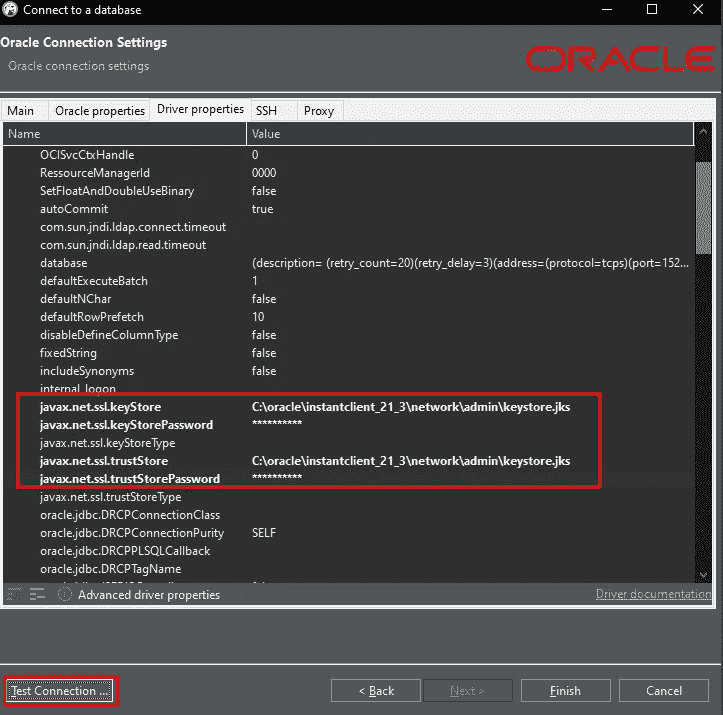**

**搜索“javax.net.ssl.keyStore”，在这一行中，您将单击以设置一个值。您将输入 wallet + '\keystore.jks '路径。对我来说是这样的:**

```
C:\oracle\instantclient_21_3\network\admin\keystore.jks
```

**在下面一行:“javax.net.ssl.keyStorePassword”中，输入您在 Oracle cloud 上创建的 wallet 密码(步骤 1 下面的图片)**

****

**在“javax.net.ssl.trustStore”(路径)和“javax . net . SSL . trust store password”(密码)上输入相同的内容。**

**点击测试连接。如果您输入了正确的路径和密码，将会弹出一个窗口，显示“已连接”，您的服务器和驱动程序如下图所示:**

**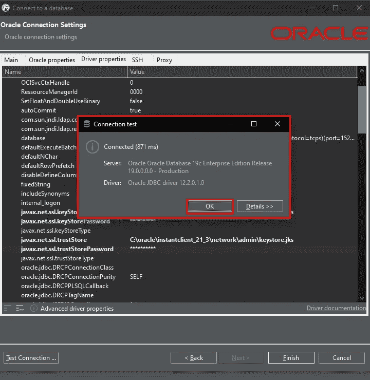**

**好了，我们已经连接到我们的数据库，您可以按照下面的步骤检查我们在使用 python 之前创建的表:**

****

**左边:
1- Oracle 数据库；
2 -用户
3 -用户管理
4 -表格‘数据 _ 标签’(双击此处)**

**右边:
5 -路径信息(你在数据库里面的位置)
6 -表名
7 -数据库列、类型等。**

**现在，我们必须将数据发送到数据库，为此，右键单击“DATA_TAB”(您要发送数据的表名)，然后单击“Import Data”。**

**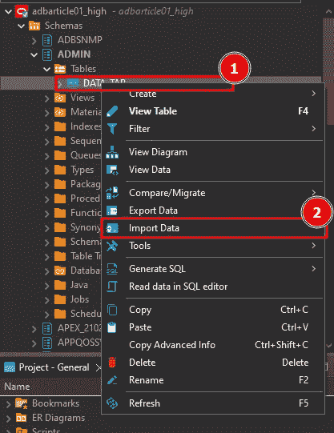**

**将弹出如下所示的窗口:**

**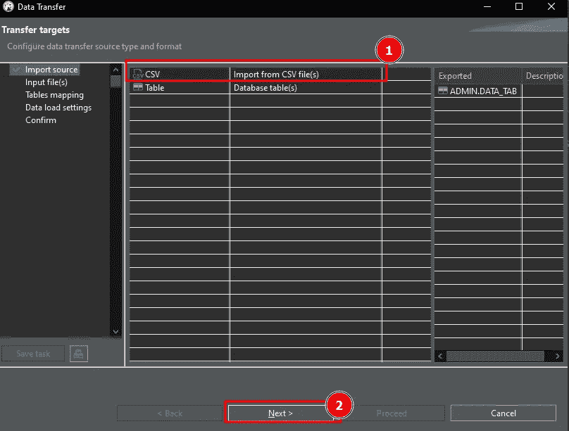**

**1-选择 CSV
2-点击下一步
**PS:** 之后选择您的 CSV 数据集**

**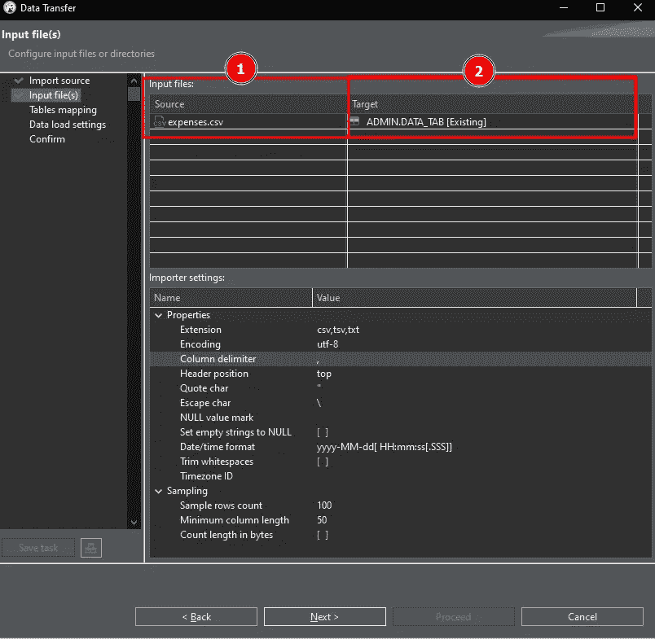**

**1-此栏将显示您的 CSV 文件；这一栏(目标)将显示你的文件将被发送到哪里。**

**点击下一步。**

****

**1-单击箭头展开表格将向我们显示源列(数据集列)、它们所在的数据和类型，以及它们的去向(目标列)。在我们的例子中，我们之前已经用 python 创建了列，但是如果列不存在，Dbeaver 会自动创建它们。**

**点击下一步。**

**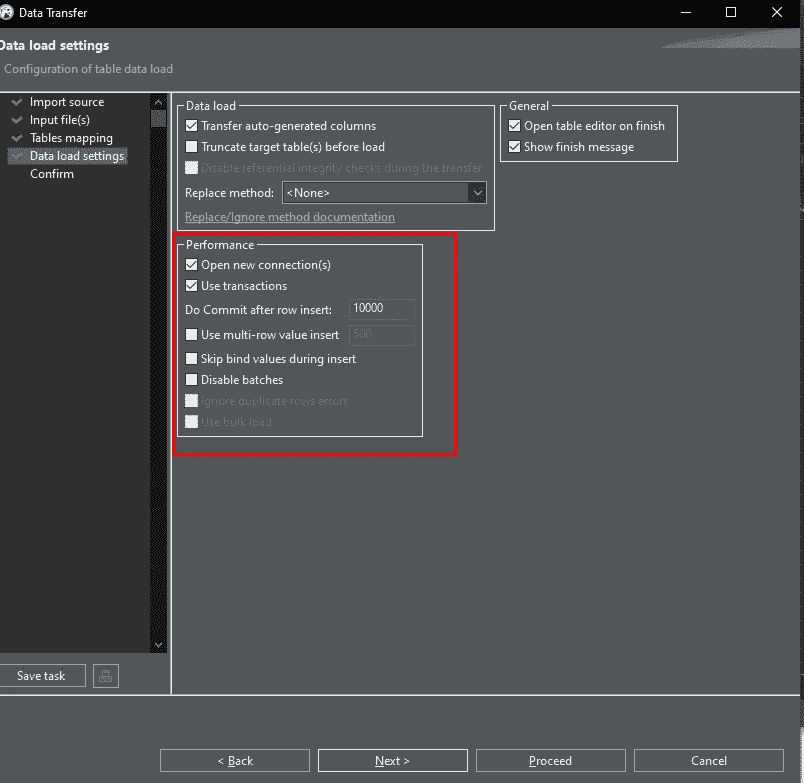**

**在这里，您可以调整将要发送的时间行数。如果你不知道它的意思，就点击下一步。**

**最后是最后一步，下面的窗口只是向我们显示了将要做的事情的摘要。
点击继续。**

**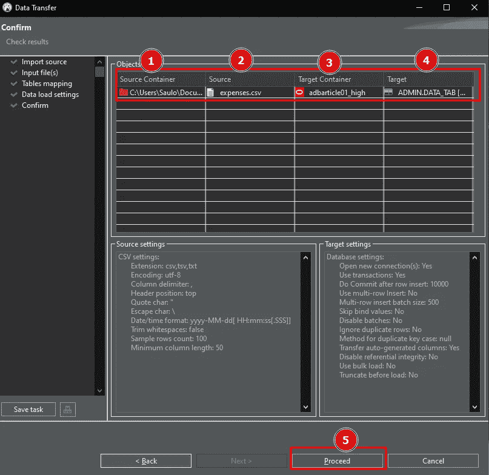**

**现在，你只需要等几分钟，就可以了。**

**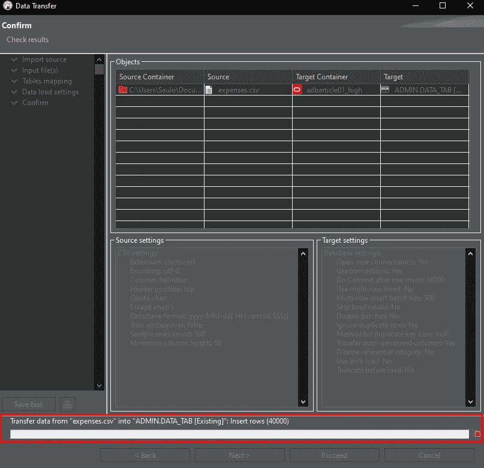**

**数据已发送到数据库！**

**你可以点击“数据”并查看你发送到数据库的内容。**

**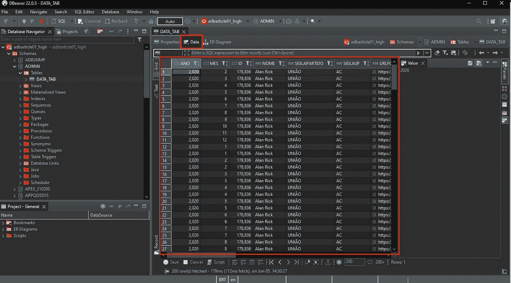**

**或者，如果您有一些 SQL 技能，只需按 F3 并编写您的查询，在这种情况下，我只是编写了代码:**

```
SELECT  *
FROM DATA_TAB
```

**Dbeaver 将我的数据库的前 200 行返回给我。**

**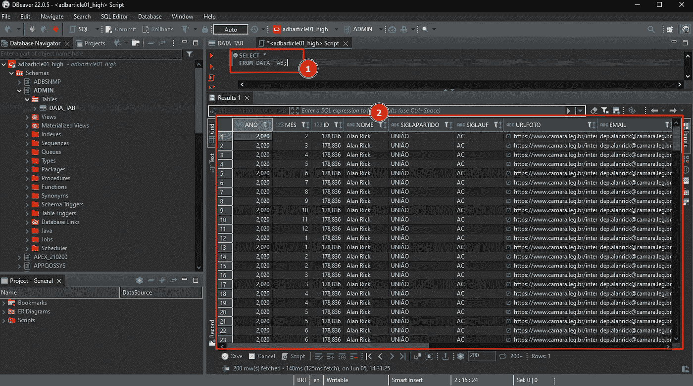**

**就这样，您现在可以将大约 30 万行数据免费发送到 Oracle Cloud 中的自治数据库！恭喜你。**

> **步骤:
> 1-创建 Oracle 云基础架构帐户✔
> 2 -创建自治数据库✔
> 3 -使用 python ✔创建到我们数据库(OCI)的连接
> 4 -可选:使用 Dbeaver 连接到我们的数据库✔**

**我希望这篇文章能帮助你踏上 python、cloud 或 DB 之旅。在下一篇文章中，我们将使用这些数据制作一个使用 Power BI 的交互式仪表板。如果您有任何建议、疑问、批评，或者您只是想谈谈，请联系我:**

****saulodetp@gmail.com****

**下一篇 [**此处**](https://saulodetp.medium.com/power-bi-desktop-integration-to-oracle-autonomous-database-6abfa496fe38) 。**

**上一篇 [**这里**](https://saulodetp.medium.com/webscrape-data-extraction-from-a-public-api-using-python-5a5a618394d) 。**

> **Github 项目[此处](https://github.com/saulotp/Dados-publicos)**