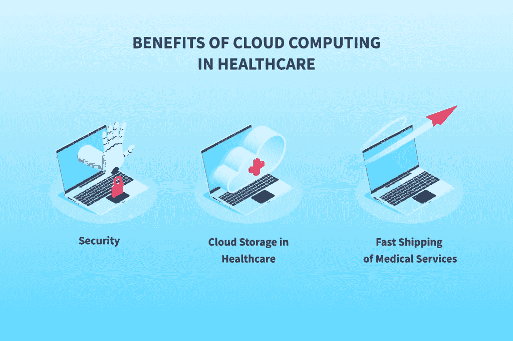
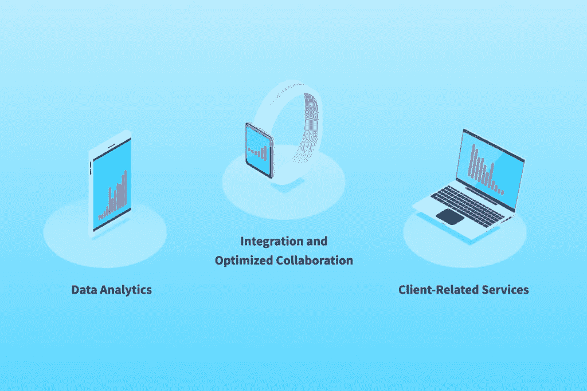

# 医疗保健行业的云计算技术— NIX United

> 原文：<https://medium.com/geekculture/cloud-computing-technology-in-the-healthcare-industry-nix-united-fb62fc3de347?source=collection_archive---------20----------------------->

云技术是来自世界各地不同领域的专家们讨论的热门话题。然而，这几天在医疗保健部门引起了更激烈的争论。对医疗云计算的浓厚兴趣，尤其是在疫情肆虐全球期间，推动了其快速发展。对于这种爆炸性增长，有一个非常简单的解释——如果医疗设施保持与以前相同的发展水平，治疗将类似于医疗剧《尼克斯队》中的治疗。

任何人都不应该幻想云计算是解决所有不幸的灵丹妙药，然而它最大限度地降低了诊断不准确的可能性及其所有后果的事实是很有价值的。医疗保健中的云计算现在正在世界各地的医院中积极实施，从而有助于以更快的速度治疗患者，并解决医生短缺的问题。

在深入医疗保健云计算的细节之前，解开技术基础背后的要点并弄清楚什么是医疗保健中的云计算是至关重要的。先说定义。简而言之，这是通过 web 托管和访问各种服务的能力，例如，物理或虚拟服务器、数据存储和应用程序。鉴于每个公司都有自己的需求，掌握现有的云计算类型以选择最适合他们的类型是至关重要的。让我们粗略地看一下它们。

# 云计算服务的类型

基础设施即服务(IaaS)允许用户选择操作系统、数据存储容量和网络设备。这项服务是可扩展的、灵活的和可靠的。IaaS 让用户有机会获得虚拟平台上所需的所有资源和基础架构。IaaS 消除了对物理办公室、硬件和基础架构的需求，这对于企业来说非常好。世界上最著名的有 AWS EC2、Rackspace、Google Compute Engine (GCE)和 Digital Ocean。

平台即服务(PaaS) —顾名思义，PaaS 是一个用于应用程序开发、维护和管理的平台。这种云计算服务提供了部署、运行和管理 web 应用程序或服务所需的一切。换句话说，PaaS 使用户能够在简洁的时间内快速轻松地开发和运行他们的应用程序。但是，服务提供商控制着基础设施和网络，如存储、灵活性和可扩展性。因此，不需要深入的编码技能，因为平台会提供模板，但是如果您的解决方案需要定制平台的选项，您将需要经验丰富的工程师的帮助。一些很棒的 PaaS 例子包括 Elastic Beanstalk、Heroku、Windows Azure(主要用作 PaaS)、Force.com、OpenShift 和 Apache Stratos。

软件即服务(SaaS)允许用户使用可用的软件

托管在云中。订阅服务(免费或付费计划)后，服务提供商维护和管理服务。这意味着 SaaS 有一个集中的管理系统。但是，用户信息在系统中得到保存和保护，使服务提供商能够提供必要的支持和资源来组织、利用和检索用于预期目的的数据。下次你在使用 Google Workspace(以前的 G Suite)、Dropbox、Salesforce、Cisco WebEx 或 SAP Concur 工作时遇到 SaaS 时，请记住，它们都是领先的 SaaS 提供商，在全球用户中有很高的需求。

当对该技术和一些示例有了大致的了解后，让我们继续前进，弄清楚是什么样的云计算医疗保健优势导致越来越多的医疗机构在其工作流程中推出这一创新。

# 云计算在医疗保健领域的优势

云计算对医疗保健有多种益处，包括:

谈到当今的商业世界，首先想到的是为用户数据提供全面保护的必要性。现在，当我们深切关注我们的敏感信息(包括医疗记录)的安全性时，问题出现了——将数据信任给第三方服务器是明智的吗？

答案似乎很明显，但事实并非如此。如果你一切都做得很好——例如，部署多因素身份验证——云服务器来保持高水平的安全性以保护敏感数据。基于云的应用程序为医疗保健公司创造了一个更安全的环境，因为领先的提供商不断更新他们的服务并检查他们的系统，以查看是否存在一些可能威胁用户数据安全的漏洞或可疑活动。

此外，在本地存储数据时，如果发生火灾或洪水，就无法取回患者的数据。通过将有价值的信息委托给云计算，任何自然灾害都不会如此危险。考虑到远程访问和备份，数据丢失似乎不太可能。

因此，有必要将医疗行业中的云计算视为一种实际而有效的选择。如今，它是一种行之有效的方法，可以为用户提供一系列安全和风险管理措施和功能。这也是用户服务受到良好监控的保证，从而大大降低了未经授权或非法数据泄露的风险。

你有没有想过关于我们医疗记录的数据量？实际上，这是海量的数据，包括医生转诊和处方、体检报告、治疗史、实验室结果等。作为医疗保健提供者的普通人无法处理和分析大量信息，反过来，几乎没有任何内部设备可以保存这些信息。这就是符合 HIPAA 和 GDPR 要求的云存储解决方案(如微软、Dropbox 和谷歌)的用武之地。通过这项技术，医疗中心将不会在存储患者数据方面遇到麻烦，从而避免了构建和维护物理服务器环境的额外成本。

2020 年让我们认识到时间的价值，以及在实施所有活动时对时间的考虑。时间决定了谁将在与 COVID 的斗争中获胜，让人们有机会建立疫苗接种中心和开发疫苗。在这场竞赛中，云计算是救命稻草，它让人们能够更快地交付关键技术解决方案。为了更好地理解，我们再举一个例子。在某个时候，COVID 测试提供商 Speed Test 感到了跨平台 web 应用程序的强烈必要性。所有这些都是为了将人与人之间的互动减少到最低限度。通过 Amazon Web 应用程序服务，这个想法得到了实现，甚至超出了预期，满足了处理数据的需求。

所有这些听起来都很吸引人，但是为什么仍然有医疗机构没有将云计算应用到他们的医疗系统中呢？是什么阻碍了他们？下面来讨论一下答案。

# 医疗保健行业采用云计算面临的挑战

众所周知，在第三方服务器上存储数据存在隐私风险。根据实施的网络安全措施，服务器很容易受到黑客攻击和网络罪犯的跟踪。这就是那些支持在医疗保健中采用云计算的人和他们直言不讳的反对者之间可能出现分歧的地方。

采用的另一个重大障碍是各种云计算的开发、应用和维护所需的昂贵资金。

简而言之，限制医疗保健行业采用云计算的六个主要障碍包括担心:

通过权衡云技术的利弊，每个医疗机构都会根据自己的想法得出结论。对于那些仍在思考创新和如何应用创新的人来说，下面的列表可能会澄清这一点。

# 云计算在医疗保健中的应用

我们之前已经提到过这一点，但这恰恰证明了许多医疗机构在医疗保健领域实施技术的决心。医疗保健使用云计算[大数据](https://nix-united.com/services/big-data-management-services-data-engineering/)解决方案和人工智能算法来获取信息，并帮助医生在治疗前了解医疗状况，更快地做出数据驱动的决策。医疗云计算服务提供的这些功能使维护个人健康、改进诊断和实现更好的病例结果变得更加容易。

这里，我们指的是远程医疗，它允许医生虚拟地与病人见面，这在疫情期间尤其有价值。减少人与人之间的互动，包括那些患有传染病的人，可以阻止新冠肺炎病毒的传播，并使病人不必住院。术语“远距离”在这种情况下不会发生，因为医生有能力远程召开会议，并开出治疗和康复的方法。

另一个重要因素是支持医疗保健需求的各种服务之间的巨大协同作用，如医疗保险、制药、医院用品制造商和支付。互操作性允许顺利交换数据，从而提高流程的效率。

医疗保健中心可以使用云计算服务来创建对医疗信息的远程访问。它将使协作处理医疗病例的专业人员能够以集成服务的形式从系统中的不同位置访问患者的文件记录或文档。随着医疗记录的计算机化，当拜访不同的医生时，没有必要创建单独的记录。相反，一个统一的系统将允许专业人员共享患者的病史，并获得以前与其他医生互动的结果。结果是在更短的时间内进行准确的诊断和治疗。

# 让我们得出结论

人们可能仍然认为牺牲患者数据的安全性没有任何好处——我们同意你的观点，但事实并非如此，因为提出的问题可以通过可靠的解决方案来处理，这些解决方案由经验丰富的工程师开发，并受到[预防措施](https://nix-united.com/blog/how-to-secure-your-business-in-the-cloud-best-practices/)的保护。通过选择正确的方法，许多额外的好处——如成本下降、高级分析和护理团队之间的密切合作——都在你身后。对我们来说,“医疗保健”和“云”这两个词已经不可分割，必须如此看待。

因此，如果你对利用云技术改善医疗保健的想法感到兴奋，但又因缺乏相关知识而感到困惑，请相信我们。我们的专家将帮助您解决所有疑问，并找到最适合您的解决方案。

*原载于 2022 年 1 月 6 日*[*【https://nix-united.com】*](https://nix-united.com/blog/technology-in-healthcare-that-changes-the-industry-unrecognizably/)*。*