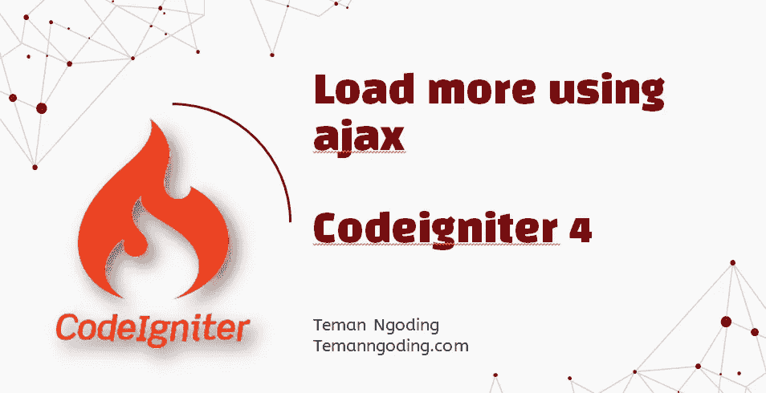

# Codeigniter 4 教程~使用 ajax 加载更多

> 原文：<https://medium.com/geekculture/codeigniter-4-tutorial-load-more-using-ajax-2d7926042ff9?source=collection_archive---------4----------------------->



你好，你们都好吗，希望你们永远健康成功。这次我们将讨论如何在 codeigniter 4 中增加负载。使用 ajax 和 codeigniter 4 创建无限滚动。先说讨论。

我刚刚得到了一份工作，使负载更多地使用 ajax，我已经被赋予了在 Codeigniter 应用程序中添加无限滚动的任务。理想情况下，这种类型的特性有助于将数据分块加载到单个网页上。

可以用很多名字调用，比如无限滚动分页、无限滚动分页、自动分页、懒加载分页、渐进加载分页；似乎都差不多。

在这个 Codeigniter 4 load more data 教程中，我们将向您展示如何使用 jQuery AJAX 在页面上加载更多数据。我们将创建一个数据列表，并在 Codeigniter 应用程序中动态检索数据，即当用户开始滚动网页时将在页面上显示或加载的数据或记录列表。

在这样的特性中，用户不需要刷新或重新加载整个网页，数据被加载到网页上，并替换为 HTML 元素。

# 下载 Codeigniter 项目

要创建 codeigniter 4 项目，我建议您使用 composer。

```
composer create-project codeigniter4/appstarter
```

# 用数据创建数据库表

这次创建一个客户端表作为我们的模拟数据。

```
CREATE TABLE clients (
    id int(11) NOT NULL AUTO_INCREMENT COMMENT 'Primary Key',
    client_name varchar(100) NOT NULL COMMENT 'Name',
    client_email varchar(255) NOT NULL COMMENT 'Email',
    created_at varchar(30) NOT NULL COMMENT 'Date',
    PRIMARY KEY (id)
  ) ENGINE=InnoDB DEFAULT CHARSET=latin1 AUTO_INCREMENT=1;

INSERT INTO clients(id, client_name, client_email, created_at) VALUES
  (1, 'Hunter George', 'tyshawn1978@hotmail.com', '1949-10-6'),
  (2, 'Kyle Johnson', 'brown1998@gmail.com', '1980-8-12'),
  (3, 'Pat Vang', 'isom1970@hotmail.com', '1961-10-10'),
  (4, 'Brad Bailey', 'elwyn1980@hotmail.com', '1992-3-31'),
  (5, 'Hunter George', 'tyshawn1978@hotmail.com', '1949-10-6'),
  (6, 'Kyle Johnson', 'brown1998@gmail.com', '1980-8-12'),
  (7, 'Pat Vang', 'isom1970@hotmail.com', '1961-10-10'),
  (8, 'Brad Bailey', 'elwyn1980@hotmail.com', '1992-3-31'),
  (9, 'Hunter George', 'tyshawn1978@hotmail.com', '1949-10-6'),
  (10, 'Kyle Johnson', 'brown1998@gmail.com', '1980-8-12'),
  (11, 'Pat Vang', 'isom1970@hotmail.com', '1961-10-10'),
  (12, 'Brad Bailey', 'elwyn1980@hotmail.com', '1992-3-31'),
  (13, 'Hunter George', 'tyshawn1978@hotmail.com', '1949-10-6'),
  (14, 'Kyle Johnson', 'brown1998@gmail.com', '1980-8-12'),
  (15, 'Pat Vang', 'isom1970@hotmail.com', '1961-10-10'),
  (16, 'Brad Bailey', 'elwyn1980@hotmail.com', '1992-3-31'),
  (17, 'Hunter George', 'tyshawn1978@hotmail.com', '1949-10-6'),
  (18, 'Kyle Johnson', 'brown1998@gmail.com', '1980-8-12'),
  (19, 'Pat Vang', 'isom1970@hotmail.com', '1961-10-10'),
  (20, 'Brad Bailey', 'elwyn1980@hotmail.com', '1992-3-31');
```

# 更新数据库

在我们创建数据库和表格之后，我们在 **app/Config/Database.php** 创建了一个文件数据库。

```
public $default = [
        'DSN'      => '',
        'hostname' => 'localhost',
        'username' => 'db_username',
        'password' => 'db_password',
        'database' => 'db_name',
        'DBDriver' => 'MySQLi',
        'DBPrefix' => '',
        'pConnect' => false,
        'DBDebug'  => (ENVIRONMENT !== 'development'),
        'cacheOn'  => false,
        'cacheDir' => '',
        'charset'  => 'utf8',
        'DBCollat' => 'utf8_general_ci',
        'swapPre'  => '',
        'encrypt'  => false,
        'compress' => false,
        'strictOn' => false,
        'failover' => [],
        'port'     => 3306,
    ];
```

这是一个非常好的数据库。

# 创建模型文件

创建一个模型文件，将数据库中的表与我们的应用程序连接起来。我们创建一个模型**app/Models/client model . PHP**。

# 创建控制器

接下来是重要的一步，您必须创建一个控制器，并定义一个函数来使用分页和分块加载页面滚动从数据库加载数据。

在**app/Controllers/client controller . PHP**中创建一个控制器文件。

# 创建视图

正如您所记得的，这次我们将创建一个视图来显示数据，您必须创建一个主视图文件。该文件将在页面用户开始滚动页面时加载。

在 **app/Views/index.php 文件**中创建一个视图文件。

在一个文件夹中创建另一个文件**app/Views/load _ clients . PHP**。

# 注册路线

别忘了添加一个路由来调用函数 **app/Config/Routes.php** 。

```
/*
 * --------------------------------------------------------------------
 * Route Definitions
 * --------------------------------------------------------------------
*/

$routes->setDefaultController('ClientController');
$routes->get('/page-scroll-load-more', 'ClientController::index');
```

# 运行应用程序

最后一步向您展示了如何启动 Codeigniter 开发服务器，运行提供的命令。

使用建议的 URL 来测试在页面滚动功能上加载更多数据。

php spark 服务
方
[http://localhost:8080/page-scroll-load-more](http://localhost:8080/page-scroll-load-more)

这是我这次做的教程，希望对我所有的朋友都有用。谢谢你访问我的网站。

也看其他教程。

[CodeIgniter 4 教程~ RESTful API JWT 认证](https://temanngoding.com/tutorial-codeigniter-4-restful-api-jwt-authentication/)

[Codeigniter 4 教程~登录注册](https://temanngoding.com/tutorial-codeigniter-4-login-dan-register/)

从 Codeigniter URL 4 中删除公共和 Index.php