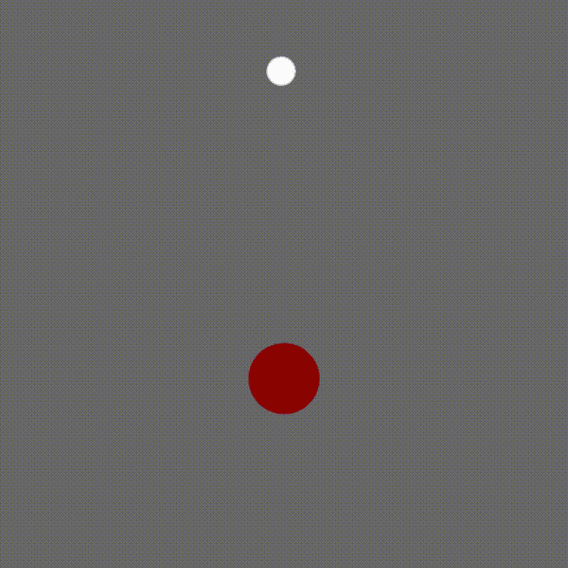

# 编码故事:骑自行车平衡

> 原文：<https://medium.com/geekculture/coding-stories-bike-balance-202fae7039c4?source=collection_archive---------33----------------------->

骑自行车登上布鲁克林大桥的木板桥面是一种体验。黎明的曙光照亮了布鲁克林市区的建筑。当我沿着小路滑行时，在我前面的不祥的石塔顶部升起的众多钢缆交叉并似乎重新洗牌。在我的右边可以看到一个闪闪发光的自由女神像，与我左边的曼哈顿大桥的宏伟结构相平衡。


当我进入桥的快速下坡路段时，旋转轮胎下的木板发出的噼啪声震动着我身体的每一个部位。冬天凉爽的空气吹过我的头盔和夹克，令人神清气爽。每天上班时有机会得到充分的锻炼是我一生中真正的幸事。在许多日子里，尤其是在疫情疯狂的日子里，它让我保持冷静。在我的自行车上是我的安全空间，为我的思想提供了一个平静和平静的空间。这也是社交距离的最佳方式之一。

关于我从这种日常仪式中获得的满足感，我有太多的话要说。但我想在这里重点介绍的是我的骑装。每天我都密切研究天气，避开降水，注意温度、风速和湿度。我尽量仔细挑选完美的衣服，让自己在整个旅程中保持舒适。如果我穿得太多，我会发热和出汗。如果我穿得太少，我会发抖，手指和脚趾失去知觉。我经常一路上脱一两层来保持热平衡。当我得到它的权利，平衡增加了不可估量的乘坐乐趣。当我爬上桥的山坡时，我能感觉到热量在我的腿中积聚，冷空气散发热量的能力令人难以置信。试图找到平衡是我喜欢这个旅程的一部分。

锻炼时找到温度平衡并不总是容易的。冬天长跑的时候，我会想很多。它也在所有季节的背包旅行中发挥着关键作用。徒步旅行中有句谚语说，没有坏天气，只有错误的装备。所以我花了相当多的时间拨入我的齿轮到一个特定的郊游，然后调整齿轮到那个时刻。有时舒适意味着穿上另一层衣服来保暖，有时意味着保持运动。一双合适的手套可能是快乐和痛苦的区别。当我在身体、服装和环境之间找到完美的平衡时，我会非常兴奋。我花了相当多的时间来探索这种平衡，所以用艺术的方式来表达它是有意义的。我开始坐下来编写一个 p5.js 草图。

当我开始思考这个想法时，我从对这个场景的字面解释开始。温度是物质分子的平均动能。我开始在画面中摆弄移动的粒子。在之前的一篇文章中，我建立了一个弹性碰撞的 2D 气体模型。我想，也许我可以在这项工作的基础上，让动画的一面墙将能量传递给粒子，而另一面墙则像冷空气吸收我身体发出的能量一样消耗掉这些能量。我首先探索了有序的粒子网格是如何迅速转变为明显的无序状态的。这是 2D 碰撞模型的初步动画，能量在画布上是守恒的。


当我制作动画时，模型变得复杂了。粒子应该如何被热源弹开？它们应该如何从散热器上反弹？更具挑战性的是在动画混乱的外观中发现一种简单的美。这个传热的计算模型是一个很好的探索，可能值得在自己的博客上发表，但尽管这个模型取得了科学进步，我似乎偏离了故事的中心思想。我在徒步旅行、骑自行车或跑步时的体验是一种平衡感。也许这与热和粒子无关。我开始思考摄影。通过色调、形式或色彩实现的平衡是成功摄影的核心。我开始想，我是否可以在我的 p5.js 草图中更简单地展示平衡，并通过保持简单更有效地联系到我的生活经验。

对我来说，简单似乎总是回到基础物理的世界。我从一个有位置和速度的简单质量开始。然后我在一个固定的位置放置另一个物体。利用牛顿引力定律创作一个简单的动画是相当简单的。这是实现它的行星类。

```
class Planet {
  constructor(pos,v){
    this.pos = pos;
    this.velocity = v;
  }
  force(pos, magnitude) { // pos is the position of the central mass
    const dist = this.pos.dist(pos);
    const v = p5.Vector.sub(pos,this.pos);
    // Newton's law of gravitation with modified constants
    return v.normalize().mult((magnitude) / (dist*dist));
  }

  update() {
    const f = this.force(center,3000);
    this.velocity.add(f);
    this.pos.add(this.velocity);
  }

  show() {
    fill(255);
    ellipse(this.pos.x,this.pos.y,20);
  }
}
```

请注意重力是如何在？force()方法。从技术上讲，两个质量都应该受到力的作用，但是在固定质量比轨道质量大得多的极限情况下，我的近似成立。这是一个创造的动画。



这个动画以多种方式创造了视觉平衡。行星的椭圆路径是对称的，因此是平衡的。屏幕底部有更多的图形重量，因为深红色的圆圈在垂直中心的下方，然而，由于开普勒运动定律，轨道运行的物体在屏幕顶部花费更多的时间，这创造了一种平衡感。然而，这个行星模型的平衡超出了视野。绕轨道运行的物体不断地在直线运动的惯性和加速其向中心质量运动的引力之间取得平衡。椭圆轨道代表着最终从自然法则中浮现出来的平衡。我们周围的大部分世界可以通过平衡和均衡的透镜来理解。深入探索这个概念在科学理解的许多领域都很重要。观看这个简单的动画也是一件令人愉快的事情。

在这一点上，我在草图上添加了一些美学元素，根据计算出的能量改变了旋转物体的阴影和大小。我还包括了一条与身体的 y 位置成比例旋转的径向线。最后，我沿着椭圆轨道一次添加了多个行星。我真的很喜欢这个事实，平衡的多个方面交织在草图中。在试验了不同的参数配置后，我得到了下面这个我觉得很好看的版本。

如果你想自己探索代码，这里有 p5.js 草图的链接。

这个草图与我开始时的字面理想气体模型相差甚远。最后，我获得了一种平衡感，这种平衡感与我那天早上穿过布鲁克林大桥时的那种平衡感联系在一起。