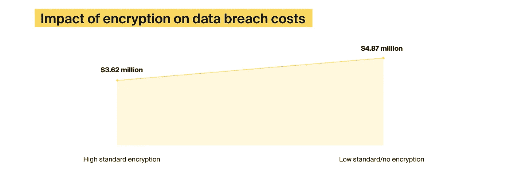

# 常见的安全漏洞类型及其修复方法

> 原文：<https://medium.com/geekculture/common-security-vulnerability-types-and-ways-to-fix-them-a33b7d40911c?source=collection_archive---------17----------------------->

微软 Exchange 服务器中的一个漏洞导致了一系列影响美国 6 万多家私营公司的网络攻击。就在一个月前，航空航天公司庞巴迪(Bombardier)的员工和供应商的数据因其第三方文件传输应用程序中的漏洞而被泄露。

有许多类型的安全漏洞会让您的 IT 系统成为黑客的目标。从糟糕的编码实践到有缺陷的外部组件，不管是什么原因，许多公司最终都会被曝光。为了缓解这一问题，企业受益于 [QA 和测试服务](https://itrexgroup.com/services/software-testing-qa/)来评估自己的软件和网络，并评估外部供应商组件的安全风险。

那么，此时此刻，哪些安全漏洞类型可能会使您的系统面临网络威胁呢？漏洞是如何出现的？我们如何减轻它们？

# 什么是软件漏洞，它源自哪里？

> *安全漏洞是一种非预期的系统或组件特征，它通过意外暴露、故意攻击或与新组件的冲突，放大了入侵或数据丢失的风险。这种漏洞可能是设计缺陷、实现错误、配置错误等。*

在我们继续之前，让我们澄清一下漏洞、利用和威胁之间的区别。

*   **一个漏洞**存在于系统中，无需任何外来者的努力
*   **漏洞利用**是入侵者利用现有系统弱点发动攻击的方式
*   **威胁**是指一个或多个漏洞利用漏洞渗透系统的实际事件

安全专家可以使用软件补丁、硬件更换和系统重新配置来消除发现的漏洞。对最终用户进行安全实践培训并使所有组件保持最新也将防止并最大限度地减少漏洞。此外，安全团队需要记住，随着系统的发展，新的弱点会出现。因此，企业需要系统地扫描其软件、硬件和网络，寻找新出现的漏洞，并在漏洞被发现和利用之前修复它们。

新的安全漏洞不断快速出现，美国政府的国家漏洞数据库(NVD)在 2022 年第一季度发布了超过 8000 个新条目。随着这种快速的步伐，许多企业跟不上，并留下多年的公开弱点，暴露他们的系统。一项软件漏洞研究显示，[2020 年发起的 75%的攻击](https://www.checkpoint.com/downloads/resources/cyber-security-report-2021.pdf)利用了至少两年前的漏洞，而 18%依赖于 2013 年报告的漏洞！

# 安全漏洞是如何进入软件和网络的？

根据调查，[软件供应商开发的 75%的应用程序](https://www.veracode.com/sites/default/files/Resources/Whitepapers/how-vulnerabilities-get-into-software-veracode.pdf)不符合开放 Web 应用程序安全项目(OWASP)十大标准。这些标准是公开的。那么，为什么仍有如此多的公司未能开发出安全的应用程序呢？以下是主要原因:

*   **易受攻击的第三方代码和其他组件**。重用第三方组件是一种常见的做法，因为这大大加快了开发过程。然而，用户往往对这些部分的安全性掉以轻心，并且经常在没有彻底评估的情况下部署它们。这同样适用于从源代码复制粘贴代码，例如堆栈溢出，而不评估其安全性。
*   **不安全的编码实践**。最近的研究表明，安全性甚至不在大多数开发人员的考虑范围之内。在一项调查 1200 名开发人员态度的实验中，研究人员得出结论，只有 14%的人在编写代码时将安全性视为优先事项。此外，请注意，许多组织要求他们的开发人员在紧迫的期限内快速生产代码，这根本没有为彻底的安全评估留下空间，并导致代码漏洞。
*   **快速变化的网络攻击格局**。攻击者不断发现破坏应用程序安全性的新方法。因此，以前被认为是免疫的部分今天可能变得脆弱。如果 IT 团队不系统地评估应用程序和网络的漏洞，不更新所有软件，弱点开始出现只是时间问题。

# 安全漏洞类型分类

有两个平台， [OWASP](https://owasp.org/) 和 [CWE](https://cwe.mitre.org/about/index.html) ，它们提供了可靠而详细的安全漏洞列表。他们更新他们的列表，以包括任何新出现的弱点。这两种资源都可以用来培训程序员、测试人员和工程师。

OWASP 是一个非盈利的全球社区，它定期发布 [OWASP 十大](https://owasp.org/Top10/)软件漏洞列表。CWE(common vulnerability Enumeration)是一个软件和硬件漏洞的组合，也是由一个专门的社区开发的，它包括 25 个条目。

这里有 18 个最突出的安全漏洞，我们想在本文中强调，按领域排序。这些可以在任何 IT 系统中体现出来，例如云、基于物联网的配置和移动应用。

1.  **缺乏强大的加密实践**

尽管加密无法阻止网络攻击，但确保敏感数据的安全至关重要，即使其存储平台遭到破坏。攻击者在对加密数据进行解码之前无法滥用加密数据，这为被侵犯的业务提供了采取必要措施的时间，例如通知受影响方并准备身份盗窃对策。

[研究显示](http://www.openaccessgovernment.org/why-lack-of-encryption-is-putting-public-data-at-risk/101928/#:~:text=Essential%20encryption&text=Encryption%20is%20a%20must%20to,fall%20into%20the%20wrong%20hands.&text=Even%20if%20the%20device%20is,not%20authorised%20to%20access%20it.)许多公司没有立即加密 u 盘、笔记本电脑和台式机上数据的计划。说到数据保护法规，GDPR 没有明确要求加密，但[将](https://www.zettaset.com/blog/gdpr-compliance-encryption-requirements/#:~:text=Although%20there%20are%20no%20explicit,measures%E2%80%9D%20of%20personal%20data%20security.)描述为数据安全的“适当的技术和组织措施”。

IBM 在其[数据泄露成本报告](https://www.ibm.com/downloads/cas/OJDVQGRY)中指出，加密是降低数据泄露平均成本的最有效因素之一。

Source: [IBM](https://www.ibm.com/downloads/cas/OJDVQGRY)

**2。敏感数据暴露**

当疏忽的员工将数据上传到公共数据库或网站时，数据可能由于人为错误而暴露。但是这种安全漏洞类型也可能受到内部流程的支持，这些流程实际上允许未经授权的员工获得访问权并操纵敏感数据。

网络安全公司 Egress 进行了一项调查，发现 83%的美国组织通过电子邮件、文件共享、协作软件和消息应用程序意外暴露了敏感数据。

**3。传输层保护不足**

这种类型的漏洞处理客户端和服务器应用程序之间的信息交换。此类信息可能包含敏感数据，包括用户凭据和信用卡详细信息。当数据传输不安全时，通信可能会被截获，如果使用弱算法，攻击者可以访问数据并破译加密。

**4。错误配置的系统组件和危险的交互**

不正确地配置组件和它们之间的交互是我们经常遇到的另一个安全问题。例如，在设置 IT 系统时，管理员忘记覆盖制造商的默认设置并禁用目录列表，从而使系统暴露在外。另一个例子是忘记限制对外部设备的访问。

说到交互，建议应用程序采用零信任方法，在验证和证明输入合法之前，将每个输入都视为有风险的。这将有助于避免攻击，例如跨站点脚本，在这种情况下，攻击者会向应用程序中注入不受信任的数据。

这一方面与基于云的解决方案特别相关。一项研究报告称，服务器配置不当导致两年内出现 200 起云漏洞。另一项研究表明，大约 70%的云安全漏洞始于有缺陷的架构。例如，一个错误配置的 AWS 存储桶在 2019 年暴露了美国 75 万份出生证明申请。

**5。薄弱的服务器端控制**

这种安全漏洞类型代表服务器端可能出错的一切，从糟糕的身份验证到导致攻击的安全错误配置，例如跨站点请求伪造，其中一些用户的浏览器在该用户不知情的情况下向服务器发出未经授权的操作。

例如，数据库服务器中的错误配置会导致数据变得可以通过基本的 web 搜索来访问。如果它包含管理员凭据，入侵者就可以访问系统的其余部分。

**6。远程代码执行**

这意味着您的系统存在的软件安全漏洞使得入侵者能够通过互联网在您的设备上执行恶意代码。例如，当员工点击第三方网站上的电子邮件链接时，这种设置背后的黑客会将恶意软件注入受害者的计算机，并从那里取得控制权。外人可以访问敏感数据或锁定机器并索要赎金。

**7。已知的基于操作系统的漏洞**

每个操作系统都有其软件漏洞列表。有些名单在网上公布给大家看。例如，这里列出了 Windows 10 操作系统的 10 大弱点，这里列出了 OS X 的相应弱点。安全团队有责任审查并解决这些问题，以最大限度地减少攻击的机会。

**8。运行没有病毒检查的脚本**

这是一种常见的安全漏洞类型，存在于某些 web 浏览器中。例如，Safari 允许在没有明确用户许可的情况下运行“可信”脚本。黑客往往会利用这一弱点，试图运行一段可能与“安全”脚本混淆的恶意代码。幸运的是，通常可以禁用这个“特性”

**9。弱认证**

入侵者可以通过强行获取用户凭证来获得访问权限。当密码“123456”被超过 2300 万人使用时，这尤其容易。这是对密码的补充，如“admin”、“password”和“qwerty”，这些密码也很常见，很容易被破解。

这种类型的软件漏洞被认为是人为的，但企业可以实施措施，迫使员工选择更强的选项，并经常更改他们的凭据。考虑到弱证书在系统安全中的作用，这一点至关重要。统计数据显示，80%的安全漏洞是由弱密码造成的，61%的用户倾向于将一个安全短语用于多种服务。

10。使用具有已知漏洞的组件

部署第三方组件，比如库、API、数据集和框架，可以显著减少启动和运行系统所需的工作。但是它也可能引入漏洞。保持勤奋和评估这些组件很重要，以确保它们不会留下任何访问敏感数据的后门。

甚至下载和使用第三方图像也可能是危险的。2021 年，30 个下载量达 2000 万的 Docker Hub 镜像被部署用于传播密码挖掘恶意软件。

**11。不安全的设计**

这是 2021 年在 OWASP 上出现的一个比较新的安全漏洞类型。该组织要求安全的设计模式、威胁建模和参考架构，以便从一开始就消除弱点。

安全设计是一种不断评估威胁并确保代码健壮性的方法。它鼓励对已知的攻击方法进行系统测试。它将安全性视为软件开发的一个基本部分，而不是一个附加物或一个很好的特性。

**12。API 中的安全漏洞**

应用程序编程接口(API)允许软件组件相互交互，这是 IT 系统的重要组成部分。然而，具有弱安全措施的 API 可以打开多个漏洞，例如被破坏的认证和允许代码注入和其他恶意行为。

例如，一个不顾一切地构建的 API，依赖于客户端在将信息呈现给用户之前过滤信息，可能会暴露数据，使其可供窃取。敏感数据必须在服务器端过滤。这是这种安全漏洞类型的另一个例子:如果一个 API 不限制传入请求的数量，它就有可能遭到拒绝服务(DoS)攻击。

以下是 OWASP 列出的 10 大 API 相关安全漏洞，供您参考。过去几年，不安全的 API 为许多攻击敞开了大门。一个臭名昭著的例子来自 LinkedIn，一个恶意行为者利用该平台的免认证 API 下载了 [7 亿用户](https://blog.malwarebytes.com/awareness/2021/06/second-colossal-linkedin-breach-in-3-months-almost-all-users-affected/)的数据。利用一个类似的 API 漏洞，一名入侵者获取了[130 万俱乐部用户](https://www.securitymagazine.com/articles/95006-clubhouse-api-allows-everyone-to-scrape-public-user-data)的信息，并将其发布在一个黑客论坛上。

13。认证不充分

薄弱的身份验证措施允许黑客利用“忘记密码”选项重置帐户或发起帐户接管攻击。当身份验证问题是用户的生日或宠物名之类的东西时，它会帮助入侵者，因为这是由于社交媒体而公开的信息。遵循多因素身份认证流程将提高安全性。可悲的是，研究表明只有 26%的美国公司使用这种强认证方法。

**14。监控和日志不足**

日志存储系统事件、网络活动和用户操作的数据。通过监控日志，安全团队可以观察最近发生的所有活动，并识别可疑事件。如果没有系统地审查日志，就会产生信息缺口，导致软件漏洞和恶意活动未被检测到。

**15。超级用户权限**

用户可以访问的数据越少，他们的帐户受到的损害就越小。然而，一些企业仍然疏忽地授予超级用户权限，并且未能限制员工访问他们履行日常职责所需的内容。如果入侵者拥有管理员级别的帐户，他们可以禁用防病毒软件和防火墙，安装有害的应用程序，获取文件的所有权等。

根据调查， [74%的数据泄露](https://www.forbes.com/sites/louiscolumbus/2019/02/26/74-of-data-breaches-start-with-privileged-credential-abuse/?sh=13a66caa3ce4)始于滥用特权凭证。

**16。过时的软件**

大多数企业意识到及时的软件更新是安全系统的关键。然而，似乎只有少数人真正遵循这种做法。 [Cybernews 报道了最近一项调查软件更新频率的研究](https://cybernews.com/security/95-of-websites-run-on-outdated-software-with-known-vulnerabilities/)。这项研究进行了 18 个月，它发现 95%的网站实际上运行在具有已知漏洞的过时软件上。该研究团队还发现，一个普通的软件产品通常比其最新补丁晚四年。

此外，卡巴斯基确定，运行过时软件的公司很可能会因违规而多支出 47%的成本。

举个例子，万豪连锁酒店有 [5 亿条数据记录](https://www.1e.com/news-insights/blogs/10-unpatched-software-security-breaches/)因未打补丁的软件导致安全漏洞而受损。

**17。源代码中的漏洞**

这种代码漏洞会在软件开发过程中出现。例如，一个程序可能在不加密的情况下传输敏感数据，或者使用一个随机的字符串，而这个字符串实际上并不是随机的。这种错误经常在软件测试阶段被发现。

根据最近的一项 Secure Code Warrior 调查， [86%的参与开发人员](https://github.blog/2022-05-06-todays-most-common-security-vulnerabilities-explained/)承认他们在编写代码时没有将应用程序安全性视为首要任务，36%的人将此归因于时间紧迫。调查还显示，33%的受访者甚至不明白是什么让他们的代码易受攻击。

18。SQL 注入

这种安全漏洞类型与结构化查询语言(SQL)支持的网站和应用程序相关。它允许攻击者修改用户提供的 SQL 语句，欺骗解释器执行非预期的命令，并授予对数据库的访问权限。这样，入侵者可以通过替换/删除/修改敏感字段来操纵敏感数据。

这是一个相当古老的漏洞，早在 2019 年，它就占了软件应用程序攻击的 65%。

# 特定于系统的安全漏洞类型，以及如何防止这些软件漏洞

在强调了常见的安全漏洞之后，让我们转到特定于应用程序和系统的弱点，并找出如何保护您的系统免受它们的攻击。

# 云

无论是 Azure、AWS、GCP 还是任何其他云提供商，云中可能的安全漏洞类型都有一个广泛的列表。我们的云专家，[阿列克谢·扎多夫](https://www.linkedin.com/in/alexey-zhadov-285b5177/)，将这些漏洞进行分层，并给出如何防范它们的技巧。

**系统层漏洞**

无论你的软件运行在什么样的云服务上，总会有一个操作系统。即使您只能访问资源的控制面板。每个操作系统都有它的“漏洞”和“后门”。操作系统开发人员不断寻找这些弱点，试图掩盖这些基础。这就是为什么让你的软件保持最新，并在已知问题上与网络安全领域的最新发展保持联系是很重要的。

**网络层漏洞**

每个云资源都运行在云网络上。随之而来的是从外部连接到资源的可能性。安全团队需要确保网络配置足够。不要打开您不打算部署的端口，使用您知道的 IP 和预计连接到您的解决方案的网络的白名单。从已知 IP 之外的任何地方打开到 RDP/SSH 端口的直接连接时要小心。

**配置层漏洞**

云必须根据用户的需求和目标进行适当的配置，并且这种配置必须始终保持最新。建立配置管理策略和程序，并监控任何可疑活动。

**人为因素漏洞**

不要忘记访问云解决方案的最终用户和管理员。帐户劫持是任何 IT 系统中最常见的弱点之一。如果入侵者获得了某人的帐户凭据，他们可以在帐户权限内自由进入并操纵系统，在收到被黑客攻击的用户的通知之前，没有人会阻止他们。以下是云应用中最常见的安全漏洞类型列表:

*   错误配置的网络和防火墙
*   错误配置的云存储
*   不安全的 API
*   糟糕的访问管理
*   帐户劫持
*   恶意的内部人士
*   系统漏洞
*   共享租赁漏洞
*   对于想要加入网络的用户和设备，缺乏多因素身份验证

Alexey 推荐了一些简单的规则，公司可以实施这些规则来保护他们的云系统:

*   保持操作系统最新
*   保护您的网络
*   使用堡垒服务器进入你的封闭边界
*   配置网络安全组和访问控制列表
*   限制对不必要端口的访问
*   尽可能配置监控和日志记录
*   为所有用户实施多因素访问控制
*   使用防火墙和 DDoS 保护
*   使用云工具检查是否符合安全标准，如 Azure 安全中心

# 网络应用

阿列克谢也参与了困扰网络应用的软件安全问题。通过利用这些漏洞，攻击者可以对应用程序和整个组织造成严重损害。以下是由 web 应用安全漏洞导致的最常见的 web 应用攻击:

*   SQL 注入
*   跨站点脚本
*   路径遍历
*   远程命令执行

如果网络犯罪分子成功发起这些攻击，他们就可以植入恶意软件、危害用户帐户、访问受限信息等等。那么，如何测试软件的漏洞呢？Alexey 建议进行 web 应用程序安全性测试，以评估以下参数:

*   **输入验证**。应用程序如何处理输入，它能发现并阻止任何恶意输入吗？
*   **服务器配置**。它使用强加密方法吗？
*   **认证管理**。强制实施哪些类型的授权？用户可以选择弱密码吗？
*   **授权选项**。应用程序能保护自己免受权限提升的影响吗？
*   **商业逻辑**。用户可以插入无效数据吗？他们能跳过认证步骤吗？用户是否有可能破坏 app 及其数据的完整性？

# 移动应用

当谈到移动应用程序安全时，除了应用程序之外，我们不能忽视设备本身存在的安全漏洞类型。我们的云和移动专家阿列克谢·扎多夫也分享了影响移动应用的常见问题:

*   薄弱的服务器端控制
*   不安全的数据存储
*   传输层保护不足
*   意外数据泄漏
*   糟糕的授权和认证
*   糟糕的加密技术
*   客户端注入
*   不可信的输入
*   不正确的会话处理
*   缺乏二进制保护
*   操作系统使用不当
*   不安全的流量和 API 调用
*   代码篡改和越狱设备
*   记录和监控不足
*   安全错误配置

为了保护移动应用程序，Alexey 推荐了一些公司可以在应用程序设计和维护中实施的简单做法:

*   **开源代码评估**:大多数移动应用程序都使用开源的第三方库，每个人都可以使用。这简化了开发过程，但也为潜在的入侵者打开了后门。因此，在将第三方代码整合到应用程序之前，必须严格测试第三方代码的软件安全漏洞。
*   **强大的加密实践**:在传输过程中加密和解密数据。借助强大的数据加密技术，源代码、用户信息和登录凭据等应用数据将得到保护。一旦数据被加密，黑客将无法解读它，即使他们获得了原始内容。
*   **代码签名证书**:开发者可以对移动应用进行签名，保护其免受网络攻击，获得用户信任。这样的签名可以确保代码在应用程序签名后不会被解释或更改。安全团队可以找到几个价格适中的代码签名证书选项。这种做法既经济又可靠。
*   **数据缓存保护**:缓存数据包含从应用程序中检索的信息，有助于更快地重新打开，从而提高应用程序的性能。数据缓存通常存储在用户设备上，没有额外的安全措施。更安全的做法是生成密码并锁定应用程序。此外，Alexey 建议您经常清除缓存数据，并使用安全的网络连接登录。
*   **安全数据存储**:每个应用程序都包含入侵者可能滥用的数据。它包括用户和应用程序开发人员的信息。因此，必须将这些数据安全地存储在安全的云存储中，而不是依赖于本地存储单元。
*   **认证和授权技术**:设置多因素认证以防止数据窃取至关重要。它包括用户 ID、密码、PIN、动态口令等。授权应该总是发生在服务器端，以验证经过身份验证的用户的角色和权限。
*   **数据擦除和设备锁定**:此功能主要用于包含机密数据的应用，如个人、财务、健康信息等。它是一个安全层，在从用户侧进行几次不成功的登录尝试后，远程数据被擦除，并且应用程序被自动锁定。它还禁止用户选择一个连续的数字作为他们的密码，而不是大写字母，特殊字符，字母，数字等。
*   **逆向工程对抗**:黑客利用逆向工程篡改应用程序的功能。通过获取应用程序的源代码，黑客可以绕过认证过程，伪造他们的位置，并窃取数据。加强运行时安全性对于抵制逆向工程至关重要。它通过改变应用程序的代码结构来影响应用程序的行为，从而防止入侵者修改应用程序的内部功能。

# 物联网解决方案

从安全角度来看，[物联网解决方案](https://itrexgroup.com/services/iot-development-consulting/)的独特之处在于，每个设备的功能都受到其使用要求的限制。没有空间来实施任何消耗额外容量、内存或电力的花哨安全功能，这使得物联网设备易受攻击。

我们的物联网专家 [Yahor Paloika](https://www.linkedin.com/in/yahor-paloika-%F0%9F%87%BA%F0%9F%87%A6-53aa97122/) 强调了互联设备中的以下安全漏洞类型:

*   **硬编码凭证**。物联网设备带有硬编码的密码，管理员有时会忘记更改密码，这使得黑客有可能使用这些众所周知的凭据轻松渗透系统。
*   **无保护网络**。一些网络不实施强认证，允许入侵者添加设备、重新配置设置以改变数据流、截取数据并注入他们自己的数据来模仿传感器读数。
*   **更新管理薄弱**。许多物联网设备独立工作，不依赖于人的干扰来进行更新。在这种情况下，更新管理系统负责确保自动更新通过加密通道到达，来自经过验证的来源，并且没有被破坏。如果这样的系统是脆弱的，它将允许入侵者破坏更新的软件和固件，改变设备的行为。
*   **过时的代码模块**。忘记消除不再使用的过时模块给了黑客足够的时间来探索他们的软件安全问题，并找到漏洞来渗透系统。必须移除不属于连接设备功能的所有模块。
*   **数据保护**。物联网网络内部流通的所有数据都必须加密，只有授权用户才能访问。

入侵物联网系统可能会产生毁灭性的影响。例如，在一项实验中，一组研究人员[可以渗透](https://www.wired.com/2016/08/jeep-hackers-return-high-speed-steering-acceleration-hacks/)吉普切诺基中的物联网设备软件，并通过吉普的娱乐系统发送恶意命令。他们篡改了空调，降低了温度，打开了挡风玻璃，然后，令司机惊恐的是，他们禁用了刹车。幸运的是，这只是一个实验。以下是 Yahor 推荐的一些保护物联网系统的技巧:

*   使用现有的安全密集型加密协议，如传输层安全性(TLS ),来支持物联网网络中的通信，并弥补内置安全性的不足
*   拥有现代化的集成密钥和证书管理子系统，提供所需的加密和安全级别。此外，Yahor 建议至少每六个月更新一次密钥和证书
*   建立可靠的密码管理系统，生成强密码，并系统地更改密码
*   实施一个更新管理系统，该系统只允许来自合法来源的安全更新通过，阻止任何强制进行损坏的更改的企图

# 人工智能解决方案

有一个方面将[人工智能(AI)](https://itrexgroup.com/services/artificial-intelligence/) 和[机器学习(ML)解决方案](https://itrexgroup.com/services/machine-learning-development/)与本文提到的其他系统区别开来——这是这样一个事实，即这些模型经常被训练来做出预测，而这个训练过程引入了几种类型的安全漏洞。我们的人工智能专家 Maksym Bochok 强调了最普遍的弱点:

*   攻击者可以篡改训练数据集，迫使模型学习假规则并做出错误的预测
*   ML 工程师可能会选择他们在网上找到的现有预训练模型，这些模型可能已经是恶意的。例如，它们可能包含特洛伊病毒或其他恶意软件。
*   入侵者可以获得算法本身，并调整代码、权重和其他参数来修改模型的行为。

此外，人工智能经常与其他技术相结合，如物联网和云，使其容易受到这些系统引入的安全漏洞类型的影响。

为了保护人工智能系统，我们的专家建议如下:

*   当使用预先训练的模型和外部数据集时，验证它们不包含任何恶意软件
*   系统地测试你的算法以得到想要的输出，确保没有人篡改匹配规则或引入偏差等。
*   监控数据漂移(输入数据的变化)
*   检测异常值，因为入侵者可以插入潜在的危险数据，使模型偏离他们想要的输出
*   在训练数据集中搜索任何可能的异常值
*   使用通用的 AI 安全评估工具，比如 [Counterfit](https://www.microsoft.com/security/blog/2021/05/03/ai-security-risk-assessment-using-counterfit/) 。这将有助于确保算法的可靠性和健壮性。
*   受益于现有的数据保护工具，并在存储和使用时保护机密数据。一个例子是可以作为外部防火墙的 [Imperva](https://www.imperva.com/learn/data-security/data-loss-prevention-dlp/) 工具。

# 最后一点

如果你是一家成功的企业，很有可能有人已经/正在试图侵入你的系统，索要赎金或造成声誉损害。随着黑客不断寻找漏洞进行利用，您的 it 团队正在努力降低风险。为了确保您赢得这场竞赛，请咨询一家经验丰富的安全和测试公司，他们将帮助您评估系统的状态，并给出如何改进的建议。

同时，为了防止不同类型的安全漏洞暴露您的应用程序，请注意您的系统配置，确保您的所有软件都是最新的，并对您的员工进行安全实践培训。

> *你对现有系统的安全性有疑问吗？或者想要构建一个考虑到安全性的应用程序？* [*降 ITRex 队一线*](https://itrexgroup.com/contact-us/) *！我们的安全专家将测试您的硬件和软件的漏洞，并提出改进建议。*

*原载于 2022 年 7 月 6 日 https://itrexgroup.com***。**