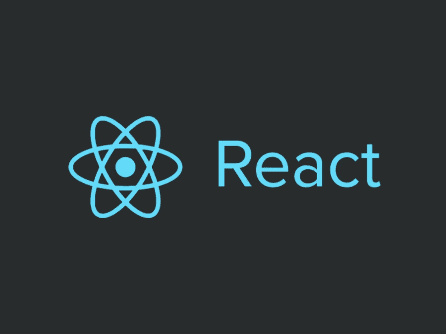

# React 中的组件

> 原文：<https://medium.com/geekculture/components-in-react-7f447263a8e6?source=collection_archive---------31----------------------->



React 组件是独立的、可重用的代码。React 组件接受一个可选输入，并返回一个呈现在屏幕上的 *React 元素*。

React 组件有两种主要类型:

1.  功能组件是无状态的。
2.  类组件是有状态的。

# 功能组件

> 一个功能组件只是一个普通的 javascript 函数，**将 props 作为参数**并返回一个 react 元素。功能组件不需要来自其他组件的数据，并且**不与任何其他组件**交互。

功能组件可以做什么:

1.  接受和使用道具
2.  以某种形式显示数据(返回一个 react 元素)

哪些功能组件不能做:

1.  使用`this.state`
2.  使用生命周期方法(例如`componentDidmount`)。
3.  使用渲染方法

功能组件的示例:

```
import React from "react"

const Welcome = props => {
  return (
    <div>
      <h1>Hello, {props.name}</h1>
    </div>
  )
} export default Welcome 
```

# 类别组件

> 这些组件是使用 ES6 的类语法创建的。它们有一些额外的特性，例如包含逻辑的能力(例如处理 onClick 事件的方法)、本地状态(下一章将详细介绍)以及本书后面部分将探讨的其他功能。

类组件可以做什么:

1.  利用 ES6 类并扩展 React 中的`Component`类
2.  使用`this.state`
3.  使用生命周期方法(例如`componentDidmount`)。
4.  使用渲染方法
5.  接受通行证道具，用`this.props`进入

一个类组件的示例:

```
import React, {Component} from "react"

class Welcome extends Component {
  render() {
    return (
      <div>
        <h1>Hello, {this.props.name}</h1>
      </div>
    )
  }
}export default Welcome
```

# 使用哪种组件类型？

**除非需要，否则始终使用功能组件:**

1.  管理状态
2.  向组件添加生命周期方法
3.  为事件处理程序添加逻辑

然而，还有另一种基于行为逻辑来区分组件的方法。

# 表象成分

表示组件通常被称为无状态功能组件，它接受道具并呈现 UI。与功能组件一样，表示性组件不能:

1.  使用`this.state`
2.  使用生命周期方法(例如`componentDidmount`)。
3.  使用渲染方法

演示组件的一个示例:

```
**import** React from 'react'

**const** Book **=** ({ title, img_url }) **=>** (
  **<**div className**=**"book"**>**
    **<**img src**=**{ img_url } alt**=**{title}/>
    **<**h3**>**{ title }**<**/h3>
  **<**/div>
)

**export** **default** Book
```

# 容器组件

容器组件将处理行为部分。容器组件告诉表示组件应该使用道具呈现什么。它不应该包含有限的 DOM 标记和样式。如果您使用 Redux，容器组件包含将动作分派给存储的代码。或者，这是您应该放置 API 调用并将结果存储到组件状态的地方。

以下是容器组件模式的简明定义:

*   容器组件主要关心事情如何工作
*   除了包装之外，他们很少有自己的 HTML 标记
*   它们通常是有状态的
*   他们负责向他们的孩子提供数据和行为(通常是表示组件)。

容器组件的示例:

```
**class** BookList **extends** Component {
  constructor(props) {
    **super**(props);

    **this**.state **=** {
      books: []
    };
  }

  componentDidMount() {
    fetch('https://learn-co-curriculum.github.io/books-json-example-api/books.json')
      .then(response **=>** response.json())
      .then(bookData **=>** **this**.setState({ books: bookData.books }))
  }

  renderBooks **=** () **=>** {
    **return** **this**.state.books.map(book **=>** {
      **return** (
        **<**div className**=**"book"**>**
          **<**img src**=**{ book.img_url } />
          **<**h3**>**{ book.title }**<**/h3>
        **<**/div>
      )
    })
  }

  render() {
    **return** (
      **<**div className**=**"book-list"**>**
        { **this**.renderBooks() }
      **<**/div>
    )
  }
}
```

> 这里要记住的主要事情是容器组件和表示组件是一起的。事实上，您可以将它们视为同一个设计模式的一部分。表示组件不管理状态，容器组件管理状态。在组件层次结构中，表示组件通常是从属的“子组件”，而容器组件几乎在所有情况下都是表示组件的“父组件”。

# 纯组件

> 纯组件主要用于提供优化。它们是我们能编写的最简单和最快的组件。它们不依赖或修改其范围之外的变量的状态。因此，为什么纯组件可以取代简单的功能组件。

但是，常规的`React.Component`和`React.PureComponent`之间的一个主要区别是，纯组件在状态变化时执行 ***浅层比较*** 。纯组件自行照顾`shouldComponentUpdate()`。如果前一个`state`和/或`props`与下一个相同，组件不会被重新渲染。

`React.PureComponent`用于优化性能，除非遇到某种性能问题，否则没有理由考虑使用它。

```
import React from ‘react**class** Welcome extends React.PureComponent{
  render(){
    **return** (
      <div>
        <h1>Welcome!</h1>
      </div>
    )
  }
}export default Welcome
```

最后，在使用任何类型之前，请始终考虑应用程序中的组件角色。

[](https://learn.co/lessons/react-container-components) [## 反应容器组件-Learn.co

### 在本课中，我们将学习 React“容器组件”本课结束时，你将能够…

learn.co](https://learn.co/lessons/react-container-components)