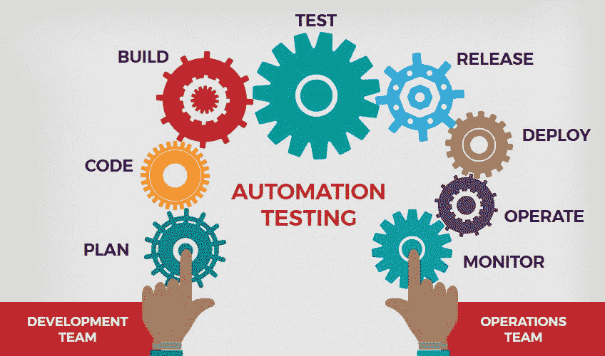
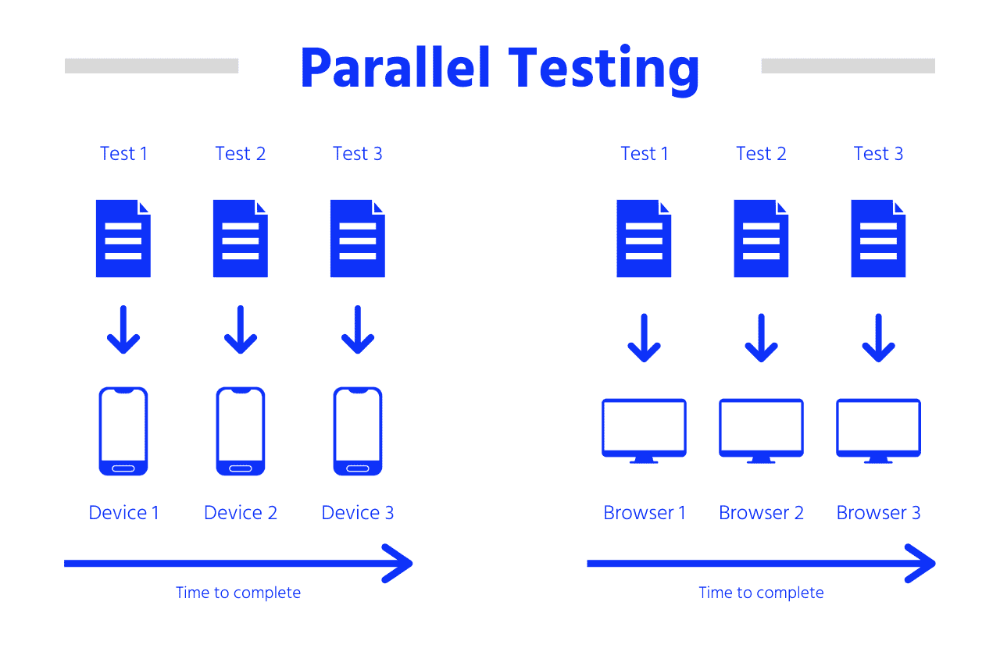

# 在回归中进行并行测试

> 原文：<https://medium.com/geekculture/conducting-parallel-testing-in-regression-e162669caafc?source=collection_archive---------6----------------------->

[**Photo**](https://unsplash.com/photos/WC6MJ0kRzGw) **by** [**David Travis**](https://unsplash.com/photos/WC6MJ0kRzGw) **on Unsplash**

今天，在软件开发生命周期中有许多类型的测试方法，每种方法在效率、节省时间、成本、可靠性、可用性等方面都有优点和缺点。一般来说，我们可以将软件测试方法分为四大类:功能测试、非功能测试、手动测试和自动化测试。

在本文中，我们将关注什么是自动化测试，为什么它是有用的，自动化测试中的主要技术，如回归测试，以及一些流行的自动化测试工具。

# 什么是自动化测试？

总的来说，[自动化测试](https://www.guru99.com/automation-testing.html)是利用一些自动化工具对软件或程序进行测试，以代替人工监控和验证产品的过程。在市场上，有一些流行的工具为自动化测试提供了广泛的服务，比如 Selenium、WebDriver、Appium 和 Cucumber。

**Figure 1:** [**Automation Testing Lifecycle**](https://techoptimals.com/how-to-increase-test-coverage-with-automation-testing/)

# 为什么自动化测试如此有用？

自动化测试的主要好处是，通过自动化测试过程，您可以确保软件开发生命周期中的 [CI/CD](https://www.atlassian.com/continuous-delivery/software-testing) 需求得到满足。因此，它在 DevOps 团队中的使用已经开始大幅增加。

除此之外，您还可以利用项目中的自动化工具来享受更快的上市时间、更快的部署机会、更高效的工作流、更大的测试量、压力测试、更好的准确性、更好的洞察力、持续的质量、成本和时间效率，以及更快的错误检测。

# 回归测试

## 什么是回归测试？

回归测试是一种软件测试，用于检查应用程序环境中的所有更改、新添加到应用程序中的功能、纠正之前的错误后存在的问题以及新功能导致的新错误。

在应用程序环境中进行必要的更改和修复后再次执行的测试称为回归测试。这确保了在以前的测试中发现的问题得到了解决，新添加的功能可以顺利工作，并且不会出现新的错误。

## 为什么要应用回归测试？

回归测试非常重要，因为现在大多数软件都是使用[迭代开发过程](https://www.indeed.com/career-advice/career-development/iterative-process)开发的。在迭代开发过程中，通过在每个循环中添加一些新功能来使用短循环。在这种情况下，在每个循环中运行回归测试以确保新添加的函数不会破坏现有的函数是非常有意义的。

可以通过回归测试来监控软件错误或回归(性能不佳)、功能性和非功能性改进、对系统某些方面的修补以及配置更改的影响。

## 自动化回归测试

自动化回归测试是一种技术，它从典型的回归测试中去除了所有人工驱动的步骤，并在软件测试中利用了基于自动化的工具。自动化回归测试主要是自动化工作流、计划、脚本和[手工回归测试](https://blog.qasource.com/resources/what-is-manual-regression-testing-how-can-you-optimize-your-test-cases)周期中的其他阶段。

在自动化回归测试之后，您可以确保软件在更新期间被正确执行，并且它支持完成主要软件功能的所有其他服务。

此外，自动化回归测试还提供了一些特性，如跨各种平台的支持、基于风险的回归、通过并行测试节省执行时间、更快的单元和 API 测试功能覆盖、性能影响分析以及持续测试方法。

# 回归中的平行检验

## 什么是并行测试？

一般来说，我们可以根据工作方法将软件测试分为两个主要概念:并行测试和串行测试。

并行测试(Parallel testing)是一种自动化测试技术，可以同时用计算机或手机、web 浏览器等电子设备的不同组合执行许多边缘测试用例。

例如，如果您有 10 个边缘测试用例，其中一个在 20 分钟内运行，那么您将不得不为所有用例等待总共 200 分钟。但是，如果您在 5 个并行点上使用并行测试，那么它将在 40 分钟内完成所有过程。从这个例子可以看出，这种技术可以为您节省大量时间。另一方面，对于这个测试操作，它可能需要许多系统或云资源。

**Figure 2:** [**Parallel Testing Methodology**](https://bitbar.com/blog/parallel-testing-what-it-is-and-why-you-should-adopt-it/)

## 并行测试的好处

理解了并行测试需要什么之后，我们可以列出它的一些重要的好处。并行测试节省时间，具有成本效益，提供更好的覆盖率，优化 CI/CD 阶段，并增强测试。

## 回归测试中如何进行并行测试？

市场上有许多健壮而有效的工具，当涉及到应用阶段时，您可以在自动化回归中利用这些工具进行并行测试。我个人更喜欢使用免费工具，尤其是在第一次尝试一个工具时，因为这有助于我在使用它之前了解它的可用性的全部范围。

免费试用产品的一个例子是 [Perfecto](https://www.perfecto.io/) :他们的工具通常具有我项目的质量测试阶段所需的特性。它们支持流行的浏览器/操作系统平台组合和真实的 Android 和 iOS 设备、用于跨浏览器测试的专用虚拟机、对真实移动设备的即时访问可用性、与 DevOps 工具和自动化框架的无缝集成，以及测试报告和分析。

# 结论

每个产品都需要增强和更新。因此，总是需要软件测试工具。然后，如果你能自动化一个必要的过程，你应该永远去做。利用自动化工具的产品将总是从自动化过程中受益。

我希望你发现这篇文章信息丰富，并帮助你决定自动化并行回归测试是否是你的用例的最佳解决方案。