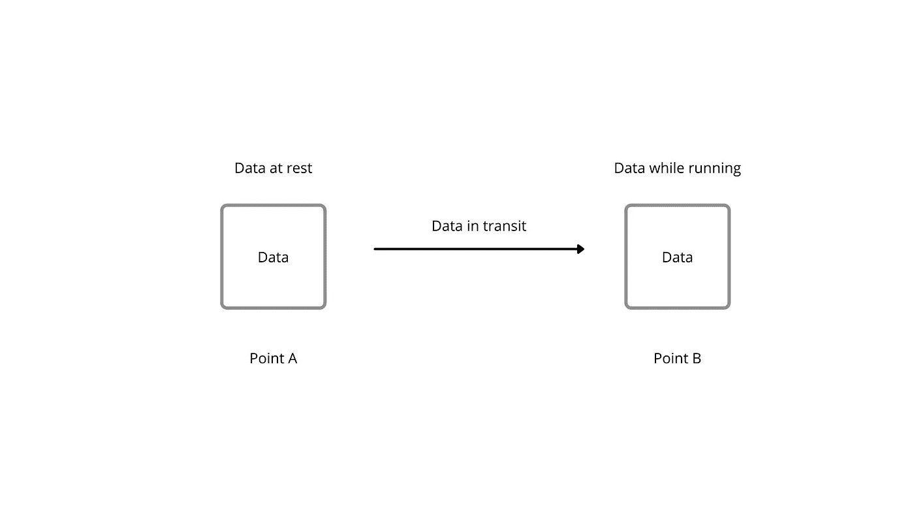

# 机密计算解释

> 原文：<https://medium.com/geekculture/confidential-computing-explained-97a4fdc8052f?source=collection_archive---------27----------------------->

## 数据保护的另一个支柱

Photo by [Taylor Vick](https://unsplash.com/@tvick?utm_source=medium&utm_medium=referral) on [Unsplash](https://unsplash.com?utm_source=medium&utm_medium=referral)

您如何确保高度敏感的信息在运行时得到保护？机密计算。在我进入什么是机密计算之前，我想稍微了解一下为什么它是一个如此令人兴奋的领域。除了其他原因之外，机密计算令人兴奋，因为在技术领域有许多交叉合作，实际上推动了技术的发展。我的意思是，看到人们穿过竞争激烈的过道去做那件事是令人惊奇的。另一个原因是，该技术将直接补充我们今天拥有的现有数据加密范式，并使其更加完整。

因此，在我进入实际技术及其背后的一些用途和价值之前，让我们先从当今数据加密的现有支柱开始。通常，在存储数据时，您会从保护静止的数据开始。你可以认为这是你想要的任何信息。基本旅程如下图所示。

Image by Author

现在，我们有了要从 A 点移动到 b 点的信息。因此，为了安全地做到这一点，我们需要在传输过程中保护它。那被盖住了。这是今天故事中的两大支柱。缺失的部分是如何在运行时保护它。这是我想在这篇文章中探讨的第三个支柱。为什么在它运行的时候我们需要保护它？

不言而喻，但你将不得不保护自己免受恶意黑客，内部威胁，内存转储，以及类似的事情。除此之外，我们可能还希望与值得信赖的供应商或技术合作伙伴进行合作，但同时不希望向他们透露高度敏感的信息，即使我们希望他们能够利用这些信息。

我们如何确保正确的信息不仅对这些方是不可见的，而且在最坏的情况下也能得到保护？这就是机密计算的用武之地。机密计算是一种基于硬件的技术，允许在服务器级别对内存进行物理分区。这有点拗口，所以，让我用更简单的术语一步一步地解释。

这个堆栈很容易可视化。我们在底部有硬件层，这是实际的内存物理分区发生的地方，我们有中间件层，然后例如，但不排除，我们将使用任何容器化的抽象。

Image by Author

在硬件级别，我们有内存的物理分区，允许您在其竖井中运行特定的应用程序。因此，我在这里画的场景中的筒仓将被称为飞地。这意味着我们将在堆栈的集装箱级别拥有飞地。这些飞地可以让应用程序在物理隔离的环境中运行。让我们更深入地了解一下飞地是什么。Enclave 本身的功能就像一个黑匣子，存放着我前面提到的数据以及处理这些数据的一套技术或过程。

在我们面临不同数据威胁的情况下，系统有一个仅延伸到授权程序的加密密钥，允许该授权程序解密在物理隔离的思洛内运行的信息，并能够执行它的一组进程。因此，该权限阻止任何未授权方的访问。

Image by Author

它阻止了什么样的实际访问？这将是查看分区竖井内的数据以及修改该代码的访问。对于这种设计来说，最重要的事情是，我们验证与代码或数据的交互是否符合预期。这可以通过证明报告来实现。回到关键:讨论的价值主张，可以肯定地说，这个安全的飞地提供了我们以前没有的数据和代码完整性。这意味着它限制数据可见性，防止未经授权的修改，并通过使用证明报告来验证授权方与代码和数据的实际交互。

我们为什么要使用机密计算？当这三大支柱(静态、传输中和运行时的数据加密)一起使用时，机密计算消除了将敏感数据集从一家公司转移到另一家公司的最大障碍，从而实现了与合作伙伴更快、更好的协作。机密计算具有巨大价值的另一个领域是它在边缘计算中的应用。当作为分布式云模式的一部分使用时，边缘节点的数据和应用程序可以通过机密计算得到保护。

机密计算不仅仅是为了保护数据。它还用于保护任何企业的知识产权，使企业不必担心存储和处理客户数据、专有技术和其他敏感资产。这也意味着企业在寻找最能满足其业务和技术需求的云计算服务时，可以自由选择。

您可以看到保密计算提供的明确价值。机密计算专注于在您运行应用程序时保护应用程序数据，它使我们能够更自由地与其他方协作，并以一种新的方式保护我们自己免受外部或内部恶意行为者的攻击。