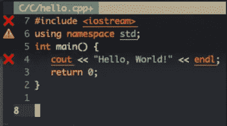

# 2021 年在 OSX 上为 C++开发配置 NeoVim

> 原文：<https://medium.com/geekculture/configuring-neovim-for-c-development-in-2021-33f86296a8b3?source=collection_archive---------4----------------------->


在尝试用我喜欢的文本编辑器学习 C++时，我遇到了一大堆错误，甚至在编写简单程序时也是如此。



在我试图调试和消除这些错误的 6 个小时里，我在网上遇到了一堆建议和技巧，它们本身并没有多大帮助。这种跨越较新的 OSX 机器的原因是没有将依赖关系保存在最初的建议被张贴时曾经是通用的目录中，缺乏正确的插件，以及某些路径没有被 ZSH 或终端正确地识别或使用。在这篇文章中，我想说明我为 C++开发正确配置 NeoVim 所做的一切，并希望它可以帮助你摆脱大量错误或丢失文件和库的压力！

# 安装正确的依赖项

这是我尝试配置此权限的第一个地方。经过多次搜索，我发现 [LLVM](https://releases.llvm.org/download.html#12.0.1) 是开始的地方(在 brew、node 和 yarn 之前，你可能已经有了)。LLVM 是模块化编译器的集合，可以帮助 C++顺利运行。接下来，我安装并构建了用于 C++的服务器 [CCLS](https://github.com/MaskRay/ccls) 。接下来， [CMake](https://cmake.org/download/) 强烈推荐(甚至有一节是编辑器语法文件包括 Vim)。据该网站称:“CMake 是一个可扩展的开源系统，它在操作系统中以独立于编译器的方式管理构建过程”。我发现这有助于在终端中编译和构建，而不是在本地编译器中。接下来，我安装了 [Clang](https://clang.llvm.org/) 、 [Clangd](https://clangd.llvm.org/) 和 [GCC](https://gcc.gnu.org/) ，它们也有助于澄清语法和编译。

# COC。NVIM 和 CCLS

接下来，使用通过 Vim-Plug 安装的 [coc.nvim](https://github.com/neoclide/coc.nvim) (完成的征服)，我将所有这些代码添加到我的 init.vim:

```
" if hidden is not set, TextEdit might fail.
set hidden" Some servers have issues with backup files, see #649
set nobackup
set nowritebackup" Better display for messages
set cmdheight=2" You will have bad experience for diagnostic messages when it's default 4000.
set updatetime=300" don't give |ins-completion-menu| messages.
set shortmess+=c" always show signcolumns
set signcolumn=yes" Use tab for trigger completion with characters ahead and navigate.
" Use command ':verbose imap <tab>' to make sure tab is not mapped by other plugin.
inoremap <silent><expr> <TAB>
      \ pumvisible() ? "\<C-n>" :
      \ <SID>check_back_space() ? "\<TAB>" :
      \ coc#refresh()
inoremap <expr><S-TAB> pumvisible() ? "\<C-p>" : "\<C-h>"function! s:check_back_space() abort
  let col = col('.') - 1
  return !col || getline('.')[col - 1]  =~# '\s'
endfunction" Use <c-space> to trigger completion.
inoremap <silent><expr> <c-space> coc#refresh()" Use <cr> to confirm completion, `<C-g>u` means break undo chain at current position.
" Coc only does snippet and additional edit on confirm.
inoremap <expr> <cr> pumvisible() ? "\<C-y>" : "\<C-g>u\<CR>"" Use `[c` and `]c` to navigate diagnostics
nmap <silent> [c <Plug>(coc-diagnostic-prev)
nmap <silent> ]c <Plug>(coc-diagnostic-next)" Remap keys for gotos
nmap <silent> gd <Plug>(coc-definition)
nmap <silent> gy <Plug>(coc-type-definition)
nmap <silent> gi <Plug>(coc-implementation)
nmap <silent> gr <Plug>(coc-references)" Use K to show documentation in preview window
nnoremap <silent> K :call <SID>show_documentation()<CR>function! s:show_documentation()
  if (index(['vim','help'], &filetype) >= 0)
    execute 'h '.expand('<cword>')
  else
    call CocAction('doHover')
  endif
endfunction" Highlight symbol under cursor on CursorHold
autocmd CursorHold * silent call CocActionAsync('highlight')" Remap for rename current word
nmap <leader>rn <Plug>(coc-rename)" Remap for format selected region
xmap <leader>f  <Plug>(coc-format-selected)
nmap <leader>f  <Plug>(coc-format-selected)augroup mygroup
  autocmd!
  " Setup formatexpr specified filetype(s).
  autocmd FileType typescript,json setl formatexpr=CocAction('formatSelected')
  " Update signature help on jump placeholder
  autocmd User CocJumpPlaceholder call CocActionAsync('showSignatureHelp')
augroup end" Remap for do codeAction of selected region, ex: `<leader>aap` for current paragraph
xmap <leader>a  <Plug>(coc-codeaction-selected)
nmap <leader>a  <Plug>(coc-codeaction-selected)" Remap for do codeAction of current line
nmap <leader>ac  <Plug>(coc-codeaction)
" Fix autofix problem of current line
nmap <leader>qf  <Plug>(coc-fix-current)" Use <tab> for select selections ranges, needs server support, like: coc-tsserver, coc-python
nmap <silent> <TAB> <Plug>(coc-range-select)
xmap <silent> <TAB> <Plug>(coc-range-select)
xmap <silent> <S-TAB> <Plug>(coc-range-select-backword)" Use `:Format` to format current buffer
command! -nargs=0 Format :call CocAction('format')" Use `:Fold` to fold current buffer
command! -nargs=? Fold :call     CocAction('fold', <f-args>)" use `:OR` for organize import of current buffer
command! -nargs=0 OR   :call     CocAction('runCommand', 'editor.action.organizeImport')" Add status line support, for integration with other plugin, checkout `:h coc-status`
set statusline^=%{coc#status()}%{get(b:,'coc_current_function','')}" Using CocList
" Show all diagnostics
nnoremap <silent> <space>a  :<C-u>CocList diagnostics<cr>
" Manage extensions
nnoremap <silent> <space>e  :<C-u>CocList extensions<cr>
" Show commands
nnoremap <silent> <space>c  :<C-u>CocList commands<cr>
" Find symbol of current document
nnoremap <silent> <space>o  :<C-u>CocList outline<cr>
" Search workspace symbols
nnoremap <silent> <space>s  :<C-u>CocList -I symbols<cr>
" Do default action for next item.
nnoremap <silent> <space>j  :<C-u>CocNext<CR>
" Do default action for previous item.
nnoremap <silent> <space>k  :<C-u>CocPrev<CR>
" Resume latest coc list
nnoremap <silent> <space>p  :<C-u>CocListResume<CR>
```

大部分应该被注释，以澄清发生了什么。我在这个网站上找到了这段代码。CoC 配置的其余部分可以在 NeoVim 中通过:CocConfig 启动。

说到这里，有一大段代码需要添加到:

```
{
    **"languageserver"**: {
        **"ccls"**: {
            **"command"**: "ccls",
            **"filetypes"**: [
                "c",
                "cpp",
                "objc",
                "objcpp"
            ],
            **"rootPatterns"**: [
                ".ccls",
                "compile_commands.json",
                ".vim/",
                ".git/",
                ".hg/"
            ],
            **"initializationOptions"**: {
                **"cache"**: {
                    **"directory"**: "/tmp/ccls"
                }
            }
        }
    }
}
```

这是 CCLS 服务器的标准配置，除了简单的 C++ 之外，它还支持[许多不同的语言。](https://github.com/neoclide/coc.nvim/wiki/Language-servers)

# 修复损坏的标题

最终，这是我最需要的，我要感谢[伊恩·丁](https://ianding.io/2019/07/29/configure-coc-nvim-for-c-c++-development/)提供了这个解决方案。在较新的 OSX 机器上不能容易地找到 C++头文件的原因是，CCLS 服务器将在不再存在的“/usr/include”目录中寻找它们。由于 SDK 路径没有被硬编码到这个目录中，所以头文件还在中间。要包含 C++开发的头文件，请在终端中运行以下命令:

```
g++ -E -x c++ - -v < /dev/null
```

这将返回一个你的编译器将从中提取的位置列表。它们将出现在参数“搜索从此处开始”和“搜索列表结束”之间。您需要做的是复制这些路径(或者在 tmux 中打开一个新的终端窗口进行复制)，并将它们放在根目录下一个名为. ccls 的新文件中。这种配置的示例如下:

```
-isystem
/usr/local/include
-isystem
/Applications/Xcode.app/Contents/Developer/Toolchains/XcodeDefault.xctoolchain/usr/include/c++/v1
-isystem
/Applications/Xcode.app/Contents/Developer/Toolchains/XcodeDefault.xctoolchain/usr/lib/clang/10.0.1/include
-isystem
/Applications/Xcode.app/Contents/Developer/Toolchains/XcodeDefault.xctoolchain/usr/include
-isystem
/Applications/Xcode.app/Contents/Developer/Platforms/MacOSX.platform/Developer/SDKs/MacOSX10.14.sdk/usr/include
```

在这之后，你的。cpp 项目应该能够找到标题，错误应该会消失。如果你一直在为在 NeoVim 中正确配置 C++而奋斗，我祈祷这个解决方案对你有用！我花了几乎整整一个周末的时间进行实验，我很高兴摆脱了那场灾难。虽然我意识到可能有几个步骤看起来有些多余(特别是在安装许多冗余包的时候)，但我发现把所有东西都扔向墙壁，看看什么是让这些东西工作的最好方法。如果你有任何问题，请在下面评论。🙏

