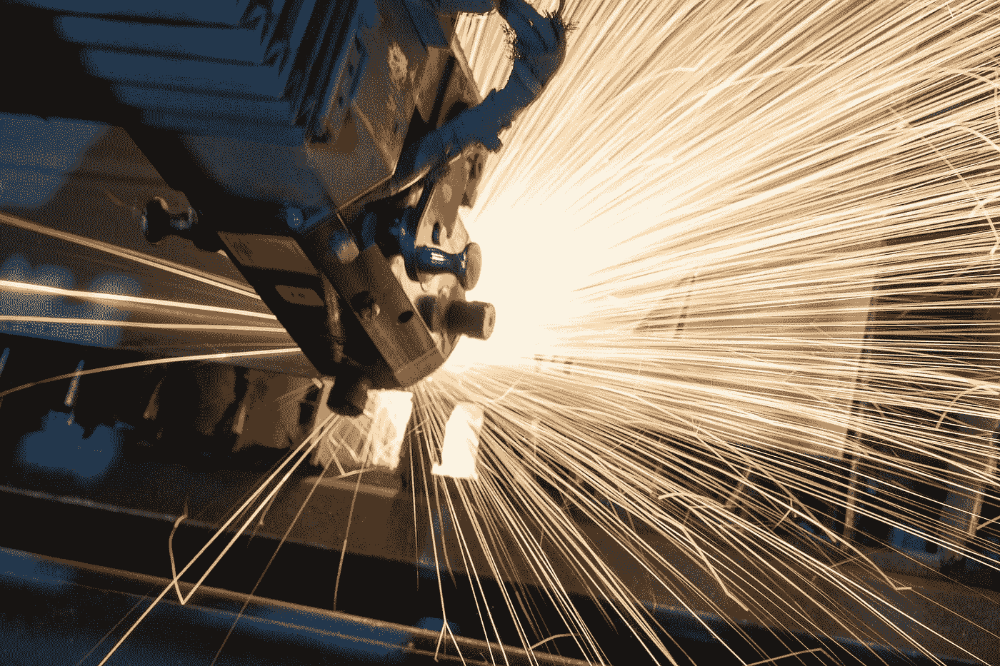
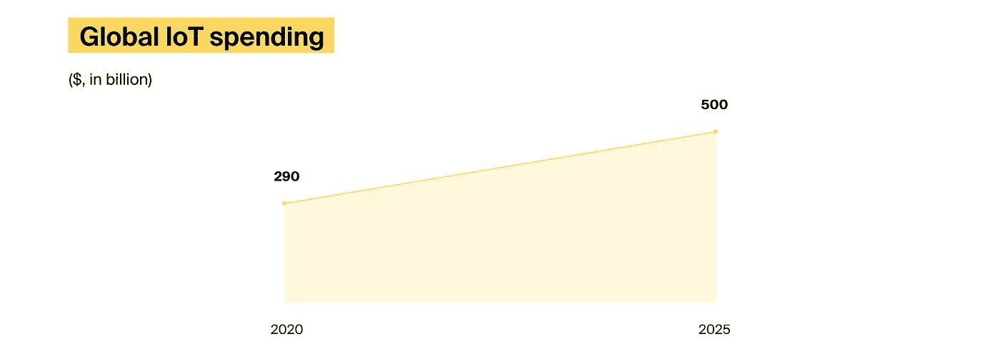
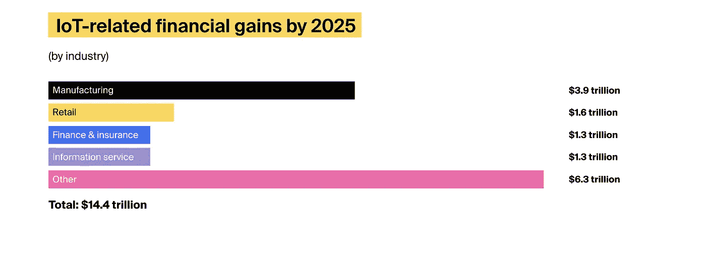

# 考虑在制造业使用物联网？先看看这个

> 原文：<https://medium.com/geekculture/considering-using-iot-in-manufacturing-read-this-first-954705e96dc8?source=collection_archive---------18----------------------->

麦肯锡最近的一项调查显示，在疫情之前成功过渡到工业 4.0 的制造商感觉更有能力应对危机。事实上，94%的受访者承认，制造业中的物联网以及其他技术在动荡时期为保持运营发挥了关键作用。

研究证明，[实施物联网解决方案和服务](https://itrexgroup.com/services/iot-development-consulting/)不仅可以帮助工业部门度过后大流行危机，而且[还可以将](https://www.tatanexarc.com/info-hub/new-age-technology/iot-in-manufacturing-aids-business-growth-28388/)业务增长率提高 25%左右。

请继续阅读，了解物联网在制造业中的应用，以及如果您下定决心对您的制造设施进行物联网升级，您可能会遇到的挑战。

# 制造业采用物联网的数字

在过去的几年里，数字化在制造业领域越来越受欢迎，预计这一趋势将持续下去。例如，智能制造市场预计将从 2021 年[的 2500 亿美元飙升至 2029 年的 6580 亿美元。](https://www.fortunebusinessinsights.com/smart-manufacturing-market-103594)

智能工厂的概念肯定不仅限于物联网。它还依赖于其他技术，如[人工智能](https://itrexgroup.com/blog/ai-types-subsets-use-cases/)、[计算机视觉](https://itrexgroup.com/blog/computer-vision-applications-in-different-industries/)、[大数据](https://itrexgroup.com/blog/big-data-and-its-business-impact/)、[不同类型的自动化](https://itrexgroup.com/blog/ipa-vs-rpa-vs-bpa/)。但即使我们只关注物联网，我们也可以看到这项技术是有前途的。麦肯锡预计，到 2025 年，工业物联网行业将达到 5000 亿美元(高于 2020 年的 2900 亿美元)。

凭借对制造业物联网的更加光明的预测，思科认为该行业将在不久的将来成为物联网的最大受益者之一，因为该技术将对该行业产生高达 3.9 万亿美元的影响。

但是厂家怎么说呢？根据普华永道最近在工业公司中进行的一项调查， [91%的受访者](https://manufacturingdigital.com/technology/pwc-digital-factories-shaping-future-manufacturing)正在投资数字化工厂，近一半的参与者预计五年后会有投资回报，而 3%的人希望在第一年内迅速收回投资。

# 制造业中的 6 大物联网用例

物联网在三个方面改变了制造业:

1.  跟踪工业资产
2.  确保安全
3.  启用预测性维护
4.  尝试工艺变化和产品设计
5.  了解制造业供应链
6.  监控远程和外包运营

# 跟踪工业资产

信息技术与创新基金会(ITIF)报告称，监控机器使用情况的物联网解决方案可以将制造业生产率提高高达 25%。

物联网设备聚合来自工厂机器的数据，并将其传输到云中进行详细分析，以深入了解机器的使用参数，如设置时间、空闲时间和小停车等。这为机器操作员提供了关于性能的详细视图，并通知他们潜在的问题，例如，如果一台机器闲置太久，而另一台具有类似功能的机器过度使用。

此外，员工可以在制造业中使用物联网快速定位大型仓库中的物品。工业互联网联盟(Industrial Internet Consortium)的执行董事理查德·索利(Richard Soley)强调了这一问题，他说:*“客户发现他们的工人花了 47%的时间寻找合适的工具，但使用 IIoT 解决方案，工人可以被告知他们需要的工具就在他们身后 10 米的左侧。”*

对于实时资产可见性，您可以为物品配备 RFID 或蓝牙标签。德勤数字公司的首席技术专家 Robert Schmid[报告说](https://www.wired.com/wiredinsider/2018/07/industrial-iot-how-connected-things-are-changing-manufacturing/)他的一个客户在他们的每条生产线上安装了位置跟踪传感器后，每年节省了 300 万美元。

# 确保安全

物联网传感器可以跟踪工作条件，检测危险材料泄漏。例如，气体传感器可以发现有毒烟雾，及时通知工作场所经理，后者可以疏散员工并最大限度地减少损害。

制造业中的另一个物联网用例是保护员工。美国劳工部[报告仅在 2020 年就有 4764 起与工作相关的致命伤害](https://www.bls.gov/news.release/pdf/cfoi.pdf)。在工厂车间使用可穿戴设备可以帮助工厂解决这个令人生畏的问题。可穿戴设备可以收集工人健康状况的数据。它们可以捕捉人们的生物特征数据，如心率和体温，并检测和报告任何不寻常的模式。这有助于值班经理发现身体不适、特别容易摔倒和受到其他伤害的员工。

制造业中物联网的一个例子来自废物回收公司 Nation Waste，Inc .该公司非常清楚有毒物质和重型机械对人类健康的危害。Nation Waste 为其员工配备了 IBM Watson 物联网可穿戴解决方案，并在工作场所安装了传感器。这使得经理们能够发现员工中任何疲劳、脱水和疲惫的迹象，并根据这些信息采取行动。这一举措使[与伤害相关的成本降低了 60%](https://www.ibm.com/case-studies/nation-waste-inc#:~:text=To%20keep%20workers%20safe%20and,helps%20workers%20avoid%20occupational%20hazards.)。

# 启用预测性维护

由于设备停机，大型制造商每年损失大约 323 个生产小时。如果我们将收入损失和错过最后期限的潜在经济处罚加在一起，对于大型生产工厂来说，与机械故障相关的成本可达每小时 532，000 美元。在制造业中使用物联网可以在早期发现设备故障，最大限度地减少停机时间，并且据麦肯锡称，可以将维护成本降低约 40%。

安装在工业设备上的物联网传感器将收集与性能相关的数据，包括压力、振动等。实时地。这些信息被传输到网关或直接传输到云，并与机器的配置数据及其使用历史相结合，以捕捉任何异常模式。工厂车间经理将获得分析结果，并安排进一步的检查和维护，以便将对生产过程的影响降至最低。

一个例子是支持物联网的卡车轮胎，其中传感器收集轮胎利用率的数据，以安排维护和更换，避免轮胎在运输途中爆炸，使车辆停止并延迟交付的情况。沃尔沃[为其卡车配备了物联网传感器](https://www.networkworld.com/article/3587404/volvo-trucks-boosts-vehicle-connectivity-with-ai-and-iot.html)，使得诊断时间减少了 70%，维修时间减少了 25%。

除了减少停机时间，预测性维护还能延长设备寿命、降低成本和事故风险。与传统的定期检查相比，这是一种更高效、更安全的替代方式，尤其是在制造机器不容易接近，而且在机器周围不安全的情况下。

# 尝试工艺变化和产品设计

面向制造业的物联网可以与人工智能和其他技术一起部署，以创建新产品和整个工厂的数字双胞胎。数字孪生是一种特定机器、过程或整个工厂及其所有设备和其他资产的计算机模型。它模仿真实世界中组件的状态和交互。管理人员和工程师可以使用这项技术进行实验，测试新的流程，并在将这些变化应用到现实生活中之前观察其后果。

Digital twins 可以帮助模拟新的生产线，检测需要优化的区域，规划仓库设计，进行产品更新，并优化现有流程以消除低效率。英国消费品制造商联合利华在美国、欧洲和亚洲运营着八家数字双胞胎工厂。再加上商业智能，该技术使公司[每天需要亲临工厂的警报](https://news.microsoft.com/transform/now-its-personal-unilevers-digital-journey-leads-to-real-results-for-consumers-and-employees/)数量减少了 90%。

制造团队也可以使用数字双胞胎来试验产品。例如，[福特通常为其每一辆车开发七个虚拟模型](https://www.palamir.com/news/5-real-world-examples-of-digital-twins)。每个模型涵盖不同的生产方面。

# 了解制造业供应链

物联网驱动的供应链管理解决方案使制造商能够获得关于单个物品以及送货卡车的位置和状况的实时信息。利益相关者还可以监控物品存储和交付的环境，如湿度、温度等。在传统的供应链中，管理人员只能在商品交付后才能看到它们被损坏。但有了物联网智能制造，就有可能在物品仍在运输过程中检测到任何损坏或违反存储建议的情况，并触发条件调整。

例如，设想一家制药公司使用第三方驱动程序向配送中心交付订单。对温度敏感的物品被放在装有传感器的容器中。如果冷却系统出现故障，传感器将检测到温度上升，并立即通知制药公司违反存储条件。该公司将联系司机，要求他们重置冷却系统，从而防止潜在的药物腐败。

这种物联网供电系统的一个例子是 [Efento Transport](https://www.efento.gr/en/application/pharma/temperature-monitoring-during-transport-of-medicines/) ，它可以确保需要连续温度监控的疫苗和药物的安全运输。无线传感器读取并传输温度数据。系统监控这些值，如果读数超过预定阈值，则向相关方发出警报。

制造商还可以在工厂车间放置物联网传感器，以了解正在生产哪些产品，从而避免重复订单。例如，爱立信在德克萨斯州的智能工厂定位了这种类型的资产跟踪器，并节省了高达 5%的备件采购成本。

# 监控远程和外包运营

根据德勤的数据，美国制造业高管[报告称，与 2018 年相比，如今在该行业找到合格候选人](https://www2.deloitte.com/us/en/insights/industry/manufacturing/manufacturing-industry-diversity.html)的难度增加了 36%。当地人才和能力的缺乏迫使制造商分散经营。当在不同的城市收购制造设施或将业务外包给第三方时，公司仍然希望监控生产标准和速度。物联网传感器可以向总部发送实时性能数据，以评估生产效率和工厂条件，并发现设备故障，而无需亲自前往工厂。

例如，屋顶上的传感器可以检测并报告烟雾和火灾，而入口处的物联网驱动摄像头可以监控员工出勤并报告未经授权的访问。

远程监控的一个例子来自便携式卫生产品制造商， [Armal](https://www.armal.biz/) 。该公司注意到其远程生产工厂的照明和冷却能源消耗过多。其中一个问题是他们遗留的机器。Armal 聘请了一名顾问，帮助该公司将他们的设备数字化，并在制造业中部署物联网，以促进实时监控，这导致[将生产和能源成本削减了 30%](https://www.zerynth.com/blog/case-study-remote-production-monitoring-with-the-zerynth-iot-platform/) 。

# 物联网解决方案对制造业的业务影响

在制造业中采用物联网有很多好处。以下是最突出的几个:

# 降低成本

物联网可以在许多方面降低制造成本，最显著的是通过实现预测性维护和能耗监控。

收入损失的主要原因之一是意料之外的长时间设备停机。一项研究表明，这种阻碍会让大型工厂每小时[损失高达 26 万美元](https://www.iiot-world.com/predictive-analytics/predictive-maintenance/the-actual-cost-of-downtime-in-the-manufacturing-industry/)。如上所述，物联网传感器可以发现故障甚至设备过载，并提醒经理解决问题，而不是等到机器在生产过程中出现故障。

在工厂部署物联网解决方案也有助于优化能源消耗。成都席晖水环境有限公司生产和经营污水处理厂。在设备上安装物联网传感器后，该公司可以将消耗与能源价格相关联，并利用非高峰时段，[将能源成本降低 10%](https://blogs.sw.siemens.com/mindsphere/three-energy-optimization-case-studies/) 。

# 做出明智的决策

位于工厂周围的物联网传感器持续传输实时数据，这些数据经过聚合、分析，并方便地投射到定制的仪表盘上。当需要时，领导团队将随时掌握所有重要的及时见解。如果没有物联网和分析，经理们就不可能对工厂的需求有如此深刻的理解。

# 创造安全的工作环境

工伤事故非常普遍。美国的研究表明，每 7 秒钟就有一名员工受伤。这相当于每小时 540 人受伤。此外，制造业是导致残疾的受伤人数最多的五大职业之一。

将物联网解决方案用于制造业有助于改善这些严峻的统计数据。物联网设备可以跟踪员工的健康状况，并在他们出现疲劳、脱水或任何其他增加犯错可能性的情况时通知他们的上级。其次，传感器可以监控机器，发现可能导致事故的异常行为。此外，连接的设备可以监控工作环境，并通知气体泄漏、火灾和其他危险。如果发生事故，物联网可以通过例如指示工人被困的区域来促进救援行动。

# 简化生产过程

物联网设备可以帮助工人快速定位大型仓库中的物品，而不是花费数小时四处漫游。新的产品线可以用数字双胞胎进行虚拟测试，而不是开始生产并失败。传感器有助于监控运输货物的状况，以避免损坏，损坏会延迟生产，因为经理将不得不安排新的交付并等待它。这些只是在制造业中使用物联网可以促进生产的几个例子。

普华永道最近的一项调查显示，[超过 80%的工业制造商](https://www.pwc.com/us/en/services/consulting/technology/emerging-technology/iot-pov/manufacturing-iot-snapshot.html#:~:text=IoT%20solutions%20can%20monitor%20the,reduce%20errors%20and%20minimize%20fraud.)借助互联设备提高了运营效率。

# 提供制造后支持

在传统的制造环境中，供应商在销售完产品后会失去与客户的联系。除非顾客投诉，否则他们不知道自己的产品性能如何。随着物联网在制造业中的应用，生产团队可以在部署后收集有关其产品的信息，并将修正纳入新版本。如果设备出现故障，他们还可以通过提供及时和更明智的客户支持来建立忠诚度。

# 物联网与制造业:实施过程中的挑战

# 安全性

物联网设备极易受到安全漏洞的攻击。根据卡巴斯基的数据，2021 年上半年有[15 亿起物联网违规事件](https://www.iotworldtoday.com/2021/09/17/iot-cyberattacks-escalate-in-2021-according-to-kaspersky/#:~:text=IoT%20cyberattacks%20more%20than%20doubled,from%20639%20million%20in%202020.)，这已经是 2020 年全年的两倍多。以下是总部位于纽约的网络安全公司 Lifars 的首席执行官 Ondrej Krehel 对物联网安全问题的描述，*“世界上没有任何设备能够 100%安全地抵御所有外部威胁。任何地方的任何联网设备都容易受到某种类型的攻击。然而，考虑到物联网设备的互连性，一个简单的漏洞可能会带来灾难性的后果，并使整个(整个企业)设备网络出现问题，而不仅仅是一个。”*

Ondrej 提到的威胁包括:

*   控制工业环境的高级恶意程序
*   僵尸网络和分布式拒绝服务(DDoS)攻击
*   数据失窃
*   可以操纵机器的勒索软件

当传统工厂在制造业中部署物联网时，它们会变成一个基于 IP 的系统，其中每个连接的设备都很容易受到攻击，并可能危及整个网络。历史上有许多可怕的公司遭受物联网相关安全漏洞的例子。例如，大型跨国铝制造商 Norsk Hydro 成为 LockerGora 勒索软件的受害者。该公司不得不关闭许多生产工厂，并将剩下的工厂转移到线下。整个磨难花费了挪威水电公司大约 7500 万美元。

另一个不幸的制造商是国防领域的 Visser Precision。该公司的基础设施被 DoppelPaymer 勒索软件渗透。当试图清理这次攻击的后果时，研究人员发现黑客公开发布了敏感文件，包括 Visser Precision 与 SpaceX 和特斯拉的[未公开协议](https://www.cpomagazine.com/cyber-security/doppelpaymer-ransomware-hits-major-us-parts-supplier/)。

为了最大限度地降低网络攻击风险，关注物联网的公司应该采用“设计安全”范式。安全团队需要以限制其参与 DDoS 和其他攻击的方式配置连接设备，并利用可靠的硬件和软件组件。不过，设备安全不是一次性投资。专门的团队需要监控网络，以确保软件不断更新，跟上新出现的威胁，并捕捉早期攻击迹象。

此外，处理数据也很重要。物联网传感器收集大量信息。所有这些都必须在不违反机密性和隐私的情况下安全地收集、传输和存储。

# 大型初始投资

另一个让制造商犹豫不决的因素是财务方面。你需要投资一大笔钱来建立制造业的物联网，而投资回报可能需要数年时间。支出包括硬件，如传感器、网关等。、软件、云或其他存储单元、连接和技术支持。

从我们最近关于[物联网成本](https://itrexgroup.com/blog/how-much-iot-cost-factors-challenges/)的文章中，您可以更好地估计所需的预算。

在改造工厂或仓库时，无法避免支出，但有一些方法可以最大限度地减少这些支出。例如，您可以租用内置传感器的设备。在这种情况下，您不必一次支付所有费用，供应商仍将参与其中。他们将监控设备，确保设备及时更新。

# 互操作性问题

另一个重要问题是，鉴于缺乏物联网标准化和竞争性通信协议，如何将所有物联网设备整合到公司的基础设施中。如果您在一个由供应商、物流公司和其他参与者组成的生态系统中工作，并且需要与他们进行互操作，那么情况会变得更加困难。

为了绕过这个问题，决策者需要与所有相关合作伙伴沟通，并与不断发展的物联网标准保持同步。此外，始终选择常用的物联网通信协议，因为它们通常具有强大的安全功能，并且更有可能与合作伙伴的技术互操作。

# 与遗留系统的集成

遗留系统也在阻碍集成和工厂数字化方面发挥着重要作用。在 Forrester Consulting 进行的一项制造商调查中， [53%的低成熟度受访者](https://www.embedded.com/lack-of-expertise-and-interoperability-still-hinder-iot-in-connected-factory/)承认他们的遗留系统根本无法与其余资产进行通信。

用更具连接友好性的替代方案来替代传统系统并不总是可能的，但工厂仍然可以在制造过程中使用物联网来升级这些机器。

一种选择是为孤立的机器配备智能传感器，这些传感器可以收集设备性能的数据，并将其发送到云端或本地服务器。另一个更全面的解决方案是使用包含物联网传感器和预测分析等其他功能的改造套件。这些套件中的一些是由供应商为特定的机械类型生产的。其他人可以使用不同的遗留系统。前物联网时代开发的设备现代化的另一种可能性是使用网关。它不仅将遗留资产连接到系统的其余部分，还将提供额外的功能，如安全性。

# 综上

制造业中的物联网可以为您的工厂带来许多好处，并帮助您应对大流行后的世界。改造你的工厂是昂贵的，但如果你留下来，你可能最终会放弃更多的钱。

如果你有兴趣发现其他技术如何彻底改变工业部门，请查看我们最近关于制造业中的人工智能的文章。

如果你想了解更多关于物联网的知识，我们已经在[物联网架构和设计技巧](https://itrexgroup.com/blog/iot-architecture-components-design-tips/)上发布了一篇详细的帖子。

> *考虑用物联网改造工厂？***！ITRex 团队将帮助您构建/购买物联网设备，将它们连接到网络中，并在需要时实施定制软件。甚至你的前互联网机械都可以参与！**

**原载于 2022 年 6 月 2 日 https://itrexgroup.com***。***