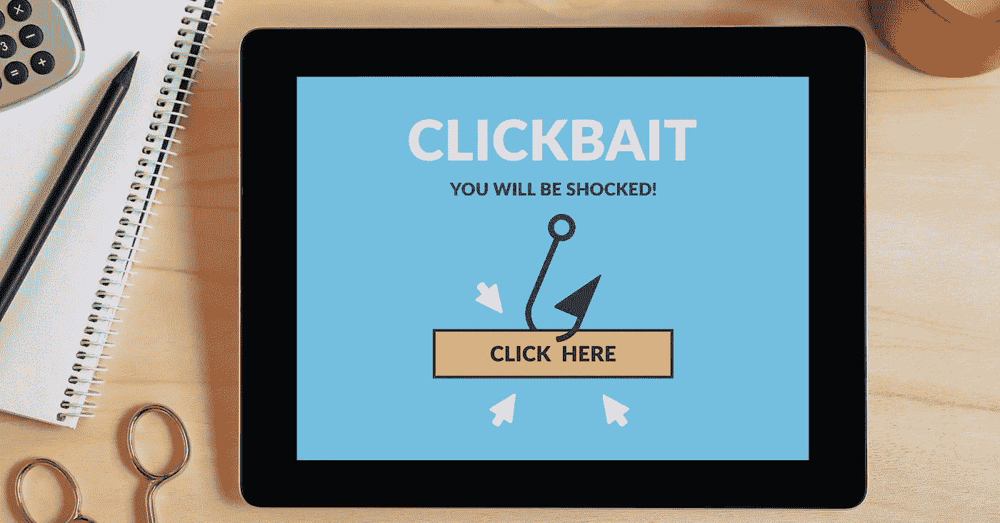

# 当代对公共领域中立性的挑战

> 原文：<https://medium.com/geekculture/contemporary-challenges-to-the-neutrality-of-the-public-sphere-28bb5a9eb9f8?source=collection_archive---------10----------------------->

一个正常运转的公共领域对于维护和平社会至关重要。有了言论、辩论和集会的自由，公共领域就是社会基石背后的支柱。公共领域强化了自由民主的理念，促进了政府的合法性，同时在社区内带来了自豪感和团结感。然而，在算法和社交媒体时代，公共领域的客观性正受到不断变化的信息景观的挑战。

Photo by [Eduardo Sánchez](https://unsplash.com/@eduardoequis?utm_source=medium&utm_medium=referral) on [Unsplash](https://unsplash.com?utm_source=medium&utm_medium=referral)

# 简介:

公共领域通常被描述为一个社区成员可以自由讨论问题和决定公众意见的话语空间。在技术时代，公共领域的概念与社交媒体平台和算法交织在一起，探索公共领域的局限性变得越来越重要。一些学者认为，公共领域的概念本身是有缺陷的，被占主导地位的富裕的同质白人男性用作一种工具，而牺牲了被边缘化的个人。然而，人们可以说，今天公共领域正朝着不同的方向发展，来自贫困背景的人更容易发出自己的声音。例如，在警察施暴的情况下，手机录像可以作为让施暴者承担责任的重要证据。在某种程度上，这正在侵蚀美国和世界各地的白人至上文化。理想情况下，公共领域是一个“不受操纵和冥想”的地方，在这个社会中，权力、社会阶级和资本不会影响公众的观点和态度(Reed 和 Boyd 2016)。现实是，在不同的历史时期，公共领域总是排斥不同的群体。本文将分解在技术时代保持公共领域中立的主要挑战。

# #1 算法并不总是中立的

Photo by [Markus Spiske](https://unsplash.com/@markusspiske?utm_source=medium&utm_medium=referral) on [Unsplash](https://unsplash.com?utm_source=medium&utm_medium=referral)

随着我们进入大数据时代，信息比以往任何时候都增长得更快，算法的任务是过滤内容并提供用户感兴趣的信息。然而，偏见很容易进入系统，造成信息传播的中断。许多平台，如谷歌和脸书，现在都采用了基于个人兴趣来评估内容价值的系统。除了对偏见的担忧，学者们还担心算法的存在会阻碍真正理想化的公共领域的发展。如今，技术和算法对消费者行为和公众舆论的影响程度尚不清楚，也无法追踪。问题是，算法在多大程度上影响了人们日常自愿消费的东西？

# #2 媒体对公共领域的挑战

Photo by [Adem AY](https://unsplash.com/@ademay?utm_source=medium&utm_medium=referral) on [Unsplash](https://unsplash.com?utm_source=medium&utm_medium=referral)

公共领域通常被视为公共话语、讨论和辩论的一种理想化的民主形式。人们普遍认为，21 世纪的公共领域应该对所有人开放，在这个地方，每个人都有平等的发言权来交流、挑战机构或传播信息。然而，公共领域经常不以支持实质性民主的方式运作，尤其是在社交媒体时代。媒体最重要的功能之一就是它应该具有批判性和独立性。这意味着媒体应该成为权力的制衡，无论是对名人还是政治家。众所周知，媒体平台有自己的议程，由于自身的制度偏见、价值观和忠诚，往往无法客观地挑战社会中的强大行为者。例如，在共和党和民主党的辩论中，福克斯新闻频道和 CNN 几乎总是会得出截然不同的结论。现在，社交媒体变得比以往任何时候都更加广泛的概念，加上媒体平台并非天生中立的事实，意味着公共领域在信息时代越来越难以保持客观。

# #3 监管虚假信息和点击诱饵的困难

除了社交媒体平台存在的偏见，公共领域中立性的另一个挑战是过滤不准确信息和点击诱饵的能力。随着摄像设备和电波等要求的松动，现在进入新闻职业越来越容易(Reed 和 Boyd 2016)。理论上，任何能上网的人都可以开始写作，并在网上自由发布信息。但如果信息是虚假的，误导性的呢？不幸的是，这个问题没有完美的解决方案，现实是，公共领域充斥着不准确的信息，这破坏了所有在线信息的完整性。此外，clickbait 的出现挑战了自启蒙时代以来就存在的新闻道德观念(Reed and Boyd 2016)。出于经济动机和推广内容的愿望，一些创作者不可避免地选择牺牲新闻业的基本道德和价值观。在今天的信息时代，虚假信息和网上点击诱饵继续挑战公共领域的中立性。

# 结论:

在信息时代，随着算法等技术的出现，公共领域的中立性在宏观层面上受到多种因素的挑战。媒体和算法中的偏见以及监管网上信息准确性的困难是民主国家公共领域面临的一些最大挑战。问题是:在可预见的未来，公共领域能在多大程度上保持客观，社会能做些什么来防止公共领域被少数有权势的人所控制？

参考资料:

里德大学和博伊德大学(2016 年 5 月 13 日)。在算法时代，谁控制着公共领域？数据与社会。