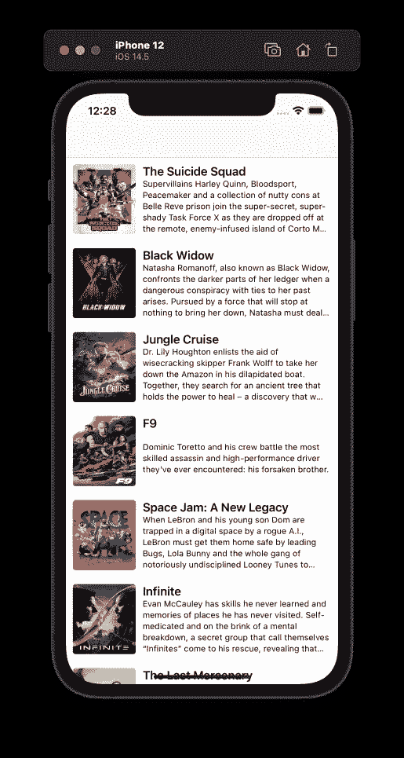

# 使用 Swift 中的协议和通用协议创建简单的网络层

> 原文：<https://medium.com/geekculture/create-simple-network-layer-with-protocol-and-generic-in-swift-1e7e06f5ead2?source=collection_archive---------0----------------------->

理论够了，我们来造点好玩的:]

Photo by [Alex Knight](https://unsplash.com/@agk42?utm_source=medium&utm_medium=referral) on [Unsplash](https://unsplash.com?utm_source=medium&utm_medium=referral)

在本文中，我想向您展示泛型和协议的强大功能，以及我们如何使用它们来创建可重用的网络层并使其可测试。如果您不熟悉协议，那么您可以访问我以前的文章来了解它。但是在我们开始实现网络层之前，关于泛型的一点概述将是完美的:]

## 通用入门

实际上我们已经使用了泛型，不管你是否意识到。我们在声明数组时使用了泛型。你可以用你想要任何类型来声明一个数组，一个字符串数组，一个整数数组，等等。不仅仅是数组，当我们使用字典和集合这样的数据结构时，我们也使用泛型。基本上，泛型是一个特性，它使我们能够定义一个类型或函数来接收一个类型参数，我们只需要编写一个实现，就可以将它用于许多类型。像数组一样，它接受类型参数，对吗？当你像【T6【String】或者**【Int】**这样定义的时候。让我们看看下面的代码:

上面的代码是一个关于如何实现一个泛型函数的例子。你从函数中注意到，它有`<T>`符号。它基本上像一个类型参数，我们可以通过注入具体的类型来调用函数。就像上面的例子，我们可以调用字符类型的函数，也可以调用其他类型的函数，比如 Int，Double 等。使用泛型，我们只需要编写一个实现，我们可以通过我们想要的许多类型来使用它。我们可以任意定义类型参数符号，可以用`Element`、`Value`、`X`等来定义。但是在社区中，通常我们使用`T`来定义类型参数。请注意，我们可以定义多个类型参数，但要确保符号是不同的，如下所示:

另一个例子是我们可以像这样实现泛型类型:

像泛型函数一样，泛型类型也接受类型参数。我们可以用尖括号`<>`来定义具体的类型。

## 协议关联类型

我们也可以有一个通用协议。但是实现与泛型函数和泛型类型有一点点不同:

相关联的类型将成为协议要求。为了实现上面的协议，你需要为你的实现提供一个`typealias`，或者你可以直接定义具体的类型——在这种情况下，我们将其定义为`UIButton`。我们可以对关联的类型进行约束，以符合`UIView`。只要满足约束和要求，Swift 将用`UIButton`替换`C`。

## 足够的理论，让我们开始:]

我创建了一个简单的项目来演示使用泛型和协议来创建简单和可重用的网络层。

 [## GitHub - tifoaudii/PopularMovies:一个简单的项目，展示了通用和

### 此时您不能执行该操作。您已使用另一个标签页或窗口登录。您已在另一个选项卡中注销，或者…

github.com](https://github.com/tifoaudii/PopularMovies) 

这只是一个简单的应用程序，显示电影数据库 API 的流行电影列表。你可以随意克隆它，如果你想看到最终结果，只需检查到`finish`分支。还有别忘了自己注册 API key:】。

好的，第一步是我们需要定义一个协议来代表一个网络请求。所以每当我们想要创建一个新的请求时，我们可以创建一个具体的类型并遵守这个协议。

1.  我们定义一个枚举来表示 http 方法。enum 本身符合 String 并使其成为 RawRepresentable，这意味着我们可以创建原始值，也可以获得原始值。后来，我们创建的每个请求都需要这个 enum 值来确定网络层在创建 http 请求时应该使用哪种方法。
2.  在这一步中，我们创建了一个名为 **DataRequest** 的协议。所以无论何时我们想要创建一个新的请求，它都需要符合这个协议。它还有一个关联的类型叫做 **Response** ，它的值类型取决于我们在客户端定义的具体类型。这个协议有五个要求，从 url、http 方法、头、查询项和解码函数开始。
3.  我们希望来自 web 服务的响应能够被轻松解码，对吗？然后我们可以创建一个带有约束的默认实现，该约束是关联类型**响应**应该符合**可解码**协议。**响应**类型可以是类似于【电影】、电影响应、【用户】、【字符串】等。
4.  那么，如果我们想创建一个请求，但不需要定义标题或查询项，会发生什么呢？客户端不应该遵守他们不使用的协议对不对:]？不要担心，我们可以像上面的示例代码那样通过扩展协议来创建一个默认的实现。客户端不需要编写协议的头和查询项的实现。

好吧，解释了很多:]，但是请和我呆在一起，我们可以继续下一步。在当前步骤中，我们已经创建了一个请求协议。然后我们可以创建对象和协议来处理对 web 服务的 http 请求。

哇代码真多 dude :]，不过让我们一个一个分解一下:

1.  首先，我们想让任何组件依赖于抽象，而不是直接依赖于具体类型。然后我们定义了一个名为 **NetworkRequest** 的协议。任何客户端组件，如视图模型或演示者，都应该依赖于它。为了实现依赖性反转原则，这是必需的。该协议有一个要求，它是一个请求函数，接收一个名为**请求**的类型参数，我们希望该类型参数符合我们之前已经创建的**数据请求**协议。请求函数有两个参数，即符合 **DataRequest** 协议的请求类型和使用 **Result** 类型的完成处理程序。
2.  在我们定义了 **NetworkRequest** 协议之后，我们就可以创建一个符合该协议的具体类型，在本例中我们称之为 **DefaultNetworkRequest** 。确保它实现协议要求。
3.  在请求函数中，我们需要做的第一件事是定义 url 组件。我们通过实现 **guard** 关键字来确保 url 组件是有效的，我们将来自请求的 url 注入到 url 组件初始化器中。
4.  在这一步中，如果需要，我们希望将所有查询项填充到 url 组件中。它可以像一个 api 键，或者像 page 和 limit 这样的元数据分页。我们可以在请求对象中循环查询项，如果查询项存在，就追加查询项。最后，我们可以将 url 查询项的数组设置为 url 组件。
5.  在我们设置了查询项之后，我们希望通过使用 **guard** 关键字来获取有效的 url。
6.  我们创建 url 请求对象，注入上一步中的有效 url，并设置 http 方法和 url 请求对象的请求头。
7.  最后，我们可以使用 urlSession 执行一个网络请求，并注入我们之前已经创建的 URL 请求。

好了，这一步我们的网络层已经准备好了。然后，我们可以实现获得流行的电影，并显示在屏幕上。我们创建名为 **PopularMovieRequest** 的新请求，并且我们可以在视图模型中配置请求。

就像我们之前的讨论一样，每当我们想要创建一个新的请求对象时，我们都需要遵循 **DataRequest** 协议。确保我们实现了协议中的所有要求。在上面的代码示例中，确保您已经从 Movie DB api 注册了 API 键，并将其放入`apiKey`变量。我们通过创建一个基本 url 和路径来实现 url 属性。我们还定义了查询项，因为我们需要向请求路径添加 api 键。我们从响应中指定 http 方法和解码逻辑。在这一步中，我们可以实现网络请求，将流行电影列表发送到视图模型。

看一下`fetchMovie`函数。首先，我们可以从 **PopularMovieRequest** 中创建一个实例。然后我们可以通过调用`request`函数来请求网络服务执行 http 请求，不要忘记将请求对象注入到函数中。运行项目，boom 热门电影列表出现:】。

电影现在出现了，但是我们还没有实现获取电影海报的请求。我们可以创建一个新的请求来获取图像，如下所示:

同样，不要忘记遵守 **DataRequest** 协议，并确保实现所有必要的要求。现在导航到 **ImageClient，**一个简单的单例对象来管理获取图像的请求。在`setImage`和`downloadImage`函数中实现请求:

从 **ImageRequest** 创建一个实例，并将 url 注入初始化器。首先，我们检查缓存映像是否存在。如果它存在，那么我们可以直接调用完成。否则，我们调用`downloadImage`函数并向其注入请求对象。`downloadImage`函数采用符合 **DataRequest** 协议的类型参数，该函数负责执行网络请求以获取图像。现在我们准备好了，我们可以实现将电影图像提取到**大众电影单元**中。

运行该项目，你会看到所有的细胞现在有一个渲染图像:】。

## 从这里去哪里

祝贺您已经阅读了这篇文章。泛型和协议都是 Swift 编程语言的重要特征。了解如何使用它们将使我们的生活变得更容易。感谢您阅读我的文章，如果您有任何问题或反馈给我，请告诉我，我们将不胜感激。