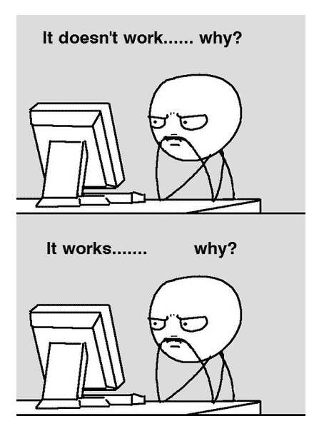
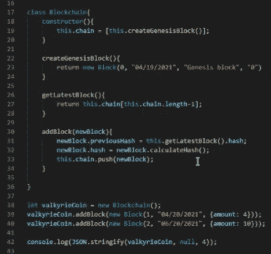
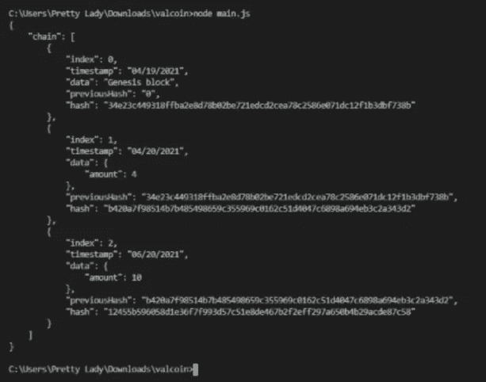
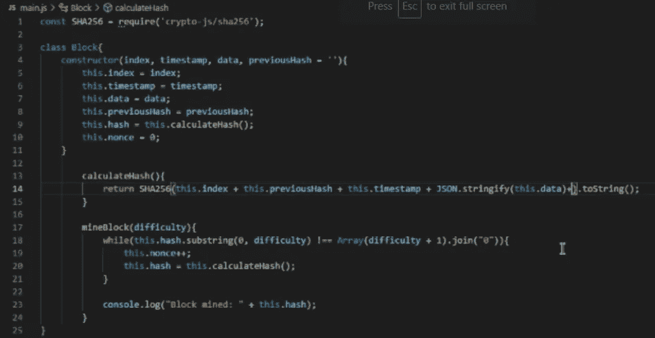
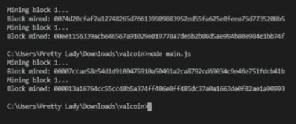
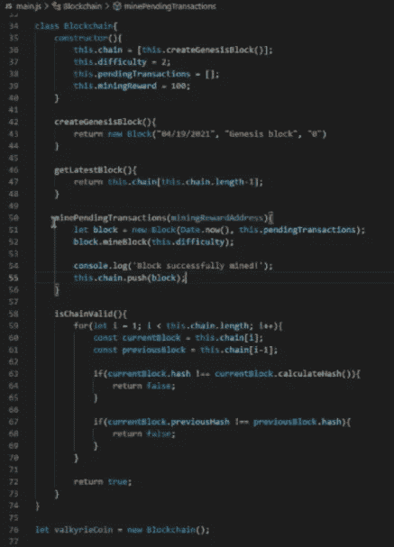
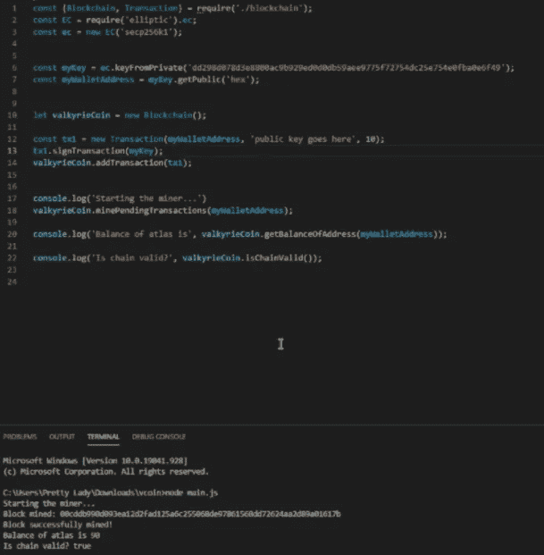
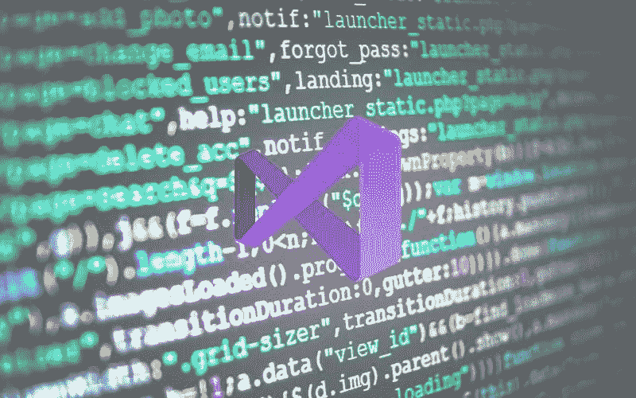

# 用 Javascript 创建区块链

> 原文：<https://medium.com/geekculture/creating-a-blockchain-with-javascript-16e9dbdda691?source=collection_archive---------4----------------------->

简单解释的复制

> 作者瓦尔基里·霍尔姆斯

这基本上总结了我过去五天的工作。

我决定做一件我以前从未完全做过的事情，那就是**尝试用 Javascript 编码。**我对 Python 只是略知一二，甚至不能说我是中级水平，所以这绝对是一个有趣的挑战，中途我紧张得要命，但当代码最终按照我想要的方式运行时，我也高兴得跳了起来。我理解这种挣扎。

我最近一直在学习区块链，**一个分散的货币系统，让每个人都能看到发生的每一笔交易，并对具体信息进行编码**。这些信息，在这种情况下，硬币，包含在被挖掘以获得更多奖励的块中，并且可以通过使用特定的密钥来解锁网络来获得奖励。想了解更多关于区块链和加密未来的信息，请查看我的另一篇文章！

但是今天，我们讨论 Javascript 和**我是如何为一个简单的区块链机制从头开始写了 150 多行代码。**

你可以观看这个介绍性的视频来大致了解我的项目:

我看了一系列来自**简单解释**的视频，这是一个 Youtube 频道，致力于学习从编码到存在性问题的一切新事物。他发布了一个由五部分组成的播放列表，用于用 javascript 编写你自己的区块链。虽然视频没有告诉我如何检查自己是否有足够的资金进行交易，或者如何与其他矿工沟通，但它确实让我对系统如何在比特币等加密货币中工作有了一个相对简单的概述。

# 创建基础

我的第一个任务是创建真正的链本身。我使用了 Visual Studio 代码和 node.js 扩展，其中包含了与构建加密货币相关的所有属性。一旦所有这些都安装完毕，我就开始制作我的第一个页面。

我定义了类“Block ”,并使用构造函数**来接收块**的属性，即索引、时间戳、数据和先前的散列。索引告诉我们该块在链上的位置，时间戳告诉我们它是何时创建的，数据将是虚拟代码，而先前的散列包含我们在链中破解的最后一个块的散列。

从那里，我们通过使用 SHA256 库为我们的块中的不同随机散列很好地使用 crypto.js 文件。我把它们串起来，**把它们变成可见数据**，并完成了这个程序块！

接下来，我**创建了一个新的类**叫做区块链。在这个类中是链起点的代码，即包含日期、名称和索引的 genesis 块。我还输入了一个“getLatestBlock”函数，**将下一个块**返回给我们，以及一个“addBlock”函数，**继续链**。这样，我们需要根据新的块来改变散列。实际上，在实际创建另一个块之前，您必须经过无数次检查，但是为了这些目的，它已经被简化了。

最后，我设置了一个名为“valkyrieCoin”的变量(非常原始，我知道)来与新的类 Blockchain 相对应，并创建了两个新的块，当我运行程序时，这两个块返回一系列的块。它包含属性链，该属性链包含引用先前块的散列。但是有一个问题，你不能这样验证链的完整性。这就是为什么我们然后创建一个链验证函数**，它可以实际检查一个块是否正确。**

Blockchain class and strings

Stringified blocks with data and hashes (notice how the previousHash corresponds with the hash of the last block)

# 工作机制的证明

好了，现在我们已经得到了所有的基本方式，有几个附加组件，可以完成我们的区块链多一点。现在，我们可以快速创建一个新块，但我们没有任何安全机制。这就是为什么我们实现了一个[工作证明系统](https://www.youtube.com/watch?v=HneatE69814&list=PLzvRQMJ9HDiTqZmbtFisdXFxul5k0F-Q4&index=2)，设置**来补偿现代计算能力和所述硬币的膨胀。**

我们需要做的第一件事是设置一个具有设定难度的“mineBlock”功能。该段包含在“while loop”子字符串中。难度**设置散列，使得一定数量的零被添加到前面**。试图挖掘数据块的计算机必须通过这一额外的安全级别，这使得这个过程比普通的笔记本电脑或个人电脑要慢得多。一旦设置完毕，您就可以创建一个能够结束循环的 nonce 值。再做一些调整，我们现在可以测试代码了。

mineBlock difficulty feature

Printed blocks (with added difficulty)

正如你所看到的，所有块的散列现在以 2 个零开始，如果我们将难度设置为 4，计算机将需要更长的时间来挖掘块并返回它们的散列。

# 硬币激励

然后我们有一个古老的问题:为什么人们首先要开采这些区块？嗯，**当然是数字货币**！但是到目前为止，我们还没有准备好。所以下一步是在代码中引入虚拟货币和交易。

我稍微修改了一下代码，在 Block 类中包含了事务，并且为事务创建了一个完全独立的类。这个类包含“收件人地址”、“发件人地址”和转账金额。然后，我们创建一个“未决事务”空间，在这个空间中，密码可以存在，直到区块被开采(有点像在一个单独的账户中持有资金)。

我还创建了一个**采矿奖励**，在未决交易行动完成后(一旦硬币被成功交付到一个设定的位置)每转移一块。在建立了另一个验证机制以确保没有任何东西被篡改之后，**余额被返回到设置的地址**。我们的新余额是 100 来自采矿奖励！

Pending Transactions code

Blocks being mined and returning the value of 100 coins to the “atlas” address

# 签署交易

好了，我们现在在最后冲刺阶段。现在我们要解决[交易安全](https://www.youtube.com/watch?v=kWQ84S13-hw&list=PLzvRQMJ9HDiTqZmbtFisdXFxul5k0F-Q4&index=4)的问题。我们有验证设置，我们有一个机制，但现在人们实际上可以花甚至不是他们的硬币，因为这些账户没有保护。这就是为什么我们必须**使用我们账户的公钥和私钥来签署每笔交易**。

我把代码放在不同的页面上，稍微清理了一下，现在，我们准备向终点线冲刺了！

我需要导入一个带有方法的**“椭圆”库，以验证签名并创建受保护的事务**(特别是 secp256k1)，将公钥和私钥作为“十六进制”字符串。将它们存储在另一个页面上后，我可以设计“calculateHash”代码，以便在每次运行时签名。在签署交易之前，我创建了与特定散列相对应的签名数据，并在另一个验证系统中工作，以检查是否满足条件。

Elliptical library inputs

Generated public and private keys

为了运行代码，我将私钥复制到 const 函数中以获取钱包的内容，然后将 10 个硬币的交易分配给一个随机地址(理想情况下，是您试图向其发送硬币的另一个人)。如你所见，余额是 90。这是因为我们从该区块获得了 100 英镑的采矿奖励，并且我们将其中的 10 英镑转移到了另一个地址。

Transactions and end balance

咻，那对你来说是一个巨大的编码转储。如果你不能理解所有的东西，不要难过，我花了很长时间才理解不同的函数，以及为什么我的代码第 50 次不能工作。总的来说，看到最后的 90 分出现在我的电脑屏幕上，我很有成就感。

在未来，我计划完整地完成这个系列，并为我的应用程序构建一个有角度的前端，但是因为时间的缘故，为了能够完整地解释区块链是如何工作的，我认为进入一些编码机制的大门是很好地利用我的知识的最好方式。我想继续这个区块链发现，并迫不及待地想了解更多。

Visual Studio Code

如果你有任何问题或顾虑，随时给我发电子邮件到 vholmes113@gmail.com。