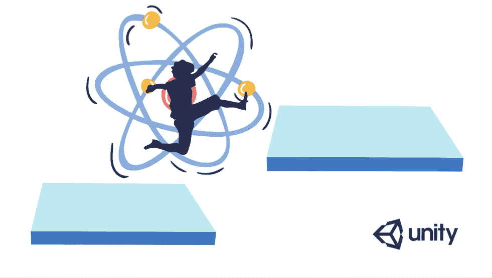

# 在 Unity 中创建基于物理的角色控制器

> 原文：<https://medium.com/geekculture/creating-a-physics-based-character-controller-in-unity-8bb061ef6031?source=collection_archive---------21----------------------->



Unity

这里的练习演示了在 Unity 中实现一个定制的物理控制器。

要移动 3D 对象，所需的数据如下。

*   方向
*   速度
*   重力

方向输入应给出左或右移动信号。速度输入应以一定的速度加速运动。重力输入应模拟真实世界的物理。

因此，在 player 对象上创建一个 C#脚本组件，并添加以下代码。

首先，角色控制器对象需要一个合适的句柄，因此使用 Start 方法来获得这个句柄。

```
private CharacterController _characterController;void Start()
   {
       _characterController = GetComponent<CharacterController>();
   }
```

1.  方向

*   在 Update 方法中，创建一个私有变量来保存水平轴值。

```
float _horizontalInput = Input.GetAxis("Horizontal");
```

*   创建一个名为 direction 的 vector3 变量，以使用从用户接收的输入。

```
Vector3 _direction = new Vector3(_horizontalInput, 0, 0);
```

2.速度

*   创建一个私有速度变量，其值根据选择而定。

```
private int _speed = 5;
```

*   在 Update 方法中，创建一个 vector3 变量来计算速度。

```
Vector3 _velocity = _direction * _speed;
```

3.重力

*   创建一个私有重力变量，其值由用户选择。

```
private int _gravity = 1;
```

*   在 Update 方法中，检查 bool 值以查看播放器是在地面上还是在空中。
*   如果被禁足，还会有下一次行动。如果在空气中，速度矢量的 Y 值应减小。

```
if (_characterController.isGrounded == true)
       {

       }
       else
       {
           _velocity.y -= _gravity;
       }
```

最后，使用所有的结果让玩家使用角色控制器移动。

```
_characterController.Move(_velocity * Time.deltaTime);
```

应该就是这样了:)

这是最终的结果。

[](https://drive.google.com/file/d/17vBVRAdVUMVaXZttKT6ef-F_YcV0syHe/view?usp=sharing) [## PlayerMovementPhysicsController.mp4

### 编辑描述

drive.google.com](https://drive.google.com/file/d/17vBVRAdVUMVaXZttKT6ef-F_YcV0syHe/view?usp=sharing)