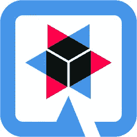

# 用 MongoDB、Quarkus 和 Panache 创建一个反应式 CRUD 博客应用

> 原文：<https://medium.com/geekculture/creating-a-reactive-crud-blog-app-with-mongodb-quarkus-and-panache-54d659cf8dcb?source=collection_archive---------4----------------------->


**MongoDB** 是一个广为人知的 **NoSQL** 数据库，使用它的原始 API 有不同的方式，这可能很麻烦，因为你通常需要将你的实体和查询表示为 **MongoDB** `[Document](https://mongodb.github.io/mongo-java-driver/3.11/bson/documents/#document)`。幸运的是，有了 **Panache MongoDB** 扩展和 **Quarkus** ，很多查询已经被简化了，因为它是建立在 [**MongoDB 客户端**](https://quarkus.io/guides/mongodb) 扩展之上的。

**MongoDB** 和 **Panache** 提供了**活动记录风格的实体**(和**存储库**),就像你在 [Hibernate ORM 和 Panache](https://quarkus.io/guides/hibernate-orm-panache) 中拥有的一样，并且专注于使实体更加无缝地编写查询。

凭借**的派头** , **Quarkus** 社区采取了一种自以为是的方法来解决许多不同的问题，以增强开发人员的体验。以下是其中的几个。



> 使您的实体扩展`PanacheMongoEntity`:它有一个自动生成的 ID 字段。如果你需要一个定制的 ID 策略，你可以扩展`PanacheMongoEntityBase`,自己处理 ID。
> 
> 使用公共字段。去掉愚蠢 getter 和 setter。在幕后，我们将生成所有缺少的 getters 和 setters，并重写对这些字段的每个访问以使用访问器方法。通过这种方式，您仍然可以在需要时编写*有用的*访问器，即使您的实体用户仍然使用字段访问，这些访问器也会被使用。
> 
> 使用活动记录模式:将所有实体逻辑放在实体类的静态方法中，不要创建 Dao。您的实体超类附带了许多非常有用的静态方法，您可以在您的实体类中添加自己的方法。用户只需输入`Person.`就可以开始使用你的实体`Person`，并在一个地方完成所有操作。
> 
> 不要编写查询中不需要的部分:编写`Person.find("order by name")`或`Person.find("name = ?1 and status = ?2", "Loïc", Status.Alive)`或者更好的`Person.find("name", "Loïc")`。

只是深入研究之前的一个旁注。

# 处理

> MongoDB 从 4.0 版本开始提供 ACID 事务。Panache 的 MongoDB 不支持它们。

# 问题域

对于这个 crud 应用程序，我们将把**帖子**和**评论**作为一种通用的博客格式来管理。典型的 1:N 关系。

由于在 **MongoDB** 中没有级联，我们在自己的场景中管理集合和它们在不同操作中的引用。在这个场景中，我们将使用包含实体方法的活动记录模式。然而，由于我们在 NoSQL 域中，我已经将注释隔离在它们自己的集合中，以便能够在它们自己的资源端点中查询。人们可能会考虑将引用 id 放在包含实体的数组中以节省空间，但这是另一个不同的讨论。

# 先决条件

*   MongoDB≥ 4(在 Docker 中)
*   Java 8+
*   龙目岛≥ 1.18.18
*   Maven ≥ 3.6.2

# Quarkus 扩展

```
$ ./mvnw quarkus:add-extension -Dextensions="quarkus-mongodb-panache,quarkus-resteasy-reactive-jsonb"
```

# Decaring 后派头反应蒙古实体

这里我们扩展了`PanacheMongoEntity`:它有一个自动生成的 ID 字段。如果您需要一个定制的 ID 策略，您可以扩展`PanacheMongoEntityBase`并相应地处理 ID。我们使用公共字段代替 getter 和 setter。

有了活动记录模式，我们可以将所有的实体逻辑放在实体类的静态方法中，而不用创建 Dao。如果需要的话，Mongo 实体超类附带了许多非常有用的静态方法。这样，我们可以减少很多样板文件，使用提供给我们的完整方法。

Quarkus 处理一些基本的日期类型转换:所有类型为`Date`、`LocalDate`、`LocalDateTime`或`Instant`的字段将使用`ISODate`类型(UTC datetime)映射到 [BSON 日期](https://docs.mongodb.com/manual/reference/bson-types/#document-bson-type-date)。MongoDB POJO 编解码器不支持`ZonedDateTime`和`OffsetDateTime`，所以您应该在使用之前转换它们。

# 声明注释 Panache 反应 Mongo 实体

同样的**活动记录**原则也适用于上述情况。

# API 发布资源端点

在`search2`调用中，查询时有几个选项可供选择。有一种普通文档查询、raw JSON 查询或 PancheQL 查询，它们可以让人想起 JPA 查询语言。

# API 注释资源端点

# 运转

运行 MongoDB 数据库。

```
$ docker run -ti --rm -p 27017:27017 mongo:4.0
```

使用实时编码预览运行 quarkus 应用程序。

```
$ ./mvnw compile quarkus:dev
```

# API 调用

为我们的博客创建帖子

```
$ curl -X POST "localhost:8080/posts"

{
"title":"A new title",
"content":"This is some sample content",
"author":"John Doe",
}
```

给帖子添加评论

```
$ curl -X PUT "localhost:8080/posts/60db336deb401c61ad7c559c"

{
    "content":"This is a comment"
}
```

给定时间间隔搜索帖子

```
$ curl "localhost:8080/posts/search?dateFrom=2021-06-17T00:00:00.000Z&dateTo=2022-06-17T00:00:00.000Z"
```

# API 响应

获得所有帖子的回复

```
[
   {
      "id":"60dc9301971c0d514f62792e",
      "author":"John Doe",
      "comments":[
         {
            "id":"60dc930f971c0d514f62792f",
            "content":"This is a comment",
            "creationDate":"2021-06-30T17:51:43.781"
         }
      ],
      "content":"This is some sample content",
      "creationDate":"2021-06-30T17:51:29.812",
      "title":"A new title"
   }
]
```

# 测试

现在我们可以开始深入细节，添加适当的**错误处理**、**测试**和**故障场景**。Quarkus 在测试具有活动记录模式的实体时提供了一组辅助方法。这里是依赖性。

```
<dependency>
    <groupId>io.quarkus</groupId>
    <artifactId>quarkus-panache-mock</artifactId>
    <scope>test</scope>
</dependency>
```

更多关于使用模仿方法的信息可以在这里找到。有了 Quarkus 2.0，我们可以添加测试并在实时重新加载期间运行它们，因此不需要在开发模式下单独运行测试。

[](https://quarkus.io/guides/mongodb-panache#using-the-active-record-pattern) [## Quarkus -简化的 MongoDB

### Kotlin 数据类是定义数据载体类的一种非常方便的方式，使它们成为定义数据载体类的一个很好的匹配

quarkus.io](https://quarkus.io/guides/mongodb-panache#using-the-active-record-pattern) 

请记住， **Panache** 的主要意图是通过使用查询和 API 来简化事情，但是如果需要，总是可以选择使用 **MongoDB 客户端扩展**，因为 Panache 正在幕后使用它。

如果你想看完整的源代码，可以在 GitHub 上找到。

[在这里找到 GitHub 源码项目](https://github.com/dvddhln/quarkus-crud-reactive-mongodb)

其他有用的资源可以在下面的链接中找到。

祝你好运！

[](https://quarkus.io/guides/mongodb-panache) [## Quarkus -简化的 MongoDB

### Kotlin 数据类是定义数据载体类的一种非常方便的方式，使它们成为定义数据载体类的一个很好的匹配

quarkus.io](https://quarkus.io/guides/mongodb-panache) [](https://quarkus.io/guides/mongodb) [## quar kus——使用 MongoDB 客户端

### 首先，我们需要一个新项目。使用以下命令创建一个新项目:该命令生成一个 Maven 结构…

quarkus.io](https://quarkus.io/guides/mongodb)