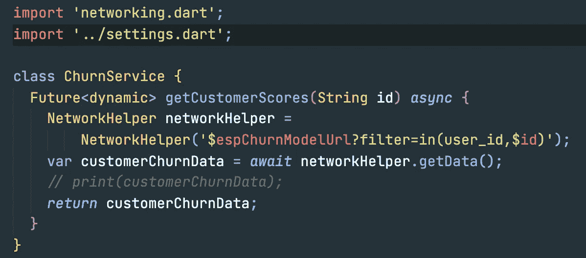
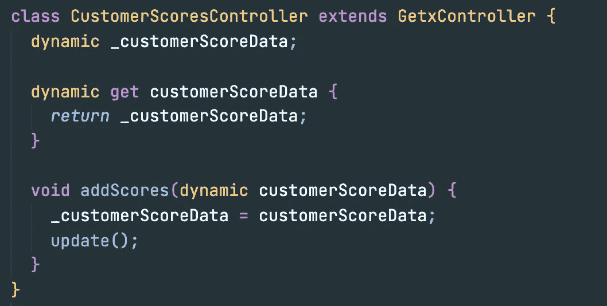
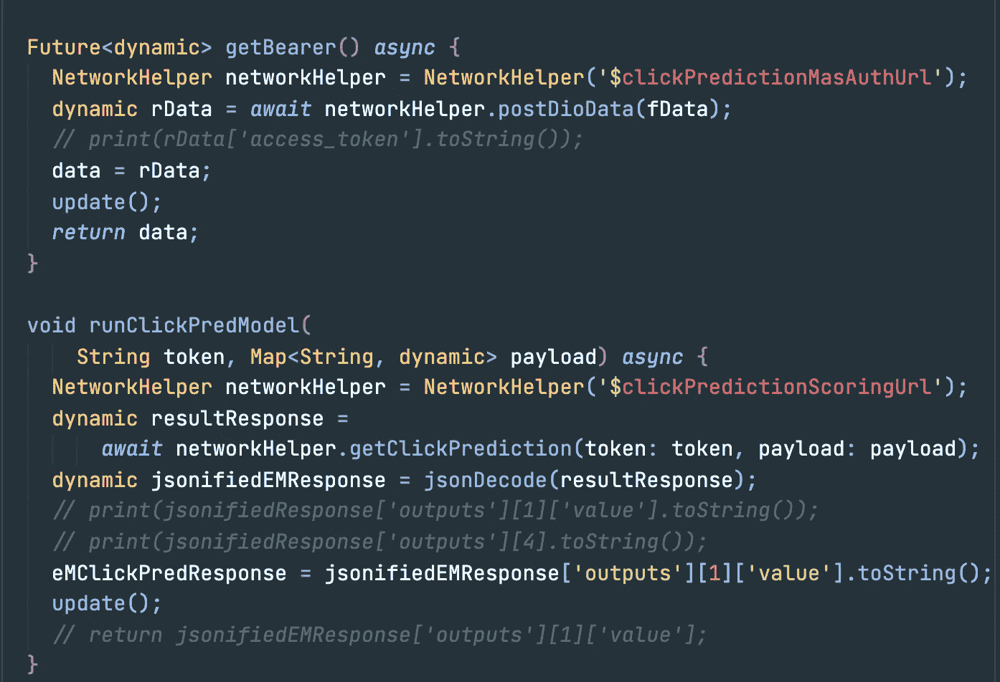
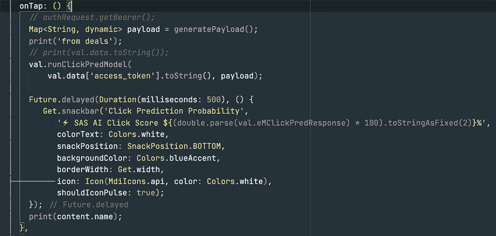

# 使用 Flutter 和 SAS 创建出色的跨平台消费者体验:第 2 部分，共 2 部分

> 原文：<https://medium.com/geekculture/creating-awesome-cross-platform-consumer-experiences-with-flutter-and-sas-part-2-of-3-3a9b768a4cc0?source=collection_archive---------35----------------------->

**注:**如题，这是 part2。如果你还没有读过的话，我强烈推荐你从《T2》**第一部** 开始。

作为快速复习，我们正在构建一个人工智能优先的零售/电信应用程序

1.  使用以实时/流模式运行的后端服务对客户交互进行评分
2.  利用现代跨平台开发框架——Flutter，从而允许我们在 iOS、Android、Web 和其他形式的因素和平台上运行，如果需要的话。
3.  在我们不需要完整的 ML 开发生命周期的情况下，当适合快速洞察时，使用云 API。

如果你已经忘记了我们的应用程序是做什么的，请点击这里查看最终产品

*在这篇文章中，我们将重点关注如何生成分数来预测客户流失/保留、细分和点击倾向的细节。这篇文章假设读者对 Dart 和 Flutter 有些熟悉。但是不要担心，否则，我已经故意保持内容在技术细节上有点轻，以允许大多数人跟随 ok。*

*预测客户流失和细分的前两个功能将使用 SAS 事件流处理(SAS ESP ),而点击倾向预测将使用 SAS 微分析服务。我们将使用 REST 调用通过 http(s)与所有这些“评分服务”对话。但是首先，如果您想知道为什么选择 SAS ESP，原因有两个(对我们来说)。*

a.它允许您在事件发生时立即对其进行评分，允许低延迟、高吞吐量的评分，可以扩展到大量的传入数据

b.它还包含一系列在线算法，无需任何离线模型开发。是的，你没看错。没有必要跟在神话般的数据科学家/MLE 后面去寻找一个有效的模型。当然，在适当的情况下，或者当你知道离线培训的结果绝对有利时，你可能仍想参与传统的*离线培训、在线评分*过程。

在任何情况下，由于我们的应用程序展示了广泛的可能性，让我们展示两种类型的 SAS ESP 评分模型。我们将使用 ASTORE(分析存储)二进制文件进行客户流失评分，该文件将 ML 评分逻辑压缩到一个文件中，该文件可以在运行时热加载到内存中，并可以通过 SAS ESP 高速执行。重要的是要记住，在任何建模实践中，最重要的是使模型有用的能力，然后我们可以迭代改进它。这样，您就有了一条清晰的部署路径，并且您的建模用例交付了一个*可测试的*结果，而不是我们独自生活在假设和假设的土地上。该过程的第一步是构建一个可部署到 ESP 的模型。这是您的标准 ML 培训流程，您将参与冠军/挑战者评估，并挑选最适合该用例的模型，同时保持较低的复杂性。在我们的例子中，这是一个检测客户流失倾向的随机森林模型。我们需要这种情况在我们的应用程序中发生，只要我们通过弹出凭证并单击如下所示的登录按钮导航出登录页面

Need to trigger the model as soon as the login button gets tapped

Sending requests to SASESP to collect the churn and the segmentation scores

单击登录后，我们生成一个事件，并通过 http(s)将该事件假脱机到 SAS ESP。然后，ESP 项目会立即对即将到来的事件进行客户流失和细分评分。在点击 ESP 之前，我们还会在数据库中快速查找客户 ID 和一点个人资料历史，这样我们就可以快速确保我们获得了为活动评分所需的所有详细信息。我们将所有这些都包装在一个小小的 *ChurnService* 类中(见边上的图片)。当我们这样做时，我们从 ESP 得到如下响应，如 dart devtools 日志控制台所示。

Response to be parsed from SAS ESP

就这样，我们能够找出客户流失的倾向。我们也知道他们都属于哪一部分。在我们的演示应用程序中，当用户在主页上单击图标时，我们会在对话框中显示这些数据。(见下图 gif)

好了，让我们在这里暂停一下，想想你能为用户提供什么样的 CX。有了这些信息，你就可以为你的客户创造无数个性化内容的机会——这些机会可以采取促销活动、用户拒绝后的会后跟进等形式。或者，如果我们知道用户正在努力解决某个问题，并且知道这是哪种类型的用户，就在应用内提供客户支持。业务的可能性是无限的，你如何处理它可能取决于你的核心业务模式和你可能追求的指标类型，因为它与你想用你的营销/CRM 预算做什么有关。

***状态管理侧注*** :因此，在我们的应用程序中，我们需要能够在整个会话过程中保存从 SAS ESP 获得的结果。我们将使用令人敬畏的 [getx 状态管理器](https://pub.dev/packages/get)来完成这个任务。这意味着，我们可以使用 getx 从实例化的 GetxController 中检索分数，而不是像上面的 gif 中所示的那样，每次点击用户图标按钮时都调用一些服务。对于我们的应用程序，该控制器如下所示

GetXController to manage the state with a getter and a function to update the scores

这个应用程序的大多数状态管理问题都是使用类似的范例来处理的。您可以在这里 查看应用程序 [**的全部源代码。**](https://github.com/datasciencemonkey/spock)

 [## 数据科学关键/斯波克

### SAS 驱动的人工智能应用程序可以在 iOS、Android 或 Web 上运行——datasciencemonkey/Spock

github.com](https://github.com/datasciencemonkey/spock/blob/main/lib/widgets/deals.dart) 

好，这是第一个。第二个特性与点击预测有关。这个问题的处理方式略有不同。一个现实的情况是，任何零售组织都可能有各种各样的商品经历降价，而特定的商品会成为最受欢迎的商品。现在，如果我们有 N 个条目，我们希望能够对前 N 个条目进行排序和排列，从而最大程度地增加用户点击的可能性。为了实现这一点，我们可以根据分桶流失分数范围、客户细分和各种客户档案属性来生成点击预测分数。通常在实践中，只要我们从 ESP 得到响应 JSON，这就可以作为一个异步过程来完成。然而，我们将对这种类型的实施稍加改动，只是为了展示我们如何使用 SAS MAS(SAS 微分析服务)来实现这一点。为了演示这一点，让我们在主屏幕的底部调出一个小的小吃店，显示点击的概率。我们所能做的与我们在登录页面所做的类似，但这次是将请求发送到 SAS 微分析服务模块。SAS MAS 模块允许我们使用 REST 调用对特定的 ML 模型进行评分。在这种情况下，我们向 MAS 模块的评分 URI 发出 POST 请求，如下所示。

Make Request to MAS Module and get the scored result

一旦我们从 MAS 模块获得了结果，我们就可以简单地将解析后的响应注入到对话框中，这是我们再次从 awesome getx 包中借用的。请参见下面的代码片段，该代码片段展示了我们如何利用“交易部分”中的 GestureDetector 小部件中的 onTap 功能。你可以在这里看到这个页面[的全部代码。](https://github.com/datasciencemonkey/spock/blob/main/lib/widgets/deals.dart)

How the results get surfaced up to the app

最后，当我们这样做时，我们看到我们能够成功地预测在*我的最大储蓄者*部分中列出的每个项目的点击概率，就像你在下面的 gif 中看到的那样。用 flutter 做这件事的好处仍然存在，我们在这篇文章中讨论的所有内容都适用于 Android 和 Web。

就这样，我们结束了这篇文章。下次再见，保重！🚀

在 [**LinkedIn**](https://www.linkedin.com/in/sathishgangichetty/) 上与 Sathish 连接