# 使用 Flutter 和 Solidity 的加密钱包应用程序

> 原文：<https://medium.com/geekculture/crypto-wallet-app-using-flutter-and-solidity-9f67b0d0819f?source=collection_archive---------0----------------------->

加密货币钱包**存储购买加密货币所需的公钥和私钥，并提供授权每笔交易的数字签名**。这些数字钱包可以是一种设备，一个应用程序或在线网站上的程序，或者是加密交易所提供的服务。

在这篇文章中，我们将使用 flutter 开发一个加密货币钱包应用程序。我们还将讨论如何轻松实现 ERC-20 令牌，并从我们的钱包应用程序中与智能合约进行交互。

**钱包 Dapp 的完整代码在本文末尾。**

# ERC-20 智能合同

在 flutter 中构建实际的钱包应用程序之前，我们需要部署一个 ERC-20 令牌契约，以便我们可以从我们的钱包应用程序与其进行交互。如果您想知道如何编写自己的 ERC-20 令牌，请阅读我以前的文章。

 [## 编码你自己的 ERC-20 代币

### 学习在区块链以太坊上编码自己的基本 ERC-20 代币。

medium.com](/geekculture/code-your-own-erc-20-token-1678d9b381da) 

但是现在，我们将使用 Openzepplin 轻松创建一个 ERC-20 令牌。Openzepplin 为以太坊和其他区块链提供了经过战斗考验的智能合约库。

 [## OpenZeppelin

### 以太坊网络的模块化、可重用、安全的智能契约库，用 Solidity 编写。杠杆作用…

openzeppelin.com](https://openzeppelin.com/) 

我们还需要元掩码来部署合同。所有 ERC-20 令牌将在部署后存放到合同所有者地址。

 [## MetaMask -区块链应用程序的加密钱包和网关

### 区块链应用程序的加密钱包和网关

区块链 appsmetamask.io 的加密钱包和网关](https://metamask.io/) 

我们将使用 Remix —以太坊在线 IDE 来编码和部署我们的智能合约。

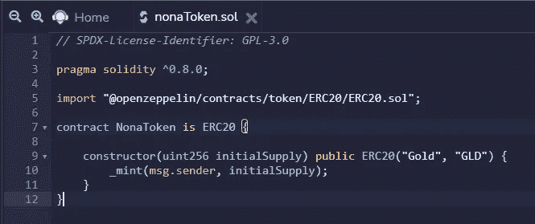

ERC-20 Contract

在上述合同中，我将 ERC-20 代币的名称设置为“黄金”，符号设置为“GLD”。在部署之前，我也把币的初始供应量定为 10000。部署契约后，我们可以从 IDE 本身访问 ERC-20 契约的功能。

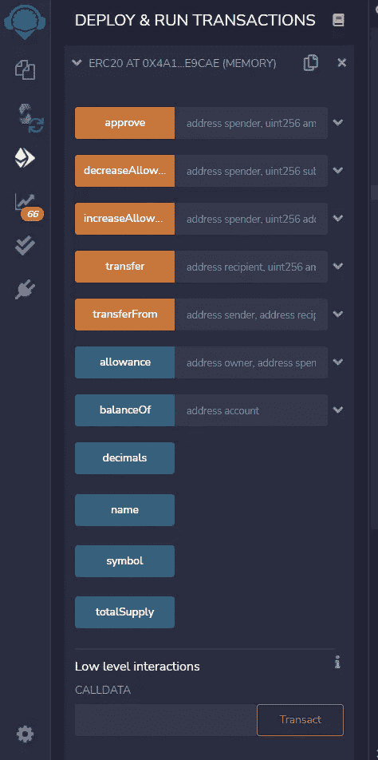

通过合同我们可以看到我们可以使用的各种功能，如**审批**、**转账**、**余额**等。我们要做的钱包应用程序的目标是创建一种方法，通过应用程序使用私钥和公钥安全地与这些功能进行交互。

您可以在 etherscan.io 中看到关于已部署契约的详细信息，您只需粘贴契约地址就可以获得关于您在 remix IDE 中部署的契约的详细信息。

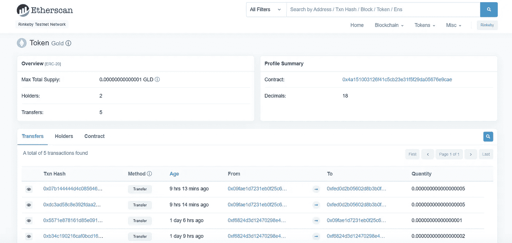

Etherscan

现在我们已经部署了我们的 ERC-20 智能合同，我们必须制作与该合同交互的 flutter 应用程序。

# 先决条件

我们需要做的第一件事是用 Firebase 设置 Flutter。Firebase 帮助我们轻松维护不同的用户，我们也将使用 Firebase 通过 Gmail 认证用户。

 [## 重火力点

### 加入我们，参加 2021 年 11 月 10 日的 Firebase 峰会。收听了解 Firebase 如何帮助您加速应用程序…

firebase.google.com](https://firebase.google.com/) 

创建一个 Firebase 帐户，并添加一个具有您想要的项目名称的项目。然后按照 firebase 提供的 sdk 说明，将你的 flutter 项目与 firebase 连接起来。

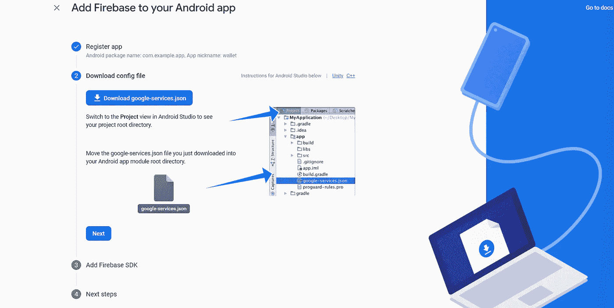

Firebase

您可以从应用程序级别的 build.gradle 获得 android 包名称，并在应用程序级别和项目级别的 build.gradle 上添加 firebase SDK。

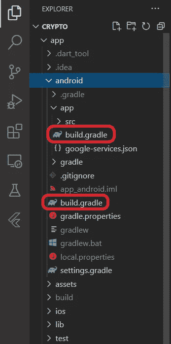

Folder Structure

最好将 minSdkVersion 更改为 21，将 targetSdkVersion 更改为 30，以避免在导入未来的 firebase 库时出现错误。

App-level build.gradle

# 谷歌登录

为了让我们通过 google 登录来验证用户，我们需要将我们项目的 SHA 证书指纹添加到 firebase 中。

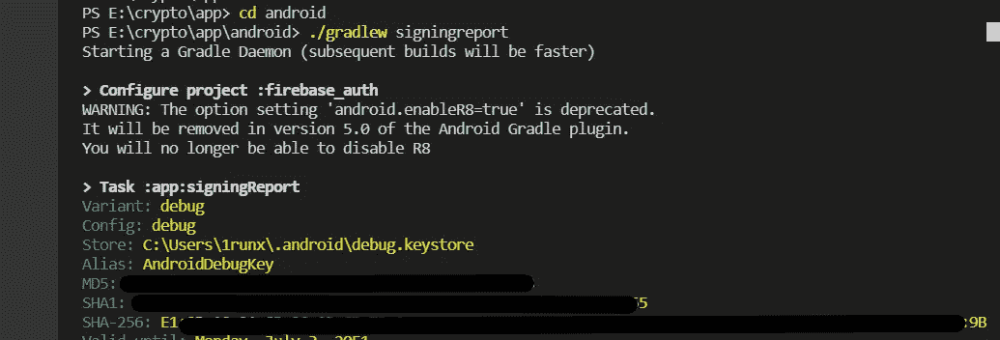

SHA-1 and SHA-256

要获取项目的指纹，请转到 android 文件夹，在终端类型中，

> 。/gradlew 签名报告

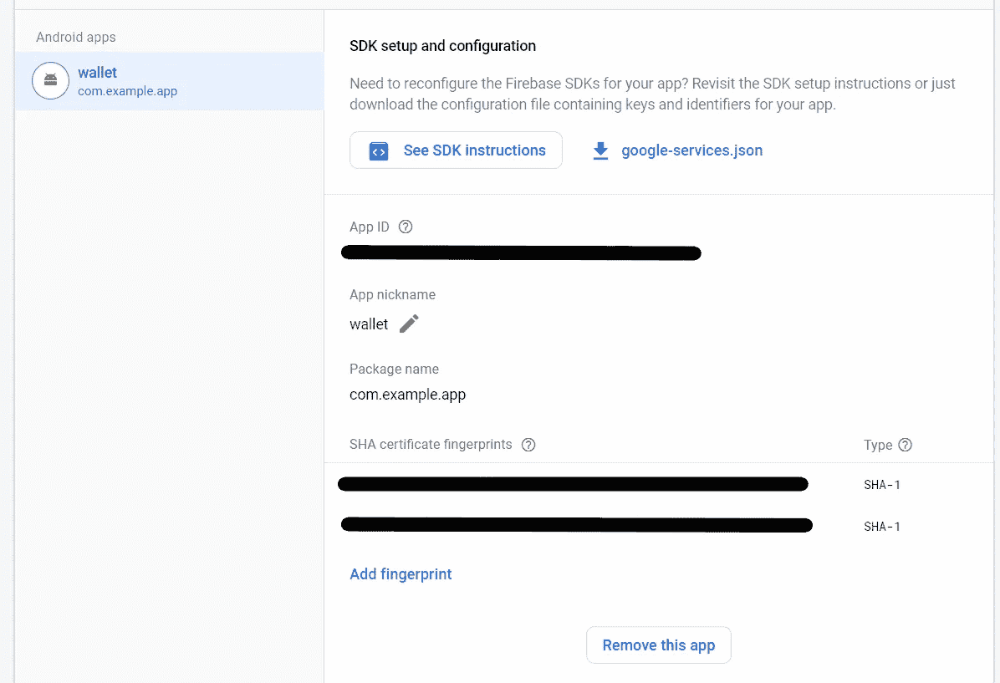

确保在添加 SHA 指纹后，将 google-services.json 文件下载到您的 android 应用程序级文件夹中。要启用 google 登录，请确保从登录提供商处激活 google。

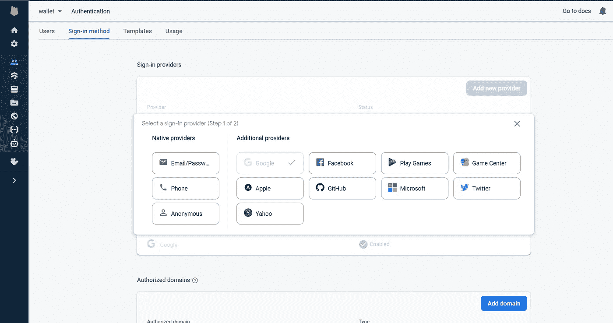

Sign-in providers in Firebase

既然我们已经选择了 google 作为登录提供者，我们需要设置我们的 flutter 应用程序来访问 google 登录。首先，我们需要将 **google_sign_in** 包添加到 pubspec.yaml 文件中。

 [## google_sign_in | Flutter 包

### 一个用于谷歌登录的抖动插件。注意:这个插件仍在开发中，一些 API 可能不可用…

公共开发](https://pub.dev/packages/google_sign_in) 

我们还需要在 pubspec.yaml 中添加 **firebase_core** 包来与 firebase 交互。

 [## firebase_core | Flutter 包

### 一个使用 Firebase 核心 API 的 Flutter 插件，可以连接到多个 Firebase 应用程序。要了解更多关于…

公共开发](https://pub.dev/packages/firebase_core) 

然后我们需要另一个名为**提供者**的包，它为继承的小部件创建一个包装器，使它们更易于使用和重用。

 [## 提供商| Flutter 包

### English | Português | 简体中文 | Español A wrapper around InheritedWidget to make them easier to use and more reusable.

公共开发](https://pub.dev/packages/provider) 

现在要使用 firebase，我们需要首先在 main 函数中初始化 firebase。

Initialize firebase

WidgetFlutterBinding 类将框架绑定到 flutter 引擎。通过调用 **ensureInitialized()** 方法，我们在调用 MyApp()之前初始化了绑定。

Future<FirebaseApp>

在 MyApp()类内部，我们需要创建一个 future **FirebaseApp** 实例并初始化它。MyApp()类返回一个 **ChangeNotifierProvider** 。它是一个可以扩展或混合的类，使用 voidCallback 为通知提供更改通知 API。

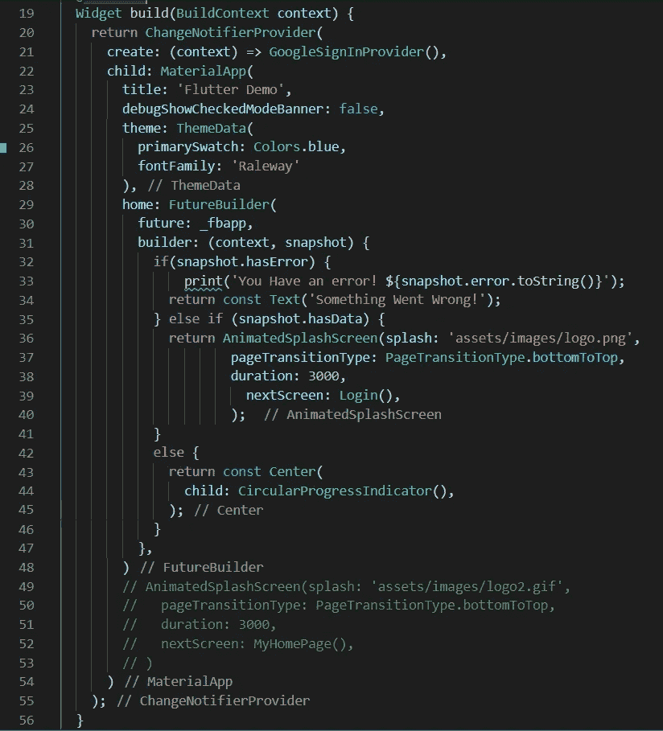

MyApp()

注意，我们使用 **GoogleSignInProvider()** 类向 MyApp()传递了一个上下文，我们很快就会创建这个类。

还要注意，我在应用程序中添加了动画启动画面，你可以选择不将其添加到你的应用程序中。如果你想添加它，请访问下面的链接，并将其添加到 pubspec.yaml。

 [## 动画 _ 飞溅 _ 屏幕|颤动包

### 去酒吧看看吧。Dev 这些天我维护了相当多的 repos，慢慢烧出来了。如果你能帮助我…

公共开发](https://pub.dev/packages/animated_splash_screen) 

现在我们需要制作两个页面，登录页面和主页。我们使用一个 **StreamBuilder** (这是一个小部件，可以将用户定义的对象流转换成小部件)来直接进入主页(如果用户已经通过身份验证),或者进入登录页面(如果没有通过身份验证)。

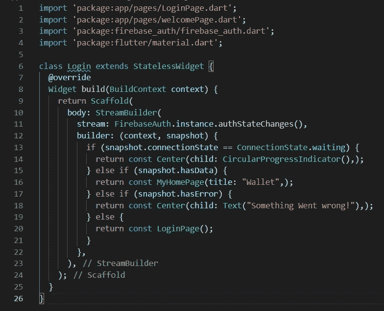

我们建立了一个简单的登录页面，可以选择通过用户的 Gmail 帐户登录。

Login Page

如果您想使用完全相同的按钮，只需将这个包添加到您的 pubspec.yaml 中。

 [## 颤振 _ 登录 _ 按钮|颤振包

### 一个适用于 iOS 和 Android 的 Flutter 插件，用于为不同的社交媒体帐户生成登录按钮。反馈和…

公共开发](https://pub.dev/packages/flutter_signin_button) 

当登录按钮被按下时，我们调用 **GoogleSignInProvider()** 类。我们需要首先创建一个提供者，然后使用它调用类中的函数。

SignInButton()

GoogleSignInProvider()

我们的谷歌认证完成了。现在，我们的应用程序中可以有不同的钱包用户。

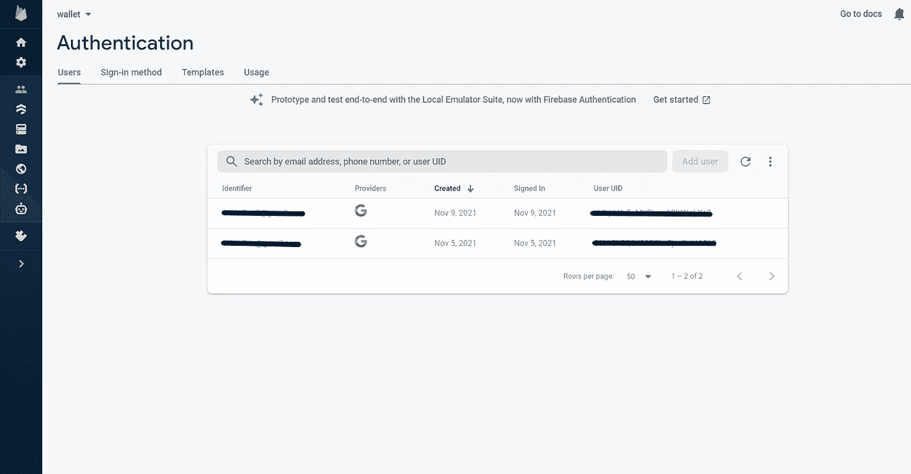

如果您想要完整的源代码，本文末尾给出了链接。

# 加密钱包

既然我们的应用程序有不同的用户，我们需要为每个用户创建钱包。像本文开头提到的加密钱包，使用私钥和公钥工作。如果你想了解更多关于钱包的信息，请点击下面的链接。

 [## 加密货币钱包:完全指南

### 加密货币钱包是一个存储加密货币交易的公钥和私钥的数字容器…

medium.com](/xord/cryptocurrency-wallet-a-complete-guide-66368979dc61) 

我们可以通过 firebase 从 google 认证中拉取用户的用户名、个人资料图片等信息。

FirebaseAuth.instance.currentUser

我们使用 FirebaseAuth 库创建当前用户的实例，以获取显示名称、照片 URL 等信息。当前用户的。我们可以在主页上显示所有这些信息。

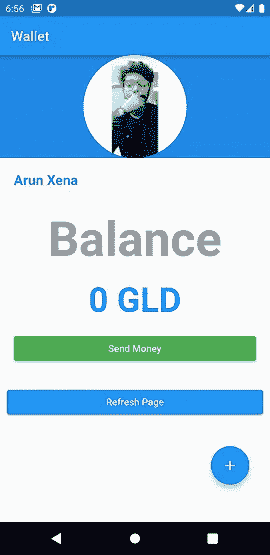

Home Page

如您所见，余额为 0 GLD，因为用户还没有代币，为了发送 GLD 代币，用户必须单击右下角的浮动操作按钮并创建一个钱包。

Wallet Creation Page

在实际编写钱包逻辑之前，我们需要更多的包来添加到我们的应用程序中。

我们需要的第一个包是 **web3dart** ，它是一个 dart 库，用来与以太坊区块链进行交互。它连接到以太坊节点来发送交易，与智能合约交互等等。

 [## web3dart | Dart 包

### 一个 dart 库，用于连接以太坊区块链并与之交互。它连接到以太坊节点发送…

公共开发](https://pub.dev/packages/web3dart) 

我们需要的第二个包是 **bip39。BIP39 是加密钱包中常见且有用的标准。BIP39 定义了钱包如何创建种子短语和生成加密密钥。它由两部分组成:生成助记符并将其转换为二进制种子。该种子可在以后使用 BIP-0032 或类似方法来生成确定性钱包。**

 [## bip39 | Dart 包

### 比特币 BIP39 的 Dart 实现:用于生成确定性密钥的助记码从 bitcoinjs/bip39 转换…

公共开发](https://pub.dev/packages/bip39) 

我们需要的第三个包是 **ed25519_hd_key** 也就是一个公钥签名系统。

 [## ed25519_hd_key | Dart 包

### ed25519 曲线的 BIP-0032 式推导

公共开发](https://pub.dev/packages/ed25519_hd_key) 

我们需要的最后一个包是 **hex** ，它使用 dart:convert API 对十六进制进行编码和解码。

 [## 十六进制|镖包

### 使用 dart:convert API 实现简单的十六进制转换。

公共开发](https://pub.dev/packages/hex) 

安装完这些包后，我们需要创建一个抽象类，它将为我们的钱包生成助记符、私钥和公钥。

**助记短语**——一组容易记住的单词——用于在钱包受损、丢失或毁坏的情况下，作为找回钱包和硬币的备份。这也被称为助记种子、种子短语、恢复短语、钱包备份、主种子等。

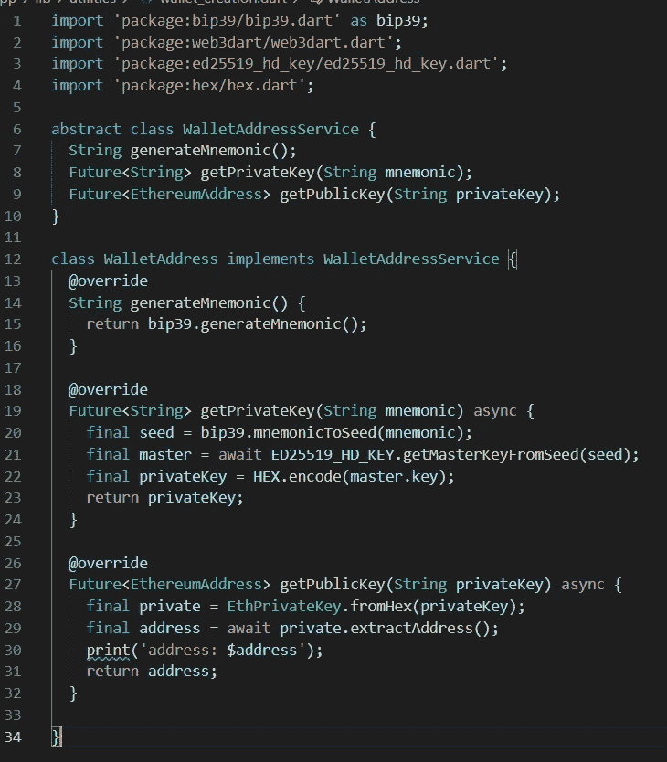

WalletAddressService()

我们创建了一个抽象类 **WalletAddressService()** ，它有三个函数， **generateMnemonic()** ， **getPrivateKey()** 和 **getPublicKey()。**

**generateMnemonic()** 函数使用 bip39 库生成助记符并返回。

**getPrivateKey()** 函数使用 bip39 将助记符转换为种子，然后使用 ED25519_HD_KEY 从种子生成主密钥。然后，我们使用十六进制库对主密钥进行编码，以获得我们的私钥，然后返回该私钥。

函数 **getPublicKey()** 将私钥作为参数，并将私钥十六进制转换为以太坊私钥。然后，它从私钥中提取公钥并返回它。

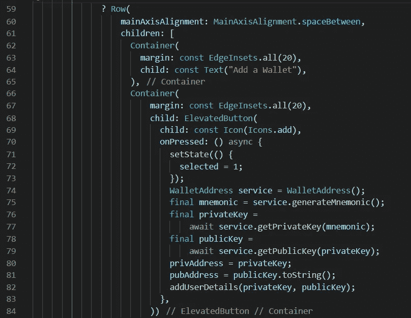

CreateWallet Page

当按下“添加钱包”按钮时，我们调用所有三个函数，并将助记符、私钥和公钥存储在一个本地变量中。然后我们调用另一个函数 **addUserDetails()** ，它将私钥和公钥存储到 firebase firestore 中的用户数据库。

addUserDetails() and getUserDetails()

**addUserDetails()** 函数将私钥和公钥作为参数，并使用 FirebaseFirestore 实例创建一个名为“users”的集合，我们将在其中存储当前用户的用户名、私钥、公钥和标记 wallet_created，以了解用户是否已经创建了一个钱包。

**getUserDetails()** 检索用户创建钱包时创建的用户钱包信息。

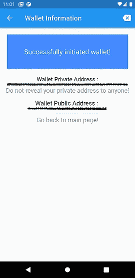

Wallet Information

Cloud Firestore 是一个面向文档的 NoSQL 数据库。没有表或行，数据存储在文档中，文档被组织成集合。每个文档都包含一组标识文档的键值对。这些键值对针对存储大量小文档进行了优化。

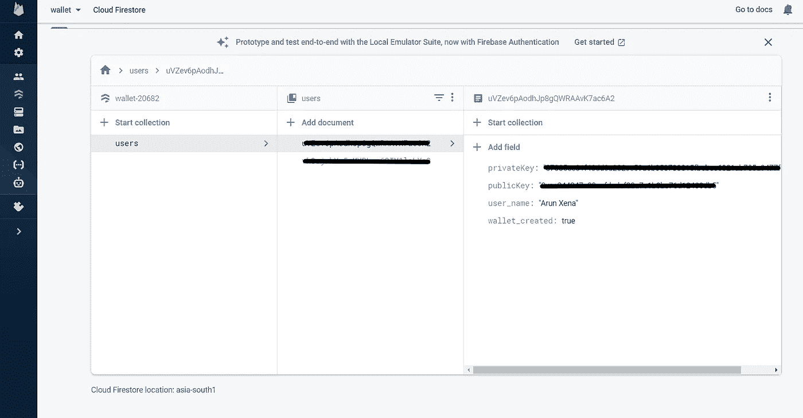

Firestore Database Structure

既然我们已经有了钱包所需的所有细节，我们就可以将代币从一个钱包转移到另一个钱包了。我们需要通过我们的钱包 Dapp 与智能合约进行交互，以转移令牌。我已经写了一篇文章，详细介绍了如何创建一个简单的 Dapp，**请阅读这篇文章，了解这篇文章的其余部分，介绍如何获得合同的 ABI 文件，以及如何编写与合同交互的函数。**

 [## 利用颤振和坚固性的简单 Dapp

### 创建一个简单的 flutter Dapp，它可以与部署在以太网上的智能契约进行交互。

medium.com](/geekculture/simple-dapp-using-flutter-and-solidity-b64f5267acf4) 

您需要设置一个 Infura 帐户，以便为您的 Dapp 提供一个 API 来与我们部署合同的 **Rinkeby** 测试网络进行交互。上面的文章给出了所有的设置细节。

在编写与契约交互的函数之前，我们需要初始化一个 http 客户端和 web3client。

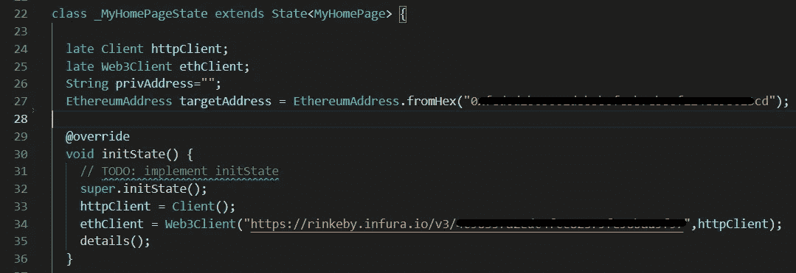

httpClient and web3Client

将 Infura 为 Rinkeby network 提供的链接粘贴为您的 Web3Client。注意，在这个示例程序中，我们提供了一个目标地址，也就是我们要向其发送令牌的目标用户的公钥。但是您可以在 Dapp 中提供一个输入字段来自己填写地址。

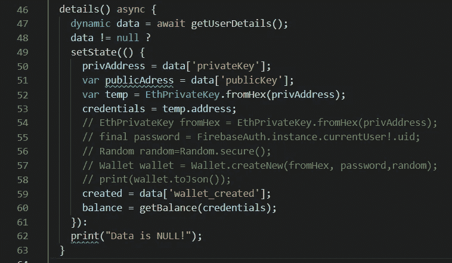

details() function

**details()** 函数从 firebase firestore 数据库中检索当前用户的钱包信息，并将其传递给 **getBalance()** 函数，从这里我们可以获得当前用户的余额。

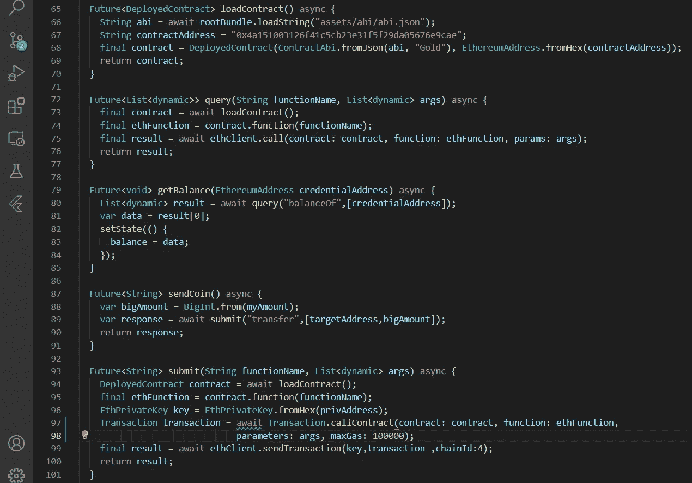

Functions to interact with the contract.

**loadContract()** 函数在 ABI 文件和契约地址的帮助下加载已部署的契约。

**query()** 函数接受函数名和参数，并与契约进行交互，以调用我们提供的带有参数的函数。

> 请注意，区块链上的交易需要汽油费，您需要确保采取必要的措施来处理用户交易的汽油费。

> 因为我们正在制作一个简单的 Dapp，所以我们事先将测试醚发送到用户的汽油费帐户，以便用户可以无误地交易 ERC-20 代币。

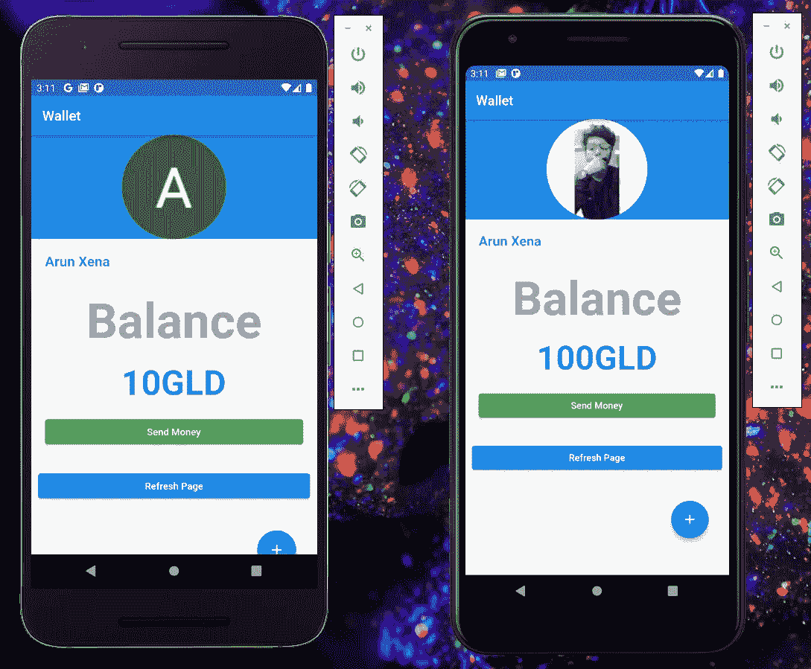

在这里，我用两个不同的钱包创建了两个不同的用户，我从合同所有者地址向其中一个帐户发送了 100 个 GLD 代币。

Etherscan Information. (100 GLD tokens from contract owner address to the user address)

现在，我们将从一个用户向另一个用户发送一个已经设置好的金额。

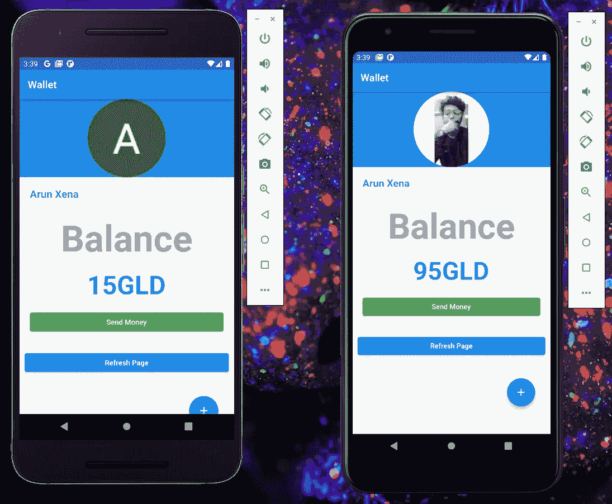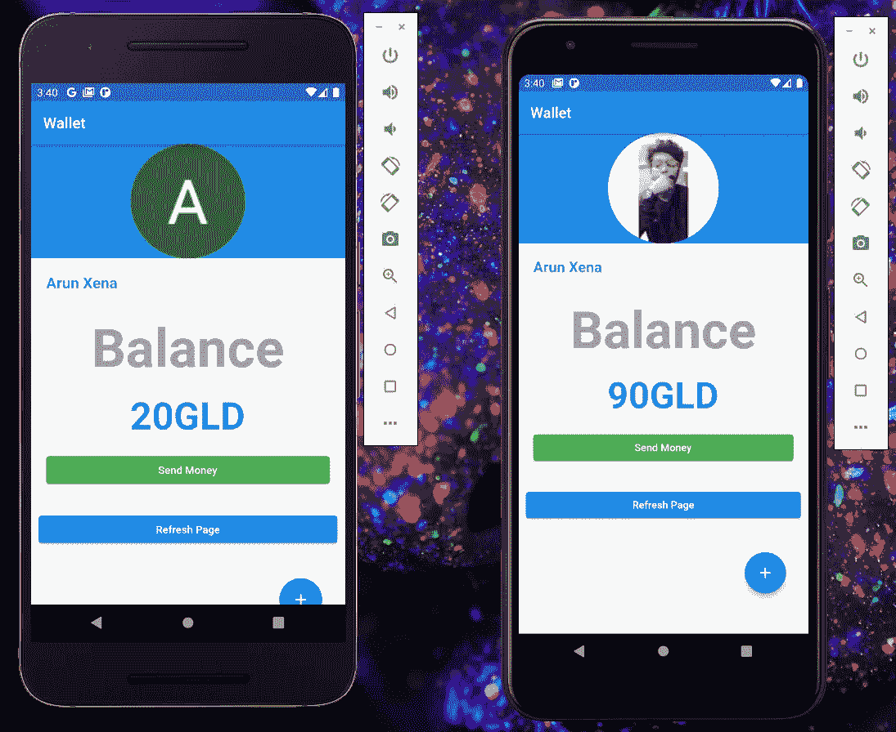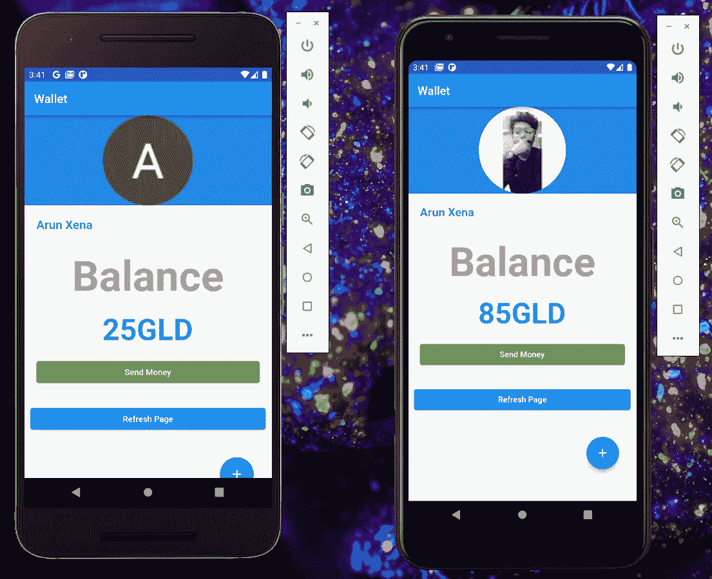

注意，我已经在代码中设置了从一个用户转移到另一个用户的令牌数量。您可以修改代码，以便用户可以输入要转账的金额。记得在转移硬币之前把 int 转换成以太坊兼容的 BigInt。

Convert amount

你可以查看 Etherscan，查看你的钱包地址的交易历史和详细信息。

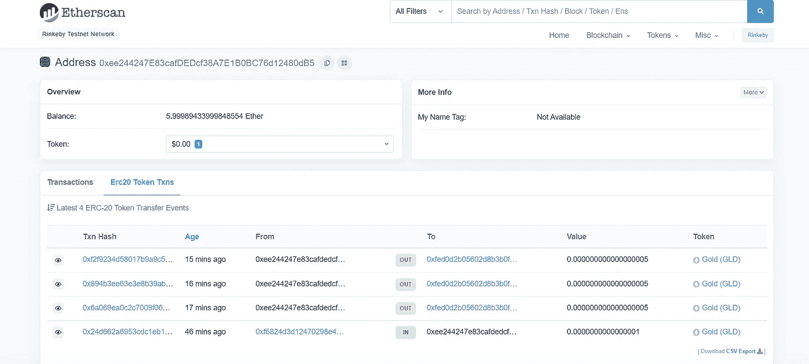

# 完全码

您可以在我的 GitHub 上找到本文的完整代码。请在 Medium 和 GitHub 上关注我！

 [## GitHub-tion x3na/Crypto _ Wallet:Crypto Wallet-个人项目

### 一个新的颤振项目。

github.com](https://github.com/tionx3na/crypto_wallet)