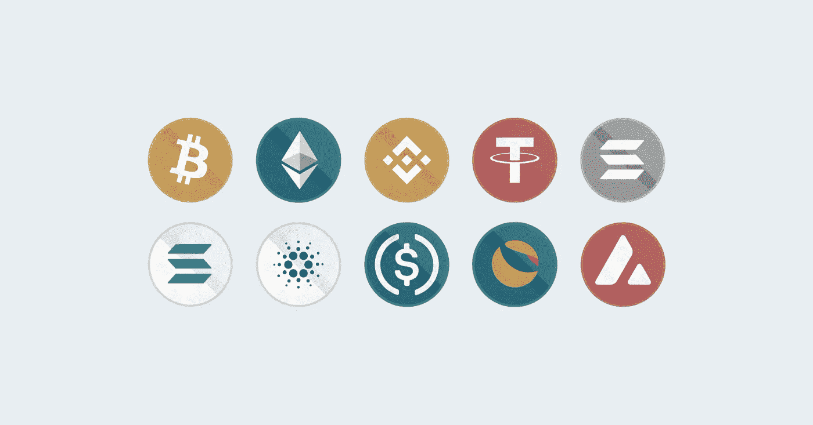
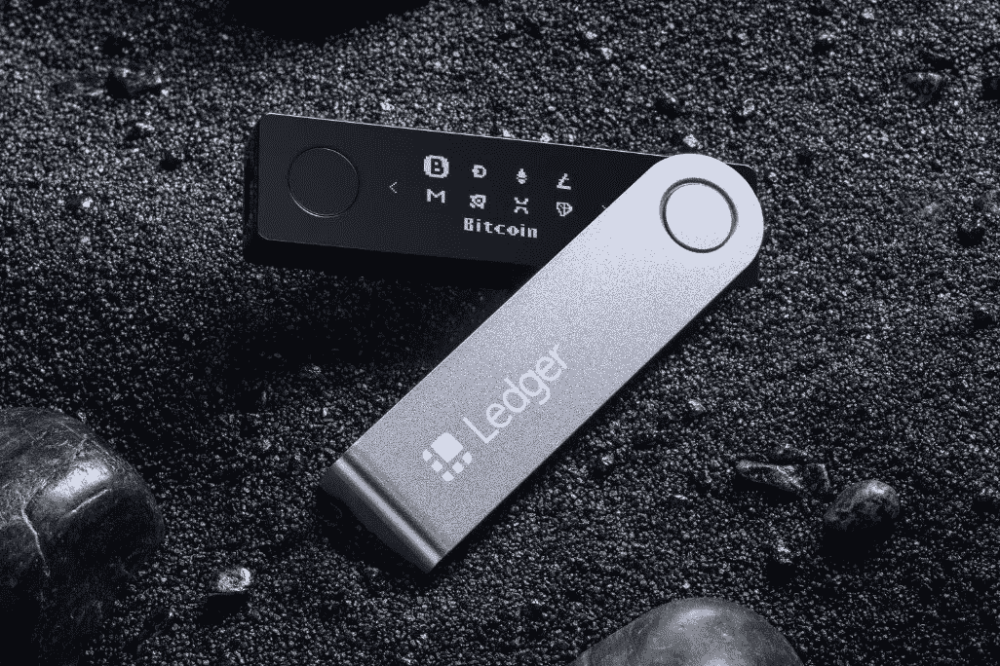
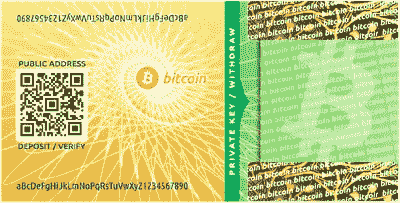

# 虚拟加密货币

> 原文：<https://medium.com/geekculture/cryptocurrency-for-dummies-8a99222ee0cc?source=collection_archive---------13----------------------->

## 你的朋友或家人一直在谈论的比特币，你也能理解。

Source: [n26](https://n26.com/en-eu/blog/types-of-cryptocurrency)

有没有想过加密货币的热门话题是什么？欢迎你来了解。

每天，技术都在不断改变和改善我们交换价值的方式，无论是在工作场所、学校还是市场。我们已经看到了从现金社会向无现金社会的转变，纸币以数字形式存储，方便了各方之间的分发和转移。

更重要的是，我们正在经历无现金经济的另一个方面——加密货币时代。加密货币几乎是一项新技术，对一些人来说，它们可能令人生畏。但事实是这样吗？

# 什么是加密货币？

一种[加密货币](https://en.wikipedia.org/wiki/Cryptocurrency)是一种数字资产，旨在充当交易媒介。资产的所有权使用加密技术记录在分类账(计算机化的数据库)中，以保护交易记录，控制附加部分的创建，并验证所有权的转移。

加密货币这个名字是密码学和货币的结合。有了密码术，高等数学被用来保护人们的资金，确保只有他们才能花掉它。

像法定货币一样，我们可以使用加密货币在商店购买食品，在餐馆留下小费，从[电子商务商店](/swlh/the-growth-of-ecommerce-2220cf2851f3)订购运动鞋，以及预订航班或酒店。你也可以把它寄给世界上任何地方的朋友和家人，支付薪水，购买公司股票，以及进行捐赠。

你可能认为加密货币像传统的在线支付提供商[一样运作，比如 Paypal、支付宝或 Payoneer。问题是，支付平台属于代表你持有你的钱的组织，直到你要求他们在你想花的时候转账。而加密货币没有中央权威。每个拥有所有权的人都可以充当运行自由软件的银行。也就是说，您、您的朋友以及许多其他人可以直接互动——不需要第三方！](https://techtimez.com/startups/top-10-fintech-companies/)

# 加密货币的好处

但是加密货币的有趣之处在于:

1.  它们是[分散的和无权限的](https://academy.binance.com/en/start-here)。由于每个加密货币持有者都充当着他们的银行，没有人能阻止你访问你的资产或按照你的意愿移动它们。另一方面，集中支付系统控制交易发生的时间、原因和方式。也就是说，如果他们认为有必要，他们可以冻结你的账户或者阻止交易。
2.  交易更便宜更快捷。无论地理位置如何，大多数加密货币交易都是即时发生的，而且成本只是国际电汇的一小部分。交易率低且快可能是因为[没有中间人和授权](https://www.investopedia.com/terms/c/cryptocurrency.asp)(如国际电汇)。
3.  除了低交易率，拥有(持有)加密货币相对更便宜，因为[持有者不需要支付与法定货币相关的传统银行费用](https://www.investopedia.com/ask/answers/100314/what-are-advantages-paying-bitcoin.asp)。没有账户管理费、最低存款余额要求、透支费和存款返还费。
4.  此外，加密货币网络的运行方式使得黑客或攻击者几乎不可能关闭它们——它们高度安全且具有抵抗力。

# 加密货币简史

那些不从历史中吸取教训的人注定会重蹈覆辙——这里是加密货币的简史。

在当今主流加密货币出现之前，[之前试图创造依赖于安全加密账簿的数字货币](https://www.forbes.com/sites/bernardmarr/2017/12/06/a-short-history-of-bitcoin-and-crypto-currency-everyone-should-read/)包括 Digicash 和 B-Money。

Digicash 是一种早期的加密电子支付形式，由美国密码学家 David Chaum 于 1985 年实现。它依赖于使用软件从银行提取钞票，并在转移到收款人之前指定特定的加密密钥。因此，允许发行银行、政府或第三方无法追踪数字货币。

1998 年晚些时候，戴伟发表了一篇关于 B-Money 的描述，其特征是一个匿名的分布式电子系统。2008 年，[当中本聪(一个人或一个团体的化名)发表了一份详细介绍比特币系统如何运作的白皮书](https://www.thebalance.com/history-of-cryptocurrency-5119511)时，这个概念完全浮现出来。该软件于 2009 年上市，比特币成为有史以来第一种加密货币。

比特币的诞生为许多其他加密货币提供了基础。有些是同一软件的衍生产品，而另一些则采用了不同的方法。但在我们讨论不同类型的加密货币之前，让我们谈谈你已经听说过很多次但还不知道它是什么的“区块链”吧。

# 区块链

不要被人们用来描述区块链的技术术语所困扰。

区块链只是一个数据库，包含一个不断增长的记录列表，称为块，使用加密技术进行链接和保护。数据库不一定复杂，您可以使用电子表格轻松创建它。每个块都包含一个链接到前一个块、时间戳和事务数据的哈希指针。最后，你会得到一连串的积木，或者人们喜欢称之为区块链。

需要注意的一点是，数据库是一个开放的分布式系统，每个参与节点(计算机)都有一个副本。

现有超过 7000 种加密货币(在撰写本文时)。有的比别人快，有的更私密。此外，有些更安全，而其他人很容易编程。加密货币一般有[四大类](https://learn.g2.com/types-of-cryptocurrency)。

# 工作证明

在区块链上，任何单个节点都不能单独向其添加记录。记录交易需要节点竞争解决代表交易数据的复杂密码问题。解决问题的第一个节点将解决方案广播给网络的其余节点进行验证。这个过程叫做挖掘；第一个得到答案的节点会得到区块链的奖励。

工作是节点解决问题的过程。证据是网络其余部分的验证。这使网络保持有效并得到所有成员节点的同意。此外，它保持网络固有的安全性和健壮性；折衷的唯一方法是让一个节点控制一半以上的节点。

尽管 PoW 是确保区块链中数据有效性的可靠算法，但它需要大量的计算能力才能运行。由于每个节点都必须处理每个事务，因此添加节点不会影响网络的速度或吞吐量。结果，电力网络不能有效地扩展。

最受欢迎的使用 PoW 的加密货币也拥有最高的市场资本(在撰写本文时):比特币(1 万亿美元)和以太坊(3600 亿美元)。

# 股权证明

电力系统有缩放问题；每个节点都必须验证每个事务。它催生了一种不同的共识算法(PoS ),允许较小的节点池来验证交易。

在 PoS 网络中，不是每个节点都验证每个交易。取而代之的是，参与节点参与(存放他们持有的加密货币)交易池(验证组)。作为证据，试图欺骗或向分类帐中输入不正确数据的节点会自动失去他们的股份。但是，那些按照规则运作的银行会收到存款利息，作为对其股份的回报。

通过设计，PoS 系统具有很高的处理速度，并且可以轻松扩展。然而，与 PoW 系统相比，它们往往安全性较低，并且随着时间的推移，存在分散化程度较低的风险。

就安全性而言，当参与者的股份高于其潜在利益时，他们失去股份的风险就会产生。但是，如果一个节点可以在分类账中输入高于其股份的欺诈性交易，那么做正确事情的激励就会消失。

随着时间的推移，加密货币持有量高的参与者可以加入更多的交易池，获得更多的利息奖励。这可能会产生滚雪球效应，最有影响力的节点最终主宰网络。

目前，使用 PoS 共识模型的最受欢迎的加密货币是 Cardano、Polkadot 和 Algorand。然而，以太坊——战俘领域的一个大玩家——正在向 PoS 区块链迁移。

尽管存在其他散列算法，但 PoW 和 PoS 是用于验证区块链交易的最流行的一致算法。但是，哈希算法并不是加密货币分类的唯一标准。

此外，还需要考虑市场上产品的用途。这就把我们带到了加密货币的下一个主要类型:代币。

# 代币

与传统的加密货币不同，代币不是通用货币，并且[没有区块链](https://www.bitdegree.org/crypto/tutorials/types-of-cryptocurrency#tokens-for-dapps)。它们在以太坊或币安智能链(BSC)等现有区块链上运行，不能作为独立系统运行。虽然代币代表具有实际价值的资产，但将它们转换为法定货币只能通过它们所在的区块链的本地加密货币来完成。

通常，令牌在建立在区块链上的 [DApps](https://academy.binance.com/en/glossary/decentralized-application) (分散应用)上运行。因此，令牌交易仍然需要区块链上的节点进行验证。因此，支付交易费用是使用区块链的本地加密货币完成的。

例如，NFT 的一个市场通过一个名为$BAKE 的代币——DApp 面包店——WAP，方便数字艺术家出售他们的艺术作品。$BAKE token 在 BSC 上作为智能合约运行，不能直接转换为法定货币。收到$BAKE 付款的艺术家可以将其兑换成$ BNB——BSC 的本地加密货币——直接与法定货币兑换。

代币非常适合建立在现有区块链基础上的单一用途应用，以在流动性差的市场中提供流动性。但是，它们依赖底层区块链进行交换和验证。这意味着底层网络中的任何变化都会影响其上构建的所有令牌。例如，以太坊向 PoS 的转变会影响——从技术上说——在其网络上运行的智能合约。

目前在世界上引起很多兴趣的几个加密令牌包括 Tether(USDT)、UNI WAP(UNI)、PancakeSwap(蛋糕)和基本注意力令牌(BAT)。

# 稳定的硬币

是的，你猜对了！

稳定币是一种加密货币，其[价值(价格)反映了法定货币或交易所交易商品](https://en.wikipedia.org/wiki/Stablecoin)。此外，一种稳定的硬币可能与另一种加密货币的价值相匹配。它们是标准加密货币和代币的混合体；它们建立在现有的区块链基础上，但可以兑换法定货币。

像比特币和以太坊这样的传统加密货币波动性很大。因此，它们的价值(价格)会在短时间内大幅波动，这使得它们非常不稳定且难以管理。与标准加密货币不同，稳定货币提供稳定可靠的价值储存。他们通过将价格与一种或多种稳定资产(法定货币或交易所交易商品)挂钩，并将挂钩资产的储备作为加密货币价值的抵押品来实现这一点。

例如，一些加密货币交易所将 USDT 作为投资者的默认储值手段。它鼓励投资者买卖加密货币，并消除了撤回其持有以避免损失的需要。

即使稳定的硬币更加可靠和稳定，它们也有灭绝的危险。由于没有政府支持，硬币持有者依赖支持他们的公司进行适当的管理，并保持现金储备以保证其价值。

除了占 stablecoins 市值约 60%(在撰写本文时)的 Tether 之外，其他知名的 stablecoins 还包括 USD Coin(＄USDC)、USD(＄BUSD)和 DAI(＄戴)。

不同类型的加密货币比我们目前讨论的要多。这是一个多样化的市场，资产属于一个或多个群体——其中一些不受欢迎。但我们讨论的四种类型是大多数加密货币的基础。

# 加密货币钱包

到目前为止，很明显，加密货币只在区块链上以数字形式存在，不像法定货币那样有物理形式。没有任何银行或第三方机构对你的资产负责。那么，你如何跟踪你的资产呢？

与普遍看法相反，加密货币只存在于区块链。然而，要与你的财产互动，你需要一个加密货币钱包。

一个[钱包](https://academy.binance.com/en/articles/crypto-wallet-types-explained)是一个工具——硬件、软件或物理媒介——促进与区块链的交互。它持有加密货币交易的公钥和私钥。私钥对进入区块链的“发送”交易进行加密。而公钥解密来自区块链的“接收”交易。

钱包为持有者提供一个地址——一个使用公钥和私钥生成的字母数字标识符。该地址唯一地标识了区块链上用于存放加密货币的位置。请注意，加密货币从未离开区块链——只是从一个地址转移到另一个地址。

# 冷热钱包

加密货币钱包主要有三种类型:软件、硬件和纸质钱包。然而，它们可以被称为热的或冷的，这取决于它们的功能。

热门钱包是任何连接到互联网的加密货币钱包。它们是最受欢迎的钱包，因为它们相对容易使用和存取。现有的大多数软件钱包都属于这一类。

另一方面，冷钱包没有连接到互联网。他们使用物理介质离线存储加密密钥。因此，它们非常安全，并且在线黑客攻击的风险更低。硬件和纸质钱包就是冷钱包的好例子。

# 软件钱包

软件钱包是一种存储加密密钥并简化与区块链交互的软件应用程序。大部分都是以热钱包的形式存在。

**1。网络钱包**

网络钱包允许通过互联网浏览器界面与区块链进行交互，而没有安装额外软件的开销。大多数集中式交换(CEX)平台和其他基于浏览器的钱包服务向它们的用户提供这种类型的钱包。

通常，当用户通过这些提供商创建帐户时，他们可以使用提供商提供的安全选项创建新的钱包。但是，一些提供商代表他们持有和管理私钥。即使很方便，特别是对于新手来说，也是不安全的。将您的加密密钥委托给第三方，存在管理不善和您的资产被盗的风险。为了应对这种不安全性，许多网络钱包现在允许用户完全或通过共享控制来管理他们的加密密钥——通过[多重签名](https://academy.binance.com/en/articles/what-is-a-multisig-wallet)。

**2。桌面钱包**

与网络钱包不同，你可以在电脑上下载并安装桌面钱包。桌面钱包提供对你的加密密钥和财产的完全控制。

生成新钱包时，您的私钥存储在本地计算机上，您会收到一个种子短语。如果您因意外或恶意软件损坏而无法访问钱包，种子短语可以方便地恢复您的私钥。因此，它应该被保存在一个安全和可访问的位置。

因为桌面钱包允许你离线保存你的私人密钥，所以你的财产被在线攻击者窃取的风险更小。一般来说，它们被认为比网络钱包更安全。

一些受欢迎的选项包括 [Exodus](https://www.exodus.com/) 和[比特币核心](https://bitcoin.org/en/bitcoin-core/)。

**3。手机钱包**

手机钱包的操作与桌面钱包非常相似，但只能在智能手机上运行。它们非常方便，适合执行日常交易:点对点支付、在线购物、账单结算以及在现实世界中消费加密货币。

像电脑一样，用密码加密你的钱包，并在你无法访问你的钱包时备份你的私钥(或种子短语)是很重要的。

现在使用最广泛的手机钱包有[比特币基地钱包](https://wallet.coinbase.com/)、 [Metamask](https://metamask.io/) 和 [TrustWallet](https://trustwallet.com/) 。

# 硬件钱包

硬件钱包是一种物理的电子设备，它使用 RNG(随机数生成器)来生成私钥和公钥，然后将它们存储在本地设备上。

Photo from [Ledger](https://www.ledger.com/ledger-nano-x-available-for-general-sale)

他们中的大多数是作为便携式 USB 闪存驱动器或其他没有互联网连接的外部设备存在的。正因为如此，硬件钱包非常安全，能够抵御在线攻击。但是，在与区块链交互时，它们往往不够用户友好，并且不适合执行日常交易。

为了克服可访问性的不足，一些分散式交易所(DEX)平台，如[币安 DEX](https://www.binance.org/) 、 [IDEX](https://idex.io/) 、 [AirSwap](https://www.airswap.io/) 允许直接连接到交易所进行交易。此外，Metamask 和 [Trinity Wallet](https://trinity.iota.org/) 等软件钱包也提供了类似的连接方法。

一些流行的硬件钱包选项有[总账](https://www.ledger.com/)和 [Trezor](https://trezor.io/) 。

# 纸质钱包

顾名思义，纸质钱包是一张包含区块链地址和私人密钥的纸，以二维码的形式打印出来。执行加密货币交易需要提取钱包上的信息。

Photo from [Wikimedia](https://commons.wikimedia.org/wiki/File:Sample_Bitcoin_paper_wallet.png)

一些纸质钱包服务允许你下载他们的代码来离线生成新的地址和密钥。因此，纸钱包是无恶意软件的，不具有任何在线攻击的风险，并且可以是冷存储的替代品。

然而，使用纸钱包是不合适的，危险的，不鼓励的。它们可能会被水浸湿或溅到，被风带走，弄皱，或扔进垃圾桶。

纸质钱包的另一个缺陷是，它们不适合部分转移加密货币，只能全部转移。例如，假设你有一个区块链的地址，里面有 10 美元。如果你决定花两个$ETH，你首先需要将十个 ETH 发送到一个软件钱包，花掉两个$ETH，并将剩余的八个$ETH 返回到一个纸质钱包。

# 备份钱包的重要性

对于所有加密货币钱包来说，失去访问权限可能代价高昂。

建议将您的私钥(或种子短语)备份到一个安全且可访问的位置。在发生事故或腐败的情况下，您可以使用您的私钥来重新访问您的财产。

# 投资加密货币

投资是对资产未来的长期押注，投资者基于资产的基本面进行这些押注，如其当前估值或与之相关的用例。尽管加密货币是一项新技术，也是一种独特的资产类别，但它们的运作方式类似。

与大多数投资形式一样，加密货币包含风险——甚至更大的风险！因此，投资加密货币需要仔细研究并做出明智的决定。

# 霍德林

大多数加密货币投资者遵循 HODL 哲学。 [HODLing](https://academy.binance.com/en/glossary/hodl) 是一种加密货币投资者拒绝出售其所持股份的做法，无论价格如何波动。他们如此相信加密货币的长期成功，以至于决定长期持有它。在熊市期间，尽管价格下跌，投资者拒绝出售加密货币是很常见的。

做一个霍德勒并不复杂。它只需要获得加密货币，并有一个可靠的存储介质来长期持有它。

获得加密货币最简单的方法是通过值得信赖的 CEX 平台购买，如币安或 T2 和比特币基地。CEX 平台有被攻击的风险，可能会让你失去投资。所以一般建议把你的持有量转移到一个冷钱包里。另一种方式是通过在 DEX 平台上交换资产，如 [Uniswap](https://uniswap.org/) 或 [PancakeSwap](https://pancakeswap.finance/) 。

# 用加密货币赚取被动收入

就像沃伦·巴菲特说的，“如果你在睡觉的时候没有找到赚钱的方法，你会一直工作到死。”足够好的是，一些加密货币提供了许多被动赚取收入的方式，包括采矿、赌博、借贷和农业生产。

# 采矿

本质上，挖掘意味着使用计算能力来保护网络并获得奖励，即使没有加密货币持有。这是加密货币领域最古老的被动收入形式。

即使在加密货币的早期，在普通 CPU(中央处理器)上挖掘也是一种可行的解决方案。随着哈希速率的增加，矿工们迁移到复杂的 GPU(图形处理单元)。今天，竞争很激烈，由公司主导，已经成为 ASICs(专用集成电路)——定制采矿芯片——的游乐场。挖掘比特币等加密货币现在是一项企业业务，而不是普通个人被动收入的可行来源。

虽然设置和维护采矿设备可能会很昂贵，并且对普通人来说需要一些技术专长，但也有一些负担得起的选择，比如云采矿。

云采矿涉及从专门的采矿场租赁采矿硬件，使个人能够在不拥有和维护采矿硬件的情况下被动赚取加密货币。作为交换，像 Ecos 或 Hashflare 这样的云开采提供商在他们的开采合同上收取维护费。

从历史上看，霍德林比云采矿更有回报。云开采合同的回报期可能需要一年或更长时间。在那段时间里，加密货币的价值可能会下降到不再有利可图的地步。在这一点上，采矿运营商取消合同。

# 立桩标界

如前所述，PoS 加密货币通过允许参与者在交易池中下注(贡献他们的资产)来验证其区块链中的交易。作为交换，他们从最初的存款中获得奖励。

简单来说，赌注意味着锁定加密货币供区块链使用，并因此获得奖励。从本质上讲，打桩比采矿需要的资源更少。因此，投资支持赌注的加密货币可以让投资者不费吹灰之力就能随着时间的推移增持。

在前面提到的被动收入策略中，霍德勒喜欢下注；回报激励他们继续持有他们的资产。

# 放款

对于那些喜欢亲自动手并有可能从所持资产中赚取高额利息的投资者来说，贷款是一个不错的选择。

存在像 [Celsius](https://celsius.network/) 这样的点对点借贷平台，允许你锁定一段时间的资金，然后收取利息。利率可以是固定的(由借贷平台设定)，也可以是动态的(基于当前市场利率)。

一些有融资融券业务的 CEX 平台向用户提供点对点贷款服务。此外，分散贷款是可能的，这些天通过 DeFi 贷款。

[DeFi](https://hedera.com/learning/what-is-decentralized-finance) ，分散金融的简称，是区块链技术(应用和项目)颠覆传统金融的生态系统。与集中式贷款平台不同，DeFi 贷款平台，如[复合](https://compound.finance/)和 [Aave](https://aave.com/) 基于智能合同支持的自主协议运行。此外，在 DeFi 贷款平台上，借款人直接从贷款人那里获得贷款，无需任何中介。

尽管贷款是霍德勒以最小的努力被动增加其持有量的理想方式，但将资产锁定在智能合同中会使他们面临错误风险。

# 高产农业

另一种在贫困地区被动赚取收入的方式是通过农业生产。

收益农业(也称为流动性开采)涉及将加密货币投入流动性池并获得回报。在收益农业中，流动性提供者负责向流动性池中添加资金。流动性池是一种包含资金的智能合约。作为向流动性池提供资金的交换，流动性提供者将获得回报。奖励可以来自于由基础 DeFi 网络或一些其他来源产生的费用。

一些流动性池用多种代币支付报酬。奖励可以存入其他流动资金池，以赚取更多的奖励，等等。

# 交易加密货币

交易是一种基本的经济活动，包括购买和出售资产。在某些情况下，交易需要交易方之间交换货物/服务。

在金融市场中，可用于交换的资产称为金融工具:股票、债券、法定货币、期权、期货、保证金产品和加密货币。

与其他金融工具不同，加密货币波动性很大。交易者试图利用市场波动。他们频繁进出头寸，每次交易可能会寻求较小的回报。

Photo by [Fru Kerick](/@frukerick) from [TechTimez](https://techtimez.com/technology/cryptocurrency-for-dummies-everything-you-should-know/)

一般来说，加密货币交易商依靠一种叫做[技术分析](https://academy.binance.com/en/articles/what-is-technical-analysis)的方法。即使这个技术很简单，它需要很大的努力去学习，特别是对新手来说。

要了解更多关于交易加密货币的信息，请务必查看币安的[指南](https://academy.binance.com/en/articles/a-complete-guide-to-cryptocurrency-trading-for-beginners)。

> ***您知道吗，您的年度中级会员可以节省 10 美元*** ***？点击*** [***此处***](https://frukerick.medium.com/membership) ***即可享受***[【*优惠****的同时。***](https://frukerick.medium.com/membership)

👉 [**跟我来**](https://frukerick.medium.com/) ，Fru Kerick。
👉 [**订阅**](https://frukerick.medium.com/subscribe) 让你永不错过一个故事。
👉 [**中级会员可节省 10 美元**](https://frukerick.medium.com/membership) 。**阅读** [无限故事](https://frukerick.medium.com/membership)。以后再谢我吧…

[Fru Kerick](https://frukerick.medium.com/?source=post_page-----8a99222ee0cc--------------------------------)

## 周日运动

[View list](https://frukerick.medium.com/list/the-sunday-movement-4ca3751173a0?source=post_page-----8a99222ee0cc--------------------------------)25 stories