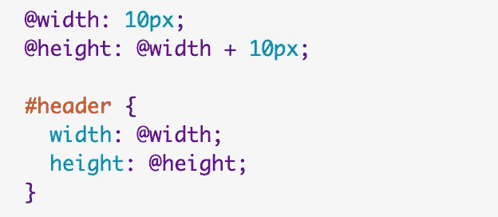

# CSS 预处理程序；揭开神秘面纱

> 原文：<https://medium.com/geekculture/css-preprocessors-unveiling-a-mystery-44a79d3c8f21?source=collection_archive---------67----------------------->

在软件工程和开发领域，要学习的主题的广度是如此之广，以至于有时会感觉像是没有尽头的海洋。因此，每周我都试图找到一个我不太熟悉的话题，并在这广阔的可能性海洋中创造一个知识孤岛。

这一周，我将仔细看看 CSS 的世界；特别是 CSS 预处理程序。它们到底是什么，以及这项神奇技术的几个用例。

预处理器本质上是 CSS 的一个框架，它允许你编写更灵活、更有逻辑、更强大的代码。正如我们所知，CSS 和 Javascript 一样，是互联网不可改变的支柱之一。它存在于我们所接触的每一个浏览器和网站中，如果没有它，任何网络应用程序都将在很大程度上瘫痪，或者至少相当难看。不幸的是，CSS 创建于 1996 年，缺少那一茶匙语法糖，而语法糖让大多数现代编程语言变得如此干净和易于使用。

> (作为题外话，当我们谈论 SE 世界中的每个人都应该知道的事情时；“语法糖”只是一种奇特的说法，它让你更容易、更流利地编写或阅读代码。好吃)

与我上周谈到的使用 transpilers 的框架非常相似，CSS 预处理程序生成流畅的、语法优美的代码，这些代码最终被编译成普通的 CSS，网站的 HTML 可以在浏览器上引用。

有一些不同的流行的预处理器，但是最流行的两个是 Sass 和 Less。我今天将谈论 Less 的几个关键特性，几乎完全是因为我更喜欢这个名字。也就是说，如果你喜欢无礼的声音，这里有一个链接，链接到他们同样强大的[文档](https://sass-lang.com/documentation)。

开始时，您只需键入:

```
npm install -g less
```

从那以后，Less 的所有特性都将起作用，只要您在样式表中使用正确的语法。

Less 最常用的特性之一是创建 CSS 变量的能力。也就是说，您可以将某个 CSS 属性保存在一个命名变量中，然后在所有样式表中重用该变量。那看起来像什么？这是 Less 自己文档中的一张图片。



So handy!

此时你可能会问自己“但是加布！如果我输入 CSS 变量的名称所花的时间和输入 CSS 属性本身所花的时间一样长，那为什么一开始就要这么麻烦呢？!"说得好，尊贵的读者。让我们做一个思维实验。

想象一下，你有一个客户非常喜欢洋红色。他们要求你为他们建造的网站上的每一个资产和元素都沐浴在宏伟的 magentine 色调中。现在想象一下，客户获得了新生，离开了令人兴奋的科技创业世界，在印度的某个地方建立了一个农场。董事会成员接手，他们讨厌洋红色。这让他们想起了反复无常的老创始人，他唯一真正的激情似乎是一个深陷吝啬洋红色泥潭的世界。所以他们要求按照他们的形象来重塑这一景象。二十种不同深浅的米色。

15 年前，在你的 CSS 样式表中搜索，并费力地从新的网页中找出任何洋红色的痕迹，这将是一场噩梦。另一方面，如果你用得更少，只需要敲几下键盘就可以改变你设置的颜色变量，变成你的新老板禁止的更柔和的色调。

CSS 变量的一个更强大的变体是 less 的人们所说的 mixin。使用 mixin，您可以将应用于给定类的一整套 CSS 属性一起传递给一个完全不同的选择器。例如，如果您刚刚制作了一束令人愉快的 CSS，可以编译成一张特别可爱的卡片，那么您可以通过简单地调用您在第一个类中使用的选择器，在另一个组件中重用所有精心制作的样式。语法上的一个亮点是在调用的类后面使用了一对 Javascript-eque 括号。

解析示例:

```
.new-class-styling{
    .old-class-styling()}
```

瞧，这个新类将继承你为上一个类设计的所有可爱的风格。

Less 使用的另一个巧妙技巧是嵌套。这里没有华而不实的功能特性，这个方面更多的是关于可读性。而对于普通 CSS，相同类型的 HTML 元素的不同类需要单独定位，在 less 中，您可以将元素类子集的选择器嵌套在更大的元素选择器中。这里有一个例子

```
p{
color: red; .big-p-elements {
    width: 500px;}}
```

正如您所看到的，如果您能够将一个

标签的每一次可能的迭代的所有样式都保存在一个地方，那么代码会变得更容易阅读和理解。

这就是我的一点点探索。如果你对它如何工作的更详细的分析感兴趣，请随意查看 Less [文档](https://lesscss.org/)，并保持关注，直到下周我进入另一个每个人都应该熟悉的软件工程领域。