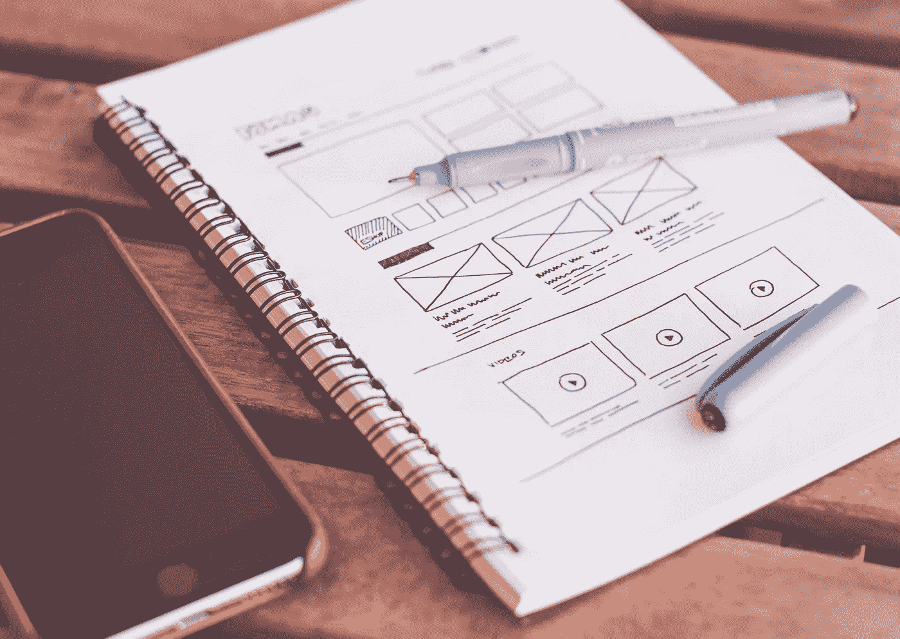
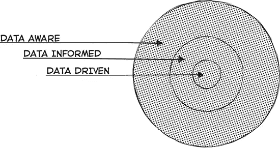

# 数据驱动设计及其对产品增压创新的影响

> 原文：<https://medium.com/geekculture/data-driven-design-and-its-impact-on-supercharging-innovations-in-products-8ca7fdc14221?source=collection_archive---------12----------------------->

说数据是新的石油是非常有趣的，但我们肯定要考虑这种说法似乎是正确的原因，因为没有正确使用数据，它是绝对无用的。

## **关于上述陈述的更多上下文:**

如果不能被可视化或解释，大量丰富的数据是完全没有实质意义的，这让我收集了一些历史数据；雇佣专门的资源来操纵数据并从中提取意义的想法始于 2001 年，当时克利夫兰(2001；波拉克 2012)。这为大学开辟了一条道路，通过开放数据科学机构和中心，正式将数据科学作为一种职业进行教学，从而开始促进数据科学领域的发展，例如伯克利的数据科学研究所、爱丁堡大学数据科学博士培训中心和纽约大学数据科学中心等。抛开过去，跳到十年后，数据科学已经成为每个行业的基本要素，许多作者将数据称为“未来的货币”，甚至将它比作黄金(Pollack，2012；Johnson，2012)让数据科学家成为这种新货币成功的不可或缺的一部分。Bakhshi & Mateos-Garcia (2014)将数据科学家定义为“使用统计、计算和其他学科的分析技术从新(‘大’)数据中创造价值的专家。”

> 作为一个非常以数据为中心的人，我非常想看到数据在创新中的应用和实现，甚至是产品的日常使用。本文将只关注三大资本，它们使得创新或日常产品具有使用吸引力。
> 
> 还需要注意的是，我更像是一个数据科学家(在这种情况下)，我帮助企业基于数据驱动的设计和经验来构建产品，这就是为什么我觉得我至少对这是如何工作的有一点了解+作为一名研究人员，我也使用真实世界的例子作为用例进行了大量研究，以了解这是如何工作的:)

> 数据+设计和设计师

数据科学可以定义为利用统计学、科学方法和机器学习模型的重叠领域从数据中提取意义和见解的分析。数据科学包括准备用于分析和处理的数据、执行高级数据分析以及呈现结果以揭示模式并使利益相关者能够得出明智的结论。

设计可以被视为一个坚实的计划，使我们能够达到我们想要的结果，无论这个结果是一个产品，服务，过程，甚至是战略。当一个设计以目标为导向，基于对数据的洞察，而不是一些随机的猜测时，它就被认为是一个“好的设计”。

设计者基本上利用所有可获得的信息，试图构建对情况的准确理解，目的是确定需要解决的挑战，以便达到预期的结果。设计师擅长使用定性研究方法来理解人类的需求和行为。

## 数据驱动设计

如果**你已经让**做了明确知道你的缺点是什么、你的目标是什么的工作，并且你有一个非常精确和明确的问题，你只是想抓住它，那么你就可以是数据驱动的。此外，这还假设你的方法和测量方法是测量声音，你想要回答的问题是知识将会证实的问题。这取决于对知识会带来的陷阱的敏锐理解，并采取措施纠正这些陷阱

计划理解数据驱动风格方法的设计师是一项非常重要的职业能力，因为投入到用户分析和测试过程中，理解什么是数据分析及其工作方式，为设计师提供了进一步的工具来敦促支持他们的概念。此外，它还允许他们制作最有效的可行产品，并提供数据来支持这一主张。

数据驱动的 UI 设计既是艺术也是科学。理解**的方法**收集和分析数据，并实现设计支持它是一个非常重要的能力，对于初学者和熟练的设计师都一样。

## 数据驱动设计是答案吗？

任何领域变得更加“数据驱动”的需求是人们越来越熟悉的需求。组织越来越依赖数据来辅助决策，包括关于设计和用户体验的决策。尽管术语“数据驱动的设计”在文献中已经变得流行，但 King 等人(2017)讨论了三种不同的方式来思考数据以及如何在设计流程中使用数据。他们讨论了熟悉的术语*数据驱动的*和*数据通知的*，并额外创造了术语*数据感知的*。

以下概述了从《用数据进行设计》一书中摘出的那些术语的定义:

*   **数据驱动设计:**数据决定产品的结果，企业可以优化对其主要指标的影响。当设计项目的目标明确，并且有明确的设计和研究问题需要回答时，数据驱动设计是最常见的。

*Laying out the relationship between “data-driven,” “data-informed,” and “data-aware” — data-driven answers well-targeted questions, where data alone can help drive decision-making.*

*   **基于数据的设计:**数据与其他来源一起使用，如战略应用、用户体验、直觉和竞争。以数据为基础的方法意味着它没有那么集中和有针对性，但数据是一个可以告知如何看待问题空间和做出决策的元素。

*Laying out the relationship between “data-driven,” “data-informed,” and “data-aware” — being data-informed allows you to understand how your data-driven decisions fit into a larger design space of what can be addressed.*

*   **数据感知设计:**通过这种方法，设计师意识到有许多类型的数据可以回答大量不同的设计和研究问题，而且设计师通常意识到在整个设计过程中他们可以使用不同类型的数据。

*Laying out the relationship between “data-driven,” “data-informed,” and “data-aware” — data-driven answers well-targeted questions, where data alone can help drive decision-making.*

我最近还从一篇关于[实现更好的用户体验设计](https://www.freecodecamp.org/news/4-ways-to-implement-data-for-a-better-user-experience-design/)的文章中发现了一个非常有趣的方法，叫做:

*   ***数据驱动的 UX*** *，* 作者将其定义为探索围绕数据本身的体验的机会——如何让数据更容易使用，如何从数据中获得更多价值，以及数据如何丰富我们的工作和生活。如今，许多科技公司的主要目标是创造以用户为中心的产品。因此，让设计和数据交织在一起，成为同一个开发周期的一部分是一个好主意。公司面临着跨渠道和平台为客户创造难忘体验的挑战。

## 这对作为设计师的你意味着什么？

我相信在设计过程中应用数据绝对不是为了取代设计过程和设计师已经做得很好的东西。它通过提供另一种方式来看待设计工作对用户的影响，来帮助设计师扩展这些东西的价值。A/B 测试不能回答所有的问题，但是它可以回答某些其他方法和实践不能回答的问题。事实上，我们认为你会发现使用 A/B 测试实际上与其他评估性设计过程非常相似。当正确应用时，它是创造性的、迭代的和赋权的。

不考虑数据(或以无效的方式使用数据)会对项目的成功产生严重的影响。如果你仅仅依靠直觉或最佳实践来做决定，而没有进行任何数据驱动的调查，你就冒着浪费金钱去改变无效(甚至有害)的设计选择的风险。

有效地使用数据可以直接改善业务成果。麻省理工学院数字商业中心[的研究发现](https://s3.amazonaws.com/files.technologyreview.com/whitepapers/Google-Analytics-Machine-Learning.pdf)“在使用数据驱动决策的行业中，排名前三分之一的公司平均比竞争对手的生产率高 5%，利润高 6%。”

有许多数据驱动的 UX 技术在投资回报率方面带来切实改善的例子。例如，2014 年，维珍美国航空公司[使用 A/B 测试](https://www.toptal.com/designers/ux/roi-of-ux-redesign-case-studies)重新设计了一个新的、反应灵敏的网站。这导致了:

*   转化率增加了 14%
*   支持电话减少 20%
*   客户通过各种设备预订的速度提高了近一倍

另一个[有趣的例子](https://www.toptal.com/designers/ux/e-commerce-responsive-web-design)来自电子商务网站 Music & Arts，它使用可用性测试和[启发式评估](https://www.springboard.com/blog/heuristic-evaluation-in-ux/)来指导网站重新设计。项目结束后，他们的网上销售额同比增长了约 30%。

以用户为中心的设计和用于理解行为的数据都集中在为企业或产品的预期和当前用户群建立有效、有益和可复制的用户体验上。我相信数据捕获、管理和分析是设计、用户体验和业务相关性之间的最佳桥梁。根据我之前的描述，这就是为什么我认为设计出色用户体验的*数据感知*方法比更常用的*数据驱动*术语更好地描述了我们渴望的东西，因为我相信数据会反馈到创造性的设计过程中，并且它本身是多样的和创造性的，提供了许多解决问题的可能方法。

但首先，让我们回顾一下我们对你是哪种设计师的一些假设:

*   你对打造卓越的用户体验感兴趣，并且有一些目标，包括改变或影响你的产品或服务的用户行为。
*   你对与你的产品相关的人类行为感到好奇，你已经在观察用户以及他们如何使用你的产品，即使只是非正式的观察。
*   你正在仔细考虑谁是你当前的用户，谁可能在未来成为你的用户。
*   你试图解决许多不同类型的问题，并确定什么对你的用户最有效。
*   虽然您可能没有统计学背景或者不是数据科学家，但是您有兴趣熟悉如何参与实验设计来检验您的想法。

我相信实验方法和它们产生的数据可以帮助磨练你的手艺，改进你的产品，并具体衡量你对用户的影响，最终对业务的影响。总之，我相信熟悉在互联网上进行的有大量用户的实验的方式，在那里你可以收集大量不同的数据类型——也就是说，大规模的实验——可以帮助你的设计实践。最后，我认为优秀的设计和智能数据实践是任何企业产生战略影响的关键。

# 结论

在理解了什么是数据驱动的设计和它的过程之后，实际上在你的设计中使用数据也有其黑暗的一面。

许多设计师陷入了总是试图优化数据的陷阱，而忘记了一个更广泛的画面，这可能会导致更糟糕的用户体验，并从长远来看损害品牌形象，因为在你的直觉和经验证据之间保持健康的平衡。你必须下意识地学习微妙的艺术，知道什么时候依靠什么。因此，从根本上说，当数据不能给你一个非常明确的答案，或者你需要将许多不同的片段缝合成一个和谐的整体时，你可以随时相信你的专业知识、直觉和直觉。

> **了解数字，但不做数字的奴隶。**

毕竟，数据可以提供信息，但设计师需要添加秘密成分，让设计变得生动。这个人的因素才是真正推动创新的，而数字只能激发或给出一些有用的见解。

如果你最终看到了这个结尾，这是一个免责声明，这篇文章是结合人类和人工智能(GPT-3)创作这样的文章的纯实验，所以如果你读到任何感觉有点“机器人化”的段落，那肯定是我仍在努力完善的东西，但如果不是，你可以为我的模型的出色工作鼓掌:)

我将分享一个名为 [**Lucidicity**](https://luciditycity.substack.com/) 的新通讯系列，它将专注于简化和清晰地表达科技领域的流行词汇，所以你可以通过下面的链接订阅以了解更多信息。

[https://luciditycity.substack.com/](https://luciditycity.substack.com)