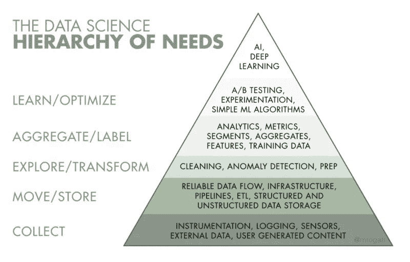

# 数据工程

> 原文：<https://medium.com/geekculture/data-engineering-52a6e2345381?source=collection_archive---------19----------------------->

## 这篇文章提供了对什么是数据工程师以及他们的各种角色和职责的基本理解。

我们对“数据科学家”这个术语着迷已经很久了。我们知道它们如何改变了我们周围的生态系统。例如，[数据科学正在帮助网飞节省数十亿美元](https://www.fool.com/investing/2016/06/19/how-netflixs-ai-saves-it-1-billion-every-year.aspx)。从亚马逊通过他们的推荐引擎帮助我们更好地购物，到无人驾驶汽车，人工智能和数据科学正在改变全球的 IT 行业。但是数据工程师呢？对他们的大肆宣传是怎么回事？他们是谁？

# 什么是数据工程？

让我们借助一个例子来理解数据工程。假设一家公司决定开发一个关于票价预测的功能。它需要预测特定航班/火车的价格何时会下降，并通知用户。计算机程序做出这种预测需要什么条件？

现在，我们所有人都在生活中的某个时刻订过机票或火车票。从那次经历中，我们知道离出发日期越近，机票就越贵。也就是说，如果我们计划在临近新年的时候去一个热点地区度假，那么圣诞节前后的价格往往会更贵(或者机票甚至都买不到)。

这种经验每天都在指导我们，告诉我们，随着旅行日期的临近，机票价格可能会上涨，所以我们应该尽早订票。对于构建预测程序来说，它需要数据(就像我们需要来自过去经验的信息一样)。

既然我们已经知道计算机需要过去的信息，那么这些信息就需要存储在某个地方。然而，不仅需要存储这些信息，还需要有人来处理这些信息，并确保每当计算机需要进行预测时，它都能够以有效的方式进行预测。那个“某人”是数据工程师。在某种程度上，数据工程师是数据科学的推动者。

# 数据工程的历史

有趣的是，数据工程是一个最近创造的术语。在 20 世纪 80 年代,“信息工程”一词被创造出来，主要用来描述数据库设计，并包括数据分析中的软件工程。在 20 世纪 90 年代和 21 世纪初互联网兴起后的某个时候，“大数据”出现了。然而，数据库管理员、SQL 开发人员和在该领域工作的 IT 专业人员当时并没有被贴上“数据工程师”的标签。

在过去十年中，大多数公司都实现了数字化转型。这不仅产生了难以想象的大量新型数据，还以更高的频率产生了复杂得多的数据。例如，脸书和 Airbnb 等公司可能拥有大量数据；以前很明显，需要数据科学家来理解所有这些数据，但不太明显的是，需要有人来组织和确保这些数据的质量、安全性和可用性，以便数据科学家开展工作。这些公司的软件工程师现在需要以一种专业的方式来处理如此大量的数据。

“数据工程”这个术语是用来描述一种角色，它不再使用传统的 ETL 工具，而是开发自己的工具来处理不断增长的数据量。随着大数据的增长，“数据工程”开始描述一种深入关注数据的软件工程，即数据基础设施、数据仓库、数据挖掘、数据建模、数据处理和元数据管理。

# 数据工程师的角色和职责

Data Collective 的股权合伙人莫妮卡·罗加蒂(Monica Rogati)创建了现在著名的数据科学需求层次结构。它描绘了数据工程在成为数据科学/人工智能驱动的组织的路线图中所处的位置。

数据工程师的角色位于该层次结构的第 2 级和第 3 级。值得注意的是，底层的“收集”规模越来越大，从而推动了对更多数据工程师的需求。

从图表中我们可以推断，数据工程师负责将收集到的数据移动到可以处理数据的位置。

这样，我们可以说，数据库工程师需要擅长设计管道(以便移动/存储数据)，他们应该能够为数据科学团队提供干净的数据(通过探索/转换接收到的数据)。

# 数据工程师的迫切需求

LinkedIn 的 [2020 年新兴工作报告](https://business.linkedin.com/content/dam/me/business/en-us/talent-solutions/emerging-jobs-report/Emerging_Jobs_Report_U.S._FINAL.pdf?src=aff-ref&veh=jobs_aff_ir_pid_10078_plc_Skimbit%20Ltd._adid_615074&trk=jobs_aff_ir_pid_10078_plc_Skimbit%20Ltd._adid_615074&clickid=1iXRZOxajxyOT1q0UfQwQyYMUknyqszLSSUfUU0&irgwc=1)和 Hired 的 2019 年软件工程师状况报告将数据工程工作与数据科学和机器学习工程并列。这是为什么呢？为什么公司准备花钱请好的数据工程师？

同样值得注意的是，Gartner 和 IBM 等公司透露，他们的大多数大数据和人工智能项目从未投入生产。他们提到的原因是缺乏适当的数据基础设施。这是什么原因呢？

这都是由于当前 It 世界的趋势。大多数公司都在努力成为人工智能驱动的公司。为此，他们收集大量实时数据，并将其存储为原始日志(以日志文件的形式)。原始日志是非结构化的，因此管理它们需要专业工程师(数据工程师)。这些公司需要工程师来清理这些原始日志并创建管道，以便将它们收集在一个位置。

此时需要数据工程师的另一个原因是很难找到好的数据工程师。一个好的数据工程师需要对系统架构有很好的理解，并且应该精通数据模型。这些技能需要对数据库和系统有更深的理解。

# 结论

在这篇文章中，我试图简单地解释数据工程。我讲述了数据工程师的角色，从哪里开始，包括什么，以及数据工程与数据科学的关系。这篇文章还简明扼要地介绍了数据工程师的历史和关键需求。

为了更深入地了解数据工程，请点击下面的链接:【https://quanthub.com/what-is-data-engineering/ 