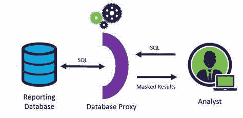

# Azure 中的数据屏蔽和加密

> 原文：<https://medium.com/geekculture/data-masking-encryption-in-azure-9adda124385a?source=collection_archive---------14----------------------->

在过去的十年中，数据泄露和敏感数据丢失的新闻屡见不鲜，影响到存储敏感公共信息的所有类型的组织，如银行、保险公司，甚至政府机构。这促使组织更深入地审视其数据治理和安全策略，以确保降低数据泄露的风险。

实施的这些安全策略需要降低潜在数据泄露的风险，并考虑在泄露发生时会发生什么。如果确实发生了这种情况，则可能会实施一些方法，使黑客或访问数据的第三方无法使用这些数据。

数据泄露并不总是恶意的或由个人恶意发起的，在某些情况下，这可能是由于质量保证和开发团队没有发现的编程错误、数据民主化的不当实施，以及在某些情况下云提供商的错误。那么这种威胁的解决方案是什么呢？**它的数据屏蔽和加密。**

**数据屏蔽**是一种数据安全措施，通过用字符或数字替换数据子集来混淆敏感数据。这实质上生成了一段全新的数据，其中可能包含原始数据的元素，但是将其恢复为原始数据的可能性很低。

Azure 提供了多种方式来实现数据屏蔽。这种实现在结构化数据上更容易，因为非结构化信息的性质使屏蔽过程变得复杂。在 Azure 中，屏蔽被设置为通过 REST API 实现的策略。屏蔽策略被设置为应用于整个 Azure SQL 实例。

有两种主要类型的数据屏蔽:

*   动态数据屏蔽
*   静态数据屏蔽

对于本文，我们将重点关注动态数据屏蔽，因为它在 Azure 中使用得更为突出。

**动态数据屏蔽—** 这种形式的屏蔽使管理员能够确定他们希望对数据应用何种级别的模糊处理。在未授权访问的情况下，数据对访问方没有任何价值。在 Azure 中，屏蔽策略使用屏蔽功能应用屏蔽。

屏蔽功能通常基于数据的性质来应用。屏蔽功能的例子有:

*   默认-基于数据类型的掩码，例如，包含四个或更少字符的字符串将全部替换为 X，包含四个以上字符的字符串除四个字符外将全部替换为 X，对于数字数据，它们的子集将随机替换为零。
*   信用卡—仅显示信用卡/借记卡的最后四位数字。这可以在网上购物时看到，甚至可以在购物的打印收据上看到。
*   电子邮件—将首字母替换为 X，并将电子邮件的域部分也替换为 X。
*   随机数—这种特定的方法将根据指定的参数生成随机数。
*   自定义文本—此方法公开字符串的第一个和最后一个索引，并允许管理员自定义用于不同于 X 的填充，或者使其尽可能复杂。

总的来说，这里的目标是创建数据的替代版本，即使获得，也不会授予个人访问敏感信息的权限。

**数据加密**根据加密代码/密钥改变数据的性质，并允许另一个用户根据解密密钥查看数据的初始状态。

Azure 提供加密作为两个选项之一:

*   服务器端加密
*   客户端加密

对于本文，让我们关注服务器端加密。

**服务器端加密—** 这主要是在数据存储到 Azure 之前对其进行加密，本质上是保护静态数据。在 Azure 中，每个对象都用唯一的密钥加密。

有三种类型的服务器端加密:

*   *使用服务管理密钥的服务器端加密* —在这个场景中，Azure 资源提供商执行加密和解密操作，微软负责管理密钥。
*   使用 Azure Key Vault 中客户管理的密钥进行服务器端加密 —在这种情况下，Azure 资源提供商通过 Azure Key Vault 执行加密和解密操作，客户控制密钥。
*   *在客户控制的硬件上使用客户管理的密钥进行服务器端加密* —在这种情况下，Azure 资源提供商在客户控制的硬件上执行加密和解密操作以及客户控制密钥。

客户可能希望保持对其密钥的控制，因为这使他们能够完全控制所使用的根密钥，并能够在一个主密钥下加密服务。

上面提到的 Azure Key Vault 是一个基于云的服务，它安全地存储数据或秘密，并且可以使用该数据和秘密安全地访问。这是 Azure 提供的替代服务，完全专注于增强密钥的安全性。

**参考**

*图片:*[https://www . fujifilm . com/fbmm/en/Insights/Article/Is-your-Data-Security-keing-you-up](https://www.fujifilm.com/fbmm/en/Insights/Article/Is-your-Data-Security-keeping-you-up)