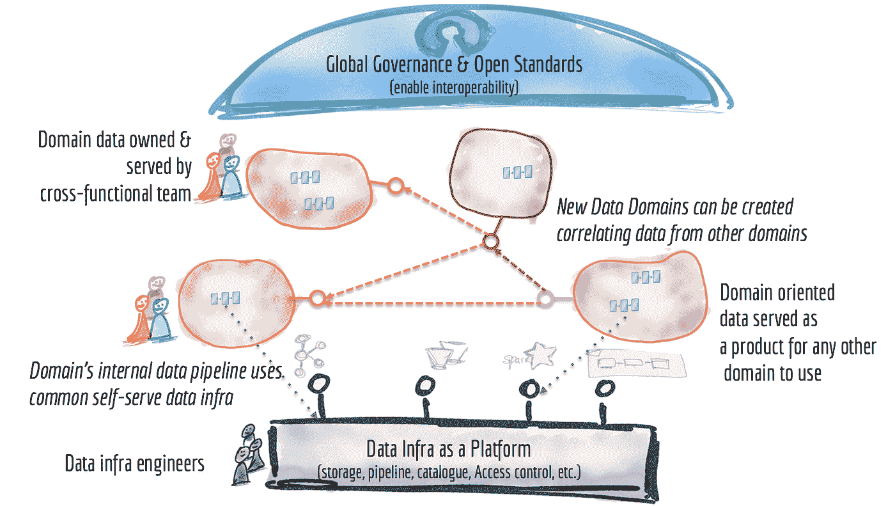
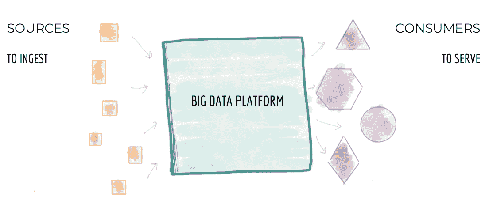

# 数据网格:对数据产品团队和业务成果的影响

> 原文：<https://medium.com/geekculture/data-mesh-implications-for-data-product-teams-and-business-outcomes-15ef10f930b1?source=collection_archive---------5----------------------->

[*Data Mesh architecture from 30,000-foot view*](https://martinfowler.com/articles/data-monolith-to-mesh.html)

您是否正在评估数据网格是否非常适合您的组织？那么，就有必要看看这篇关于业务而非 it 将如何加速数据货币化的简短文章。我们将深入探讨围绕业务成果统一 IT 和业务团队的数据战略。

本次讨论的核心是强调数据网格框架和无代码/低代码可视化工具在使没有编程经验的业务用户能够应用其领域专业知识来产生业务成果方面发挥关键作用的概念。

你能提出一个战略，让你的业务团队成为你组织中的数据管家吗？为此，您的目标变成了如何实现业务和 IT 团队之间的协作。

不是这个部门会加速你公司的数据货币化；这是你的业务团队。那些在业务部门工作的人可能没有深入的编程专业知识，所以你必须降低你组织中数据分析和科学的门槛。

这通常是通过低代码/无代码工具来完成的，如 [KgBase](https://bit.ly/kg-base) 和云平台，它们促进了整个组织的数据民主化。一旦就位，您将需要确定您将如何保护您的数据，这意味着建立数据治理策略并分配适当的数据所有权(我将在最后简要介绍)。

[Obstacles that delay analytics cycle time](https://datakitchen.io/what-is-dataops/)

# **尽可能多地委托给云提供商**

数据准备、ETL 和多个系统之间的集成占据了项目成本的 70%。在集成不同解决方案或基础设施上花费的每一个小时都是在数据货币化和商业价值创造上的时间损失。要快速减少部署时间和成本，请利用云原生解决方案，例如:

*   **AWS:** 红移
*   谷歌: GCP
*   **微软:** Synapse 或 Databricks

# **了解两个不同的世界:应用和数据/人工智能**

在应用程序领域，有 DevOps，这是一种软件开发方法，通过自动化代码的集成、测试和部署来加速构建生命周期。构建应用程序的软件开发人员对此非常了解。

在不太成熟的数据/人工智能领域，有 DataOps，它将敏捷开发、DevOps 和精益制造应用于数据分析开发和运营。

数据运营应该利用 DevOps 的许多优势，例如微服务。应用世界中的微服务包括从单一集中式应用到分布式服务。您正在将一个非常复杂的应用程序分解成一个较小的应用程序。

是的，但是这些胡言乱语和数据网格有什么关系？好问题！

Data Mesh 采用微服务概念，并将其应用于数据/AI 世界。您将从单一的集中式数据架构转变为可扩展的分布式分散架构。

**让我们快速后退一步，探索数据架构在过去 40 年中的演变，看看数据网格范式是如何演变的。**

在 20 世纪 80 年代末，一切都是孤岛，而数据仓库的概念就是为了打破这些孤岛而发明的。在 2000 年代，数据湖出现了，随后是云数据平台，组织将其数据仓库和数据湖带入云中，以实现更简单、更快速的可扩展性。

2021 年，大家脑子里的话题是数据网格。

[*Data Mesh architecture from 30,000 foot view*](https://martinfowler.com/articles/data-monolith-to-mesh.html)

在过去的 40 年中，出现了三个团队来管理数据环境的分析和操作方面——操作团队(数据生产者)、分析团队(数据消费者)和 ETL 或数据管道团队(中央团队)。

*   数据生产者拥有业务和领域知识，而
*   中央团队拥有数据工程知识，并且
*   数据消费者具有分析和 ML 知识。

数据生产者只关心生产数据，而不关心如何消费数据。当消费者需要新数据时，他们向中央团队提交请求。问题是中心团队完全被请求超载了，所以新的请求被积压了。这种孤立的方法是集中化(数据仓库和数据湖)失败的原因。缺乏数据所有权、数据质量以及业务/IT 团队各自为政，导致了我们今天看到的数据生产者和数据消费者之间的脱节。

利用数据虚拟化和数据联合的新范例即将诞生。他们支持一种管理思维，即公司寻求通过提高数据团队的绩效来运营其数据。这样做可以让组织:

*   消除中心团队的瓶颈，
*   减少数据重复，
*   减少 ETL 数据管道，
*   提高上市速度和快速原型制作，
*   减少陈旧数据，以及
*   集中数据安全。

数据网格是一种范式转换，从集中的单一数据架构到分散的分布式数据架构。这是思维方式的改变，也是技术实现的改变。

# 要考虑的四个原则

这种范式按领域建立数据团队，其中数据生产者、消费者和中心团队在整个业务和 IT 部门中形成一个协作团队。Data Mesh 的[创始人 Zhamak Dehghani](https://martinfowler.com/articles/data-monolith-to-mesh.html)采用了一种原则性的方法来弥合运营和分析世界之间的鸿沟:

*   **原则 1:** 面向领域的数据所有权和架构的去中心化。
*   **原理二:**数据作为产品。
*   **原则 3:** 创建自助式数据平台，支持面向自治领域的数据团队。
*   **原则 4:** 创建联合治理来实现生态系统和互操作性。

这些原则以多种方式解决数据管理问题:数据货币化、数据民主化、数据驱动文化、分布式数据所有权、数据保护、数据质量、数据治理以及将数据视为业务资产。

实现这些原则将业务和 IT 人员作为一个数据产品团队聚集在一起。在协作努力中，他们并行工作，为公司和客户群创造商业价值并加速价值实现。

[*The 30,000 ft view of the monolithic data platform*](https://martinfowler.com/articles/data-monolith-to-mesh.html)

原则#3 和#4 带来了一点挑战，因为许多企业害怕分散化，因为它会导致数据重复和数据孤岛。然而，如果您检查逻辑架构，它更像是一个混合体，其中数据产品是分散的，但平台的数据治理仍然是集中的。

有一个输入。有输出。有一个探索区。有一个审计区。然后，如果你看看里面，一个数据生产者坐在业务方面，而一个数据产品工程师坐在 IT 方面。数据消费者可以是充当数据管家的数据产品所有者，同时也是业务团队的一部分。但是请记住，您实现的是低代码/无代码解决方案，因为业务人员不会编程。

数据网格需要一个平台，而不是任何单一的技术。该平台涉及数据治理、DevOps、自动化、数据共享技术和数据可视化解决方案的不同方面。

# **关于无/低代码数据管理工具的说明**

新兴的数据管理工具与数据治理、数据运营、人工智能/人工智能(AI/ML)进行了本机集成。无代码数据可视化接口允许任何人访问和管理整个组织的数据，从而满足数据网格平台的需求。

[数据产品团队应该利用对运营数据的实时分析](/kgbase-blog/the-complexity-to-construct-knowledge-graphs-and-how-low-code-tools-can-help-or-hurt-ae7418b2c0ec)，减少每次对 ETL 流的依赖。这进而统一了操作和分析领域，并帮助组织更快地创建数据域。

[*Siloed hyper-specialized data platform team*](https://martinfowler.com/articles/data-monolith-to-mesh.html)

从管理的角度来看，数据网格框架促进了数据共享、数据发布、数据发现和数据互操作性。将数据生产者和消费者统一到一个数据产品团队中可以加速数据价值链和数据货币化。

在商业价值创造中，用户必须将数据视为商业资产，即数据产品。

这促使 IT 团队优先考虑业务成果，而不是纠结于技术堆栈。数据网格不是数据仓库或湖泊的替代品，而是为您的组织提供了一种替代方案。

如果您的组织有一个简单的数据模型，数据量很低，只有几个数据域，也许您可以坚持使用数据湖或数据仓库。如果您的组织尝试了这些解决方案，但是您的数据模型过于复杂，跨许多不同的数据域具有非常高的数据量，那么数据网格可能非常适合您的组织。

 [## 独特的知识图表应用和使用案例

### 由于需要跨复杂数据提出复杂问题，图表分析在未来几年将会增长，这是…

abdus-muwwakkil.medium.com](https://abdus-muwwakkil.medium.com/unique-applications-of-knowledge-graphs-f467d0ab3b62) 

# 关于企业知识图的一点注记

在现代数据仓库方法中，您正在从外部数据源中提取本地数据。例如，您从现场的云提供商那里获得数据湖中的数据，然后清除这些数据。然后，您为需要这些数据的不同用例或分析服务。

*贵公司中有不同的部门希望在采用数据和分析以及实施相关项目和用例方面变得非常敏捷。*

**你将如何变得敏捷？**

因此，如果我们在采用数据和分析方面遵循集中式方法，我们就有了这个中央环境，其中有不同的数据服务、数据工厂、数据工作、数据湖等。

您如何在不担心集中化环境的情况下支持这些其他业务线？通过分散的方法，您可以实现独特的项目，而不必通过中央许可。

因此，这就是您需要联合生态系统治理的地方，一个是数据平台治理，另一个是数据产品治理。那么，有什么区别呢？

数据平台治理包括了解您将在哪里存储数据。将您的数据放在应该放的地方，而不是强迫每个人都使用数据湖。例如，我来自业务分析师小组，我需要寻找特定的数据，分析数据，并发现新的数据。通过搜索数据目录，我应该能做到这一点。我应该明白这些数据是从哪里来的。这就是数据产品治理。

在数据网格中，有输入和输出。还有一部分是你想发现数据的地方。还有一部分，您可以在审计后发现数据发生了什么变化。

 [## 构建知识图的复杂性，以及低代码工具如何帮助或伤害。

### 在上周由 KgBase 主办的网络研讨会上，Francois Scharffe 概述了知识图的构建过程…

medium.com](/kgbase-blog/the-complexity-to-construct-knowledge-graphs-and-how-low-code-tools-can-help-or-hurt-ae7418b2c0ec) 

对数据网格的可能性感到兴奋吗？让我们在 [LinkedIn](https://www.linkedin.com/in/abdusm/) 上连线。

由 [LinkDap](https://linkdap.com/t/new) 为您带来的返璞归真。