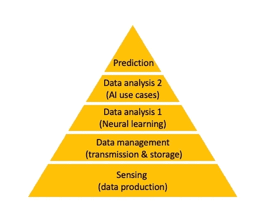

# 产生数据的传感器是新的大事情

> 原文：<https://medium.com/geekculture/data-producing-sensors-is-the-new-big-thing-db932309895a?source=collection_archive---------8----------------------->

没有传感器及其不知疲倦的数字数据生产，就不可能有人工智能。

我们生活在一场文化和经济数据驱动的革命中。人工智能(AI)研究的最新进展发现了电子设备每天产生的大量数据的有利可图的应用。深度学习(DL)算法是一种非常强大的统计分类方案，已被证明在图像和语音识别中非常有用，目前被应用于许多其他领域，包括客户概况和市场分析，需要大量数据来执行。我们能在哪里找到他们？

数字数据是一种技术产品，它们并不存在于自然界，而是通过一个称为“数字化”的过程生成的。它始于一个物理量，如磁场振幅、房间温度或一个人的体重。这个物理量通常被称为模拟数据，目前对人工智能应用没有用处。为此，模拟数据被转换成数字数据。这是通过一个叫做**传感器**的装置来完成的。传感器是一种检测物理量、模拟数据(如温度)并产生电量(通常是电压或电流)的设备。电压馈入另一个称为 ADC(模数转换器)的设备，该设备提供与模拟数据幅度成比例的数字数据作为输出。数字数据是一种有限精度的量，可以输入数字计算机，用于人工智能应用。

从这个简单的描述中可以清楚地看出，在人工智能的逻辑金字塔中，一个基本的任务是由感知活动来表示的。这将生成数字数据，并输入到 DL 算法中，该算法输出各种用例的预期预测(见图 1)。

因此，感测是正在进行的数字革命的一个基本方面，并且是通过传感器设备来实现的。传感器的一个简单例子是我们手机的触摸屏。由于与电流变化相关的屏幕电容(模拟数据)的变化，它可以感应到我们手指的轻微压力。ADC 对此进行采样和数字化，并将其输入电话处理器。另一个例子是监控汽车(发动机和乘客舱)温度的温度传感联网设备。这里产生的电压与温度成正比，经过数字化处理后发送到汽车的温度管理系统。

近年来，我们帮助大量增加小型移动无线传感器，用于监控桥梁、建筑、纪念碑等大型基础设施的状态。结构健康监测是人工智能应用的最后前沿之一。这再次得益于无线传感器分布式网络采集的大量振动数据。

如果数据是新的石油，那么网络传感器就是新的石油钻塔。谁拥有传感器，谁就拥有数据。想想吧…