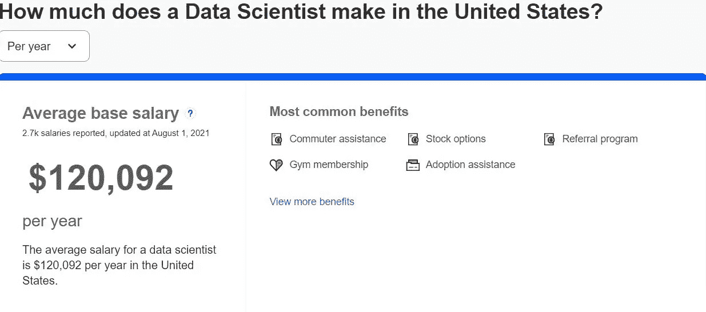

# 数据科学 Vs 数据工程

> 原文：<https://medium.com/geekculture/data-science-vs-data-engineering-e5f91fe306ba?source=collection_archive---------19----------------------->

他们做什么

Photo by [Christina Morillo](https://www.pexels.com/@divinetechygirl?utm_content=attributionCopyText&utm_medium=referral&utm_source=pexels) from [Pexels](https://www.pexels.com/photo/woman-standing-while-carrying-laptop-1181354/?utm_content=attributionCopyText&utm_medium=referral&utm_source=pexels)

人们经常混淆数据科学和数据工程，尽管事实并非如此。让我们对此有更好的理解。

## 数据科学的一点背景知识

数据科学是一门多学科。它使用科学技术、程序、算法和技术从结构化和非结构化数据中提取信息和见解。然后，它将这些知识和有价值的见解应用于各种应用领域。它是从数据中获取有用商业信息的过程。它负责改进 ML 模型的性能。计算机[编程](https://aichapters.com/top-5-programming-language-for-machine-learning/)，统计和线性代数，大分析，机器学习，信息收集是数据科学的支柱。数据产品是数据科学的成果。一个例子是区分垃圾邮件和非垃圾邮件的电子邮件过滤器或像 YouTube 的建议视频列表这样的推荐引擎。

## 谁是数据科学家？

数据科学家使用统计工具和方法分析大量数据，特别是人工智能和 ML。他们通常创建底层信息的可视化或图形化表示。这份工作对现代科技企业至关重要，无论是决定在脸书上给你展示哪个广告，还是建议网飞推荐哪些电影和电视节目。

## 数据工程的一点背景知识

数据工程是数据科学的一个分支，涉及信息收集和处理的实际应用。换句话说，它是负责为处理、存储和检索来自各种信息源的信息创建基础的学科。必须有收集和评估所有工作信息的方法。数据科学家使用大量数据来回答问题。还应该有适当的程序以某种方式将其应用到现实世界的活动中。这两者都是工程工作，包括将科学应用于功能和实际系统。数据工程负责确定信息收集的最佳技术，并确定最佳解决方案和工具包。它侧重于开发和构建能够收集、准备统计数据并将统计数据(结构化和非结构化)转换为可供数据科学家审查的可用格式的数据管道。数据工程的基础包括大量的数据存储和处理、数据管道和模型 ETL(提取、转换、加载)。

## 谁是数据工程师？

数据工程师负责建立和维护支持组织的 IT 系统和环境的数据基础设施和架构。换句话说，他们专注于创建一套可扩展的和健壮的统计分析技术。他们熟悉 SQL/NoSQL 数据库争论和构建/维护 ETL 管道。他们应该精通编码、数据存储、系统实现和数据库管理。

实际上，数据工程领域包括许多相关的子领域和工作，包括:

*   工程师:他们与数据架构师和数据库管理员密切合作，为整个公司开发可靠、成熟的数据基础设施。
*   **架构师**:他们负责创建一个或多个数据管理系统。数据架构师和工程师之间的区别类似于物理结构中架构师和工程师之间的区别。架构师专注于构思数据框架，而工程师专注于执行问题。
*   **DBA(数据库管理员)**:他们负责创建和管理一个组织的数据库，确保它们顺利运行，并且所有需要的员工都可以随时获得信息。

## 数据科学家的职责:

他们通常被给予已经被清洗和处理的数字。然后，他们可以进入高级分析工具、ML 模型和统计方法，为数据驱动的建模准备统计数据。为了开发模型，他们必须进行行业研究，然后利用来自一手和二手来源的大量内容来满足公司需求。这可能还包括数据库探索和分析，以发现隐藏的模式。

在数据科学家完成评估后，他们必须向相关机构或利益相关方提供一个令人信服的故事。一旦就调查结果达成一致，他们必须确保该过程是自动化的，以便可以每天、每月或每年向公司利益相关者提供见解。他们还必须了解云应用程序，因为他们需要访问由数据工程团队处理的信息。他们还必须将事实传达给公司的利益相关者。因此，强调讲故事和图形表示是至关重要的。

 [## 自动驾驶汽车背后的技术栈:一项调查

### 什么是自动驾驶汽车？自动驾驶汽车，也称为自动驾驶汽车，是一种在…

aichapters.com](https://aichapters.com/technology-stack-behind-a-self-driving-car-a-survey/) 

## 数据工程师的职责:

他们的职责包括创建、构建、分析和维护数据库和大规模处理系统。他们处理包含由人、机器或小工具造成的错误的原始统计数据。这些数字可能未经验证，并且可能包含可疑的记录，因为它很可能是未格式化的，甚至可能包含特定于系统的代码。

数据工程师必须倡导并在某些情况下执行提高数据可靠性、生产率和质量的方法。为了实现这一目标，他们需要使用各种语言和工具来寻找从其他网络获取额外信息的方法，例如特定于系统的代码，数据科学家可以对其进行处理。

数据工程师的一个重要职责是确保现有的基础设施满足数据科学家和公司利益相关者的需求。他们还必须为统计建模、信息提取和生产创建数据集工作流程。

## 语言、方法和软件

这两种职业技能的差异转化为他们所使用的语言、工具和软件的差异。尽管双方使用的技术高度依赖于职位在组织环境中的设想。数据工程师经常使用 Cassandra、Redis、MongoDB、Sqoop、SAP、MySQL、Oracle、PostgreSQL、neo4j、Hive 和 Riak 等工具。

数据科学家利用 JavaScript、R、Python、Stata、C 和 Julia 等语言来创建模型。 [Python 和 R 广泛使用的编程语言](https://aichapters.com/python-or-r-which-programming-is-better-for-data-science/)。他们应该对这两种编程语言有深入的理解，并对可视化和提取工具有很强的掌握。当使用这两种语言时，您最有可能使用 ggplot2 之类的包在 R 或 Python 的众多库中创建令人惊叹的图形插图，如 Pandas，它们有助于数据操作。还有几个软件包在处理数据科学项目时会很有用，如 Matplotlib、NumPy、Scikit-Learn 等。数据科学家也使用像 [Tableau](https://www.tableau.com/) 、 [MATLAB](https://www.mathworks.com/products/matlab.html) 、 [RapidMiner](https://rapidminer.com/) 和 Excel 这样的程序。他们还应该对机器学习和深度学习有透彻的了解。这将使他们能够做出高价值的预测，最终导致更好、更明智的决策。不仅如此，还需要沟通、领导和演示技巧来向高层管理人员和其他利益相关者演示和解释他们的分析结果。

数据工程师角色要求一个人彻底掌握几种编程语言，如 SQL、SAS、Python。精通 MapReduce、Hadoop、Apache Spark、NoSQL、Hive 等框架。一个人还必须具备逻辑能力、组织和管理技能以及领导能力。

如果你想知道双方有什么共同语言，它们是 Scala、Java 和 C#。然而，Scala 在数据工程师中更流行，因为与 Spark 的连接对于设置大型 ETL(提取、传输、加载)过程特别有用。目前，它在数据科学家中越来越受欢迎，尽管专家们并没有经常广泛使用它。Java 编程语言也是如此。目前，它在数据科学家中越来越受欢迎，尽管专家们并没有经常广泛使用它。但是，在寻找这两种职业的就业空缺时，Java 是必需的。双方的工具也是如此，比如 Hadoop，Spark，Storm。

## 学历

这两种职业有一个共同点:计算机科学背景。这个研究领域在两种职业中都很受欢迎。

大多数数据科学家相信他们已经学习了计量经济学、数学、统计学和运筹学。他们通常比数据工程师更注重业务。另一方面，大多数数据工程师都有工程背景和计算机工程方面的专业知识。

然而，值得注意的是，一般来说，专业服务行业是由各种背景的专家组成的。物理学家或生物学家涉足这一领域并不罕见。

## 工资和范围

由于统计学正在迅速发展，它为与数据相关的职业提供了广阔的空间和前景。据《福布斯》报道，数据工程师和数据科学家正在成为世界上收入最高的职业。

脸书、微软、英特尔、S&P 全球和亚马逊等组织都对招聘数据科学家感兴趣。另一方面，谷歌、苹果、沃尔玛等大公司都在高薪招聘数据工程师。

Source: Indeed

Source: Data Engineer

## 哪个专业比较好？

在比较这两个角色时，我们必须记住这两个角色在分析领域的重要性。还观察到这两种角色之间的区别对它们在数据领域的协作影响没有影响，因为两者都需要以高效和有效的方式实现处理信息的共同目标。

## 你应该成为什么？

虽然所需的技能和职位职责有一些重叠，但这些工作是不可互换的。因此，你必须在两者之间做出选择，并在其中一个上投入巨资。无论哪种情况，这两个职位都有非常积极的就业前景，并且非常赚钱。

然而，如果你想在这两种职业的交叉领域工作，你可以从事机器学习方面的职业。机器学习工程师是数据工程和数据科学方面的专家，拥有在这两个领域工作的背景和专业知识。机器学习工程师是数据工程和数据科学方面的专家，拥有在这两个领域工作的知识和专业技能。

这里是我的其他博客文章，你可能会喜欢

https://youtu.be/OSwuhYfMwWY ✅learn 要过社交焦虑的生活⇾

## [数据科学在金融领域的 7 大应用](https://aichapters.com/top-7-applications-of-data-science-in-finance/)

## [机器学习的 5 大编程语言](https://aichapters.com/top-5-programming-language-for-machine-learning/)

## [Python 和 R:数据科学哪个编程更好？](https://aichapters.com/python-or-r-which-programming-is-better-for-data-science/)