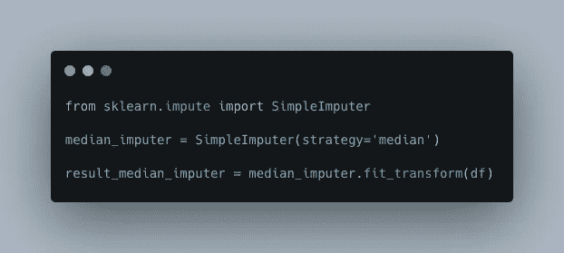

# 数据科学中的数据窥探——一个不太为人所知的问题

> 原文：<https://medium.com/geekculture/data-snooping-in-data-science-a-not-enough-known-issue-b6936e3552b7?source=collection_archive---------10----------------------->

快速简单地解释什么是数据窥探，重点是数据科学。

Photo by [Markus Winkler](https://unsplash.com/@markuswinkler?utm_source=medium&utm_medium=referral) on [Unsplash](https://unsplash.com?utm_source=medium&utm_medium=referral)

正如我在上一篇文章[中谈到的，ML](https://npogeant.medium.com/the-modelling-dilemma-in-machine-learning-optimization-vs-generalization-8f8d3fae8a0b) 中的建模困境是每个数据科学家都应该意识到的一个大问题，即他或她正在构建的模型的泛化。在一个公司里，利益相关者想要创造价值，如果你的模式足够好，每个人都会很高兴。然而，从正在处理的数据集中寻找最精确的模型可能会浪费时间，而且会产生问题，尤其是在有截止日期的情况下。

建立一个**尼斯** **结构**，从数据收集/提取到生产启动，经过一个正确的特征工程和模型的选择，显然是任何数据科学/机器学习项目的目的。

很明显，我在简化这个过程，但是首先要明白的是，忽略这个过程的一部分可能会成为其余部分的主要问题。

**数据窥探**是那种可以杀死你的模型并阻止它学习任何正确的东西的错误…

# 什么是数据窥探？

数据窥探是一种统计错误，当研究人员决定在制定统计指南或建立假设之前查看数据时就会出现这种错误。

接下来会发生什么？

他正受到他所看到的影响，他将开始工作的假设可能已经有太多的数据驱动。我的意思是，研究人员将把与他的第一个假设不相符的数据集的一部分去掉，并将推理集中到新的子集。然而，这个子集不是反映数据，而是如它所称的，它的子集，所以他要找到的见解不会推广到所有的数据。

> ***数据窥探*** 是指研究者在查看数据后决定执行*的统计推断(与*预先计划的*推断不同，研究者在*查看数据前计划*)。
> *(* [*德克萨斯大学奥斯汀分校数学系*](https://web.ma.utexas.edu/users/mks/statmistakes/datasnooping.html) *)**

# 数据科学中的数据窥探

了解数据科学项目的模型性能在很大程度上取决于您用来训练该模型的数据，这一点很重要。总是有更多的数据来训练它，可以增加模型的准确性和学习过程，但是有正确的数据集就足够了，其中所有的特征都完美地解释了与目标的关系并且具有很好的结果。

不幸的是，在特征工程和模型建立过程中，你是在调查，做假设，不知道这些关系。

当您决定采用整个数据集来分析解释变量并忽略其分割步骤时，就会发生数据窥探。

然后，您正在处理的数据也将用于评估模型，这些数据将是无效的，而且是不正确的。

让我们举一个经典数据窥探情形的**例子**:

您正在开发一个模型，该模型试图根据巴黎已售出房屋的数据集来预测房价(进行估计)。这个想法是向买家推荐一些房子，由模型推荐。

在这些特征中，购买者的收入。即使数据集足够大，它也会遗漏该列中的许多信息。您必须做出决定，是保留列并替换空值*，还是删除行。*

*受影响的行太多了，所以您决定保留它们并用收入中值替换缺失的值。*

**

*By the author (with carbon.now.sh)*

*既然您已经很好地使用了数据集，那么您可以选择将它分成定型集和测试集。*

*在评估该模型的性能时，您意识到它非常准确，您决定将其投入生产。*

*一周后，第一次反馈显示，你的模型丢失了它使用的新的每日数据，特别是客户指定的收入。*

## *错在哪里？*

*你用的是所有数据的收入中位数，而不是之前的拆分。这是基本的数据窥探。模型从更多的数据中学习，但是评估阻止显示模型的真实性能(因为它在相同的数据集上学习和评估)。*

*如果您确实在替换缺失值之前分割了数据集，您就会看到并理解使用中值收入是一个产生高方差并导致过度拟合的问题！*

# *结论*

*数据窥探的情况出现在许多存在数据和统计数据的领域。这是一个错误，即专注于在查看数据后做出的推论。
在数据科学中，它有一点不同，它是指通过获取用于构建模型的所有数据来开始对数据集进行探索性分析，而不是之前对其进行拆分。因此，系统将在训练和测试中使用目标和特征之间的关系，因为一些学习过程已经被破坏并且模型窥探了整个数据集。当数据集准备好进行分析时，分割数据是您必须做的第一步！*

*感谢您阅读这篇文章，我希望您已经了解了什么是数据窥探以及它可能带来的问题！*