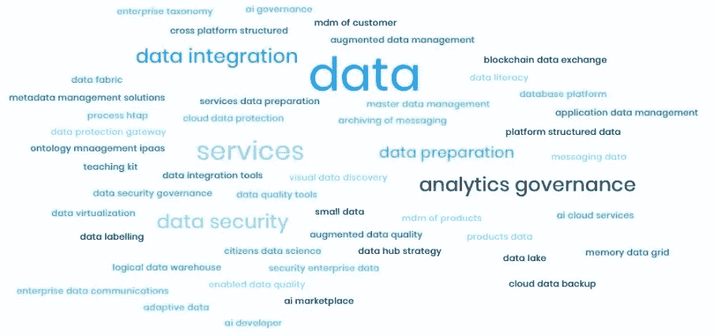

# 数据技术趋向-多部分系列。

> 原文：<https://medium.com/geekculture/data-technology-trends-76f23495278d?source=collection_archive---------39----------------------->

# 我们相信上帝，所有其他人都会带来数据。爱德华·戴明。

我们正处于信息时代，在这个时代，我们拥有丰富的数据。每个组织都在生成大量数据，并且希望能够轻松地按需访问数据，最好是从单一位置。无论组织规模如何，从高质量的数据中快速获取更多价值正日益成为许多组织面临的挑战。

随着组织中数据的急剧增长，

*   具有强大数据战略的数据的安全性、隐私性和治理
*   数据来源和数据的真实性
*   能够从不同的数据系统中收集可解释的摘要
*   回答“那又怎样”的业务问题，并以最高质量快速提供数据价值

变得很重要。

随着现代云数据库、数据湖和三角洲湖的出现，所谓的“数据是新的石油”理论正在被实践。“数据趋势”是从我的角度对我如何看待最新的数据趋势以及数据的未来进行的一系列分析。如今有如此多的数据技术，它们让组织可以将所有数据放在同一个篮子里，或者分散到不同的云解决方案提供商。这篇文章的主要思想是确定数据技术的趋势，并对其进行定位，看看未来是什么样的。

我有几十年的数据工作经验，目睹了数据从小数据到大数据的增长，以及这种转变是如何发生的。这篇文章纯粹是我个人的观点，不代表我工作的组织的想法。

# 趋势 0:基础

我将这一基础部分分为两部分(1)主流(2)走向成熟

数据成为主流，根据 Gartner 的说法，与数据相关的技术/流程已达到生产力的稳定期。由于云和现代数据平台，一度被认为已经死亡的业务又重新出现了。作为这一趋势的一部分，数据仓库随着现代云数据库而回归，大数据随着 Spark 而复兴，随着多个 PAAS 和 SAAS 提供商越来越多地使用人工智能。

走向成熟:在金融和医疗保健领域，数据保护、安全和隐私并不是一个新概念。而对于互联网组织来说，数据保护和安全性正在不断发展。

**链接:** [数据技术趋势#0:基础(第一部分)](https://luxananda.medium.com/data-technology-trend-0-foundational-117b07102ee9)

[数据技术趋势#0:基础(第二部分)](https://luxananda.medium.com/data-technology-trend-0-foundational-part-2-26025a3a0505)

# 趋势 1:可信

随着互联网组织对数据保护/安全/保护的关注，我想强调“可信”是第一个趋势——将数据从生成到归档和归档进行隔离。超越。

数据生成:数据来自任何地方和任何地方。尤其是随着区块链的发展，数据或信息来源非常重要。

数据准备:超过 60%的工作是在使用数据之前准备/清理数据。

数据处理:数据处理的主要行为是存储和计算。处理过程中的安全性是另一个关键因素，因为数据被集成、存储并传递到不同的系统进行处理。

数据存储:静态加密和安全。

数据共享:传输中的加密。

数据发布:基于文件的加密或块加密。数据加密和数据虚拟化。

数据存档:存档安全。

数据安全/治理/隐私:随着云和多/聚云的出现，安全的重要性日益增加。零信任安全、是否需要隔离区、数据个性化、高级数据治理、人工智能/分析治理、隐私和安全、差异隐私、数据分类、数据操作、人工智能/多点操作等。

监控:支持机器学习的数据质量和验证

**链接:** [数据技术趋势# 1:可信](https://luxananda.medium.com/data-technology-trend-1-trusted-67ace6862bca)

# 趋势 2:战略性

战略趋势的核心是“数据的简化”。与现代数据平台一样，越来越多的组织希望从单一区域存储和检索信息，并能够拥有简单而高效的数据架构和平台。

数据仓库是数据湖的一大回归:例如，AWS 中的红移和数据湖(Glue 和 S3)。云是数据和分析的必然选择

数据结构:世界碰撞 1。云/本地 2。关系/非关系(结构化/半结构化/非结构化)3。数据和分析

在我看来，战略趋势的其他特征包括数据中心、DBAAS:数据库即服务、Delta Lake、数据网格、满足交叉需求的单一数据库、数据目录、自助式数据准备、数据管理解决方案、数据集成工具。

链接:[数据技术趋势#2:战略(第一部分)](https://luxananda.medium.com/data-technology-trend-2-strategic-46286e49e8c2)

[数据技术趋势#2:战略(第二部分)](https://luxananda.medium.com/data-technology-trend-2-strategic-part-2-b90f2dbf417d)

[数据技术趋势#2:战略(第三部分)](https://luxananda.medium.com/data-technology-trend-2-strategic-part-3-3276c06ae5e5)

[数据技术趋势#2:战略(第四部分)](https://luxananda.medium.com/data-technology-trend-2-strategic-part-2-4dd93d1d0c96)

# 趋势 3:加速

这一趋势的核心是“数据优化”。

长期流(实时)和死 ETL(？):卡夫卡和 Kinesis 都是靠类固醇流出来的。随着 Glue 等技术的出现，本来会随着流而消亡的 ETL 又回来了。ELT 比 ETL 更占优势。更多的托管服务正在为数据 ETL 和流而旋转。使用现代实时流/ ETL 的主要优势是能够为多种目的进行代理，消除延迟，提高性能，存储和多个消费者的访问。

其他技术包括增强的数据管理、更好的主数据管理、更好、更便宜、更智能和更快地将数据转换为商业见解。

链接:[数据技术趋势#3:加速](https://luxananda.medium.com/data-technology-trend-3-accelerated-b837f96a4ba?source=your_stories_page-------------------------------------)

# 趋势 4:分散化

关于数据应该集中还是分散，一直存在争论。随着现代数据平台的出现，数据即服务和数据即产品，为什么这应该是去中心化或集中化。随着组织生成越来越多的数据，应该有一个经过验证的在集中和分散之间切换的能力，这不应该是一个事后想法，而应该是一个起始点，并且必须作为数据架构的一部分来创建。

数据网格、数据结构、数据虚拟化和区块链技术等现代技术实现了这一大时代。

链接:[数据技术趋势#4:去中心化(第一部分)](https://luxananda.medium.com/data-technology-trend-4-decentralized-b984c1f53f2b)

[数据技术趋势#4:去中心化(第二部分)](https://luxananda.medium.com/data-technology-trend-4-decentralized-part-2-ffae5afa0bec)

# 趋势 5:民主化

当前和下一代数据正快速走向数据民主化。在检索数据的来源和如何在其上进行分析之间没有技术依赖或界限。对数据民主化最有用的技术，包括但不限于 DataOps 或 DataSecOps、MLOPS 或 AIOps、使用增量表的数据共享和 Auto ML。

链接:[数据技术趋势#5:大众化](https://luxananda.medium.com/data-technology-trend-5-democratized-19c716582a04)

# 趋势 6:可操作的结果

共享数据以获得可行的结果并发布。毕竟，这是在数据被清洗、存储、分析和应用机器学习算法之后的使用。

技术包括但不限于持续智能&可解释的人工智能、嵌入式人工智能、负责任的人工智能、更聪明、更快、更负责任的人工智能、数据和分析中的区块链以及 NLP。

链接:[数据技术趋势#6:可操作的结果(第一部分)](https://luxananda.medium.com/data-technology-trend-6-actionable-outcomes-dfb90fb34bc0)

[数据技术趋势#6:可操作的结果(第二部分)](https://luxananda.medium.com/data-technology-trend-6-actionable-outcomes-part-2-bc60dd7a2527)

# 趋势 7:货币化

如果数据是新的石油，那么我们应该能够出售石油或从石油中创造衍生品，并将数据货币化。最佳途径，数据和人工智能市场放置和交换平台，数据即服务，数据即产品。

链接:[数据技术趋势#7:货币化](https://luxananda.medium.com/data-technology-trend-7-monetized-5df1d6427483)

# 趋势 8:数据下一步

我们已经处于下一代数据——统一和丰富的大数据和人工智能、数据砖块、量子计算和人工智能之间的婚姻。

链接:[数据技术趋势#8:数据下一步—第一部分](https://luxananda.medium.com/data-technology-trend-8-data-next-part-1-b52c2d6b54d2)

[数据技术趋势#8:数据下一步—第二部分](https://luxananda.medium.com/data-technology-trend-8-data-next-part-2-f22eff2ad5a2)

[数据技术趋势#8:数据下一步—第三部分](https://luxananda.medium.com/data-technology-trend-8-data-next-part-3-280d203f807d)

[数据技术趋势#8:数据下一步—第四部分](https://luxananda.medium.com/data-technology-trend-8-data-next-part-4-a5763b346eb9)

[数据技术趋势#8:数据下一步—第五部分](https://luxananda.medium.com/data-technology-trend-8-data-next-part-2-fa6e326761be)

[数据技术趋势#8:数据下一步—第六部分](https://luxananda.medium.com/data-technology-trend-8-data-next-part-6-cf1735117835)

**总结:**随着数据技术的趋势，我们也看到了新角色频繁出现的趋势。在这一系列文章中，我打算讨论数据技术的趋势，以及它如何使企业的解决方案与众不同，以从数据中获取价值，并重点关注快速上市和高质量。这是一个由 8 篇文章组成的系列。

Data technology trends — 2021

# 这是一个关于数据技术趋势的多部分系列，在相应的部分提供了链接。

其他文章参见 luxananda.medium.com。