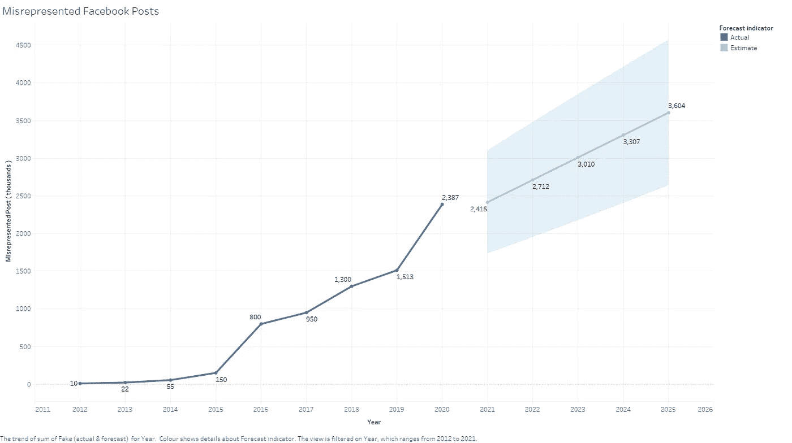

# 数据，邪恶的新根源？

> 原文：<https://medium.com/geekculture/data-the-new-root-of-evil-ab3aa5948461?source=collection_archive---------30----------------------->

## 随着我们进入数据驱动时代，对数据的违反直觉的使用可能会像野火一样蔓延。

虽然数据的使用并不新鲜，但它在最近几年确实受到了关注。在某种程度上，每个人(是的，包括你)在日常生活中都使用数据。公司基于数据做出决策，从预测收入到优化服务和成本。电影评级和产品评论是很好的数据示例，消费者可以利用这些数据来决定他们是否要在其中投入时间和资源。

人类非常善于识别垃圾评论和一些虚假评论，出于同样的目的，算法被开发出来并在现实世界中表现良好。然而，仍然存在人类和算法都忽视的问题，即解释**误报的数据**。以欺骗的方式呈现的数据，源自其原始含义，没有上下文的数据，甚至是误导性的报告，以动摇公众对个人甚至政治议程的信念，随着时间的推移，这种趋势明显增加。

# 严酷的事实

Graph of misrepresented Facebook posts yearly from 2012–2021

如上图所示，自 2012 年以来，脸书发布的虚假信息急剧增加。在 2019 年至 2020 年之间可能会出现急剧上升，这是由于冠状病毒帖子的增加。一项预测表明，到 2023 年，我们将有超过 300 万个被误传的帖子。随着这种趋势的发展，人们应该*避免*使用脸书来阻止算法学习它…

你们中的一些人可能会发现这个消息令人震惊，或者你们中的一些人可能已经怀疑和怀疑这个作者的资格。虽然这只是我为这篇文章制作的一张无害的图表，并且**我在这篇文章中说的没有一句话是真实的或被证实的，但社交媒体上肯定有类似帖子的变体。Hiroko Kanoh 在 2018 年进行的一项关于*为什么人们会相信互联网上的假新闻*的[研究表明，尽管人们可能会怀疑假新闻，但他们忍不住会想，新闻是否也不是不真实的。这篇论文的链接可以在科学指南上找到。现在，这是令人担忧的，因为这种不真实的图表和声明可能会被断章取义和滥用，而且会有一部分公众无辜地相信它。](https://www.sciencedirect.com/science/article/pii/S1877050918313851)**

# 不切实际的比较

A post from the author Facebook feed comparing Malaysia fresh graduate salary

最近，在我的脸书博客上出现了一些帖子，比较了马来西亚和其他国家的大学毕业生的薪水。试图在政治上左右人们的观点并宣扬不切实际的观点/这山望着那山高。虽然根据 Statista 统计的各国购买力平价，上述帖子在一定程度上是真实的，但香港巨无霸的定价应该低于新加坡。不用说，宽带定价可以参考[有线电视公司](https://www.cable.co.uk/broadband/pricing/worldwide-comparison/)，因为他们提供了良好的全球宽带定价原始数据。一个没有适当来源的帖子，通过转换货币歪曲数据，并且没有考虑每个国家的生活成本，这给有即将毕业的孩子的父母，甚至是应届毕业生自己带来了不切实际的期望。

# 这能走多远？

本文中的例子已经在多种规模上发生，从人们歪曲数据引起恐慌，到人们出于政治目的断章取义。

Aner Tal 和 Brian Wansink 在 T4 用图表和公式做了一项关于广告说服力的研究。那项研究表明，将数据以图表的形式呈现比仅仅发表声明更有说服力，而现在互联网上正在发生这样的事情。在我看来，数据可以被断章取义，歪曲为多倍收益。公司用有偏见的收入数据影响利益相关者或缺乏经验的投资者，或者竞争对手用同样的信息诋毁公司或个人，也可能成为一种趋势。随着数据使用的增长，数据的滥用也在增长。

# 我们能做什么？

像[走向数据科学](https://towardsdatascience.com/)这样的出版物符合严格的政策，要求声明、研究和图像有适当的来源和信用，然而，对于不受监管的社交媒体来说就不一样了。在 Hiroko Kanoh 所做的同一个研究中，一份关于“我们应该如何处理假新闻”的问卷调查以识字教育为最高应对。随着我们进入一个数据无处不在的时代，理解在下结论之前从可信来源核实事实是至关重要的。

作为处理数据的人，我们知道，一般来说，训练任何算法的一部分都包括确保数据集和算法训练的结果没有偏差。我相信，当我们在互联网上看到一个错误的数据时，我们应该更清楚。当我们看到这种模式时，教育我们的家人和同龄人将遏制可能导致不必要的恐慌或误导他人的数据传播。

正如我父母经常告诉我的，不要相信你在电视上看到的一切。这个时代浏览互联网也应该如此。