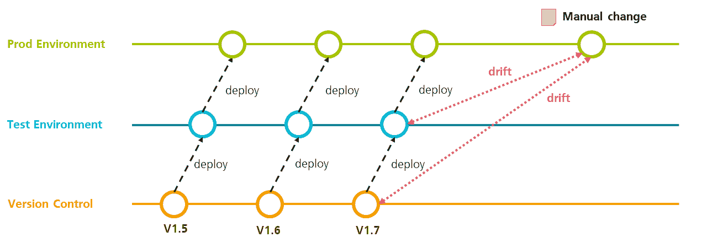
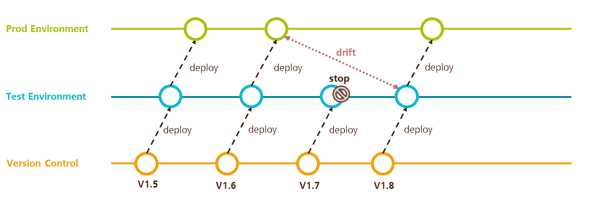
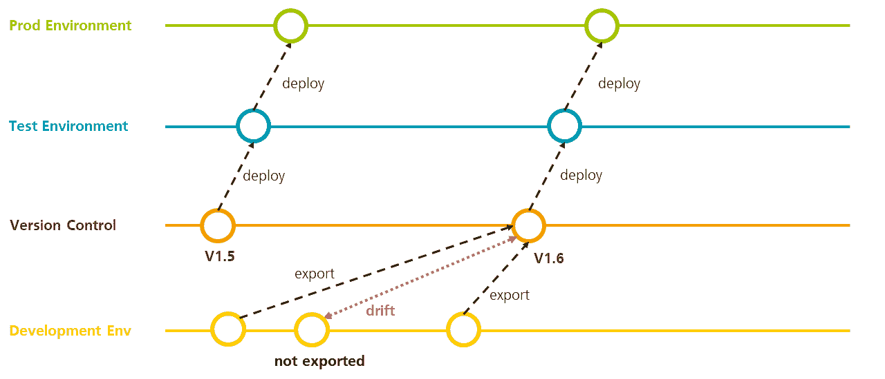

# 数据库版本漂移—它是什么以及如何避免它！

> 原文：<https://medium.com/geekculture/database-version-drift-what-it-is-and-how-to-avoid-it-17a3836a2150?source=collection_archive---------6----------------------->

The state of database objects should be identical in your version control system and your environments — developers must avoid drifting to guarantee reliable deployments!📸 Photo by [Jean-Philippe Delberghe](https://unsplash.com/@jipy32?utm_source=unsplash&utm_medium=referral&utm_content=creditCopyText) on [Unsplash](https://unsplash.com/?utm_source=unsplash&utm_medium=referral&utm_content=creditCopyText)

## 当(dev|test|prod)数据库的状态偏离版本控制中源文件的状态时，就会发生数据库版本漂移。本文解释了这种情况在您的开发过程中是如何发生的，以及可以采取什么措施来防止它。

# 什么是数据库版本漂移？

数据库版本漂移就是这样发生的:在生产环境中制作一个小的手动修补程序，而不将其添加到版本控制系统中，或者在版本控制中更改一个问题，而不将其部署到生产环境中。它可以是一些小事，比如纠正一个打字错误，或者直接在数据库的过程中添加一个 commit。如果版本控制中没有发生变化，然后部署到所有环境中，就会发生数据库版本漂移。

# 数据库版本漂移的可能原因有哪些？

## 🚩手动更改

手动修改是邪恶的。如果没有部署自动化，很有可能变更不会进入版本控制系统，或者某些环境不会被提供新的变更。在修补程序或紧急更改期间，开发人员很容易忘记特定的环境。或者更糟的是，如果发生了手动更改并且部署自动化已经就绪，开发人员很可能不知道这一更改，这可能会导致错误的未来部署。

Database version drift happens when manual changes are done directly in a specific environment.

## 🚩停止的功能

开发一个特性，然后在测试环境中发现它不适合生产，这是每个开发人员都经历过的事情。尽早停止某个功能是一种安全机制，可以保证可靠的生产环境。这些特性通常会返回到开发中，或者完全从管道中移除。但是将变更部署在测试环境中，而不是生产环境中，会导致数据库版本漂移。

Database version drift happens when features are stopped once they are installed on the test environment.

## **🚩分支**

从理论上讲，分支允许开发人员独立完成他们被分配的任务。但是作为一个团队来构建一个系统需要频繁的协调和沟通。通过长期运行的分支，您实现了一个长期运行的通信系统。一旦您想要合并您的变更，您很可能会与主线上同时进行的变更发生冲突。

> 分支越多，就越有可能经历数据库版本漂移！

数据库更改取决于版本控制主线上表示的特定数据库状态。如果创建一个新的变更，它依赖于以前的变更集。对于分支，尤其是长时间运行的分支，当您想要将它们与主线合并时，您的一些更改出错的可能性会增加。你正在造成返工和浪费时间。

但是基于主干的开发是解决方案吗？基于主干的开发需要经常添加小的变更，因此减少了因为主线上的状态改变而导致无效合并变更的风险。对于开发团队来说，沟通是至关重要的——组织实施任务对于避免重复工作也是必不可少的。

然而，基于主干的开发并不能解决当一个特性在被安装到测试环境之后不能投入生产的问题；必须在已经部署的环境中恢复更改。所以没有灵丹妙药——每种策略都有优点和缺点。尽管如此，基于主干的开发或短期运行的分支总体上受益最多。

## **🚩不经常更新的开发环境**

开发任务通常需要实验。这些实验将使开发环境的数据库对象处于与生产环境不同的状态。开发人员也可能创建临时对象或用于测试目的的对象。实现后的清理很麻烦，所以开发人员通常不做。如果没有一个通过点击按钮来重建开发环境的自动化机制，开发环境的数据库版本漂移就会发生。

假设我们使用独立的数据库开发环境，并且有适当的自动化机制。在这种情况下，一旦完成的特性被安装到产品中，我们就可以快速地重新构建开发环境，并开始后续的变更开发。如果我们有一个共享的开发环境，重建和避免数据库版本漂移就更具挑战性，因为重建必须与所有开发人员协调。

Database version drift happens when development environments contain changes that aren’t added to version control.

# 如何避免数据库版本漂移？

*   1️⃣确保您可以将开发和测试环境自动恢复到特定的版本。
*   2️⃣使用分支策略来最小化数据库版本漂移的风险。实践基于主干的开发，如果需要，使用短期运行的分支来开发变更。
*   3️⃣不允许手动改变环境。所有的变更都必须由一个自动化的管道来执行，该管道从一个中央版本控制系统获取变更集。
*   4️⃣使用独立的开发环境，只需点击一个按钮就可以重建，与开发人员的工作分离。
*   5️⃣定期检查数据库版本漂移是否在环境之间发生，最好是以自动化的方式。最有可能的是，您已经拥有了允许您手动检查数据库版本漂移是否发生的工具(例如，您的数据库 IDE 中的模式比较)。如果您想编写一个自动化的方法，一种方法是使用 Oracles 的 [DBMS_METADATA](https://docs.oracle.com/database/121/ARPLS/d_metada.htm#ARPLS026) 包来比较两个数据库的元数据。

# 结论

数据库版本漂移有许多不同的原因。应该设计开发、集成和部署流程，以消除数据库版本漂移的风险，或者如果发生了，检测它并向开发人员报告。