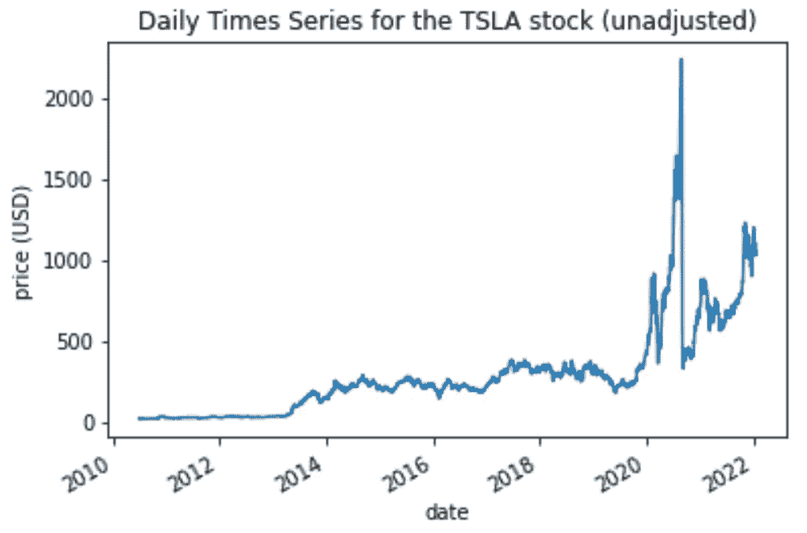
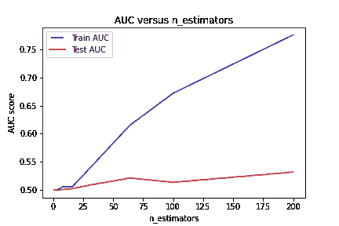
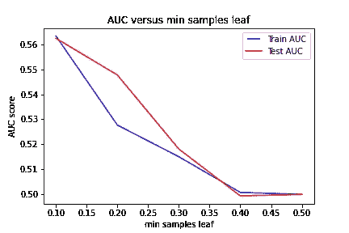
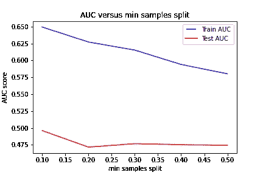

# 用机器学习揭穿 r/WallStreetBets

> 原文：<https://medium.com/geekculture/debunking-r-wallstreetbets-with-machine-learning-257a867ecc76?source=collection_archive---------7----------------------->


Photo by [Brett Jordan](https://unsplash.com/@brett_jordan?utm_source=medium&utm_medium=referral) on [Unsplash](https://unsplash.com?utm_source=medium&utm_medium=referral)

2021 年，投资界被一个以 r/WallStreetBets 闻名于世的小型日间交易员群体颠覆了。他们通过集体攻击 Gamestop 和 AMC 等股票来对抗投资大鳄。这一事件大到足以让政客们目瞪口呆，影响 T2 Reddit 的第一个超级碗广告，并激发小投资者对未来的憧憬。这是我们从未见过的奇观，我们想知道它是否会再次发生。一个重要的收获是，关注 subreddit 和股票交易所的人数至少增加了 10 倍。

这让我想到了社交媒体对股市的影响。与股票市场和华尔街赌注的活动有关联吗

像往常一样，我们将使用机器学习来研究这个问题。

# 这里可以使用哪些数据？

要做到这一点，我们需要 Reddit 和股票市场的数据，然后我们需要一个共同的属性将两者联系在一起。以下是我遇到的两个帮助入门的工具:

下面的**是一个无服务器的实时数据平台。他们有涵盖趋势 Reddit 帖子、以太坊区块链和最重要的 r/WallStreetBets analytics 的数据集。在这个实验中，我将使用帖子中提到的股票代码的[数据集。](https://beneath.dev/examples/wallstreetbets-analytics/table:r-wallstreetbets-posts-stock-mentions)**

Alpha Vantage 是一个开发者友好的 API，提供金融市场数据。它可用于各种公开交易股票价格的历史信息。请看下面的特斯拉(TSLA)股票的例子。



Historic stock prices for Tesla, visualized using matplotlib. Graphic by author.

## 将这些点连接起来

正如我前面提到的，under 有 r/WallStreetBets subreddit 上的股票提及数据。这个数据集具体指的是顶级帖子，而不是帖子上的评论。提供的一些其他数据点包括在标题中发现的股票代码提及次数、帖子发表的时间、帖子正文的长度以及其他特征。说到这里，下面是 r/WallStreetBets 帖子上提到的前 50 只股票:


Top 50 Stock Symbols Mentioned on r/WallStreetBets posts between March 9, 2021 to January 12, 2022\. Graphic by author.

此外，由于我们有帖子的发布时间，我们可以按月分解帖子。以下是排名前两位的 GME 和 AMC 的月度数据:


Monthly mentions of Gamestop and AMC on r/WallStreetBets posts. Graphic by author.

假设我们有时间序列的数据，我们可以直观地将其映射到历史股票表现。我们可以查看每月的股票增长数据，并评估股票提及率或帖子长度是否有趋势。

尽管在我们继续之前，我必须承认并做一个小小的调整——我不是股票分析师(我的博客也不应该被当作金融建议！)并且没有立即注意到 Alpha Vantage 在其自由层提供了*未经调整的*股票数据。这意味着 API 将显示股票的实际交易价格。例如，如果运行以下代码序列:

```
from alpha_vantage.timeseries import TimeSeries
ts = TimeSeries(key=key, output_format='pandas') # key is an API key
nvda, _ = ts.get_daily(symbol='NVDA', outputsize='full')
nvda.loc['2021-01-14']
```


Output of the code sequence above. Graphic by author.

回报是 NVIDIA 的股票当天交易价格在 527.22 美元至 543.99 美元之间，而在撰写本文时，历史最高价格实际上接近 325.85 美元。长话短说，这导致随着时间的推移出现差异，使得数据对于机器学习算法来说不太准确。

我本可以使用回归来处理这个问题，但是因为数字排列不整齐，我们将把它转换成一个*二元分类*问题，其中的类将是股票**在过去一个月**中是否上涨，或者**在过去一个月** *中是否下跌。*为了实现这一点，我们对数字进行如下处理:

1.  获取开市当天的日平均价格:
    (高+低)/ 2。
2.  通过平均一个月的日平均价格得到月平均价格。
3.  比较一个月的月平均值和下一个月的月平均值。是增加了还是减少了？
4.  增加会将数据点转换为+1，减少则为-1。现在我们有了自己的班级标签！我们将交叉引用股票和日期，将标签添加到 Reddit 数据中。

我们清理后的数据集将如下所示:

Cleaned dataset of r/WallStreetBets posts mentioned stocks. Gamestop selected for visualization. The leftmost column is the pandas DataFrame index. Graphic by author.

以下是我所有可用功能的列表:

*   **num_mentions_title:** 一个股票符号在帖子标题中被提到多少次。
*   **num_mentions_body:** 帖子正文中提到了多少个股票符号。
*   **num _ unique _ symbols _ title:**标题中唯一符号的数量。例如，文章标题中同时包含“GOOGL”和“AMZN”会导致该值等于 2。
*   **num _ unique _ symbols _ body:**文章正文中唯一符号的个数。
*   **length_title:** 标题的字符长度。
*   **长度 _ 正文:**字符正文的长度。
*   **num_unique_posts:** 在帖子中至少一次提到股票代码的帖子数量。这是通过对给定数据集中相应的行进行计数而获得的。

有了这个准备，我们再来谈一会儿机器学习的应用。

# 从数据中学习

因为我们正在解决一个分类问题，我们将使用方便的梯度增强树。这个决定是由算法的健壮性所驱动的。参见我在练习机器学习时经常参考的【1】*中的这段摘录:*

> *与其他基于树的模型类似，该算法在没有缩放的情况下以及在二元和连续特征的混合上工作得很好。与其他基于树的模型一样，它通常也不能很好地处理高维稀疏数据。*

*如果你不熟悉梯度增强树，它们是一种*决策树*。决策树是经过学习的分类器(或回归器)，它基于从训练数据中学习到的阈值进行预测。例如，股票价格可以上涨或下跌，我的模型可能会根据上个月 subreddit 上股票的提及次数是超过 300 次还是低于 300 次来做出预测。对于梯度增强的树，我们首先将许多树组合成一个*随机* *森林*，或者一起工作的一组决策树来进行预测。“梯度增强”元素意味着一棵树在训练中从另一棵树学习，而不是树独立学习并平均它们的预测。*

*下面是我将修改的参数，以创建不同的模型。更多详情参见 [scikit-learn 文档](https://scikit-learn.org/stable/modules/generated/sklearn.ensemble.GradientBoostingClassifier.html):*

*   ***learning_rate** :修改每棵树的贡献*
*   ***n_estimators** :提升阶段的数量，或者一棵树可以学习的树的数量*
*   ***max_depth** :一棵树的最大深度*
*   ***min_samples_split** :分割一个节点所需的最小样本数(即从现在开始发生分支)*
*   ***min_samples_leaf** :一个叶节点需要的最小样本数*
*   ***max_features** :寻找最佳分割时要考虑的特征数量*

*至此，让我们暂时缩小范围，考虑接下来的步骤。*

## *度量和参数调整*

*我们将获取上面显示的数据，尝试拟合一个模型，观察性能，并调整参数以尽可能获得最佳性能。我使用的性能指标是 AUC-ROC 曲线。[这里有一篇由](https://towardsdatascience.com/understanding-auc-roc-curve-68b2303cc9c5) [Sarang Narkhede](/@narkhedesarang?source=post_page-----68b2303cc9c5-----------------------------------) [撰写的精彩文章，详细解释了这个指标](https://towardsdatascience.com/understanding-auc-roc-curve-68b2303cc9c5)，但是如果你时间不够，它可以通过测量我们预测的真阳性、假阴性、真阴性和假阳性来帮助我们区分我们的基础真值和预测值。AUC 得分介于 0 和 1 之间，通常越高，预测性能越好。*

*首先，我将使用 learning_rate=0.0001、n_estimators=10000 和 max_depth=4 来训练一个模型。一旦经过训练，我将使用该模型对训练数据集和测试数据集进行预测。*

```
*Train AUC: 0.513355592654424
Test AUC: 0.4996242753882487*
```

*分数相当低！0.5 左右的分数表明，该模型与猜测一只股票是涨是跌一样有效。一个体面的 AUC 不应该低于，比如说，0.65 有*任何*效用。理想情况下，我们希望预测得分高于 0.7。但我们还没有完成，让我们对所有参数进行一次扫描，看看是否存在可以提高 AUC 的最佳点。我们将尝试找到每个参数的最佳值，然后训练一个最终模型并检查其性能。*

*下面您将看到为每个参数定义的区间，以及仅调整*该参数的 AUC 性能，其余参数设置为默认值，如 [scikit-learn 文档](https://scikit-learn.org/stable/modules/generated/sklearn.ensemble.GradientBoostingClassifier.html)中所述。**

************

*Gradient boosted trees parameter tuning for r/WallStreetBets and historic stock market data. Graphics by author.*

*我们可以在这里收集一些东西。首先，通过观察训练的蓝线，我们看到我们可以增加 AUC 分数，从而实现对训练数据的某种“拟合”。这对初学者来说是个好消息，但是我们实验的假设也依赖于*测试*的数据表现，这一点乍看之下并不令人印象深刻。*

*您还将看到学习率、树深度和 n_estimators 的上升趋势，表明当使用这些参数时，我们的模型*容量*增加了。简单地说，这意味着我们可以使用这些参数来减少我们的训练误差。仔细观察，我们还可以看到这三个值的 AUC 测试略有上升趋势。尽管没有一个模型达到 0.6 的 AUC 分数，我们将假定数据是有益的，现在使用所有参数训练一个模型。*

*下面是我为每个参数设置的值:*

*   *学习率=0.5，*
*   *n _ 估计值=200，*
*   *max_depth=3，*
*   *min_samples_split=0.1*
*   *最小样本叶=0.2，*
*   *最大特征数=6*

*结果是:*

```
*Train AUC: 0.6432344797435151
Test AUC: 0.5291709844559586*
```

*不幸的是，我们在这里没有看到任何有意义的分数提升。我之前提到过，我们可以实现对训练数据的某种拟合，但可惜这无法转化为测试数据。在上下文中，这意味着我们可以对 r/WallStreetBets 的一些历史事件进行建模，但我们不能通过建模来预测 subreddit 将如何影响股票市场的未来(也不能预测 crypocurrency exchange，就此而言)。*

*我这里的最后一个技巧是更仔细地选择训练数据。Gamestop 和 AMC 股票在 subreddit 上的提及次数远远超过任何其他股票，这使得它们成为巨大的异常值，可能会影响模型对任何其他股票符号的提及次数的解释。然而，即使在去除它们之后，AUC 分数仍然没有显著增加:*

```
*Train AUC: 0.647909558084076
Test AUC: 0.5176788542312194*
```

## *这令人吃惊吗？*

*股票市场受各种市场力量的影响。法规、政治、公司业绩、时事，以及*偶尔*YOLO 投资者以分支形式的冲击。没有人能够完美地模拟整个股票市场(或者至少，如果他们有，他们没有告诉任何人)，这在很大程度上包括互联网。*

*也就是说，希望你不是在读这篇博客，为把你一生的积蓄投入 r/WallStreetBets 寻求认可。如果你是，我听说他们有一个[亚社区来安慰那些经历损失的人。](https://www.reddit.com/r/wallstreetbets/?f=flair_name%3A%22Loss%22)*

# *结论和下一步措施*

*在这篇博客中，我们仔细研究了 r/WallStreetBets 如何与股票市场相交。我们检查了 subreddit 上的活动，并对股票提及率与股价每月涨跌之间是否存在显著相关性进行了分析。我们发现，使用机器学习，我们未能发现 Reddit 对市场产生影响的任何有意义的迹象。*

*然而，这并不完全是 Reddit 的错。这个实验的一些缺点包括数据的限制。一个职位的投票赞成率和投票反对率是一个很好的指标，可以用来衡量一个职位的受欢迎程度，以及它的潜在影响力。此外，我们的数据集从顶级帖子中提取信息，不从评论中提取符号提及，也不评估社区对某个帖子的任何情绪。此外，虽然梯度增强了树区域稳健模型，但也许有一种替代算法或架构可能会有更好的运气。*

*总而言之，股票市场是复杂的，但也是有限的。各种各样的研究人员、科学家和分析师花了数年时间来模拟市场趋势，希望找到一种方法来完善投资策略的方法论。不过你在这里找不到，在 r/WallStreetBets 上也找不到，所以我建议你通过坚持事实和听取专家的意见来明智地投资。*

*如果你想查看这个实验的源代码，欢迎你来看看我的 [Github repo](https://github.com/ChristopheBrown/sm-ml.git) 。它包括一些我在这里没有谈到的东西，比如数据预处理和额外的参数调整方法。*

# *参考*

*[1] A. C. Müller，S. Guido，Python 机器学习简介:数据科学家指南。(“奥莱利媒体公司”，2016 年)*