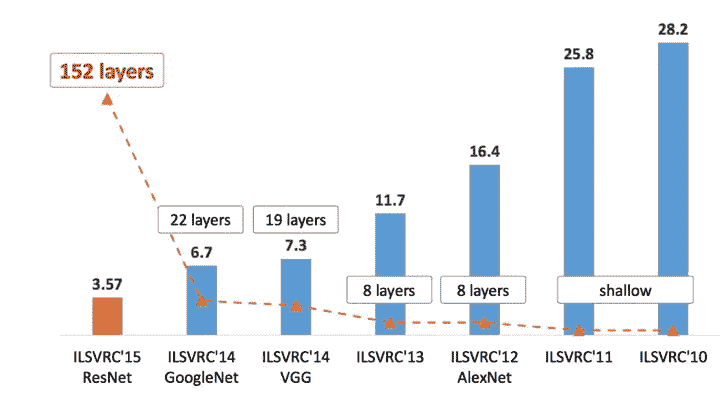
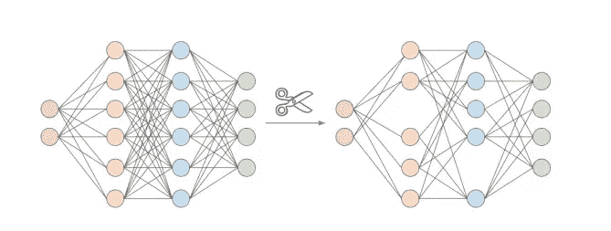
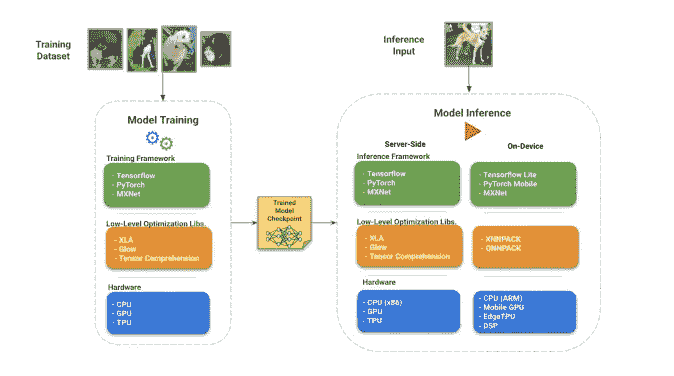
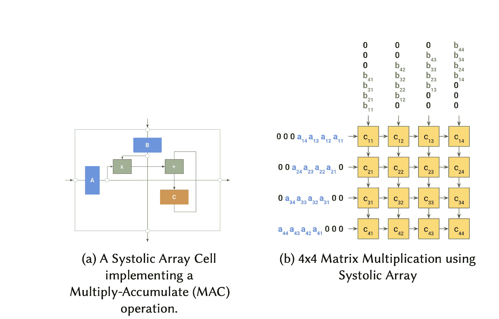
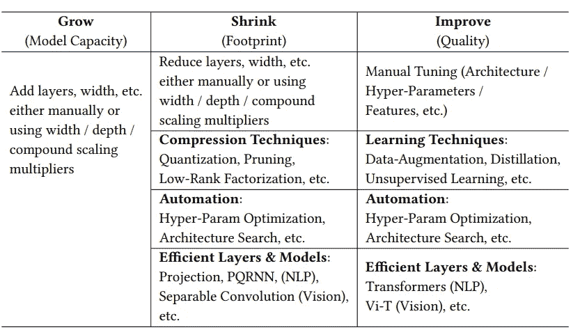

# 解码高效深度学习——通向更小、更快、更好模型的途径

> 原文：<https://medium.com/geekculture/decoding-efficient-deep-learning-path-to-smaller-faster-and-better-models-a8dc37be2560?source=collection_archive---------10----------------------->

在当今精通技术的世界，有一句名言说预测未来不是魔法，它被称为人工智能，而数据本质上是其背后的新科学！机器学习和人工智能领域正在以惊人的速度发展。每个研究人员都在努力实现最好的模型，并不断超越基准。

在现实世界中，当部署一个模型时，必须花费大量精力来分析深度学习模型是否可以有效地扩展，以适应那些可能没有数百万美元来训练模型和庞大机器来部署模型的人。深度学习和人工智能已经使人类能够从本质上大海捞针，然而让我们更深入地探讨如何通过提高效率来使这门科学变得更容易理解。

深度学习的总趋势是，如果我们能够训练更大的模型，我们总是可以获得更好的性能，因为我们有很多数据。这通常只适用于一种神经架构。例如，对于 ResNet，如果我们能够获得更深层次的新网络，我们可以获得更好的性能。这类似于一个初始模型。自然语言处理遵循类似的趋势。深度学习的崛起通常归功于 2012 年举行的 ImageNet 竞赛，其中 AlexNet(以首席开发人员 Alex Krizhevsky 命名)等模型的表现比第二好的提交作品高出 41%。这导致了一场竞赛，以创建更好、更强大的具有更多参数和复杂性的神经网络。

Comparison of various CNN architectures ([Photo Credit](/analytics-vidhya/cnns-architectures-lenet-alexnet-vgg-googlenet-resnet-and-more-666091488df5))

与神经网络相结合的深度学习已经成为自然语言理解、语音识别、计算机视觉、信息检索等领域中谈论最多和占主导地位的技术之一。随着深度学习模型的不断改进，它们的参数数量、延迟、训练所需的资源等。都显著增加了。因此，关注模型度量而不仅仅是其质量变得至关重要。

> 本文旨在提供研究论文[高效深度学习:关于让深度学习模型更小、更快、更好的调查中调查的高效深度学习技术的概述。](https://arxiv.org/pdf/2106.08962.pdf)

# **在培训或部署模型时面临哪些挑战？**

深度学习实践者通常每天都会面临以下挑战:

1.  **可持续的服务器端扩展:**尽管培训可能是一次性成本，如果使用预先训练的模型，甚至可能是免费的，但训练和部署大型深度学习模型通常是昂贵的。这是因为一旦部署了模型，就需要在很长一段时间内对其进行推理，从而导致服务器端 RAM、CPU 等的消耗..
2.  **支持设备上部署:**一些深度学习应用程序需要在物联网和智能设备上实时运行，因为隐私、连接和响应等原因，推理直接在设备上发生。这就是为什么深度学习模型需要针对更大的目标设备进行优化。
3.  **隐私&数据敏感性:**有时用户数据可能是敏感的，不容易被访问。在这些情况下，人们需要学会能够使用尽可能少的数据来有效地训练模型。
4.  **新应用:**深度学习实践者面临的另一个挑战是，一些新构建的应用提供了现有现成模型可能无法解决的模型质量或足迹相关的约束。
5.  **模型爆炸:**人们可能需要为不同的应用程序训练和/或部署多个模型，以达到期望的准确性和性能。然而，使用多个模型可能会耗尽可用的资源。

# **一个心智模型**

由于计算能力的提高、高效的硬件以及每个相关组件技术能力的整体增长，今天的技术已经将智能从云端推向了边缘设备。然而，在边缘设备上实现深度学习更加复杂，因为涉及更多的计算复杂性，例如微控制器上的存储器大小只能限制在几兆字节。为了能够在手机或微控制器上实现类似于设备人工智能的东西，我们需要更有效的深度学习模型。为了更广泛的视角，让我们从建立高效深度学习方法的心智模型开始，这是一种更小、更快、更好的高效深度学习方法。

A mental model for thinking about algorithms, techniques, and tools related to efficiency in Deep Learning [(Photo Credit)](https://arxiv.org/pdf/2106.08962.pdf)

下面解释了高效深度学习环境中模型效率和优化的多个重点领域:

**压缩技术:**在压缩技术中，我们从优化算法架构的角度来看待算法。本质上，这种技术的目标是看大模型是否可以转换成小模型，最终目标是部署在边缘设备上。压缩技术的一个很好的例子是量化。它基本上包括通过降低图层的精度来降低图层的权重。应该注意的是，压缩并不是通过将浮点舍入到最接近的整数来盲目地转换数字，而是应用了一种算法来确保没有质量损失。量化的好处清楚地勾勒出更好的性能，并在边缘设备上实现深度学习模型。

Illustration of pruning weights (connections) and neurons (nodes) in a neural network [(Photo Credit)](https://arxiv.org/pdf/2106.08962.pdf)

**学习技术:**学习技术可以被认为是传统监督学习算法的替代品。这些技术通常尝试以不同的方式训练模型，以实现更好的质量度量准确性、F1 分数、精确度、召回率等。，而不会以任何方式影响推断。目标是用较小的模型实现相同的基线质量，即使这意味着在质量和模型中的参数/层数之间进行折衷。为了提高效率，我们制作了较小的模型或学生模型来匹配较大的模型或教师模型。通过最小化损失函数，知识从教师模型转移到学生模型。具有更多参数的较大数据模型可用于为较低容量的模型标记数据。这确实有助于提高推理速度，减少存储大小，并使其更易于访问较少的计算可访问性。

Distillation of a smaller student model from a larger pre-trained teacher model ([Photo Credit](https://arxiv.org/pdf/2106.08962.pdf))

**自动化:**另一种优化方法是调整超参数以提高准确性，然后可以用参数较少的模型来代替。例如，如果我们试图对数据集进行分类以检测鸢尾花，其中基于花瓣、萼片宽度和长度，数据集试图预测它是什么类型的花。即使选择了最优模型进行预测，也有那么多参数可供选择。为了进一步优化模型，我们可以使用超调，即在选择模型后选择最佳参数的过程。训练-测试-分割方法可用于初始化参数并观察每个参数的得分/准确度。然后，该分数可用于将较大的模型替换为具有较小参数和相似精度的模型。双赢！

**高效架构:**从根本上说，这些是从头开始设计的基本构建模块，如卷积层和注意力层，这是对以前使用的基线方法的重大飞跃。这种方法的一个例子是卷积层，它引入了用于图像分类的参数共享，避免了为每个输入像素设置单独权重的需要。这些架构可以直接提高效率。它需要从基线模型中获得一些见解，并通过设计来设计更高效的层和模型，这一切都是为了让深度学习变得更小、更快、更好！

**基础设施:**为了高效地运行和训练深度学习推理，必须有良好的软件和硬件的强大组合。它分为两部分，第一部分是模型训练，第二部分是模型推理。对于本次调查的范围，我们来看看模型推理部分，因为这里的目标是使深度学习对边缘设备有效。让我们看一下对构成关键模型效率的高效基础架构的组件的全面调查。在模型推理时，根据推理是在服务器端还是在设备上，推理框架由 Tensorflow、PyTorch 或 Tensorflow Lite、Pytorch Mobile 组成。低级优化库包括 XLA、Glow 和张量理解。

A visualization of hardware and software infrastructure with emphasis on efficiency ([Photo Credit](https://arxiv.org/pdf/2106.08962.pdf))

GPU 和 TPU 等硬件可以用来加速线性代数运算。这些天来，GPU 已经针对高效的深度学习模型进行了标准化，Nvidia 已经对他们的 GPU 进行了几次迭代，更加关注深度学习。他们还推出了专门为高效深度学习应用设计的张量核。在张量核中，核心加速来自于以较低的精度进行昂贵的矩阵乘法，这使得深度学习更加有效。
谷歌设计的 TPU 更专注于 ML 应用，专门用于加速 Tensorflow 的深度学习应用。TPUs 的核心架构采用脉动阵列设计。在 Systolic 架构中，大量计算被拆分到网状设计中。网格中的每个单元计算部分结果，并在每个时钟内按顺序传递给下一个单元。这种设计的优点是，由于不需要访问中间寄存器的结果，一旦所需的数据被取出，整个计算就不受存储器限制。

下图概述了实施 MAC 操作的脉动网状拓扑结构，其中 A 水平馈入阵列，B 随每个时钟垂直推送。得到的 a(ij)和 b(jk)在每个时钟周期被传递到下一个时钟单元。

Systolic Arrays in TPUs ([Photo Credit](https://arxiv.org/pdf/2106.08962.pdf))

# **从业者效率指南**

到目前为止，我们已经看到了工具和技术，但人们是否使用它来实现高效的深度学习呢？基于我们迄今为止的理解，我们知道在深度学习模型中实现效率的关键是**帕累托最优模型**，其中我们希望在一个维度上实现最好的可能结果，同时保持其他维度不变。通常，这些维度中的一个是质量，另一个是足迹。一些质量相关的度量可以是准确度、F1、精确度、召回率、AUC 等。而一些与占用空间相关的指标可能包括模型大小、延迟、RAM 等。这些指标之间的关系可以被认为是一种权衡，这意味着，具有更高大小和延迟的模型极有可能实现更高的准确性和性能。类似地，具有较低尺寸和容量的模型可能会交付较差的准确性相关指标。下图总结了这种关系:

这种权衡可以通过两种方式实现——**增长**和**收缩**。也就是说，我们可以通过压缩模型容量，用一些质量来换取更好的足迹，从而进一步增强模型的质量度量。这个过程叫做收缩。另一方面，也可以通过向模型添加更多容量来提高模型质量。这个过程叫做成长。

Trade off between Model Quality and Footprint ([Photo Credit](https://arxiv.org/pdf/2106.08962.pdf))

因此，可以有两种效率策略来实现帕累托最优模型，帮助我们更接近目标模型:

**对内存占用敏感的模型进行收缩和改进:**如果希望减少内存占用，并保持设备上部署和服务器端模型优化的质量不变，可以采用这种策略。收缩可以通过学习压缩技术、架构搜索等来实现。并且应该理想地导致模型质量的最小损失。

**对质量敏感的模型的增长-改进-收缩:**当一个人想要部署具有更好质量的模型，同时保持相同的足迹时，就遵循这个策略。我们首先向模型添加容量，然后使用学习技术、自动化等改进模型。使用这种策略的另一个优点是，模型也可以在增长后直接收缩。

Examples of techniques to use in the Grow, Shrink, and Improve phases ([Photo Credit](https://arxiv.org/pdf/2106.08962.pdf))

# 结论

为了展示我们对高效深度学习的了解，我们可以得出结论，为了在基于深度学习的模型中实现效率，我们需要首先使用本文中讨论的效率技术来实现新的帕累托边界。根据期望的结果，可以单独使用这些技术或者组合多种技术。一旦我们缩小了我们的技术，我们展示了“收缩-改进”和“增长-改进-收缩”策略的权衡。

换句话说，我们提供的经验证据表明，既可以减少模型容量以减少占用空间(收缩)，然后恢复他们所交换的模型质量(提高)，也可以增加模型容量以提高质量(增长)，然后进行模型压缩(收缩)以提高模型占用空间。

这篇文章对高效深度学习的广阔前景提供了有用的见解，为从业者提供了从次优模型到同时满足质量和足迹标准的模型所需的信息。

我要感谢作者和谷歌研究团队在模型效率领域所做的大量工作和研究。

我希望这篇文章能启发你进一步探索高效深度学习的领域，并帮助你在训练和部署模型时做出关于效率的正确决策！

## 快乐学习！:)

**参考文献:**孟哈尼，G. (2021)。高效深度学习:让深度学习模型更小、更快、更好的调查。 *arXiv 预印本 arXiv:2106.08962* 。