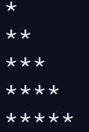

# 初学图案印刷的解码问题—第一部分

> 原文：<https://medium.com/geekculture/decoding-the-pattern-printing-problems-for-beginners-part-1-4b92a7ee7ef3?source=collection_archive---------20----------------------->

> 当你看到一个图案印刷问题的时候，你就来对地方了！


Photo by [Martin Sanchez](https://unsplash.com/@martinsanchez?utm_source=medium&utm_medium=referral) on [Unsplash](https://unsplash.com?utm_source=medium&utm_medium=referral)

到本文结束时，你将能够自己编写至少 10 行代码，如果你还没有这样做过的话。提醒一句，如果您不确定循环的[的语法，请学习一下，然后回来😊](https://www.programiz.com/c-programming/c-for-loop)

现在让我们开始解码那些面试中经常被问到的模式问题。打开你最喜欢的 IDE，边读边写代码。

这里有一些我们将在程序中用到的变量。

**nst** —恒星数量。

**cst** —数星星。

*“人生的唯一目标* ***cst*** *就是赶(注****CST****始于****c****)****NST***😉."

继续读下去，过一段时间就会明白了。使用与上述相同的变量名很重要。

对于图案印刷问题，我们总是需要至少两个循环。

问题 1:打印 n * n 个方块

如果 n = 5，那么我们的输出应该是:


如果 n= 2，那么我们的输出应该是:


现在我们开始编码吧！！

如果 n = 5，我们将打印一个 5 * 5 的正方形，如上所示。看看第一排。找出 n 和第一行星星之间的关系。如果 n = 5，那么我们图案的第一行将有 5 颗星。如果 n = 3，那么我们图案的第一行将有 3 颗星。如果 n = 2，那么我们图案的第一行将有 2 颗星。

因此对于任何 n，我们将在第一行有 n 颗星。如果你明白了这一点，你就基本上解决了问题！我们将用这个值初始化 **nst** 。

所以，让我们初始化， **nst = n**

```
int nst = n; 
```

我们将使用第一个 for 循环来初始化 pattern 中的行数。也就是说，对于 n = 5，我们将有 5 行。

这意味着从 row = 1 到 row = n

```
for(int row =1; row < = n; row++)
```

现在让我们帮助我们的科学小组抓住科学小组

```
for(int cst= 1; cst< = nst; cst++)
```

现在让我们印星:

```
printf(“*”);
```

就是这样！

**完成程序:**

**问题 2:直角三角形图案**

现在让我们尝试另一种模式！

对于 n = 5，我们应该打印以下模式:



如果 n = 5，我们将打印一个直角三角形，如上所示。看看第一排。找出 n 和第一行星星之间的关系。如果 n = 5，那么我们图案的第一行将有 1 颗星。如果 n = 3，那么我们图案的第一行将有 1 颗星。因此，我们可以发现第一行中的恒星数量与 n 无关。因此，让我们将 **nst** 的值硬编码为 1。

那么，让我们初始化， **nst = 1**

```
int nst = 1;
```

我们将使用第一个 for 循环来初始化 pattern 中的行数。也就是说，对于 n = 5，我们将有 5 行。

这意味着从 row = 1 到 row = n

```
for(int row =1; row < = n; row++)
```

现在让我们帮助我们的 **cst** 赶上 **nst** ！

```
for(int cst= 1, cst< = nst, cst++)
```

现在让我们印星:

```
printf(“*”);
```

现在我们已经在第一行打印了一个星号。我们可以观察到，在我们的图案中，每行的星星数增加了 1。

因此，我们将把 **nst** 的值增加 1。

```
nst = nst + 1
```

就是这样！

**完整程序:**