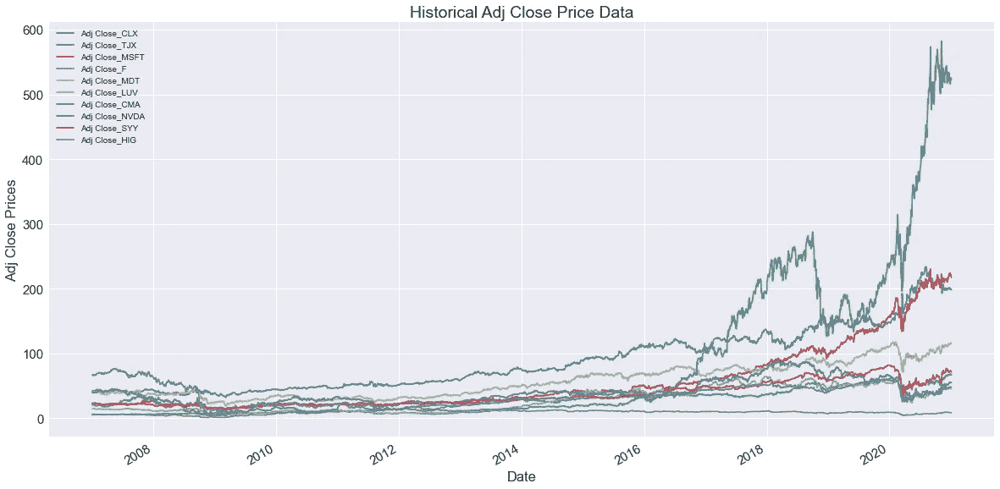
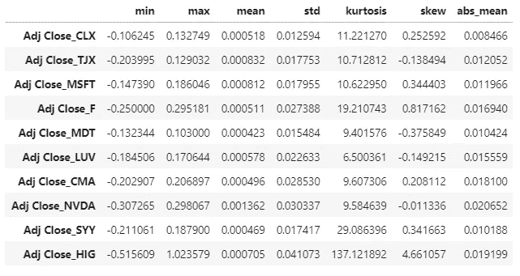
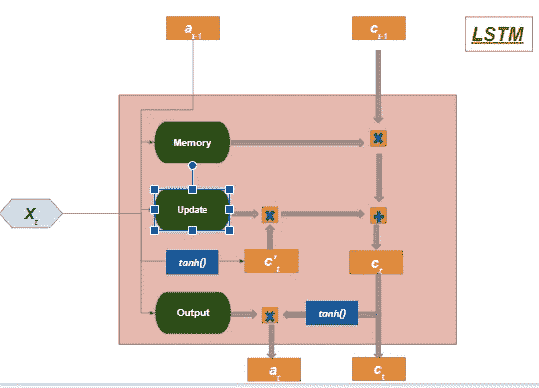
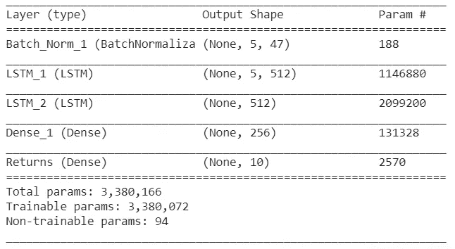
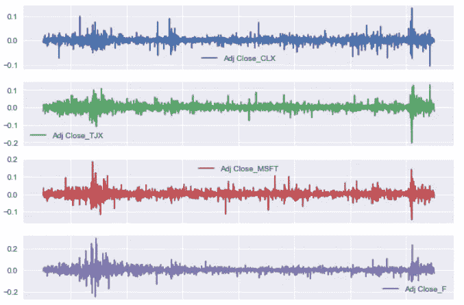
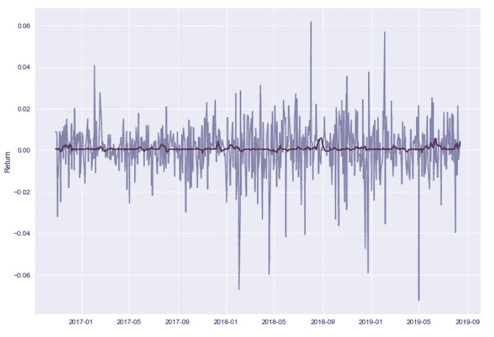
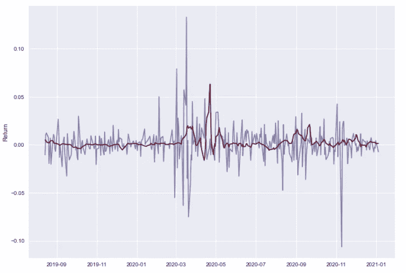

# 深度学习和投资组合管理

> 原文：<https://medium.com/geekculture/deep-learning-and-portfolio-management-b3b983528a06?source=collection_archive---------4----------------------->

## 用递归神经网络预测收益

# **项目定义**

随着深度学习的发展和免费高频金融数据在线可用性的增加，实现这些技术来预测行为和管理资产的机会出现了。利用这些可用信息进行决策，是构建优秀投资组合和决定资产配置的关键。

在这个项目中，我使用机器学习算法，特别是递归神经网络，来预测符合投资组合的已定义资产领域的资产回报。有了这个预测，我就可以优化投资组合权重，决定每项资产的分配，从而创建未来的最优投资组合。

## 问题陈述

这个项目的目标是定义一个具体的投资组合宇宙(投资组合中可用的一组股票)，它由至少自 2007 年 1 月以来一直在 S&P500 股票指数中的股票划分。利用其中 10 只股票的历史价格数据，我训练了一个回报预测模型。

回报预测的理念是投资者有能力及时行动，在符合投资组合的资产之间充分分配资金(由分析期间投资组合中每项资产的权重表示)。这是通过寻找最优权重或参与度来实现的，这样投资组合的夏普比率就最大化了。

## 韵律学

为了评估模型的性能，我使用了[休伯损失](https://en.wikipedia.org/wiki/Huber_loss)和均方根误差(RMSE)。使用 Huber 损失指标是因为它对异常信息不太敏感，这是高波动性环境中回报的一个特征。RMSE 是一个对异常值更敏感的指标，尽管不太常见，但在金融场景中考虑是很重要的，因为这些罕见的值可能会对投资组合的表现产生影响，如果不考虑，会破坏投资者的价值。

所有的代码和更深入的解释都可以在我的 [GitHub 库](https://github.com/Alejandro-Duenas/deep-learning-portfolio)中找到，其中在[笔记本](https://github.com/Alejandro-Duenas/deep-learning-portfolio/blob/master/notebook.ipynb)中呈现了过程和结果。

# 分析

## 数据探索和可视化

由于简化金融数据访问和操作的 API 的开发，以及机器学习算法和计算硬件的快速发展，现在我们可以结合这些工具来增强我们的投资组合。

第一步是定义可供选择的股票范围。为此，我使用了在 [S & P500 inde](https://en.wikipedia.org/wiki/List_of_S%26P_500_companies) x 中列出的股票。然后我选择了至少自 2007 年 1 月(分析期的开始)以来就在该指数中的股票子集。由于计算能力的限制，我从这些大组中选择了 10 只股票，它们符合我余下练习的投资组合。

在这个项目中，我使用了[雅虎财经 API](https://pypi.org/project/yfinance/) 来计算符合我投资组合的 10 只股票的历史每日价格。在下表中，您可以看到所选股票的代号和名称:

Subset of stocks of the S&P500 used for this project. Source: Wikipedia.

此外，我使用了取自 [Quandl API](https://www.quandl.com/tools/python) 的一组因素的历史信息。在以下情况下使用的因子:I)现货 WTI 价格，其是能源价格的代理；ii)10Y-2Y 国债息差作为对[收益率曲线](https://en.wikipedia.org/wiki/Yield_curve)斜率的衡量(它捕捉了对未来利率的预期，因此是市场参与者预期的一个窗口)，这有时被用作未来危机的信号；iii)10Y-3M 国债息差；iv)3 个月(3M)国库券的二级市场收益率，也用作[无风险利率](https://en.wikipedia.org/wiki/Risk-free_interest_rate)；以及 TED 利差，衡量伦敦银行同业拆放利率和 3M 国债利率之间的差异，这是货币市场流动性状况的信号。

在下图中，我们可以看到为该项目选择的股票子集的历史调整收盘价，可以清楚地看到每只股票在其价格中呈现的高波动性。我选择了每日调整收盘价，以消除股息支付和股票分割的扭曲。

可以看出，股票表现出不同的行为，在某些情况下，增长非常快，而在其他情况下，价格变化较慢，波动较小。

Jan, 2007 — Jan, 2021\. Source: Yahoo Finance.

波动性和行为的这些差异是投资者必须利用的一个特征，因为正如 CAPM 理论所发现的，这些差异允许投资者分散特质风险并建立有效的投资组合。

下一步是计算每项资产的每日回报，这是通过使用 pandas 库中的 *DataFrame.pct_change(1)* 函数来完成的，该函数测量历史价格的一步变化。因为数据的频率是每天一次，所以这些函数计算被分析资产的每日回报。下表汇总了这些回报:

Descriptive Statistics of the returns of the 10 stocks selected

股票回报的一个重要特征是它与市场投资组合回报的关系，也称为股票的*贝塔*。这是一个衡量股票回报对市场整体表现(由市场投资组合表示)变化的平均敏感程度的指标。我使用了[间谍 ETF](https://en.wikipedia.org/wiki/SPDR_S%26P_500_Trust_ETF) 的回报，这是一只跟随 S & P500 指数的 ETF。不同股票的结果如下:

alphas and betas of the 10 stocks selected

# 方法学

为了促进预测过程，关键是要找到解释不同类型风险暴露的不同因素。一些经典因素是与市场行为的关系(也称为资产的贝塔系数)或其对能源价格变化的敏感性(如 WTI 现货石油价格)。本文将更详细地探讨其中的一些因素，并将其用作下面开发的模型的构建模块。

## 数据预处理

根据股票的历史价格数据，以及上面提到的能源和货币市场信息，我计算了一些传统上用于技术分析的指标和因素。

我对股票的历史价格做了三个主要的转换:

1.  **动量**:该指标以滚动窗口方式衡量趋势，如下所示:

2.**简单移动平均线**:该指标可以解释为资产的“真实”价值，计算方法如下:

3.**布林线**:这一指标向技术分析师提供了何时买入或卖出资产的信号。计算如下:

关于 WTI 现货价格，我计算了每日变化率，这样我们就可以捕捉到这一重要因素的变化。对于收益率曲线和货币市场信息，我没有进行额外的转换，因为利差和利率显示了我想要的数据。

由于我用来预测股票回报的模型类型，我需要转换数据结构。正常的时间序列数据采用列表格式，最早的值在最上面，较新的值按顺序排列。然而，对于模型，我需要将数据重新排列成输入-目标对，定义一个时间窗口。时间窗口定义了我将使用多少过去的数据( *t-1，t-2，…，t-k)* 来预测值 *t.* 为了实现这一点，我创建了一个 *WindowGenerator 类，*，它允许我重新格式化输入-目标对中的数据，产生一个 *tensorflow.data.Dataset* 对象，具有以下形状:

对于这个项目，我选择了 5 天的时间窗口和 1 天的预测窗口(即模型只预测前一天的回报)。这可以改变，增加时间和预测窗口。该类以及其他关键类和函数可以在以下文件中找到:

> 财务 _ 数据. py

## 实现:用递归神经网络预测回报

有了数据，现在是时候构建一个模型架构来预测符合我们玩具投资组合的资产的回报了。由于价格和回报数据的时间序列性质，我决定使用递归神经网络。这种体系结构被设计用来捕捉变量之间的顺序关系。特别是，我使用了*长短期记忆(LSTM)* 单元来捕捉预测变量和目标变量之间的短期和长期关系，由于使用了记忆、更新和输出门，它可以存储长期和短期信息，然后传输到网络中的下一个单元:

LSTM Unit diagram

## 模型建立和改进

一个非常重要的过程是为预测模型确定适当的架构。为此，我创建了一系列不同的模型，从简单的 1 个循环层(使用 LSTM 单位)接着 1 个密集层开始，到多个循环层接着多个密集层，中间是批量标准化层。

用于测量模型不同迭代性能的指标，其中 [Huber 损失函数](https://en.wikipedia.org/wiki/Huber_loss)(对异常值不太敏感)和 MSE(是 RMSE 的平方)。数据集按时间顺序分为三个子集:训练数据集包含前 70%的目标窗口对；验证数据集包含下面的 20%，测试数据集包含最后的 10%。这三个子集被混洗以减轻顺序偏差。

基于上述训练和验证数据集的损失值，我选择了以下架构:

RNN model, using TensorFlow

为了定义模型的学习率，它是所使用的 [Adam Optimizer 算法](https://towardsdatascience.com/adam-latest-trends-in-deep-learning-optimization-6be9a291375c)的一个超参数，我创建了一个学习率调度回调，以查看哪个学习率可以更平滑地减少损失函数。下面你可以看到我尝试不同学习速度的图表，并计算了产生的损失。我选择的学习率是 1e-3 (0.001):

## 模型评估和验证

在 Google Colab 环境中训练的不同模型，因为加速训练过程的 GPU 硬件的可用性是测试模型的不同变体的关键。最终模型在 5 天的时间窗口上训练，如上所述，该时间窗口可以改变为更长的时间窗口。然而，经过一些调整，这些窗口大小导致了更好的性能。我使用检查点回调来保存损失最低的模型。训练过程“收敛”得相对较快，这可以从下面的 ***损失与时期*** 图中看出:

图表显示，对于训练和验证损失，优化算法很快达到平稳状态。这可能意味着需要更多的数据来更好地捕捉回报行为的复杂性，以便我们可以继续减少损失函数，可能是通过添加更好的因子。另一种选择是，由于回报数据中的高波动性，模型发现难以捕捉潜在行为，这可以从回报行为的示例中看出:

如上所示，模型训练过程导致关于验证和训练数据的快速收敛。另一个需要注意的重要事情是，模型似乎没有过度拟合训练数据，因为在所有时期，训练损失从未低于验证损失。

当我用测试数据(最新数据)评估 RNN 时，我得到:

> 胡伯损失= 0.0010
> 
> RMSE = 0.0319

此外，为了更好地掌握这种性能，我绘制了验证集和测试集的实际回报和预测回报。下面是该结果的一个示例:

Validation Dataset: The Clorox Company returns (red: forecast, blue: observed)

Test Dataset: The Clorox Company returns (red: forecast, blue: observed)

可以看到，回报是非常嘈杂的，这使得预测其行为更加困难，特别是在高波动的时候。其他方法可以为每个资产预测使用专门的网络，而不是使用一个 RNN 来预测一组资产，以便 RNN 专门捕捉每个股票的特殊性。本文末尾讨论了其他替代方案。

## 正当理由；辩解

在建模过程之后，有一点很突出:即使我使用了一个相对复杂的模型(有将近 340 万个参数)，资产的回报仍然是一个非常难以预测的目标变量。为了改善结果，首先我使用了更复杂的架构(正如在**模型构建和细化**部分所讨论的)，与更简单的模型相比，显著改善了结果。改善结果的另一个重要步骤是使用学习率计划为模型选择更好的学习率。这一改进路径中更重要的步骤在上面的章节中有所描述。

在使用了所有的调整和不同的架构之后，训练和验证数据集的损失函数停止改进，即使使用更长的时间窗口或不同的批量大小。人们可以得出结论，返回数据是非常嘈杂的，这限制了模型的预测能力。这是可以理解的，因为随机事件可能会极大地影响一组股票的回报(如在高波动时期所见)。

一种更简单的方法是预测每日回报的变化方向，甚至预测价格，然后根据预测的价格计算回报。预测这些回报是每个投资者面临的挑战，但随着数据源的增长，我们可以抓住新的数据类型来改进我们的模型和预测。

# 资产配置:优化投资组合

一旦我们有了预测模型，我们现在就可以优化我们的投资组合。为了实现这一点，我使用了一个函数来最小化负的[夏普比率](https://en.wikipedia.org/wiki/Sharpe_ratio)(即找到每项资产的权重，使得最终的投资组合最大化夏普比率):

i) R_p: return of the portfolio; ii) R_f: risk-free rate (daily return of 3-month T-bill); and iii) sigma_p: standard deviation of the portfolio.

投资组合的回报计算为符合投资组合的每项资产的*权重*回报*之和。然后，我们计算投资组合回报的平均值，这是投资组合的预期回报，也是夏普比率公式中的 *R_p* 。作为无风险利率，我使用了 300 万英镑美国国债的日收益率。

在这个项目的笔记本中，我开发了这些优化函数的滚动窗口，这样投资者可以以更动态的方式分配他/她的资产。这增加了更多可以改变以改善结果的窗口，因为选择更宽的窗口可以导致对投资组合回报的预期回报的更好估计，但使资产配置对快速变化的反应更差。

# 结论:教训和挑战

如该项目所示，由于雅虎金融(Yahoo Finance)或 Quandl 等平台中金融数据的可用性，以及深度学习技术的发展，如使用的递归神经网络，投资者可以提高他/她的投资组合管理能力。这种新技术和技巧可以与传统方法(如所示的投资组合优化)相结合，以实现自动化并创建更好的资金分配标准。然而，由于这些数据的噪音性质，在回报预测领域存在许多挑战。

还有许多事情有待进一步探索，例如神经网络可以利用的更高频率数据的使用。或者对符合投资组合的每只股票的回报使用专门的模型。此外，我们可以管理更大的投资组合，或者发现/创建新的因素作为深度学习模型的输入变量。

此外，还有许多非传统数据的新数据源。这方面的例子包括使用 NLP 通过新闻和推文的实时反馈来捕捉市场情绪，或通过计算机视觉算法(如 CNN)利用卫星图像。这些不仅仅是找到新的更好的因素来增强我们的模型，我们需要有创造力，利用数字时代带来的每一个字节的数据。