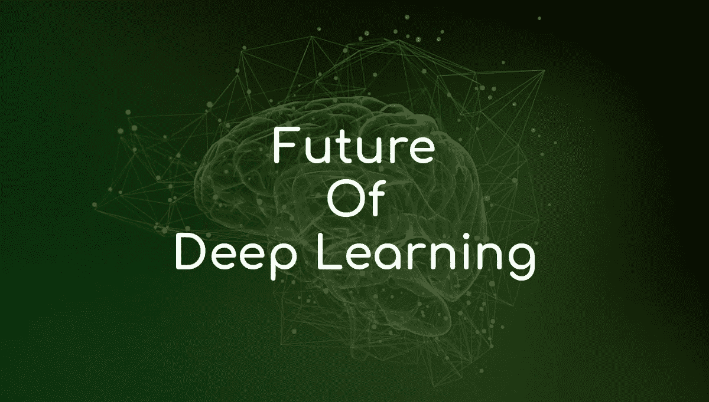

# PyTorch 深度学习第一部分:什么是深度学习？

> 原文：<https://medium.com/geekculture/deep-learning-with-pytorch-part-1-what-is-deep-learning-9759d3fd46d4?source=collection_archive---------20----------------------->

## 开始利用 PyTorch 征服深度学习的旅程

Photo by [Matt Duncan](https://unsplash.com/@foxxmd?utm_source=medium&utm_medium=referral) on [Unsplash](https://unsplash.com?utm_source=medium&utm_medium=referral)

这将是我系列的第一部分:用 PyTorch 进行深度学习。当我正在学习深度学习& PyTorch 的来龙去脉时，我认为与社区分享我的学习会对我有益。因此，我创作了这个系列。我希望在本系列结束时，您将精通 PyTorch &并有足够的知识来应用深度学习。此外，在这个系列中，我强烈建议您超越文章中提供的信息，以全面深入地了解深度学习。在本系列的第 1 部分中，我将在更高的层次上讨论深度学习。

An illustration depicting nodes connecting to other notes like in an artificial neural network. Image Link: [neural_network-fullsize.png](https://electronics360.globalspec.com/article/8956/creating-neural-networks-in-python), Image credit: Jonathan Heathcote

# 深度学习 v.s 机器学习 v.s 人工智能

在我们深入研究深度学习到底是什么之前，我认为建立人工智能、机器学习和深度学习之间的关系很重要。此图很好地展示了 3 个字段之间的关系:

Deep Learning v.s Machine Learning v.s Artificial Intelligence

 [## 什么是人工智能、机器学习、深度学习？- KDnuggets

### 通过 RapidMiner。赞助帖子。几乎没有一天我们看不到任何关于人工智能的新闻…

www.kdnuggets.com](https://www.kdnuggets.com/2017/07/rapidminer-ai-machine-learning-deep-learning.html) 

注意，我附上了上面的文章作为这次讨论的参考资料。此外，我从中获得了插图。

如图所示，人工智能(AI)是任何为计算机提供模仿人类行为能力的方法。人工智能的一个例子是 iPhone 的虚拟助手 Siri。Siri 是人工智能的一个明显例子，因为 Siri 能够模仿人类行为，例如能够更新你的日历或给你的朋友打电话。

另一方面，机器学习(ML)是人工智能的一个分支，它依赖于统计模型来进行预测分析。例如，假设你从事房地产行业，你想知道如何给一栋新房子定价。理论上，如果你给 ML 模型输入适当的数据，你将能够对给定的新房子的价格做出充分的预测。ML 到处都在应用。我们可以看到它积极影响许多行业，如房地产，医药，等等！

深度学习(DL)是 ML 的一个子部分。本质上，DL 的面包和黄油是神经网络(如果您不知道这些是什么，请不要担心，我将在后面的文章中详细介绍)。DL 与经典 ML 的区别在于 DL 能够很好地伸缩&执行复杂的任务，比如图像识别。这是因为 DL 利用了比经典 ML 模型更复杂的神经网络(假设您正在利用复杂的多层结构)。值得一提的是，DL 概念已经存在了一段时间，但研究却因为计算机当年缺乏动力而停止了。然而，在计算机变得足够强大来运行这些复杂的神经网络之后，DL 在 2010 年代后期卷土重来(你可以为此特别感谢 GPU)。

只是重新封顶，AI 是大伞，ML 是 AI 的一个小节，DL 是 ML 的一个小节。

# 什么是深度学习？

IBM 在下面的文章中对深度学习的定义如下:

> 深度学习是机器学习的一个子集，其中多层神经网络——被建模为像人脑一样工作——从大量数据中“学习”。在神经网络的每一层中，深度学习算法重复执行计算和预测，逐步“学习”，并随着时间的推移逐步提高结果的准确性。

 [## 什么是深度学习？

### 深度学习模拟人类大脑，使系统能够学习识别物体并执行复杂的任务…

www.ibm.com](https://www.ibm.com/cloud/learn/deep-learning) 

这句话中有很多需要解释的地方。别担心，我会把它分解成简单、全面的理解。本质上，简单来说，深度学习是利用神经网络建立复杂模型的机器学习的子集。这些模型非常灵活，因为这取决于工程师如何将模型组合在一起。再者，深度学习的本质是能够把一堆简单的计算组合起来，形成一个复杂的计算。它本质上遵循这样的思想，即拥有许多能够执行小型计算的单元比拥有几个能够执行复杂计算的单元要好。

我将在下一篇文章中深入研究神经网络，但我想在结束这一部分之前说，深度学习以其代表人类思维方式的能力而自豪。这些神经网络代表了我们大脑中的神经元网络。认知科学家一直在争论这个模型有多准确。

# 深度学习的应用

Just some applications of Deep Learning; Link to Image: [https://blog.quantinsti.com/machine-learning-basics/](https://blog.quantinsti.com/machine-learning-basics/), Image Credit: QuantInsti

深度学习的应用可以在我们的日常生活中看到。小到推荐电影，大到肿瘤分类。深度学习对很多领域都有很大的影响。深度学习应用的一个非常常见的例子是特斯拉的自动驾驶系统。无论你是否拥有一辆特斯拉，你都很可能熟悉特斯拉的自动驾驶系统。本质上，这个想法是让汽车自动驾驶。显然，这项技术还在发展中；然而，它显示了深度学习如何影响我们的生活。

深度学习的另一个值得注意的应用可以在医学上看到。我认为真正值得一提的是，新冠肺炎疫苗是利用深度学习技术开发的。一些科学家认为，如果没有这些技术，开发一种合适的新冠肺炎疫苗将需要长得多的时间。这是因为深度学习使我们能够识别复杂的模式，这些模式可能由于我们有限的精神力量而无法看到。当我说智力有限时，我指的是我们无法快速计算复杂的数学函数。

正如前面两个例子所示，深度学习让我们能够开发系统来解决复杂的问题，本质上，让我们每一个人的生活变得更简单。

# 深度学习的未来

Link to Image: [https://www.geekboots.com/story/future-of-the-deep-learning](https://www.geekboots.com/story/future-of-the-deep-learning)

虽然深度学习的概念已经存在了一段时间，但直到最近，行业和研究才开始涉足深度学习。考虑到这一点，深度学习领域正在进行大量研究。一些常见的例子是创建各种神经网络架构或设计新的激活函数(同样，如果您不熟悉这些术语，请不要担心，我将在未来的文章中详细解释它们)。此外，深度学习继续对行业产生积极影响。几乎每天都有大量依赖深度学习的新技术问世。考虑到这一点，深度学习有着非常光明的未来，并且是一个将会存在的领域。

# 结论

我想花点时间重新总结一下我在这篇文章中所涉及的内容。在本文中，我向您介绍了深度学习的高级定义。我向你介绍了深度学习的一些应用，同时也提到了深度学习与机器学习和人工智能的关系。最后，我以几句关于深度学习的未来的话作为结束。

希望，我已经能够成功地激发你对学习深度学习的兴趣了！我迫不及待地想和你一起踏上这次学习深度学习的旅程！我希望你喜欢我的文章，并对深度学习有所了解。下次见！

# 关于作者

我是罗格斯大学新不伦瑞克分校的本科生，正在攻读计算机科学和认知科学专业。此外，我正在辅修工商管理和数据科学证书。我已经应用机器学习一年多了，最近我开始涉足深度学习。我对人工智能的力量非常感兴趣，迫不及待地想与社区分享我的学习成果！请随时通过 LinkedIn 联系我，或者给我发电子邮件到 jinal.shah2821@gmail.com。