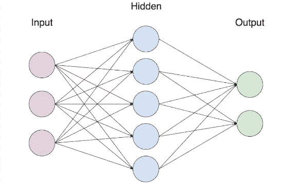
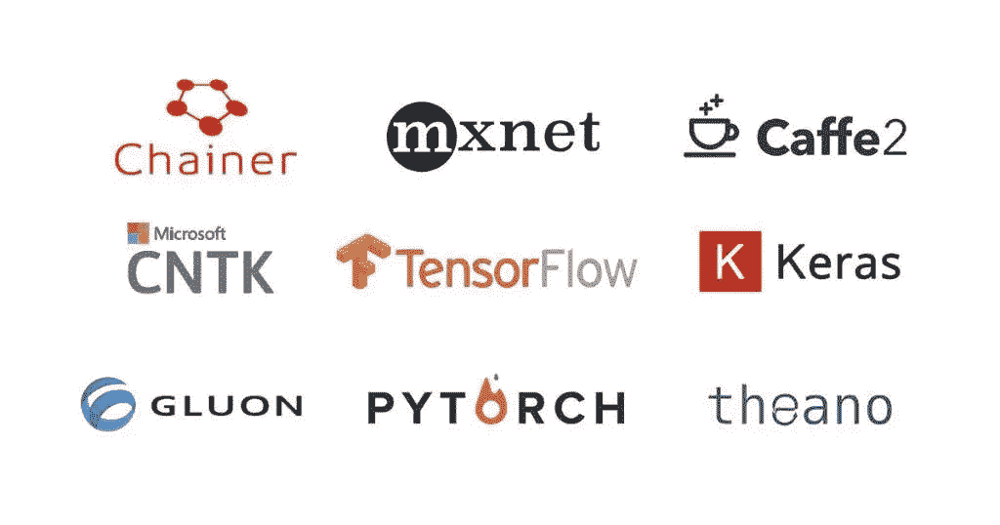

# 使用 PyTorch 进行深度学习第 2 部分:什么是神经网络？

> 原文：<https://medium.com/geekculture/deep-learning-with-pytorch-part-2-what-are-neural-networks-14aa939fd197?source=collection_archive---------32----------------------->

如果你研究过任何与深度学习或机器学习相关的东西，你可能听说过“神经网络”这个词。这些神经网络到底是什么？它们是如何工作的？是什么让他们如此强大？在这篇文章中，我将分解神经网络。本文是我用 PyTorch 深度学习系列的第二部分。如果你还没有阅读第一部分，我强烈建议你阅读。在第 1 部分中，我讨论了深度学习的高级概念。然而，关于第 1 部分已经说得够多了，让我们开始第 2 部分吧。

A simple Artificial Neural Network, Image Link: [main-qimg-3e46e8f59e28a696c0127e42be477dfb](https://qph.fs.quoracdn.net/main-qimg-3e46e8f59e28a696c0127e42be477dfb)

# 什么是神经网络？

在抽象层面上，神经网络是试图复制大脑神经连接的模型。它们由许多许多单元组成，这些单元连接到前一层的单元和下一层的单元(我将在下面描述层)。正如我在上一篇文章中所述，神经网络在多大程度上复制人类思维仍然是认知科学家们争论的话题。

有许多不同类型的神经网络(正如我下面提到的)；然而，为了概念上的理解，在接下来的两篇文章中，我将只讨论人工神经网络。上面的插图是人工神经网络的一个很好的例子。我们在本文和以后的文章中看到的概念可以应用于其他类型的神经网络。这就是深度学习的美妙之处:一旦你能够从概念上完全理解 ann 并实现 ann，理解其他类型的神经网络就变得相当容易了。其他类型的神经网络本质上是带有扭曲的人工神经网络。

人工神经网络由三个不同的层组成:输入层、隐藏层和输出层。在输入图层中，单位会接收数据的要素。例如，如果您正在构建一个人工神经网络来将肿瘤分类为恶性或良性，您的一些特征可能是肿瘤大小等。在隐藏层中，您将执行从输入到输出的复杂计算。在隐藏层中执行的具体计算是不清楚的，因为 ann(以及一般的神经网络)就像一个黑盒，这意味着你不知道为什么你会得到一个具体的结果，你只是知道。你可能已经猜到了，输出层把预测的输出吐给了具体的问题(具体的输出很大程度上取决于问题的类型)。

你的神经网络的性能很大程度上依赖于你的权重和偏差的质量。这些权重和偏差是什么？神经网络中的每个连接都有一个权重。这个权重只是一个对于重要的输入较高的数字&对于不太重要的输入较低。我理解这是否有点抽象；然而，在下一篇文章中，我将介绍人工神经网络的数学和其他关键的深度学习概念，希望这些概念有助于理解这一切。目前，我只想让你记住，连接的权重和偏差是性能的驱动因素。**你的权重&偏差越好，你的神经网络就会表现得越好**(这是相对于手头的任务而言的，因此，例如，如果你的任务是对猫&狗的图像进行分类，那么越好意味着网络在对这种图像进行分类时会有更高的准确性)**。**

# 不同类型的神经网络

就像我在上一节中所说的，在接下来的几篇文章中，我将只关注人工神经网络(ANNs 然而，我想让你明白，人工神经网络并不是唯一的神经网络。我还想指出的是，神经网络的类型不仅限于我讨论的那些。它们很多很多，如果你对发现其他类型的神经网络感兴趣，你可以转向深度学习研究论文。

一些常见类型的神经网络是人工神经网络(ann)、卷积神经网络(CNN)和递归神经网络(RNNs)。就像我之前说的，类型比我刚刚提到的要多得多。每种类型的神经网络都适合于解决某种类型的问题。例如，CNN 通常在处理计算机视觉问题时使用(它们还有许多其他用途，我们将在本系列的稍后部分看到 CNN)。你将选择哪种类型的神经网络很大程度上取决于你要解决的问题的类型。如果你正在处理一个像计算机视觉这样的复杂问题，人工神经网络可能不是最好的选择。你会想要更复杂的东西，因为任务已经变得更复杂了。

Various Deep Learning Frameworks, Link:[1*7C46N8tlMQg28Y631HUZDQ.jpeg](https://miro.medium.com/max/1024/1*7C46N8tlMQg28Y631HUZDQ.jpeg)

# 神经网络框架

用 Python 等编程语言实现神经网络可能会成为一项非常困难的任务，尤其是当您试图构建一个具有数百至数千层的神经网络时。幸运的是，有各种深度学习框架为我们做了繁重的工作。常见的有 PyTorch，Tensorflow，Keras，Caffe2 等。这些框架有什么区别？每个框架都有其优缺点；然而，一些主要的问题与谁开发了该框架以及该框架的易用性和灵活性有关。Keras 之类的框架非常容易学习和使用，但不如 PyTorch 或 Tensorflow 之类的框架灵活。完全诚实地说，你选择学习哪个框架真的不重要，它们在行业和研究中都非常常用(这种说法显然是有条件的，因为你不是选择学习 Torch 这样的古老深度学习库)。当然，这完全取决于您的偏好和您想要选择的编码语言。PyTorch、Keras、Tensorflow 等框架更面向 python 开发者，而 Deeplearning4j 等框架则面向 Java。

您可能想知道为什么我在所有这些框架中选择 PyTorch。老实说，我不知道。我的许多朋友都知道 Keras & Tensorflow，所以我决定学习 PyTorch 以与众不同。你可能认为我的决定背后没有逻辑推理，你是绝对正确的。这就像神经网络，你不知道你如何从开始到结束，但你就是这样做了。

# 结论

在本文中，我回顾了对神经网络的基本理解、神经网络的类型以及神经网络的框架。希望在这一点上，你已经在抽象层面上掌握了深度学习&神经网络。在下一篇文章中，我将深入研究人工神经网络。我将讨论人工神经网络背后的数学。公平的警告，你需要知道微积分的基本水平。通过微积分的基础水平，我的意思是你应该了解什么是导数，如何找到一个，以及如何使用导数找到全局最小值。

我还想提一下，我非常感谢对上一篇文章的支持。感谢那些花时间通读我的文章并给我提供一些积极支持和建设性批评的人。如果你对这篇文章有任何喜欢或不喜欢的地方，请在下面的评论中告诉我。我总是欣赏建设性的批评，这是我变得更好的方法之一。我请求你确保你的评论是恰当的。

如果您已经完成了这篇文章，非常感谢您！你的支持对我来说意味着整个世界，给了我继续写文章的信心。

# 关于作者

我是罗格斯大学新不伦瑞克分校的本科生，正在攻读计算机科学和认知科学专业。此外，我正在辅修工商管理和数据科学证书。我已经应用机器学习一年多了，最近我开始涉足深度学习。我对人工智能的力量非常感兴趣，迫不及待地想与社区分享我的学习成果！请随时通过 LinkedIn 联系我，或者给我发电子邮件到 jinal.shah2821@gmail.com。