# 在 Docker 容器上部署 Jenkins

> 原文：<https://medium.com/geekculture/deploy-jenkins-on-docker-container-aaa710a33572?source=collection_archive---------2----------------------->

💥在这篇文章中，我将在 **Dockerfile** 的帮助下**自动化**一个 **docker 容器**内的 Jenkins，然后**创建并执行**不同的 **Jenkins 作业**在一个容器内运行。

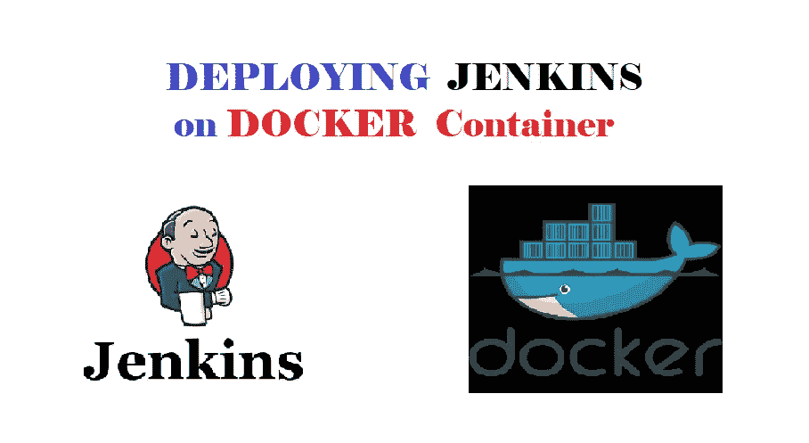

# ⚡Task Description⚡

**1。使用 Dockerfile** 创建安装了 Jenkins 的容器映像

**2。当我们启动这个映像时，它应该会自动启动容器中的 Jenkins 服务。**

**3。使用 Jenkins** 中的构建管道插件创建作业 1、作业 2、作业 3 和作业 4 的作业链

**4。Job1:部分开发者向 GitHub 推送回购时自动拉取 GitHub 回购。**

**5。Job2:通过查看代码或程序文件，Jenkins 应该自动启动相应的语言解释器安装映像容器来部署代码(例如，如果代码是 PHP 的，那么 Jenkins 应该启动已经安装了 PHP 的容器)。**

6。工作 3:测试你的应用程序是否工作正常。

7。Job4:如果应用程序不工作，然后发送电子邮件给错误信息的开发人员。

8。为 monitor : If 容器创建一个额外的 job job5，其中应用程序正在运行。由于任何原因失败，则该作业应自动再次启动容器。

# 那么，让我们开始吧🤩

⏩**创建一个 docker 文件**

👉首先为 docker 文件创建一个单独的工作空间。我创建了一个名为 **js-ws** 的目录。在这个工作区创建一个 **Dockerfile** 。

**Dockerfile**

**⏩建立一个 Dockerfile 文件**

## docker build-t<image_name>:<tag>/工作台</tag></image_name>

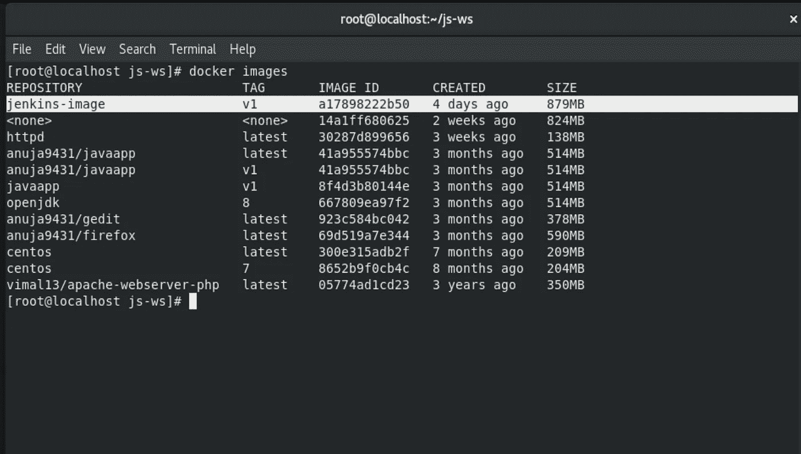

**docker images**

## ⏩启动 docker 容器

启动 docker 容器，它将自动启动**Jenkins**服务。

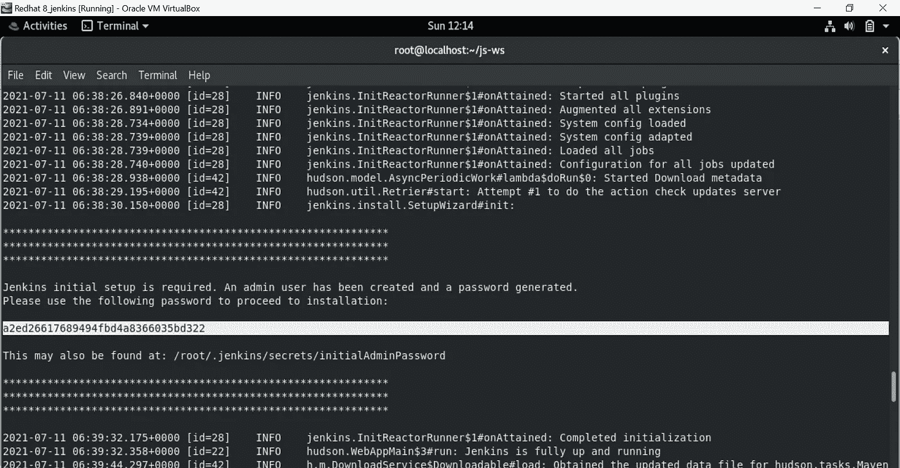

**Here we got Password**

于是，我们得到了詹金斯的**初始密码**。这是第一次解锁詹金斯所需要的。

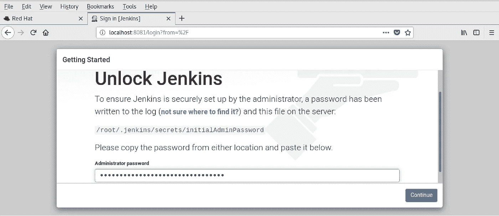

**Paste the password here to unlock Jenkins**

⏩现在点击**安装建议插件**。这将自动安装重要的插件..

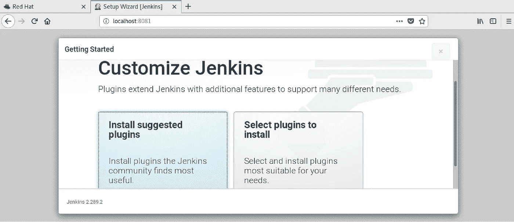

⏩我们可以看到下面👇那个**插件开始下载** …..

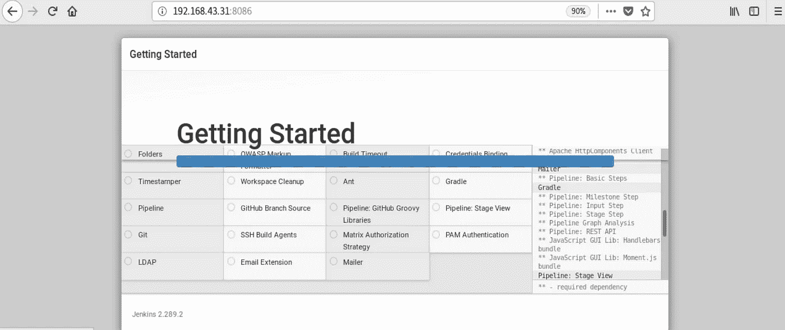

⏩在这里，我们创建**用户名和密码**用于登录 jenkins

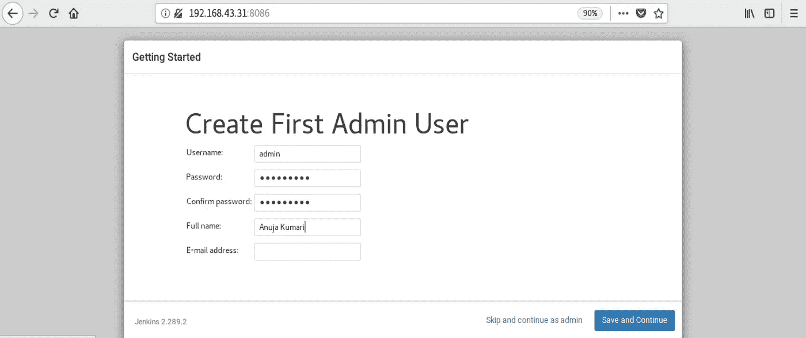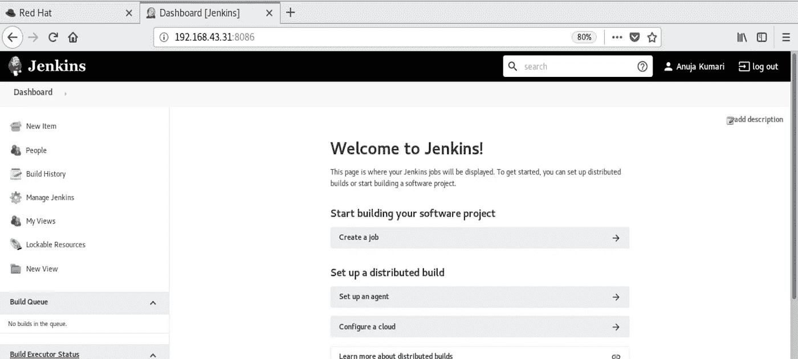

**所以现在，詹金斯准备使用**😀✌

⏩ ***首先，创建一个新的 GitHub repo，这样我们就可以把 GitHub 的 url 放到 jenkins 的作业中..***

# 🔆现在，让我们创造就业机会

## ⏩创建工单 1

***这个作业会在某个开发者向 GitHub 推送回购时自动拉取 GitHub 回购。***

👉首先在**源代码管理**中给出你的 GitHub 库 url

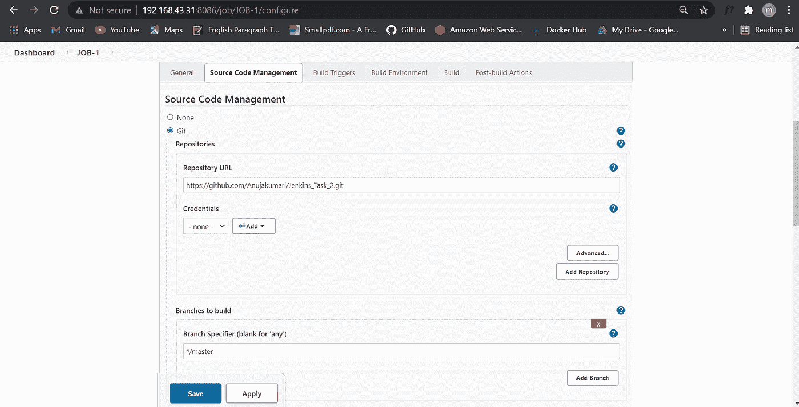

👉在 Build Triggers 中，选择 **GitHub hook trigger 进行 GITScm 轮询**，这样只有当 GitHub 代码发生变化时， **jenkins job 才会自动启动**。

👉接下来这段代码将帮助我们把文件从 **Jenkins 工作区复制到我们想要的文件夹。**

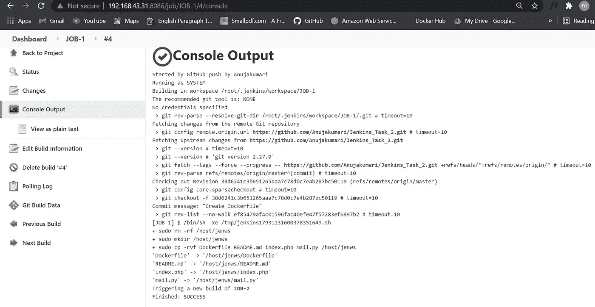

**Console Output of J0B-1**

***这样，JOB-1 就成功完成了*** 😀

# ⏩创建工单 2

***通过查看代码或程序文件，Jenkins 应该自动启动相应的语言解释器安装镜像容器来部署代码(例如，如果代码是 PHP 的，那么 Jenkins 应该启动已经安装了 PHP 的容器)。***

👉该作业将在作业 1 的作业构建后**触发**，因此在**构建触发**中选择**其他项目构建后**构建，在**项目查看**中，将**作业-1**

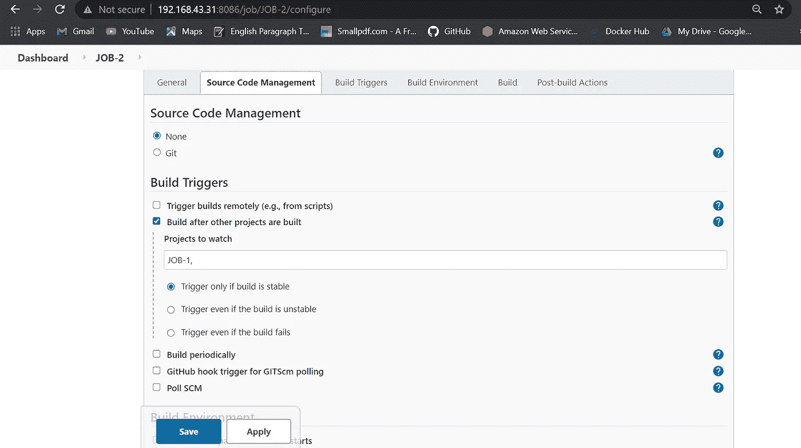

👉现在在下面的脚本中，我写了一些步骤。 **chroot 改变当前根目录**。下一行脚本将**启动一个 docker 容器，其中安装了 php。**

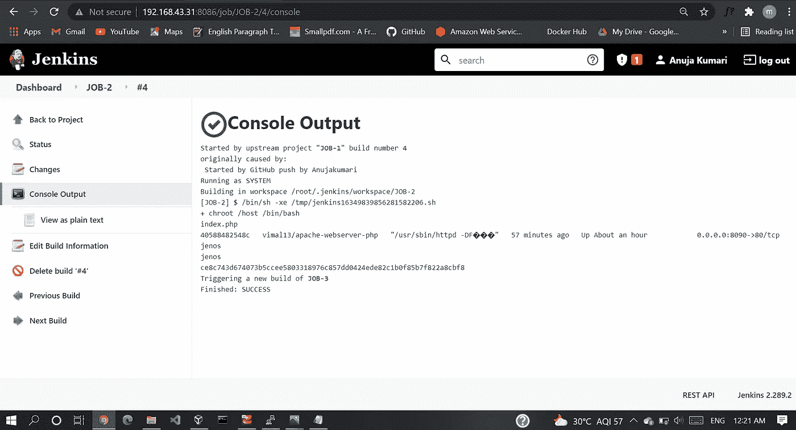

**Console Output of JOB-2**

***这样，JOB-2 就成功完成了*** 😀

# ⏩创建工单 3

***作业 3 会检查我们的网站是否在运行。***

该作业将在作业 2 的作业构建之后由**触发**，因此在**构建触发**中选择**构建在其他项目构建之后**并在**项目中查看**，将**作业-2**

👉现在下面的脚本将检查我们的网站是否给出 200 状态码。**状态代码 200 表示网站运行正常。**

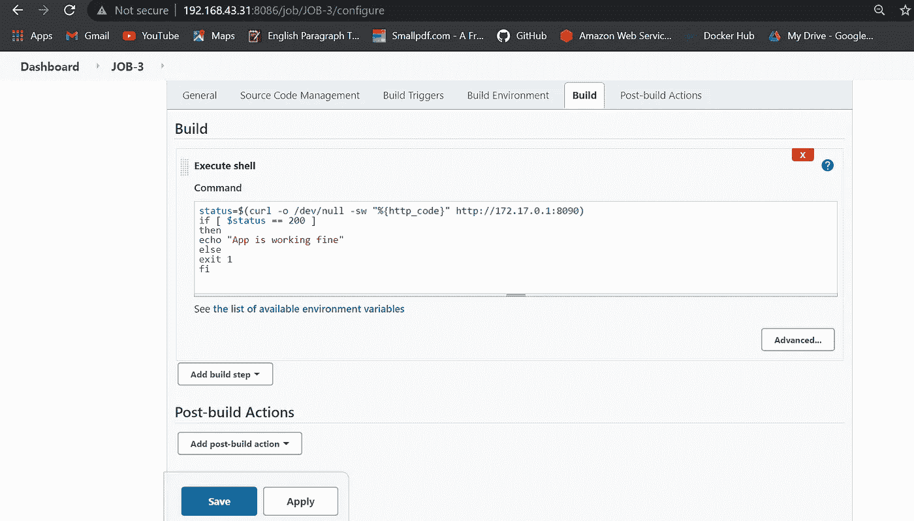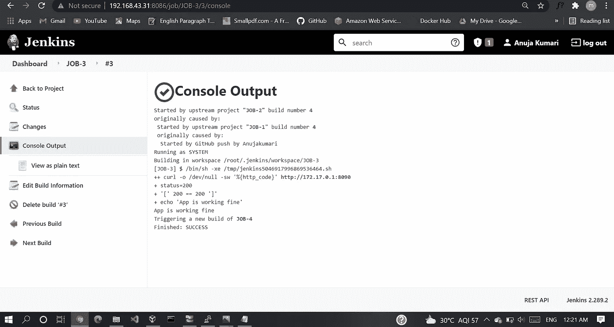

**Console Output of JOB-3**

## ***这样，JOB-3 就成功完成了*** 😀

# ⏩创建工单 4

***如果应用程序不工作，那么发送电子邮件给开发者的错误信息。***

👉该作业将在作业 3 的作业构建之后由**触发**，因此在**构建触发**中选择**构建在其他项目构建之后**并且在**项目中观看**，将**作业-3**

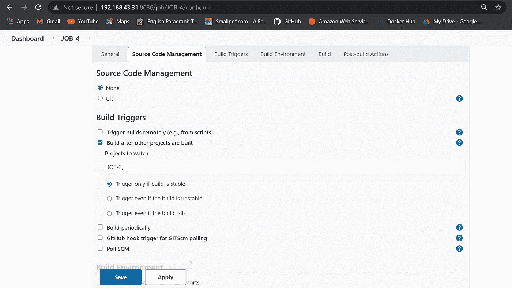

👉现在这个脚本将首先检查我们的网站是否**没有给出 200 状态码**，然后**它将发送电子邮件(通知开发者)**

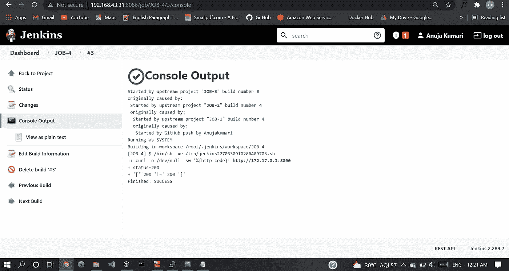

**Console output of JOB-4**

## 因此，JOB-4 成功完成😀

# ⏩创建工单 5

***该作业用于监控 docker 容器。如果我们的容器在任何时候失败，那么这个作业将再次启动容器。***

👉在构建中定期触发-给出“* * * * *”。这个“*** * * * * ***”意味着 jenkins 会每秒检查一次 ***docker 容器。*** *如果我们的容器在任何时候失败，那么这个作业将再次启动容器。*

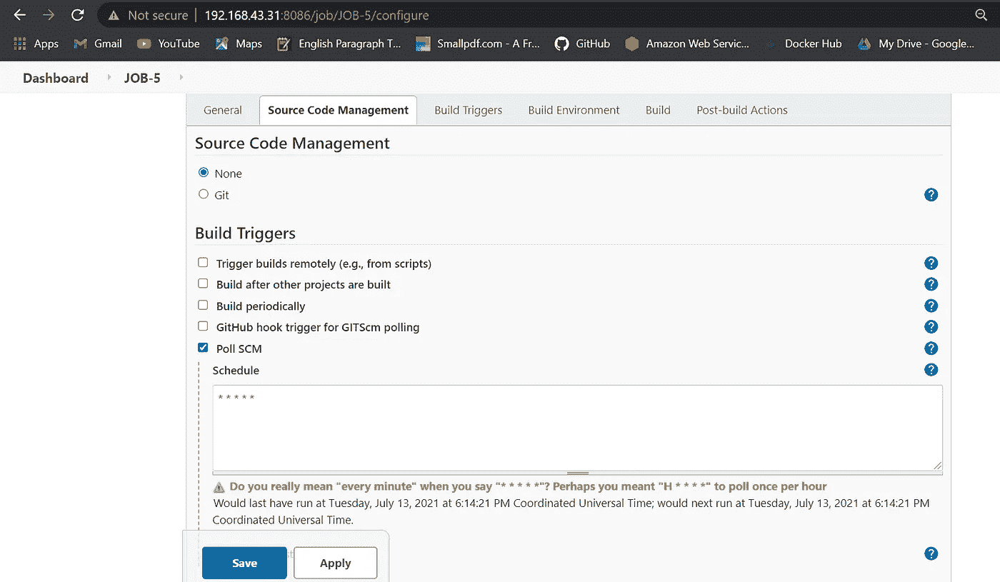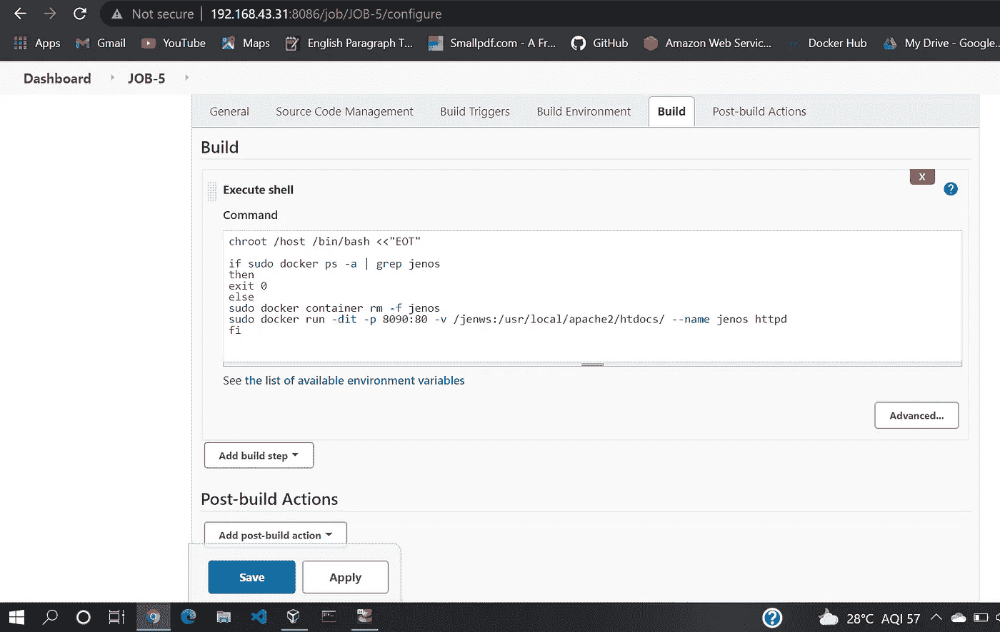

## 因此，作业 5 成功完成😀

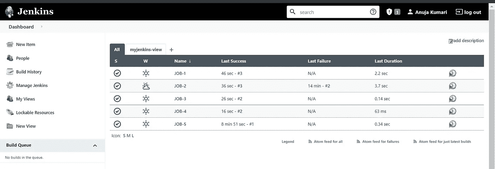

**All jobs**

**GitHub files**

***最后所有的工作都完成了，现在让我们创建构建管道***

# ⏩创建生成管道

👉要创建构建管道**首先安装构建管道插件。**

👉然后点击**新建视图**来添加一个管道。

👉命名并**启用构建管道视图选项，然后**选择初始作业作为**作业 1**

# 现在让我们看看我们的管道:

**👉到网站上键入我们服务器的网址，就会看到页面运行良好。**

**Webpage working fine**

👉现在**让我们通过在 php 代码**中犯一个错误来检查一下。所以，现在我按错了代码。

**wrong PHP CODE**

现在你会看到你的作业 3 会自动失败

***👉在这里你可以看到作业 3 已经失败，所以现在作业 4 将工作并向开发者发送通知。***

**Mail notification**

👉此外，如果你进入**页面，你会发现它不工作**。

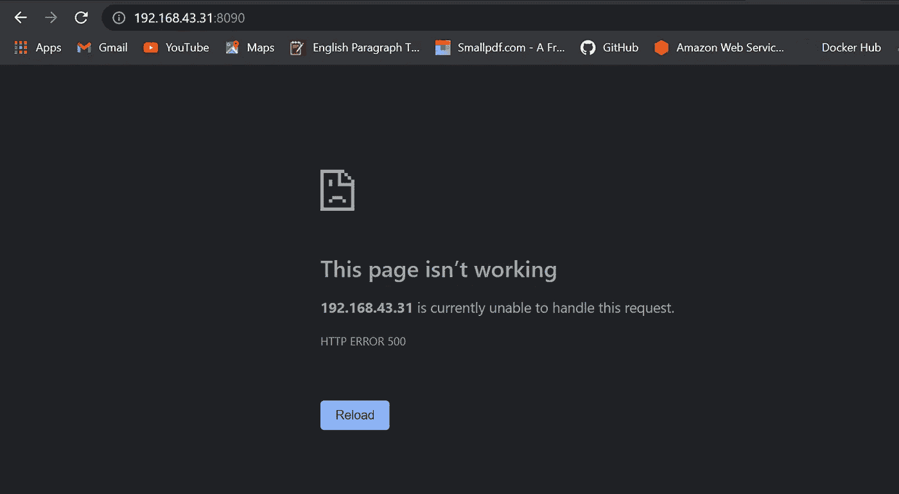

**Web page is not working**

## 💥成功完成任务😀✌

我希望这篇文章能帮助你整合 GitHub、Jenkins 和 Docker。

**🔅GitHub 链接**:[https://github.com/Anujakumari/Jenkins_Task_2.git](https://github.com/Anujakumari/Jenkins_Task_2.git)

**🔅**𝐃𝐨𝐜𝐤𝐞𝐫𝐡𝐮𝐛𝐮𝐫𝐥:[https://hub . docker . com/repository/docker/anuja 9431/Jenkins-image](https://hub.docker.com/repository/docker/anuja9431/jenkins-image)

# 感谢阅读！！

# 🔰继续学习！！继续分享🧾🔰

## https://www.linkedin.com/in/anuja-kumari-4a62581aa/领英简介:

## **https://github.com/Anujakumari github 简介:**