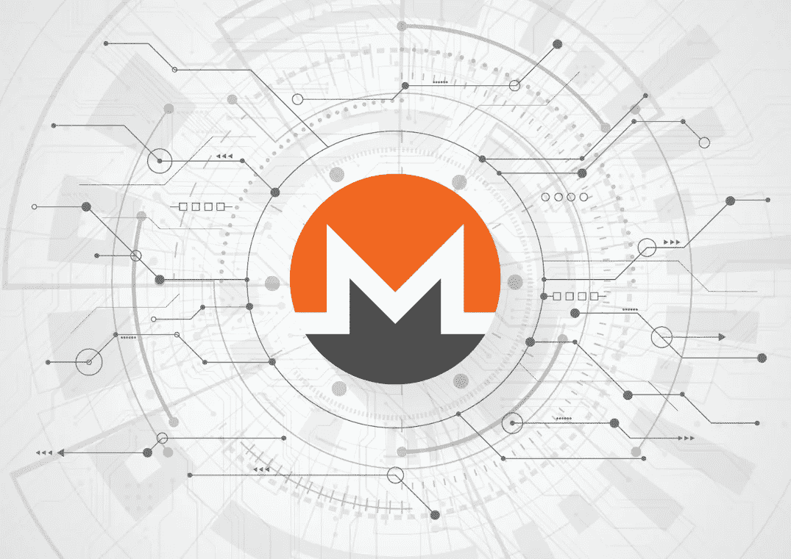

# 将 Monero 矿工部署到 Kubernetes

> 原文：<https://medium.com/geekculture/deploying-a-monero-miner-to-kubernetes-d03e5bfcd4d9?source=collection_archive---------5----------------------->

## 在几分钟内将 XMRig miner 映像部署到 Kubernetes 集群的简单指南



Vector by [Vecteezy](https://www.vecteezy.com/)

# XMRig 是什么？

很高兴你问了。官网显示如下定义:

> 高性能，开源，跨平台 RandomX，KawPow，CryptoNight 和 AstroBWT 统一 CPU/GPU miner 和 RandomX 基准测试。

用简单的英语来说， [XMRig](https://xmrig.com/miner) 是一种加密货币矿工，支持 [Monero](https://www.getmonero.org/) (XMR)，以及其他硬币。它速度很快，而且和你家用电脑的 CPU 配合得很好。开发人员社区非常活跃，文档也非常丰富和有用。这也是我选择 XMRig 而不是其他采矿应用的原因。

在这个简单的指南中，您将了解如何为 Monero 部署一个定制的 XMRig miner 映像作为一个独立的 Docker 容器，或者部署到一个 Kubernetes 集群。我保证你会学得开心！

# 先决条件

*   [Monero 钱包](https://getmonero.org/downloads/)和一个[采矿池](http://moneropools.com/)
*   码头工人
*   库伯内特星团

# 入门指南

**步骤 1:** 克隆 GitHub repo:

```
git clone https://github.com/rcmelendez/xmrig-docker.git
```

**第二步:**编辑`[config.json](https://github.com/rcmelendez/xmrig-docker/blob/main/config.json)`文件。提供你的游泳池，钱包地址，和硬币给我。如果你觉得慷慨，将`donate-level`设置为大于 0:

```
"coin": "XMR",
"url": "gulf.moneroocean.stream:10128",
"user": "43BFSy88EBK7pstEvSkxp2BpnDYj2xP4PG4sf1MSywj2EDdF1WYyTysRGZFAh639zyKyZYzshQwQ4CELq9d76wob3zwfGuc",
"donate-level": 0,
```

有关所有可用选项，请访问 [XMRig 配置文件](https://xmrig.com/docs/miner/config)文档。

**步骤 3:** 将映像部署为独立的 Docker 容器或 Kubernetes 集群:

## 码头工人

```
docker run -dit --rm \
  --volume "$(pwd)"/config.json:/xmrig/etc/config.json:ro \
  --volume "$(pwd)"/log:/xmrig/log \
  --name xmrig rcmelendez/xmrig \
  xmrig --config=/xmrig/etc/config.json
```

如果您喜欢用 **Docker 编写**，根据需要编辑`[docker-compose.yml](https://github.com/rcmelendez/xmrig-docker/blob/main/docker-compose.yml)`清单并运行:

```
docker-compose up -d
```

## 库伯内特斯

**步骤 1:** 为我们的 XMRig 应用程序创建一个*名称空间*(可选但推荐):

```
kubectl create ns xmrig
```

**步骤 2:** 从`[config.json](https://github.com/rcmelendez/xmrig-docker/blob/main/config.json)`文件在新的名称空间`xmrig`中创建一个*配置图*:

```
kubectl create configmap xmrig-config --from-file config.json -n xmrig
```

**第三步:**编辑`[xmrig.yaml](https://github.com/rcmelendez/xmrig-docker/blob/main/xmrig.yaml)`文件。您可能想要修改的内容包括:

*   `replicas`:需要运行的 pod 数量。
*   `image:tag`:要查看所有可用版本，请前往 Docker Hub repo 的[标签](https://hub.docker.com/r/rcmelendez/xmrig/tags)标签。
*   `resources`:为`cpu`和`memory`请求/限制设置合适的值。
*   `affinity`:清单将只为每个节点调度一个 pod，如果这不是期望的行为，请移除`affinity`块。

**步骤 4:** 一旦您对上面的清单感到满意，就创建一个*部署*:

```
kubectl -f apply xmrig.yaml
```

# 记录

默认情况下，这个 Docker 映像将容器日志发送到`stdout`。要查看日志，请运行:

```
docker logs xmrig
```

对于 Kubernetes，执行:

```
kubectl logs -n xmrig <pod-name>
```

## 持续日志记录

容器本质上是无状态的，所以当它们关闭时，它们的日志将会丢失。如果希望日志持久化，请在`[config.json](https://github.com/rcmelendez/xmrig-docker/blob/main/config.json)`文件中启用 XMRig syslog 输出:

```
"syslog": true,
"log-file": "/xmrig/log/xmrig.log",
```

并对主机上的目录授予完全权限:

```
chmod 777 "$(pwd)"/log
```

然后使用 Docker [绑定挂载](https://docs.docker.com/storage/bind-mounts/)或 Kubernetes [持久卷](https://kubernetes.io/docs/concepts/storage/persistent-volumes/)将日志文件保存在主机上。上面的`docker run`命令和`[docker-compose.yml](https://github.com/rcmelendez/xmrig-docker/blob/main/docker-compose.yml)`文件已经包含了这个映射。

# 确认

pod 或容器运行后，检查日志。需要几分钟时间来显示“*已接受*股票为绿色:

```
[2021-12-18 11:54:07.289]  cpu      accepted (1/0) diff 41037 (248 ms)
```

以上消息表示第一次分享被接受！然后你可以去你的游泳池的网站(在我的情况下是 [MoneroOcean](https://moneroocean.stream/) )，输入你的钱包地址，你就可以确认那些股份了。请耐心等待，游泳池也需要一些时间来更新您的号码。

# 放弃

这些都不能被认为是财务建议。自己做研究，挖掘自己喜欢的加密货币。我是一名技术爱好者，具备 Docker 和 Kubernetes 的基础知识。这个项目的灵感来自我开始了解加密货币世界的好奇心和不断提高我的技术技能的动力。我或者你会因为使用 XMRig 而变得富有吗？我不这么认为。会很好玩吗？是啊。你会学吗？很多！

# 包扎

到目前为止，您应该已经成功地使用 Kubernetes 集群或者作为一个独立的 Docker 容器来挖掘 Monero 了。如果你有任何问题或意见，请告诉我，我会帮助你的。快乐的莫内罗矿业！

# 参考

*   [XMRig](https://xmrig.com/miner)
*   [莫内罗](https://www.getmonero.org/)
*   [GitHub 回购](https://github.com/rcmelendez/xmrig-docker)