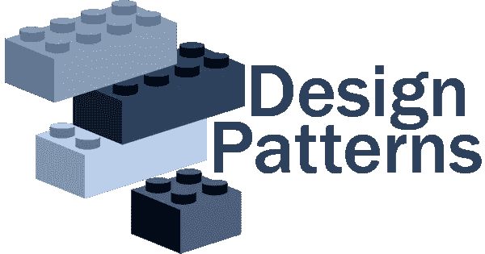

# 面向对象编程中的设计模式

> 原文：<https://medium.com/geekculture/design-patterns-in-object-oriented-programming-19a629dc3841?source=collection_archive---------15----------------------->

今天的编程世界已经不是过去的样子了。紧跟最新趋势、技术和架构设计模式的重要性怎么强调都不为过。根据 Christopher Alexander 的说法，“语言的元素是被称为模式的实体。每个模式描述了一个反复出现的问题，然后描述了该问题的解决方案超过一百万次，而没有以同样的方式做两次。

**设计模式到底是什么？？**

Scott Millett(《ASP.NET 设计模式》的作者)，已经将设计模式定义为高级抽象解决方案模板。它们有点像解决方案的蓝图，而不是解决方案本身。一个完美的例子是在方形容器中冷冻水。你得到的方形冰块是你需要的解决方案，但是容器是你解决方案的形状。这就是设计模式所做的，将你的代码塑造或重构为一个可重用的解决方案，以解决软件设计中的常见问题。

**为什么设计模式很重要？？**

设计模式对于软件设计至关重要，因为它是为复杂问题提供解决方案的有效方式。拥有扎实的设计模式知识可以让你轻松有效地与团队的其他成员交流，而不必担心代码可读性之类的细节。

它们之所以如此强大，是因为它们已经被测试和证实能够解决重要的设计问题。设计模式都是关于解决方案的重用，在 2021 年，将会遇到的大多数问题很可能已经解决了很多次。这为现在或将来解决类似问题提供了一种模式。

**设计模式的类别**

一组常见的设计模式在一本名为*设计模式:可重用面向对象软件的元素*的书中有所阐述，这本书是由四个 90 年代的初露头角的程序员写的，他们被称为四人组(g of)。他们列举了 23 种设计模式，并将它们分成 3 组:

**创建模式**:这些模式处理对象创建。它们在决定特定情况下需要哪些对象时增加了更多的灵活性，并解决了在对象创建过程中可能出现的复杂性。这一类别中的设计模式是抽象工厂、构建器、工厂方法、原型和单例。

**结构模式**:这些模式处理不同对象之间的关系，以及它们如何相互作用以形成具有新功能的更大的复杂对象。它们是适配器、桥、复合、装饰、外观、Flyweight、代理。

**行为模式**:处理对象之间的交流。这些模式是责任链、命令、解释器、迭代器、中介器、备忘录、观察者、状态、策略、模板方法、访问者。

**通用设计原则**

如果你有几年编写面向对象程序的经验。您可能已经知道下面陈述的几个设计原则:

**保持简单愚蠢(吻)**:这已经足够说明问题了。避免使用过于复杂的代码，保持简单。这就是你如何避免不必要的复杂性。

**不要重复自己(干)**:这是你作为程序员首先要学的东西之一。如果你必须重复一段代码，把它抽象到一个单独的位置并引用它。这将节省时间，并使您的代码非常干净。

**告诉，不要问:**很简单，告诉对象你想让他们执行什么动作。如果你必须检查对象的状态，然后决定它应该做什么，你已经破坏了这条规则。

你不会需要它(YAGNI): 如果你不打算使用它，就不要把它包含在你的代码中。这个原则只是强调只放应用程序需要的功能，去掉其他不必要的特性的重要性。

**关注点分离(SoC):** 它只是将一个应用程序分解成不同的特性，这些特性包含其他类使用的独特数据和行为。这增加了代码的可维护性和重用性。

**其他设计原则**

在面向对象编程中有很多其他的原则需要理解，比如 Robert C Martin 的全能的 ***坚实的原则*** 和基本的设计实践，比如测试驱动开发(TDD)、领域驱动开发(DDD)、行为驱动开发(BDD)。

但是我想确保正确理解，尽管设计模式非常有用，但它们并不是在所有情况下都是必要的。并不是所有的问题都需要设计模式，因为就像 Scott Millett 说的那样“*的确，设计模式可以让复杂的问题变得简单，但是它们也可以让简单的问题变得复杂*”。

所以，如果你提供了一个没有设计模式的清晰且可维护的解决方案，那也很好。不要试图强行加入一个设计模式，否则你的设计会过于复杂。

感谢您的阅读..

*(这里的大部分创意都来自****ASP.NET 设计模式:Scott Millett，*** *如果你是一个萌芽期。像我这样的 NET 开发者，可以去看看..*很好读^_^)