# 用 Tasker 设计你的工具条

> 原文：<https://medium.com/geekculture/design-your-sidebar-with-tasker-8cb3f13a05e0?source=collection_archive---------5----------------------->

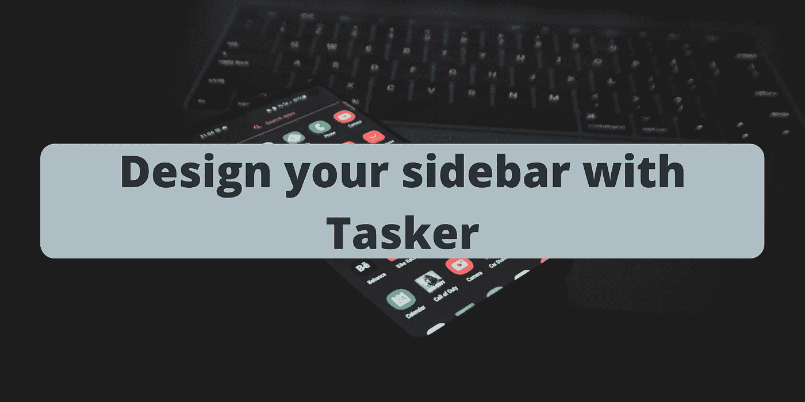

Photo by [Azamat E](https://unsplash.com/@picsaf?utm_source=unsplash&utm_medium=referral&utm_content=creditCopyText). on [Unsplash](https://unsplash.com/s/photos/android-app?utm_source=unsplash&utm_medium=referral&utm_content=creditCopyText)

几年前，边栏非常流行。我记得使用过 [Sloth Launcher](https://play.google.com/store/apps/details?id=com.slothlauncher) ，这是一个 Android 的上下文覆盖启动器，可以根据用户定义的条件显示不同的应用程序。

最近一直在找类似的东西，但是什么都找不到，于是决定用 Tasker 自己写。

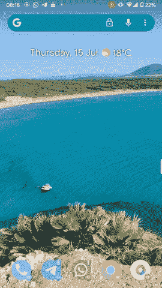

这个简短的屏幕记录显示了最终的结果。有三个主要组件:

*   *侧边栏*:包含应用程序的覆盖图；
*   *侧边栏启动器*:右边那个打开叠加图的小药丸；
*   侧边栏背景:关闭侧边栏的不可见覆盖。

遗憾的是，我不得不定义固定数量的应用程序，并且在点击时无法自定义项目的颜色。

边栏有两组:

*   *固定应用*:一开始选择的两个不变的应用；
*   *动态应用*:基于用户定义的条件，由配置文件指定的五个应用。

在接下来的步骤中，我将解释如何设计侧边栏以及如何让它工作。如果你想下载它，请点击[链接](https://taskernet.com/shares/?user=AS35m8nzU8Z2OxB1WGqHbYHDLajdlq0DG%2B8k8f7L2XfQM3eHbHEAthA2xNvalA2%2FZaJvRZj2roE7ow%3D%3D&id=Project%3ASidebar)。

## 要求

需要 Tasker 版本 *5.13.0-beta* 或更高版本。以前的版本可能在选择*固定应用*的任务上有问题。

# 步骤 0。介绍

以下步骤解释了屏幕截图中显示的项目。

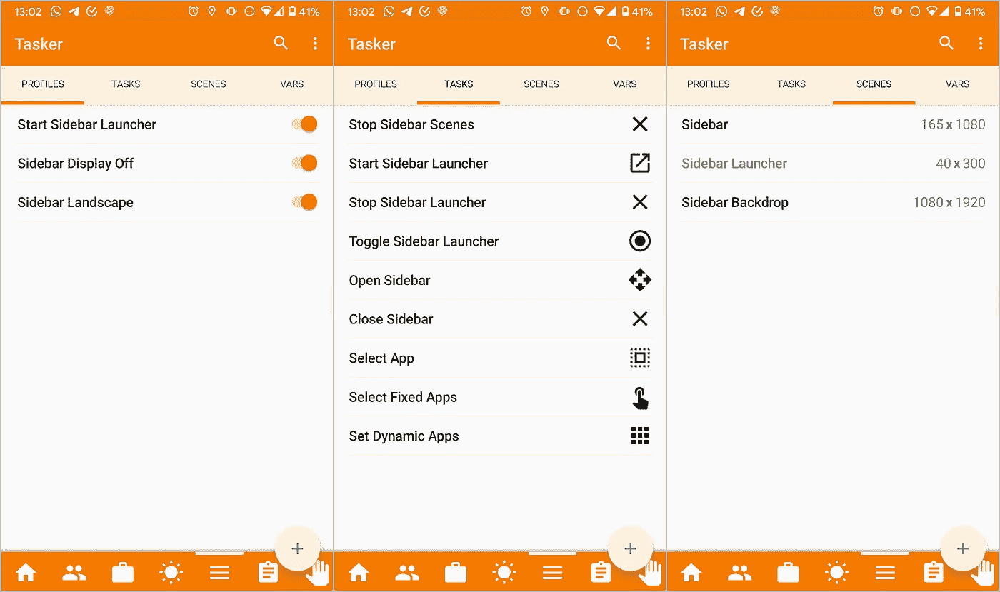

# 第一步。定义应用程序的任务

我创建的第一个任务是*选择应用*、*选择固定应用*、*设置动态应用*。

## 选择固定应用

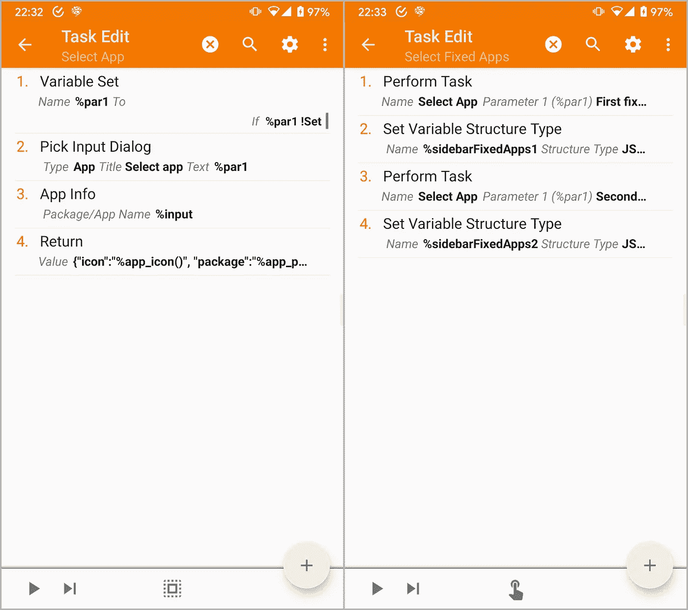

*选择应用*是一个实用程序任务，让用户选择一个应用。然后，它获取应用程序信息，并以 JSON 格式返回它们，格式如下。它包含显示在侧边栏中的图标和与之一起启动的应用程序。

> { " icon ":" % app _ icon()" " package ":" % app _ package()" }

*选择固定应用*使用前一个任务要求用户在侧边栏顶部显示两个*最喜欢的应用*。它执行以下操作:

1.  **执行任务**:调用*选择 App* 任务，并将结果设置为 *%sidebarFixedApps1* 变量。
2.  **设置变量结构类型**:确保 Tasker 将变量视为 JSON。
3.  **执行任务**:调用*选择 App* 任务，并将结果设置为 *%sidebarFixedApps2* 变量。
4.  **设置变量结构类型**:确保 Tasker 将变量视为 JSON。

## *设置动态应用*

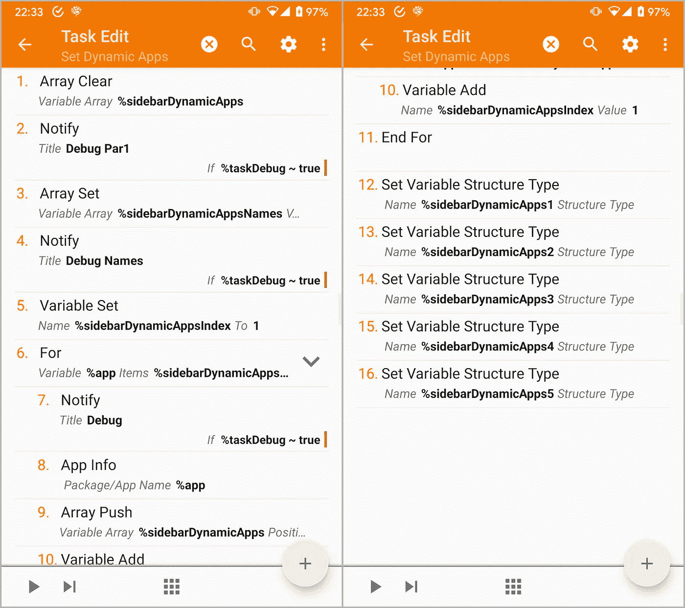

它接收带有应用程序名称列表的参数 *%par1* ，获取它们的信息，并将它们保存在数组 *%sidebarDynamicApps* 中。其他任务将使用这一个来根据上下文设置最多 5 个应用程序。

它执行以下操作:

*   **3。数组 Set** : 使用接收到的用逗号分割的 *%par1* 数据设置数组*% sidebarddynamicappsnames*的值。
*   **6。对于**:遍历*% sidebarddynamicappsnames*数组。
*   8。应用信息:使用名称获取应用信息。
*   9。数组推送:推送 *%sidebarDynamicApps* 数组中的信息，与 *Select App* 任务返回的格式相同。
*   动作 5 和 10 管理 *%sidebarDynamicApps* 数组索引。
*   动作 12 到 16 确保 Tasker 将变量视为 JSON。我必须添加这一点，因为 Tasker 不认为他们是 JSON，否则。

# 第二步。设计场景

最好用一个临时动作来准备**打开侧边栏**和**关闭侧边栏**任务，例如*等待 1 ms* 动作，因为场景会用到它们。我们将在下面的步骤中改变它们，分别打开和关闭侧边栏的场景。

请注意，我是根据我的屏幕尺寸(1080 x 1920 像素)和我的需求来设置场景尺寸的。你可以根据自己的情况进行调整。

## 补充报道

这个场景是包含应用程序的覆盖图。

它是出现在屏幕右侧的一个小场景。它使用上一步定义的 *%sidebarFixedApps* 和 *%sidebarDynamicApps* 变量来显示两个部分:固定应用**和动态应用**。****

****

**场景以*叠加*的形式出现，大小为 *165 x 1080* 像素(宽 x 高)，纵向和横向均可。背景是透明的，所以它的值是 **#00000000** 。**

**它出现在编辑器中，如下图所示，其中也显示了组件。**

****

****背景**组件有以下配置。**

****

**它是填充场景的图像组件，因此具有相同的大小。我用作**颜色**的灰度值为 *#eeeeee* ，并且**圆角半径**为 30 像素。点击时，它运行**执行任务**动作，调用*关闭侧栏*任务。**

****固定应用 1** 和**固定应用 2** 组件启动应用并关闭侧边栏。它们显示为图标，具有以下配置。**

**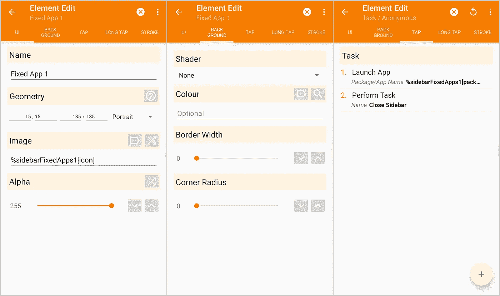**

**它们是图像组件，因为它们允许将变量中的图标配置为图像。对于按钮，这是不可能的。它们是 *135 x 135* 像素。**

**图像的值是*% sidebarFixedApps****N****【icon】*变量，其中 **N** 为 **1** 或 **2** 。要将变量设置为图像，请单击两个交叉箭头。**

**背景选项卡保持不变。在 tap 上，它运行以下操作:**

1.  ****启动 App** :从*% sidebarFixedApps****N****【包】*变量中启动带有*包*的 App。**
2.  ****执行任务**:运行*关闭侧栏*任务。**

****线**组件有以下配置。**

**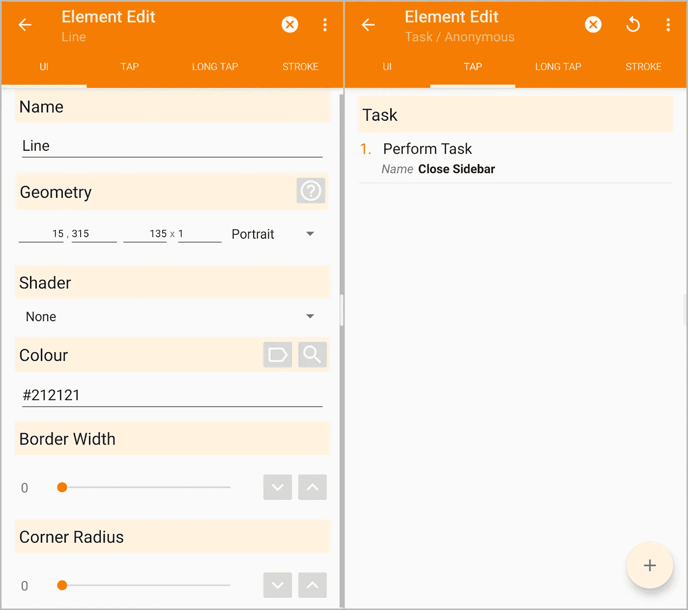**

**将**固定应用**与**动态应用**分开的矩形组件。它是 *135 x 1* 像素，所以它看起来像一条线。我用作**颜色**的灰度值为 *#212121* 。点击时，它运行**执行任务**动作，调用*关闭侧栏*任务。**

**从 **1** 到 **5** 的**动态应用**组件启动一个应用，如果定义的话，并关闭侧边栏。它们显示为图标，具有以下配置。**

**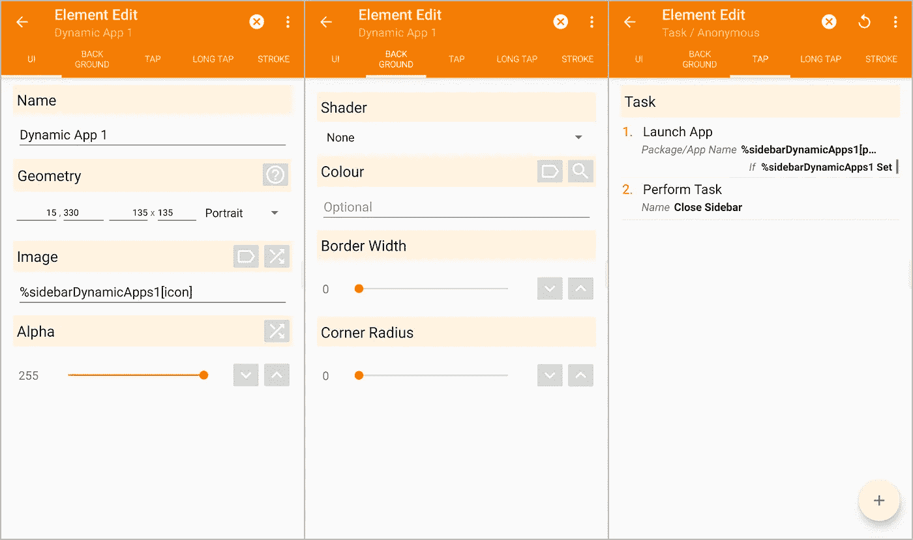**

**这些组件就像**固定应用**一样。它们是图像组件，大小为 *135 x 135* 像素。**

**图像的值是*% sidebarDynamicApps****N****【icon】*变量，其中 **N** 从 **1** 到 **5** 。要将变量设置为图像，请单击两个交叉箭头。**

**背景选项卡保持不变。在 tap 上，它运行以下操作:**

1.  ****启动 App** :从*% sidebarDynamicApps****N****【package】*变量中启动带有*包*的 App。如果设置了*% sidebarDynamicApps****N***变量，则运行该动作。**
2.  ****执行任务**:运行*关闭侧栏*任务。**

## **侧栏背景**

**这个场景是关闭侧边栏的一个不可见的覆盖图。**

**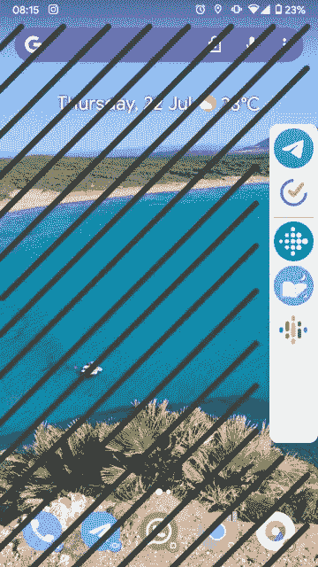**

**它是一个充满屏幕并位于侧边栏后面的场景。**

**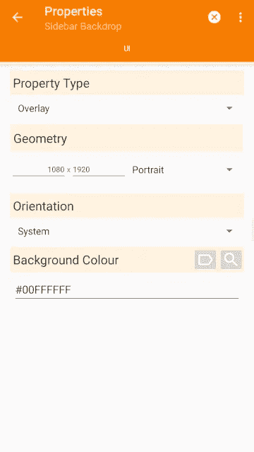**

**该场景显示为一个*覆盖图*，并且是 *1080 x 1920* 像素，这是屏幕尺寸。背景是透明的，所以它的值是 **#00000000** 。**

**它出现在编辑器中，如下图所示，其中也显示了组件。**

**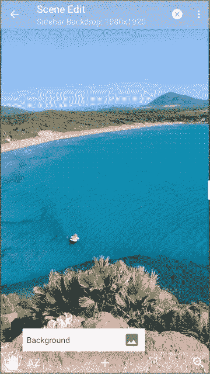**

****背景**组件有以下配置。**

****

**它是填充场景的图像组件，因此具有相同的大小。它是透明的，所以**颜色**是 *#00000000* 。在 tap 上，它运行以下操作:**

1.  ****元素背景色**:将场景中*背景*元素的颜色从 *#00000000* 变为 *#00000000* 。尽可能隐藏敲击颜色是一个小的解决方法。**
2.  ****执行任务**:运行*关闭侧栏*任务。**

## **侧栏启动器**

**这个场景是右边的小药丸打开了另外两个。**

**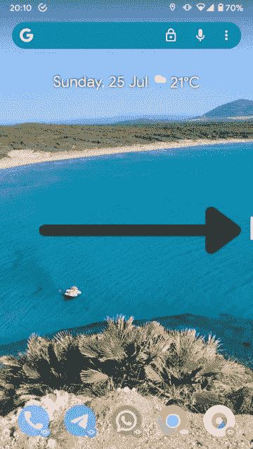**

**这是一个几乎看不见的场景，出现在屏幕的右侧。**

****

**该场景显示为*覆盖图*，像素为 *40 x 300* 像素，包括肖像和风景。背景是透明的，所以它的值是 **#00FFFFFF** 。**

**它出现在编辑器中，如下图所示，其中也显示了组件。**

**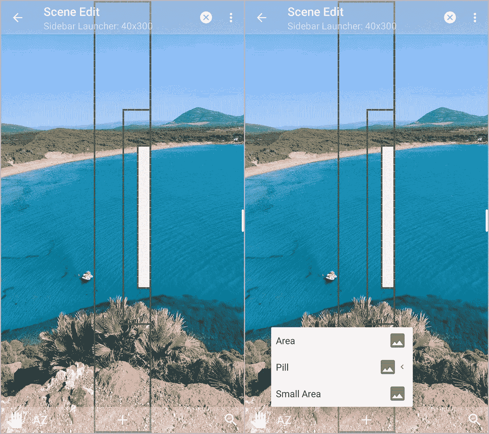**

****区域**组件是最广泛的元素。它足够大，可以很容易地通过滑动来达到，又足够小，不会干扰屏幕那一侧的任何点击。**

**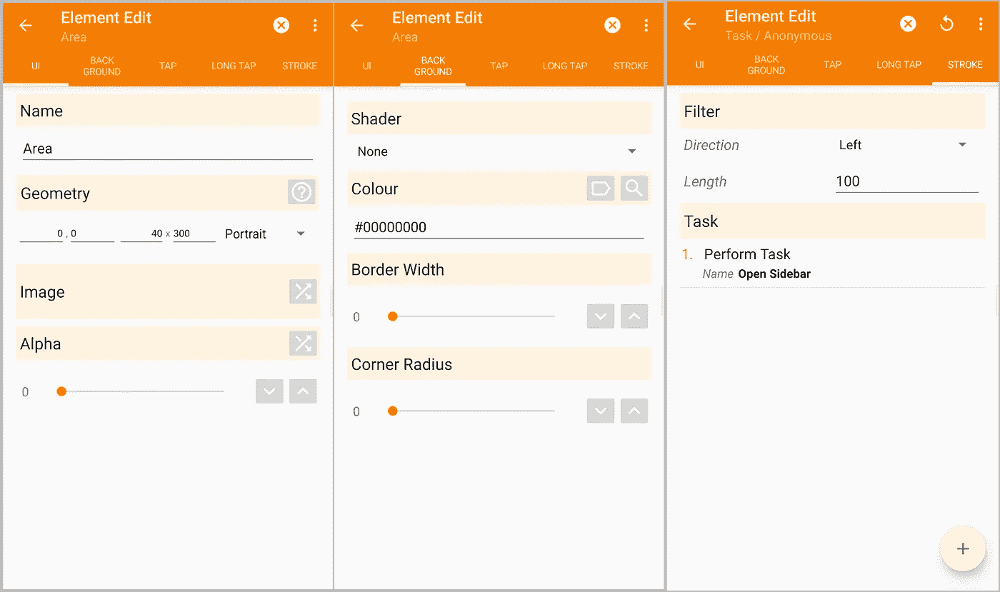**

**它是填充场景的图像组件，因此具有相同的大小。它是透明的，所以**颜色**是 *#00000000* 。在**左**冲程时，运行**执行任务**动作，调用*打开侧边栏*任务。**

****小区域**组件是一个小的不可见元素，通过点击或敲击打开侧边栏。**

**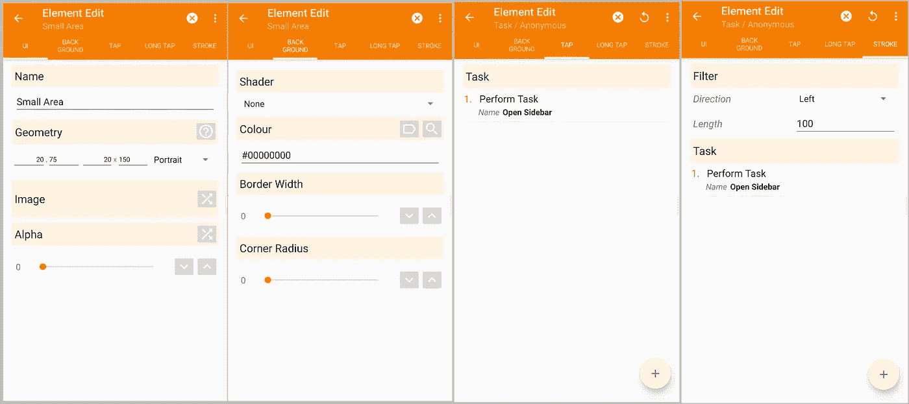**

**它是一个图像组件，大小为 20 x 150 像素。它是透明的，所以**颜色**是 *#00000000* 。轻击或**左**冲程，运行**执行任务**动作调用*打开侧边栏*任务。**

****药丸**组件是在点击或敲击时打开侧边栏的药丸元素。**

**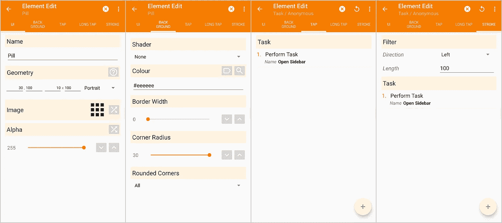**

**它是一个图像组件，大小为 *10 x 150* 像素。我用作**颜色**的灰度值是 *#eeeeee* ，**圆角半径**为 30 像素。轻击或**左**击，运行**执行任务**动作调用*打开侧边栏*任务。**

# **第三步。打开和关闭侧栏场景的任务**

**在接下来的任务中，我使用了**破坏场景**动作，而不是**隐藏场景**动作，因为后者使场景滞后太多，几乎无法使用。**

## **停止边栏场景**

**该任务破坏以前创建的场景。这将有助于在改变显示方向时关闭侧边栏。**

**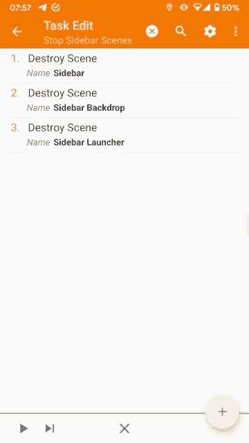**

****破坏场景**动作启用了*出错后继续任务*选项，并破坏三个侧边栏场景(如果它们是打开的)。如果指定的场景已经关闭，该选项允许任务继续。**

## **停止侧边栏启动器**

**这项任务会破坏先前创建的发射器场景。**

**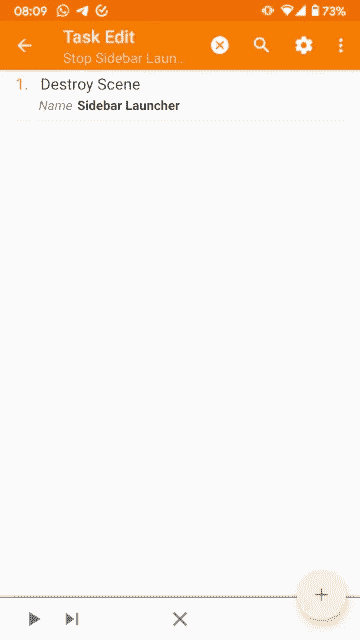**

****销毁场景**动作启用*出错后继续任务*选项，并销毁**侧边栏启动器**场景。**

## **启动侧边栏启动器**

**该任务销毁之前创建的场景，并启动侧边栏启动器。变量*% sidebarlauncher enabled*定义是否允许显示启动器。**

**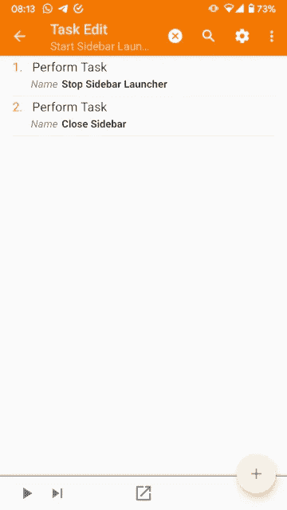**

**它执行以下操作:**

1.  ****执行任务**:运行**停止侧边栏启动器**任务，关闭之前显示的场景。**
2.  ****执行任务**:运行**关闭侧边栏**任务，关闭侧边栏并显示启动器。请在下面阅读更多信息。**

## **切换侧边栏启动器**

**这是启用或禁用侧边栏启动器场景的快捷方式。它切换*% sidebarlauncher enabled*变量的值。**

**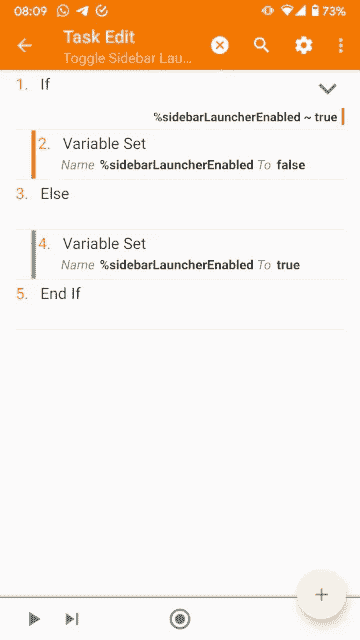**

**它执行以下操作:**

1.  ****如果**:检查*% sidebarlauncher enabled*是否为真。**
2.  ****变量集**:将*% sidebarlauncher enabled*设置为假。**
3.  ****否则**:如果不满足第一个条件。**
4.  ****变量集**:将*% sidebarLauncherEnabled*设置为真。**

## **关闭侧栏**

**它关闭侧边栏场景并显示侧边栏启动器。**

**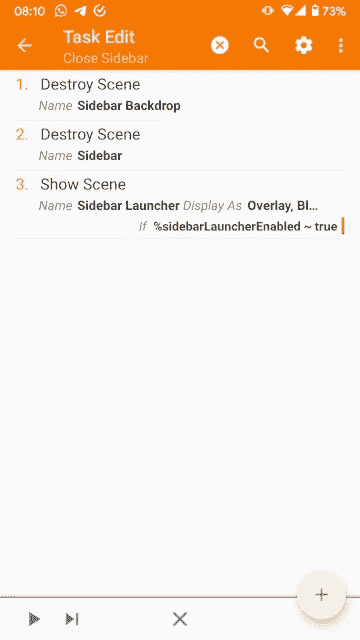**

**它执行以下操作:**

1.  ****破坏场景**:破坏**侧边栏背景**场景，启用*出错后继续任务*选项。**
2.  ****破坏场景**:破坏**侧边栏**场景，启用*出错后继续任务*选项。**
3.  ****显示场景**:如果*%*水平位置*在最右边，而*垂直位置*在中间。选项*显示在键盘守卫上*和*立即继续任务*被启用。***

## **打开边栏**

**它显示侧边栏场景并关闭侧边栏启动器。**

**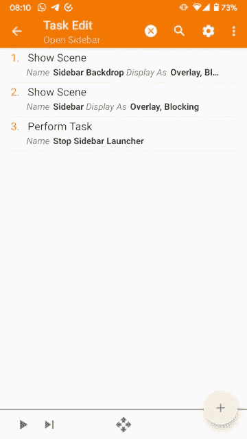**

**它执行以下操作:**

1.  ****显示场景**:将**侧边栏背景**场景显示为*叠加，遮挡*以便用户与之交互。*水平位置*一直向左，而*垂直位置*一直向上。选项*显示在键盘守卫上*和*立即继续任务*被启用。**
2.  ****显示场景**:将**侧边栏背景**场景显示为*叠加，遮挡*以便用户与之交互。*水平位置*在最右边，而*垂直位置*在中间。选项*显示键盘守卫*和*立即继续任务*被启用。**
3.  ****执行任务**:运行**停止侧边栏启动器**任务，关闭侧边栏启动器。**

# **第四步。自动化任务**

**以下配置文件根据某些条件显示和隐藏这三个场景。**

## **启动侧边栏启动器**

**该配置文件显示了设备启动时的侧边栏启动器。**

**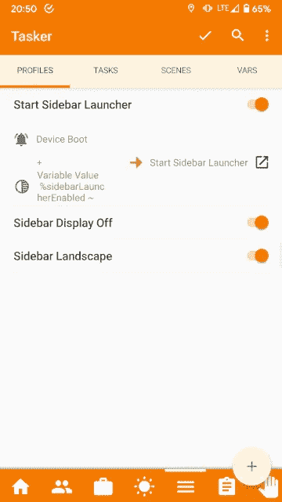**

**它在*设备启动*事件上运行**启动侧边栏启动器**任务。变量*% sidebarlauncher enabled*必须等于 *true* 。**

## **侧边栏显示关闭**

**此配置文件在屏幕关闭时破坏场景，并在屏幕重新打开时显示侧边栏启动器。**

**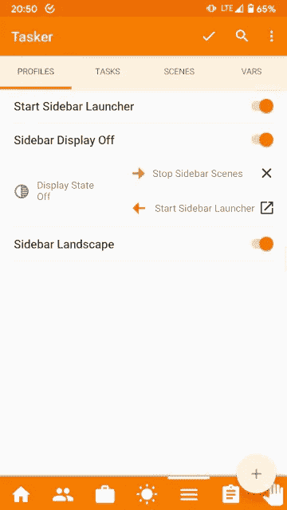**

**它在*显示状态关闭*状态下运行**停止侧边栏场景**任务，并在配置文件退出时运行**启动侧边栏启动器**任务。**

## **侧边栏风景**

**该配置文件在方向为*横向*时破坏场景，并在返回到*纵向*时显示侧边栏启动器。**

**我创建了这个配置文件，因为当设备处于横向时，我无法使用**显示场景**动作在屏幕右侧显示侧边栏启动器。**

****

**在*显示方向风景*状态下运行**停止侧边栏场景**任务，在配置文件退出时运行**启动侧边栏启动器**任务。**

# **第五步。定义配置文件以配置侧栏**

**现在是时候编写一些任务和概要文件来根据您的需要定制动态应用程序了。**

**例如，我创建了一个配置文件，它设置了我在健身房时需要的应用程序的侧边栏。**

****

**当 *%profileActive* 变量的值为 *%profileGym* 时，**健身房配置文件 debarConfig** 配置文件触发。当我在健身房，我的手机切换到**健身房档案**时，就会出现这种情况。阅读关于使用 Tasker 故事完全自动化您的 Android 设备的更多信息。**

****健身房侧边栏**任务运行**执行任务**动作，该动作调用*设置动态应用程序*任务，并提供一个应用程序名称列表作为第一个参数。**

**当 *%profileActive* 变量改变并且与 *%profileGym* 值不匹配时，运行**结束侧栏**任务。它执行以下操作:**

1.  ****If** :检查名称中是否有其他包含 *SidebarConfig* 字样的配置文件正在运行。它使用[模式匹配](https://tasker.joaoapps.com/userguide/en/matching.html)规则来做到这一点。**
2.  ****执行任务**:运行*默认工具条*任务，设置默认应用。**
3.  ****结束**:结束 if 条件。**

**另一个例子是当我的手机连接到我的蓝牙耳机时触发的**蓝牙 EventSidebarConfig** 配置文件。**

**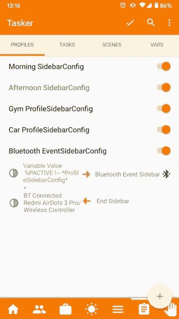**

**我添加了一个*变量值状态*条件，以确保它在另一个名称中带有 **ProfileSidebarConfig** 的变量运行时不活动。这样， **ProfileSidebarConfig** 配置文件总是胜过 **EventSidebarConfig** 配置文件。**