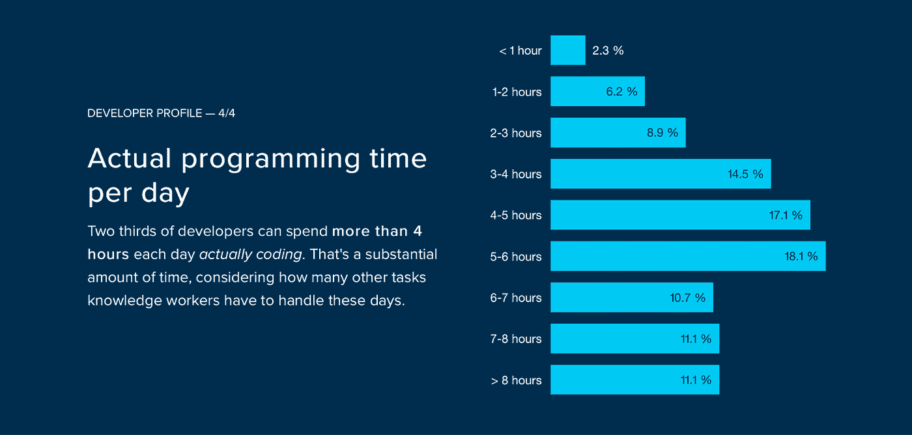
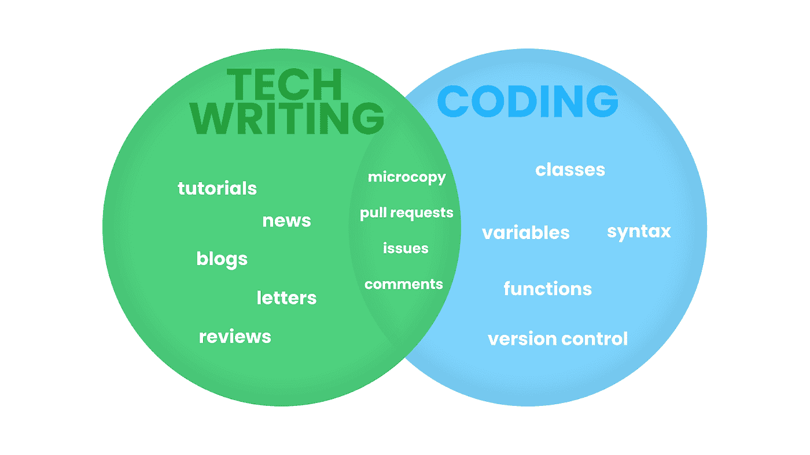
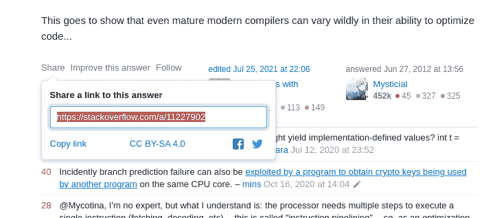

# 发展技术写作技巧

> 原文：<https://medium.com/geekculture/developing-technical-writing-skills-42b35ed5ff27?source=collection_archive---------11----------------------->

有这么多的编程语言，你甚至可能完全精通其中的几种。示例包括 HTML、CSS、JavaScript、Python、PHP、C++和 Dart。然而，当我们努力创造更多更好的代码时，我们用普通语言编写和交流的方式变得越来越重要——甚至可能被忽视。

可能比代码本身更重要的是我们如何编写代码。不管你在这个问题上的立场如何，我们都同意我们的话有能力增加或减少代码的效力。

在这篇文章中，我想讨论写作和编程这两个明显不相关的学科是如何共同提高我们的开发能力的。

技术写作，什么？是的，我就是这个意思。我真的认为我们在某种程度上都是作家。我在这里给你一个写作技巧、建议和插图的速成课程，这将帮助你成为一个更好的沟通者和开发者。

# 有大量的技术写作。

去年，著名的 Mac Git 客户端 Tower 背后的人员对 4000 多名开发人员进行了调查，发现其中超过一半的人每天花 3-6 个小时开发代码。



虽然那项特定的调查只包括了非常小的一部分受访者，但我相信我们中的许多人都在这个范围之内。无论如何，正如这个调查所显示的，开发人员不会花一整天的时间来编写代码。相反，他们花很多时间从事其他活动。

这可能包括:

*   展示一项新功能，
*   记录下那个新颖的特征，
*   新特性工作单的修订，或
*   实现新功能的任务积压。

当然，总会有时间去吃饭和上厕所。

无论如何，我们执行的大部分工作都涉及到与团队成员的互动，比如你的团队、你的同事、客户、用户和其他开发人员。

因此，除了通过代码与计算机交流，我们还会花大量时间与其他人进行口头交流。语言是用文字书写的。如果我们写得更好，我们会更有效地交流。更好的沟通增加了我们成功实现目标的机会。



即便如此，还不止于此。一些程序员喜欢创造他们自己的产品，因此营销必须是他们工作描述的一部分。此外，技术写作也很重要。因此，是的。我相信可以肯定地说，技术写作被广泛使用。

# 什么是好的语法？

我们不想再学习任何编程语言，因为已经有这么多了。

英语语法是语言的基础，也是有效交流的基础。结果，我们变得更正式、更有能力、更有条理。

让我快速回顾一下语言。

## 英语句法

类似于计算机编程语言，英语有一个清晰的以单词开始的语法。

英语的基本单位是单词，单词可以分为八类:


## 声音和语调

单词选择、句子结构、标点符号和词汇。所有这些都有助于创造英语。他们帮助我们交流思想，与我们所爱的人交谈，并向我们的工作场所发送电子邮件。

但是重要的是要考虑到我们的交流听起来如何。令人惊讶的是，只用一个感叹号来改变信息的语气:

1.  我喜欢编程。
2.  我*喜欢*编程！:)

很容易把音调误认为声音，反之亦然。

我们的用词受到语境的影响，与声音有关。

例如，文档可能以正式、严肃和专业的风格编写，以努力抓住要点，但初学者的课程更可能使用俚语和非正式语言来表达欢迎的声音。

同样的信息是用两种声音写的:

*   **乐趣:**“提升你的社交媒体形象，紧跟潮流。”
*   **正经:**“在最大的社交网站和求职网站之一，找工作。”

无意中写下傲慢、不尊重和不专业的言论是很常见的。在这里，语气变得很重要。测试您的标点符号和句子结构，大声朗读您的信息，并让他人为您朗读。你以这种方式发展你的语气。

另一种思考方式是，音调比嗓音变化更频繁。虽然语气指的是你在某种情况下的反应，但你的声音与你的为人相似。

## 主动语态和被动语态

一个动作者、一个动词和一个目标总是出现在一个句子中。陈述是用主动语态还是被动语态取决于它们出现的顺序。

在主动语态中，先提到演员。举例来说，“CSS 绘制背景。”

主动语态的句子比被动语态的句子更容易理解。它们更简洁、更易懂、更清晰，这使得它们成为更权威的风格的理想之选。

演员是被动语态的最后一个。你可以看到我在那里做了什么。因此，我们的演员，在这种情况下 CSS，出现在最后如下:“CSS 画了背景。”

在读者的大脑中把被动语态变成主动语态的过程需要更多的时间。如果

但这并不意味着你应该总是争取一个积极的声音。从一个句子切换到另一个句子——甚至在同一个段落中——如果使用有效，可以使你的内容从一个句子到另一个句子更无缝地流动。如果你听说过的话，这就是为什么用主动语态写作更好的典型理由。除了极少数例外，比如在引用研究成果时，科技作家在大多数时候更喜欢主动的声音。

## 避免错误

语法是关于语言的结构和正确性，没有什么比快速校对你的文档更好的了。消除你的写作中的拼写错误、语法问题和语义缺陷是非常重要的。

在本文的最后，我将向您展示专业人员用来避免写作错误的宝贵工具。显然，现在几乎所有东西都有内置的拼写检查器；我们的代码编辑器甚至有拼写检查和林挺插件来帮助防止错误。

但是如果你正在寻找一个一站式的语法工具，那么 [Grammarly](https://www.grammarly.com/) 是使用最广泛的工具之一。我不会因此得到回扣或任何东西。这是一个非常棒的工具，许多编辑和作者使用它来编写干净清晰的内容——类似于您可能使用 Emmet、eslint 或任何其他 linter 来编写干净清晰的代码。

# 编写代码注释

无论是我们在代码中放入了什么，我们如何解释代码，或者我们如何对一段代码提供反馈，我们为其他开发人员编写的东西可能会对我们工作的整体质量产生重大影响。

令人着迷的是，每种编程语言都有一套通用的函数来编写注释。应该解释一下代码在做什么。当我说那件事时，我不是指像这样的泛泛之谈

```
red *= 1.2 *// Multiply `red` by 1.2 and re-assign it*
```

相反，使用提供更多信息的注释:

```
red *= 1.2 *// Apply a 'reddish' effect to the image*
```

一切都取决于具体情况。你应该问自己的问题是，“我正在构建什么类型的软件？”。

## 评论应该增加价值

在我们讨论什么是“好的”代码注释之前，这里有两个懒惰代码注释的例子:

```
const age = 32 *// Initialize `age` to 32*filter: blur(32px); */* Create a blur effect with a 32px radius */*
```

永远不要忘记注释的目的是改进一段代码，而不是逐字复制它。如果您无法实现这一点，您最好不要去管代码。这些例子是“懒惰”的，因为它们所做的只是重复代码已经做过的事情。在这种情况下的评论是不必要的，因为他们只是重申我们已经知道的；他们不提供任何新的东西。

## 注释应该反映当前的代码

在大型项目中——我敢说，在大多数项目中——过时的评论并不少见。

想象一下大卫，一个程序员，也是一个非常有趣的人。David 想要从 A 到 Z 对字符串列表进行排序，所以他使用 JavaScript 来执行显而易见的操作:

```
cities = sortWords(cities) *// sort cities from A to Z*
```

然后 David 明白了列表实际上是使用 sortWords()从 Z 到 A 排序的。这不成问题，因为他可以反转输出:

```
cities = sortWords(cities) *// sort cities from A to Z* cities = reverse(cities)
```

遗憾的是，David 忽略了更新他的代码注释。

现在假设我没有告诉你这个故事，你看到的只是前面提到的代码。很自然，您会预料到当执行第二行代码时，“城市”将从 Z 到 A 排序！一个令人厌倦的陈述是整个情境误解的根源。

尽管这可能是一个夸张的例子，但是如果你面临一个紧迫的截止日期，类似的事情可能(并且经常)发生。幸运的是，这可以通过遵守一个简单的规则来避免:在更新代码的同时更新你的注释。

这一简单的指导方针将为您和您的团队避免大量的技术债务。

现在让我们来看看一些优秀的例子，因为我们已经知道了那些措辞糟糕的评论是什么样子的。

## 注释应该解释不通顺的代码

自然的行动过程并不总是最好的。程序员可能有必要稍微“变通”一下规则，但是当他们这样做时，最好提供一个简短的理由:

```
function addSetEntry(set, value) {       
*/* Don't return `set.add` because it's not chainable in IE 11\. */*     set.add(value);   return set; }
```

我想这是有用的。如果您负责检查这段代码，您可能会想在没有概述问题的注释的情况下进行修改。

## 注释可以确定未来的任务

承认需要做额外的工作是回应反馈的另一个有用的方法。

```
*// TODO: use a more efficient algorithm* 
linearSort(ids)
```

你可以通过这样做来保持你的心流。您(或其他人)可以回头在以后的某个时间纠正它。

## 评论可以链接回源代码

你刚刚解决了 StackOverflow 的问题。粘贴代码后，将 URL 保存到您认为有用的解决方案可能会有所帮助，这样您可以在将来返回到该解决方案。



```
*// Adds handling for legacy browsers* 
*// https://stackoverflow.com/a/XXXXXXX*
```

这很重要，因为程序可能会改变。知道你的代码起源于哪里总是一个好主意，以防它失败。

# 编写拉取请求

所有项目都必须包括拉式请求(PRs)，这是必不可少的。它们是代码评审的基础。没有适当的措辞，代码评审也很容易成为团队的速度障碍。

一份出色的公关总结描述了正在进行的变革及其理由。大型项目有一个拉请求的模板，就像下面这个，它取自一个实际的例子:

```
## Proposed changes 
Describe the big picture of your changes here to communicate to the maintainers why we should accept this pull request.  
## Types of changes 
What types of changes does your code introduce to Appium?  
- [ ] Bugfix (non-breaking change which fixes an issue)  
- [ ] New feature (non-breaking change which adds functionality) 
 - ...  
## Checklist  
- [ ] I have read the CONTRIBUTING doc  
- [ ] I have signed the CLA  
- [ ] Lint and unit tests pass locally with my changes  
## Further comments 
If this is a relatively large or complex change, kick off the discussion by explaining why you chose the solution you did and what alternatives you considered, etc…
```

## 避免模糊的公关标题

请远离类似这样的标题:

*   修复构建。
*   修复 bug。
*   添加补丁。

这些没有试图识别我们正在经历的构建、问题或补丁。通过提供一些关于解决了构建的哪一部分、消除了哪个问题或者应用了什么补丁的额外信息，可以实现与同事之间更好的交流和协作。它创造了公平的竞争环境，让人们走到了一起。

紧急时态通常用于公关标题。它们是整个公关的简明概要，应该说明公关在做什么。

这里有一些很好的例子:

*   NgOptimizedImage 应该支持自定义 srcset 属性。
*   默认图像配置为 75%的图像质量
*   对于每个内置的 ControlValueAccessor，添加显式选择器。

## 避免长 PRs

没有人想浏览数百或数千行代码，只是为了拒绝整个东西，就像包含冗长描述的大量 PRs 的情况一样。

您可以改为:

*   与您的团队进行基于问题的沟通，
*   制定一个计划，
*   将问题分解成更小的部分，或者
*   每件作品都有自己的公关。

现在不是干净多了吗？

## 在公关主体中提供详细信息

与公关标题不同，正文是所有细节的*地方，包括:*

*   为什么要做公关？
*   为什么这是最佳方法？
*   该方法的任何缺点，以及解决这些缺点的想法(如果可能)
*   bug 或标签号、基准测试结果等。

# 报告错误

任何项目最重要的组成部分之一就是错误报告。任何成功计划的基础都是用户输入。即使经过多次测试，消费者通常也能发现大多数问题。用户是异想天开的理想主义者，偶尔会有功能建议，所以要重视！

所有这些都是通过报告问题为技术计划完成的。一个写得很好的问题很容易被另一个开发人员找到并解决。

例如，大多数重要的计划都有一个模板:

```
*<! — Modified from angular-translate/angular-translate →* 
### Subject of the issue 
Describe your issue here. 
### Your environment 
* version of angular-translate 
* version of angular 
* which browser and its version 
### Steps to reproduce 
Tell us how to reproduce this issue. 
### Expected behavior 
Tell us what should happen. 
### Actual behavior 
Tell us what happens instead.
```

# 与客户沟通

你可以是项目中唯一的自由职业者，也可以是团队的主要开发人员。让我们假设在这两种情况下，您负责与客户合作一个项目。

目前，对编码者的刻板印象是一个糟糕的沟通者。当有人质疑我们的战略时，我们会使用太多的技术词汇，宣布什么是可行的，什么是不可行的，甚至会变得具有防御性。

那么，我们如何才能减少这种刻板印象呢？总是问你的顾客他们想要什么，注意他们的评论。这是如何着手的。

## 问正确的问题

首先要确保你和客户达成一致。：

*   你的目标受众是谁？
*   网站的目标是什么？
*   谁是你最接近的竞争对手，他们做得对吗？

当你不同意客户的评论或选择时，提问是一个很好的建设性写作方法。你可以通过要求他们证明自己的观点来攻击他们，而不是通过坚持自己的观点来批评他们:即使这会带来额外的性能成本，你能接受吗？

*   移动组件是否有助于我们更好地实现目标？
*   太好了，发布后谁负责维护？
*   你能马上知道这两种颜色的对比是否通过了 WCAG AA 标准吗？

问题要单纯得多，会激发好奇心而不是敌意。

## 推销自己

如果你在向一个潜在客户推销，你需要说服他们雇用你。客户为什么要选择你？指定以下内容很重要:

*   你是谁
*   你做什么
*   为什么你很适合这份工作
*   链接到你做过的相关工作

如果你得到了这份工作，并且必须起草一份合同，请记住，没有什么比一大段法律术语更可怕的了。虽然合同杀手是为设计项目开发的，但在开发更友好的东西时，它可能是一个好的起点。

你对细节的关注可能会让你从竞争相同任务的其他开发人员中脱颖而出。一般来说，客户会选择一个他们喜欢的开发人员，就像技术上最有资格或经验的人一样。

# 书写缩微副本

编写用户友好的 UI 消息，这样的错误，被称为 microcopy。作为一名开发人员，我敢保证，有时你不得不创建错误消息，因为它们被推迟到发布之前。

这可能就是为什么我们有时会看到这样的错误:

```
Error: Unexpected input (Code 693)
```

您最不希望用户处理的就是错误。然而，它们确实发生了，我们无法阻止它们。这里有一些帮助你更好地进行缩微复制的提示。

# 结论

这六个例子说明了技术写作和开发是如何联系在一起的。我希望这些例子和建议对您有用，无论是与其他开发人员合作、维护您自己的工作、需要在紧要关头创建您自己的文本，或者甚至创建一个项目提案，等等。他们可能不是开创性的建议。

最后的信息是，提高你的写作能力和多做一点努力实际上可以帮助你成为一个更好的开发者。