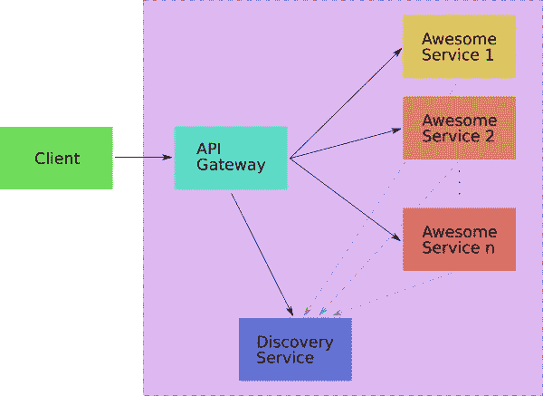

# 开发时间与构建时间与运行时间

> 原文：<https://medium.com/geekculture/development-time-vs-build-time-vs-runtime-a4ff8ce6f735?source=collection_archive---------4----------------------->

*在这篇文章中，我将分析***时间、* ***构建*** *时间和* ***运行时*** *来回答我们可以配置我们的 web 应用程序或软件什么、如何配置以及在哪里配置的问题。当然，还有什么时候更喜欢某个选项。**

**

*Photo by [Caspar Camille Rubin](https://unsplash.com/@casparrubin?utm_source=medium&utm_medium=referral) on [Unsplash](https://unsplash.com?utm_source=medium&utm_medium=referral)*

## *介绍*

*今天，每个软件开发生命周期都经历几个阶段，这些阶段根据编程语言、技术栈等而变化。为了我们的讨论，让我们考虑这三个:*

*   *程序调试时间*
*   *构建时间*
*   *运行时间*

*让我们试着回答这些问题:*

*在每个阶段，我们可以配置软件的哪个方面？又是怎么做到的？*

## *程序调试时间*

*在开发的时候，我们可以定义**常量**，幻数(请不要那样做！！)或者更复杂的配置，比如当我们实例化一个接口或服务的具体实现时。这些是我们软件的**静态**(具有**固定**、**不可变**的含义)配置的例子。*

*物理常数是一个完美的例子，因为它们从不改变。这种类型的配置的另一个优点是常量在启动时可用，在类变量的情况下加载类，或者在实例变量的情况下实例化；此外，它将被保存在内存中，以便随时可用。*

*Example of static constant*

## *构建时间*

*这是最复杂的阶段。根据技术的不同，我们可以设置一个包含许多步骤或任务的 gradle 或 npm 脚本。典型的任务可能包括:编译、单元测试、集成测试、代码隐藏、捆绑、打包等。*

*我们还可以设置更复杂的任务。例如，假设我们将代码库和/或配置文件分布并存储在几个位置。我们可以设置一个任务来获取这些数据，重新编译并产生一些工件(jar、json 等)..)在启动时加载。如果这些资源的处理需要很长时间，通过在构建时处理，我们可以在运行时加速执行，因为我们的系统不再需要获取这些资源，工件已经在内存中可用。*

*下图显示了一个简单的例子:我们的构建工具从不同的服务器或存储库中获取信息，并生成一个工件，放入生产环境中。*

**

*Fig. 1 — Build time*

## *运行时间*

*在运行时，我们的软件使用来自用户**会话**的数据来驱动业务逻辑。可以使用的一些变量有:首选项、语言、位置、权限等..*

*想象一下，例如，用户登录到我们的软件。我们可以使用他们的偏好或会话信息来调整 UI(例如，以用户的语言设置标签，以从左到右或从右到左的方式呈现语言，根据用户的角色设置权限，等等..).*

*软件在运行时的配置是**动态**。通常，这是通过正确使用工厂和/或策略模式、依赖注入等设计模式来实现的..您可以在下面的代码片段中看到一个示例:*

*Example of dynamic instantiation*

*我们使用来自用户请求的信息，在本例中是语言，来动态实例化正确的服务并驱动业务逻辑。*

*在**微服务**的世界中，另一个例子是由发现服务构成的，它在运行时被访问以将用户请求重定向到正确的后端服务。*

**

*Fig. 2 — Discovery service in a Microservices architecture*

*这些例子显示了运行时执行的动态方面如何以复杂性为代价来支持更多的解耦。*

## *如何选择？*

*我们看到了软件生命周期中的三个阶段，三个时刻，在这些阶段我们可以配置我们的软件。但如果非要我选的话， ***哪个阶段最好*** ？让我们采用几个标准(当然还有更多)，看看每个阶段的表现，以及在做决定时我们应该考虑什么。*

## *静态与动态配置*

*在**开发时间**我们设置一些东西，比如我们不能改变的常量。另一方面，当我们从开发时间转移到**构建**然后到**运行时间**时，我们以更多的复杂性为代价获得了更多的灵活性。*

*当然，在实际项目中，我们会混合使用三种类型的配置:简单的算法可以用简单的常量进行配置，而更复杂的场景则需要更动态的逻辑，就像控制器示例一样。*

*所以，这里的决定是基于 ***我们的逻辑配置是否随时间*** 变化，总是与我们需要的 ***复杂性妥协或者愿意拥有*** 。*

## *执行时间*

*这一方面标志着**开发**和**构建时间**与**运行时间**的区别。让我们想象一下，我们软件中的一些数据用于我们的业务逻辑；例如，一个包含所有时区的表(在写的时候刚刚创建的)。我们可以得到这样的信息:*

*   *存储为常量(开发时间)；*
*   *从时间服务器获取数据后重新编译成 json，然后加载到内存中(构建时)；*
*   *存储在时间服务器或数据库中，我们在运行时根据每个请求对其进行访问。*

*如你所见，我们有不同的选择。但是: ***我们对响应时间*** 有严格的要求吗？如果是这样的话，那么我们应该希望以某种方式将数据预加载到内存中。如果是这种情况，我们倾向于第一或第二种选择。作为反例，假设数据不是不可变的，而是可以更新的；在另一个场景中，我们将选择第三个选项并优化其行为，最终重构逻辑以在启动时从服务器加载数据。*

## *记忆*

*在前一点中，我们看到了在内存中预加载数据是如何减少执行时间的。当然这是有代价。对于现代 web 应用程序来说，这可能不是一个大问题，但是在一些特殊的环境中，比如嵌入式软件，以及一般情况下资源有限的硬件，这可能是一个问题。经验法则是预先知道是否有这样的需求，在这种情况下， ***仔细决定我们是否可以在内存中存储数据以及哪些数据*** 。如果我们有这样的限制，我们可以应用一些技术，如:*

*   *使用原语类型，只在内存中存储最重要的值，而不是大对象；*
*   *从后端检索数据时使用分页或类似的技术。*

## *可访问性和安全性*

*回顾图 1 中的*示例，在构建阶段，数据取自公司网络内的不同服务器，如具有代码库(gitlab 或 github、subversion 等)的服务器..)、与其他内部库或第三方库的存储库等..**

*这些位置位于我们的网络内部，从外部无法到达。这提供了**安全性**的优势，因为我们可以拥有原始数据(代码、配置等)。)放在我们的内部服务器中，我们只放入最终工件的编译和安全版本。*

*这里的规则是 ***如果我们有不想公开的敏感信息，或者保存在从外部*** 无法访问的受限服务器中，我们可以在构建时设置一个任务，将这些数据重新编译成工件。*

## *责任分离*

*将数据分布在几个地方遵循 ***责任分离*** 原则。在一个库或配置文件中应用更改会更容易，而不会触及其余的代码库或管道。*

*一般来说，特别是对于复杂的逻辑来说，应用这个原则并分散我们软件的配置是值得推荐的。*

## *结论*

*配置软件有很多方法，这里我们只关注其中的几种:在**开发**时，在**构建**时或者在**运行时**。然后，我们选择几个特征，评估每个选项，以了解它们的优缺点。*

*在现实世界中，我们需要考虑更多的方面或需求，其中一些需求可能具有更高的优先级，或者是不可协商的。例如，如果我有严格的内存需求，我在启动时可以加载的数据量是有限的。其他时候，我们更灵活，可以更自由地选择如何在我们的软件中实现配置。*

*无论哪种方式，我们都必须问自己想要完成什么，我们的需求是什么(在内存、复杂性、执行时间、安全性等方面)..).从那里，我们必须评估每个选项，选择最适合我们需要的一个，理解随之而来的障碍。*