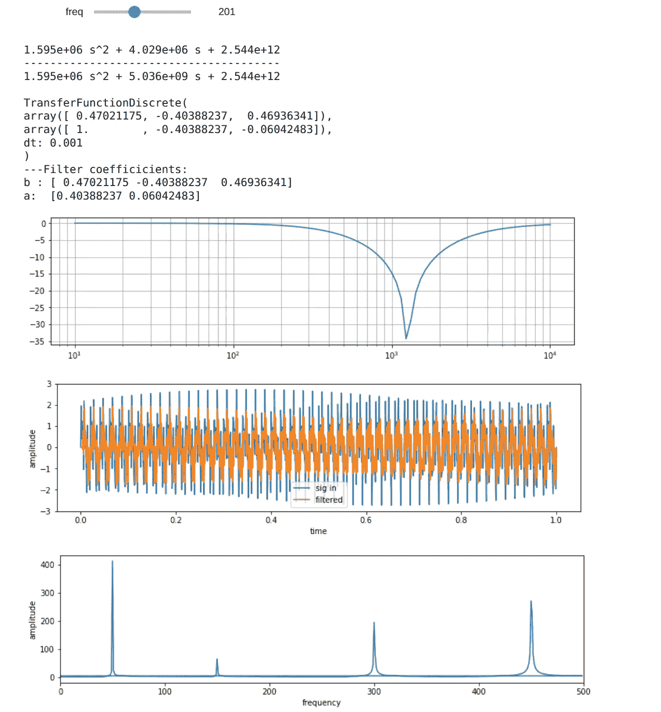
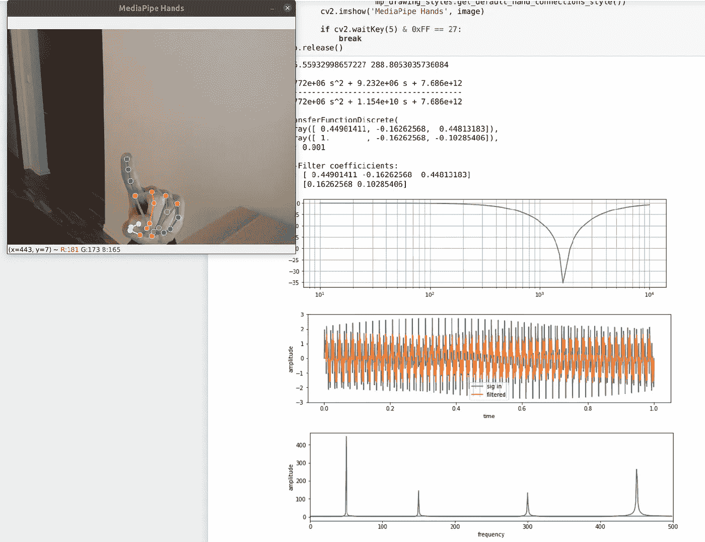

# 由深度学习解决方案控制的数字滤波器(相机跟踪)。

> 原文：<https://medium.com/geekculture/digital-filter-controlled-by-deep-learning-solution-camera-tracking-bc5d962322d6?source=collection_archive---------19----------------------->


by author

接下来的文章可以被认为是我的[上一篇文章](/geekculture/digital-filter-design-in-python-and-c-4484b6d6f4a5)的延续，在那篇文章中，我描述了数字滤波器的设计方法(陷波滤波器的主要焦点，去除某些频率)。然而，这篇文章并没有扩展给定的理论或进行模拟。提交的帖子主要关注“最终”项目，并给你很好的机会来享受这项技术([查看我的 GitHub](https://github.com/markusbuchholz/Digital-filter-controlled-by-deep-learning) )

在这种情况下，我想展示如何手动控制数字滤波器的通带(在这种情况下，RGB 摄像头捕捉手指的位置并实时移动，不幸的是，在这个项目中，滤波器的通带有一些延迟)。在我的例子中，我使用了陷波滤波器，所以对你来说，修改项目并应用低通滤波器或高通滤波器是很简单的。

以下项目(正如我的意图)可能是启动您自己的应用的绝佳机会，其中需要这种“无接触”的频域调整。我认为有很大的应用领域可以讨论。

下图显示了应用程序是如何工作的。
你手指的位置由 RGB 摄像头和深度神经网络检测。为了这个任务，我应用了最先进的开源库 Google 的 [**MediaPipe**](https://google.github.io/mediapipe/) (非常容易安装)。

```
pip3 install mediapipe
```


by author

指状物的位置进一步控制陷波滤波器在频域中的位置，因此很容易“在运行中”移除频率。在屏幕上，你可以看到信号的频谱和过滤器的位置。

对于这个特定的项目，我重复使用了我在上一篇文章中展示的设计概念。

在我将滤波器连接到相机之前，我手动检查了陷波滤波器的静止-动态位置变化。我应用了可以使用的“滑块”(见下文)(代替相机)。通过移动滑块，您可以看到陷波滤波器的频谱如何在频域中移动。



by author

您可以重复使用概念和应用其他类型的滤波器或控制系统的其他参数。你可以(例如)放大信号，控制均衡器，合成器，可能性是巨大的。我现在讨论的所有描述的概念你会发现在我的 [**GitHub**](https://github.com/markusbuchholz/Digital-filter-controlled-by-deep-learning) 上很容易。

最终结果！



by author

享受这个项目。

感谢您的阅读。